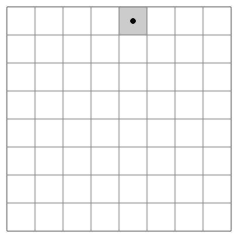
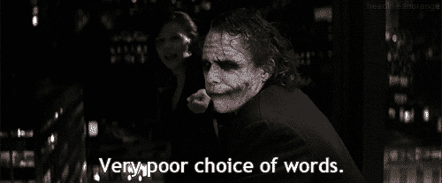
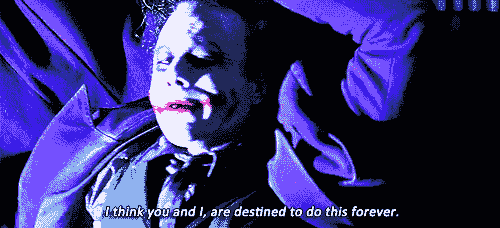

# 天真的骑士之旅

> 原文：<https://dev.to/moresaltmorelemon/a-naive-knights-tour-4a8d>

上周我听说了骑士之旅的问题，并认为“嘿，听起来很有趣！”我是对的。大部分是。这就是那次旅行的故事。

[](https://res.cloudinary.com/practicaldev/image/fetch/s--HckYVduF--/c_limit%2Cf_auto%2Cfl_progressive%2Cq_66%2Cw_880/https://upload.wikimedia.org/wikipedia/commons/d/da/Knight%2527s_tour_anim_2.gif)

问题很简单:给定一个 8x8 的棋盘和一个放置在棋盘上任意位置的骑士，移动该骑士，使其只到每个方格一次。

我最初的想法非常接近我最终的工作解决方案。然而，事实证明，从最初的想法到实际的解决方案，我所经历的挣扎是很有启发性的。

[](https://i.giphy.com/media/Zo0keHlWcBIpG/giphy.gif) 
下面是初步计划:

*   定义 8 个嵌套数组的 8×8 棋盘，每个数组有 8 个值，每个值都设置为 false。
*   定义一个函数，它接受骑士的 x 和 y 位置以及棋盘的当前状态
    *   在黑板上将坐标标记为已访问
    *   确定从该位置可以进行哪些移动
    *   如果没有更多可能的移动
        *   检查是否已经完全访问了该板
            *   如果有，返回到达目的地的路径
            *   如果没有，丢弃那个分支，继续下一个分支
    *   对于每个可能的移动，再次调用该函数

我没有把整个算法写成一段代码，而是把它分成几个部分。这允许我单独测试每个部分，并使用描述我的意图而不是实现细节的声明性名称来引用它们。

让我们从定义递归函数开始:

```
function knightsTour(x, y) {} 
```

## 那是个坏主意

[](https://i.giphy.com/media/VSfk23fs9xOVy/giphy.gif)

我很快就会知道，我选择解决的问题实际上是个大问题。比如，有大约 265 亿*的封闭巡回赛(骑士回到它的起点)和大约 196 亿*的开放巡回赛。虽然这让骑士*而不是*似乎很难找到正确的道路，但对于这些解决方案中的每一个，都有更多可能的错误答案。** 

```
// Possible Move Combinations
4,000,000,000,000,000,000,000,000,000,000,000,000,000 
```

骑士可以很容易地跳过一个方格，然后就够不着了，或者只是把自己画到一个角落里，在那里没有进一步可能的移动。

## 是无限递归，还是永远只取？

如果你只是坐在那里，实际上很难区分无止境的递归和一个需要很长时间才能解决的算法...等待中。

为了避免这种困境，不要按照您想要解决的问题的规模进行硬编码，而是要使您的问题具有可伸缩性，这样您就可以在尝试得出整个解决方案之前测试它是否有问题。目标是让你的算法在几秒钟或更短的时间内运行，只有当你确信它在问题规模上的有效性时，才扩大规模。

让我们重写简单的函数声明，使其具有可伸缩性:

```
function knightsTour(x, y, boardSize) {} 
```

接下来，我们将建立一组嵌套数组来表示棋盘:

```
function initializeBoard(boardSize) {
   return [...Array(boardSize)].map(v => 
              [...Array(boardSize)].map(v => false));
} 
```

现在我们有了一块板，让我们创建一个函数来查看是否每个方块都被访问过:

```
function entireBoardVisited(board) {
    return board.every(column => column.every(square => square));
} 
```

只有当数组中的每个元素的值都为真时，`Array.prototype.every()`函数才会返回真。因此，如果每列中的每个方块都是真的，那么整个棋盘都被访问过，将返回真。

## 递归和不变性

需要考虑的重要一点是，我们如何确保分支算法的每一步都不会受到其他分支的副作用的影响。如果每个分支共享同一个根棋盘，那么每次该分支访问一个新单元时，它将标记该单元`true`。现在那个细胞已经被访问过了*所有*的分支。那根本不行。

相反，我们需要确保在前进的每一步中，我们都有一个棋盘，只记录在这条特定的道路上走的每一步。这将带来一些空间复杂性，如果我们讨论的不仅仅是一个 8×8 板，我们就需要考虑这一点。但是，在这种情况下，成本最多是 64 个 8x8 阵列，解决方案很简单:

*   给每个递归步骤一个棋盘的深层副本
*   通过垃圾收集丢弃任何失败分支的板

因为我们知道数组只嵌套了一次，所以我们的深层副本没有那么深:

```
function copyBoard(board) {
  return board.map(column => column.slice());
} 
```

接下来，我们需要确定在任意大小的棋盘上，给定任意坐标，有哪些可能的移动:

```
function possibleMoves(x, y, board, size) {
  const moves = []

  const possibilities = [[1, 2], [1, -2], [-1, 2], [-1, -2],
                         [2, 1], [2, -1], [-2, 1], [-2, -1]]
  for (let [offsetX, offsetY] of possibilities) {
    const newX = x + offsetX;
    const newY = y + offsetY;

    if ( newY < size && newY >= 0 
      && newX < size && newX >= 0 
      && !board[newX][newY]) {
        moves.push([newX, newY]);
    }
  }
  return moves;
} 
```

我很想知道一种更简洁的方式来写那份声明。有想法请留言评论！

基本上，如果可能的移动在界内且未被访问，我们将它添加到给定坐标的可能移动列表中。

我在这里最大的错误是假设因为逻辑*似乎*正确，它就是正确的。不是的。我在初稿中犯了几个小而重要的错误。我继续编写实际的递归算法，并因为这个假设而与一系列错误作斗争。

## 不要做假设，证明你的期望

编程最具挑战性的方面之一就是我们人类自身的易犯错误。在我们的思想中，在我们的语言中，人们是不精确的。我们的大脑无缝地填补了事实和假设之间的空白，我们需要训练自己来识别这种差异。

每次我们构建一个功能时，给它有限的测试数据，并确保它独立工作。测试驱动开发非常适合这一点。但是，即使您没有遵循这种方法，也要向自己证明您的代码实际上是有效的。

在这种情况下，我必须将棋盘缩小到 3x3，然后 4x4，然后 6x6 的大小，并向自己证明我可以将骑士放在任何位置，并根据棋盘的边界和单元格的内容接收有效的结果。

我们几乎准备好递归了！让我们先写出任何递归函数中最重要的部分。

## 基格

[](https://i.giphy.com/media/bsRBPHNQg0vhC/giphy.gif)

就像你通过定义停止的条件来开始任何一个`while`或`for`循环一样，我们从它应该*停止*的条件开始递归函数:

```
function visitNextPosition(x, y, board, boardSize) {
    // if there are no more moves, check board for completion
        // if the board is complete unwind the successful path
        // if the board is not complete, move on to the next branch
} 
```

实际代码如下所示:

```
function visitNextPosition(x, y, board, boardSize) {
    const copiedBoard = copyBoard(board);
    copiedBoard[x][y] = true;

    const moves = possibleMoves(x, y, copiedBoard, boardSize);
    if (moves.length === 0) {
        if (entireBoardVisited(copiedBoard)) return [[x, y]];
        else return false;
    } else {
        // recursively call function for each possible move
    }
} 
```

所以现在我们已经建立了路径的两种可能结果:

*   返回数组中最后一个单元格的`[x, y]`坐标
*   对于失败的分支，返回 false。

因为两种结果的返回值不同，所以我们可以对它们进行测试并做出相应的响应。一旦我们得到第一个解决方案，我们希望在每个阶段展开调用堆栈，添加导致我们成功之旅的步骤的`[x, y]`坐标。但是如果我们找不到一条成功的道路，我们只想放松下来，直到有更多可供选择的道路可供探索。

```
function visitNextPosition(x, y, board, boardSize) {
  // base case ...
  } else {
    for (let [nextX, nextY] of moves) {
      let path = visitNextPosition(nextX, nextY, copiedBoard, boardSize);
      if (!!path) {
        path.push([x, y]);
        return path;
      }
    }
  return false;
} 
```

如果`path`评估为假，它将通过`if (!!path)`语句，并且循环将继续到下一个可能的移动。如果用尽了所有可能的走法都没有解决方案，那么循环将退出，函数返回`false`。

然而，如果路径已经达到一个成功的解决方案，那么它已经返回类似于`[[6, 5]]`或`[[6, 5], [5, 2], [4, 4]]`的东西，我们需要做的就是将我们当前的坐标添加到我们的骑士的旅行路径的尾部。

让我们开始吧！

```
function knightsTour(x, y, boardSize) {
  const board = initializeBoard(boardSize);

  return visitNextPosition(x, y, board, boardSize);
}

var gogoKnight = "gogoKnight " + Date.now();
console.time(gogoKnight);
console.log(knightsTour(0, 1, 8));
console.timeEnd(gogoKnight);
// 60712.694ms 
// 24105743 cells visited 
```

那不是...不好。但是我们能做得更好吗？

## 启发式

事实证明我们可以！有一些聪明人，有很多不同的方法来解决这个问题。早在 1823 年，H. C. von Warnsdorff 就提出了这样一种方法，他采用了一种简单的启发式方法(一种处理问题的实用方法，可以显著减少解决问题所需的步骤):

> 当考虑下一步可能的行动时，选择选项最少的下一步行动

这个简单的规则有三个效果。

*   它首先引导我们走最短的路。如果这些路径没有达到成功的结果，他们会更快地到达终点，并浪费我们更少的时间。
*   它把我们引向棋盘的边缘。靠近边界的方块自然会有较少的选择，因此会受到启发法的青睐。这具有首先填充外部的结果，这使我们远离棋盘的中心，在那里我们的骑士可以很容易地在注定失败的旅行上浪费大量时间。
*   它喜欢孤立的方块，不太可能留下孤立的、不可接近的方块。

因为我们已经写了一个函数，它返回一个从给定坐标开始的可能移动的数组，我们需要做的就是把这个函数应用到从当前坐标开始的每一个可能的移动，然后比较可能移动的次数。如果我们然后根据最少可能的后续移动重新排列我们的数组，那么我们已经得到了我们的启发！

```
function warnsdorff(moves, board, size) {
  const weightedMoves = [];
  for (const [x, y] of moves) {
    const weight = possibleMoves(x, y, board, size).length;
    weightedMoves.push({move: [x, y], weight});
  }
  return weightedMoves
          .sort((a, b) => b.weight - a.weight)
          .map(weighted => weighted.move);
} 
```

现在，我们只需要在检查了我们的基本情况之后调用我们的 Warnsdorff 启发式规则:

```
function visitNextPosition(x, y, board, boardSize) {
  cellVisits++;

  const copiedBoard = copyNestedArray(board);
  copiedBoard[x][y] = true;

  let moves = possibleMoves(x, y, copiedBoard, boardSize);
  if (moves.length === 0 ) {
    if (entireBoardVisited(copiedBoard)) return [[x, y]];
    else return false;
  }

  // Resort according to Heuristic: 
  moves = warnsdorff(moves, copiedBoard, boardSize);

  for (let [nextX, nextY] of moves) {
    let path = visitNextPosition(nextX, nextY, copiedBoard, boardSize);
    if (!!path) {
      path.push([x, y]);
      return path;
    }
  }
  return false;
} 
```

哦，天啊，多么不同啊！

```
console.time(gogoKnight);
console.log(knightsTour(0, 1, 8));
console.timeEnd(gogoKnight);
// 7.121ms
// 64 cells visited
// Versus:
// 60712.694ms 
// 24105743 cells visited 
```

尽管我们添加了一个函数，为每次移动增加了大量的处理量，但由此带来的节省是巨大的。

[](https://i.giphy.com/media/mm10jIWoP7mBW/giphy.gif)T3】

[https://repl.it/@EzraSchwepker/knightsTour?lite=true](https://repl.it/@EzraSchwepker/knightsTour?lite=true)

这绝对是辉煌的！这些启发值得更多的研究。