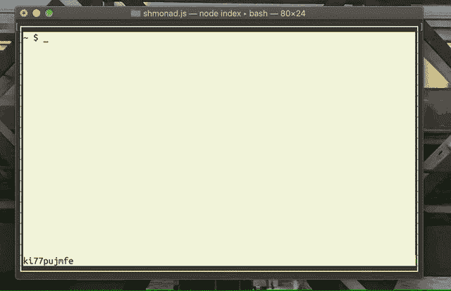
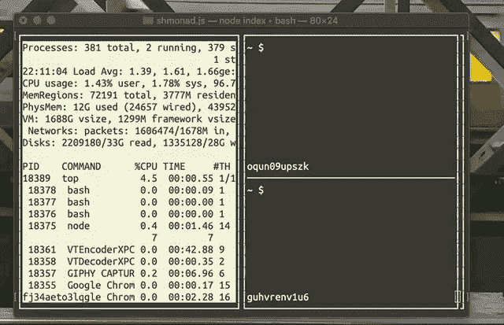
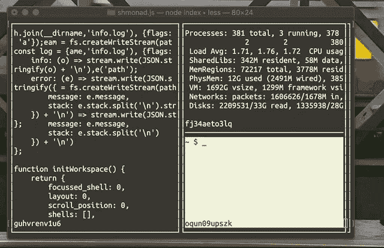

# 在 JavaScript 中模拟 Xmonad 第 3 部分

> 原文：<https://dev.to/luke/emulating-xmonad-in-javascript---part-3-219i>

[](https://res.cloudinary.com/practicaldev/image/fetch/s--EsCyhjxF--/c_limit%2Cf_auto%2Cfl_progressive%2Cq_66%2Cw_880/https://thepracticaldev.s3.amazonaws.com/i/q7le3y6cla34c17v2cjk.gif)

[](https://res.cloudinary.com/practicaldev/image/fetch/s--QGc_HxHz--/c_limit%2Cf_auto%2Cfl_progressive%2Cq_66%2Cw_880/https://thepracticaldev.s3.amazonaws.com/i/snad0iko97ci7okjecdx.gif)

[](https://res.cloudinary.com/practicaldev/image/fetch/s--7KuwNk-R--/c_limit%2Cf_auto%2Cfl_progressive%2Cq_66%2Cw_880/https://thepracticaldev.s3.amazonaws.com/i/nh5dbnkujvx0p86u6kzx.gif)

看啊！我进步更大了！

本周大部分时间都在修复错误和对某些控制序列的功能进行逆向工程。

我发现一个非常有用的方法是打开`Terminal.app`并运行

```
 $ printf '\e#8'   # fill the terminal screen with "E" (no really)
 $ printf '\e[XXX' 
```

看看会发生什么！

我慢慢开始意识到(a)终端有多复杂，(b)作为一个 API，ANSI 控制序列有多复杂，(c)我正在尝试用 Node.js 编写一个符合 ASNI 标准的终端...

本周的帖子很短，我会尽快再发一个。

# 鳍

请随时留下评论和分享你的想法，如果你渴望更多这样的帖子，请关注我！:)

下次见，谢谢你的阅读。