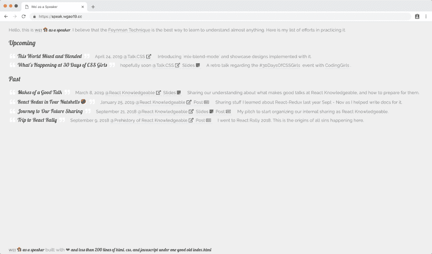

# 回到 HTML、CSS 和 JavaScript &用大约 200 行优秀的旧代码构建一个演讲者站点

> 原文：<https://dev.to/wgao19/back-to-html-css-and-javascript--build-my-speaker-site-4hpn>

受到全球多元化 CFP 日的启发，也由于我越来越多地参与当地社区，我一直在考虑建立我的演讲人网站。所以这个周末早些时候我一直在努力。

现有的商业演讲网站有 [noti.st](https://noti.st/) 和 [Speaker Deck](https://speakerdeck.com/) 。有些人在他们的个人网站下有一个发言区。

我目前到处都有现有的幻灯片，谷歌演示，slides.com，mdx-deck，奇观，revealjs 等。我很乐意把一个链接，如果它是外部托管在某个地方。但是那些我在本地构建的，我希望托管它们，以便我将来可以很容易地共享它们。

我没有技术栈的绑定选择，因为我为我的项目建立了单独的站点。甚至我的主页也是一个独立的项目。如果你愿意，就审判我吧🙈

[](https://res.cloudinary.com/practicaldev/image/fetch/s--lliNJJyK--/c_limit%2Cf_auto%2Cfl_progressive%2Cq_auto%2Cw_880/https://d2mxuefqeaa7sj.cloudfront.net/s_FCEFDF89CFD7A6773E20804F5B2453249DFBD80533FD63F98B2BC9A123554B37_1553361309546_image.png)

## 目录结构

我在想象这种结构:

```
.
├── README.md
├── ... # my site?
└── slides
    ├── 2019-03--whats-happening-30-days-css-girls
    └── year-mo--title-to-your-talk
        ├── ...
        ├── index.html
        └── package.json 
```

那么网站呢？

我决定忘掉静态站点生成器，自己写一个。周六是写真正的 HTML、CSS 和 JavaScript 的时间，下周六加入我吧？

不过，我想说的是，这个决定来得并不太快。最近建了[三个](https://css.codinggirls.sg/) [盖茨比](https://reactknowledgeable.org/) [遗址](https://japanese.wgao19.cc/)。我注意到 JAMStack 思维模式正在我的大脑中形成。在这一天结束的时候，我意识到整个事情可以归结为不到 200 行代码。事实上，我没有想到从这个更简单的抓痕开始，这让我想起来了。

## index.html

这里提醒我自己，除了将 CSS 和 JavaScript 作为单独的文件链接之外，还有一个选项可以将它们内联。

*   CSS 在一个`<style />`标签下
*   JavaScript 在一个`<script />`标签下

```
<head>
  <style>
    /* CSS */
  </style>
</head>
<body>
  <p>Hello, this is ...</p>
  <h2 class="display">Upcoming</h2>
  <ul id="upcoming"></ul>
  <h2 class="display">Past</h2>
  <ul id="past"></ul>
  <footer style="position: absolute; bottom: 0; padding-bottom: .25rem">
    ... built with ❤
  </footer>
  <script>
    // JavaScript
  </script>
</body> 
```

然后，我的想法是写一个单独的`data.js`文件来包含每个演讲的所有元数据。我解析这些数据并根据一些简单的逻辑进行渲染。

编写一个脚本来读取每张幻灯片中的所有元信息并不困难。但是我决定现在不做这个。

## 只有一个特性🤞

我检查每次谈话的日期，将过去的和即将到来的谈话分开，然后将它们放入单独的部分。

```
const isUpcoming = talk =>
  // I put random things here if it's upcoming
  new Date(talk.when) > new Date() || new Date(talk.when) == 'Invalid Date'

const isPast = talk => new Date(talk.when) <= new Date()

talks.filter(isUpcoming).map(/** renders into upcoming section */)
talks.filter(isPast).map(/** renders into past section */) 
```

## 也许是两个✌️，如果解析模板字符串算的话

我以一种混合的风格写了这篇文章，这是我从经历过的许多项目中获得的😂老实说，这部分代码让我觉得很有趣。

```
const parseTalks = (elementId, talk) => {
  // deconstruct talk object
  const { title, when, where, slides, post, intro } = talk
  const titleNode = `
    <div class="topic">
      <i class="fas fa-quote-left"></i>
      <span class="display">${talk.title}</span>
      <i class="fas fa-quote-right"></i>
    </div>
  `
  // ... others

  // create an element for each talk and append to the ul
  const talkElement = document.createElement('li')
  talkElement.innerHTML = [
    `<base target="_blank" />`,
    titleNode,
    whenNode,
    whereNode,
    slidesNode,
    postNode,
    introNode,
  ].join('')
  document.getElementById(elementId).appendChild(talkElement)
}

talks.filter(isUpcoming).map(parseTalks.bind(null, 'upcoming')) 
```

## 上菜幻灯片

我把所有的幻灯片放在一个叫做`slides/`的目录下。它们将存在于各自的目录中，并有各自独立的依赖项和构建版本。主要有两个问题需要关注:路由(如果适用的话)和构建，因为我不想在回购中保留构建的文件。

*   [Reveal.js](https://revealjs.com/#/)

这个是自动的。你在 index.html 写所有的东西，静态资产是用 grunt 建立的。除非你自己写主题，否则连搭建的必要都没有。

*   [奇观](https://formidable.com/open-source/spectacle/)

telegraph 是一个用 React 构建的演示库。它也工作得很漂亮，虽然它需要一个构建。

*   [mdx 甲板](https://github.com/jxnblk/mdx-deck)

不幸的是，这个目前不工作。因为它通过静态查找路径名索引 1 来路由。在斜杠分隔的路径名下提供 mdx-deck 将不起作用。

我已经[创建了一个问题](https://github.com/jxnblk/mdx-deck/issues/291)，希望在不久的将来解决这个问题。

所以现在回购大致是这样的:

```
.
├── README.md
├── data.js
├── index.html
├── lerna.json
├── package.json
└── slides
    ├── 2019-03--whats-happening-30-days-css-girls
    ├── 2019-04--developers-gym-gatsby
    ├── revealjs-boilerplate
    └── spectacle-boilerplate 
```

## 用于构建和部署的 Lerna + Netlify

感谢 Netlify，它带走了所有我不想关心的事情。构建步骤非常简单，没有任何问题。

我的一些幻灯片需要建立静态文件。有些人没有。Netlify 允许我为每个构建提供一个运行的构建脚本。编写一个脚本来遍历每个需要构建的目录并不太麻烦。但是为什么不用 Lerna 呢..

使用`lerna bootstrap`和`lerna run build`，它自动引导(安装所有依赖项，如果可能的话，安装符号链接)所有包，在我的例子中是 slide，并在所有指定了构建命令的包中运行构建。然后我就完了！！

## 到下次

这个网站是怎么建成的？我认为这是幼儿园和成人玩具的结合。几乎是治疗性的。

你会在你的网站上建一个演讲区吗？如果是这样，你将如何构建它？