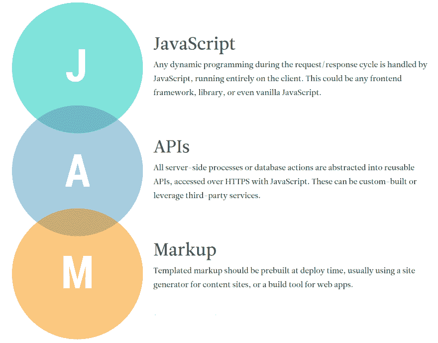
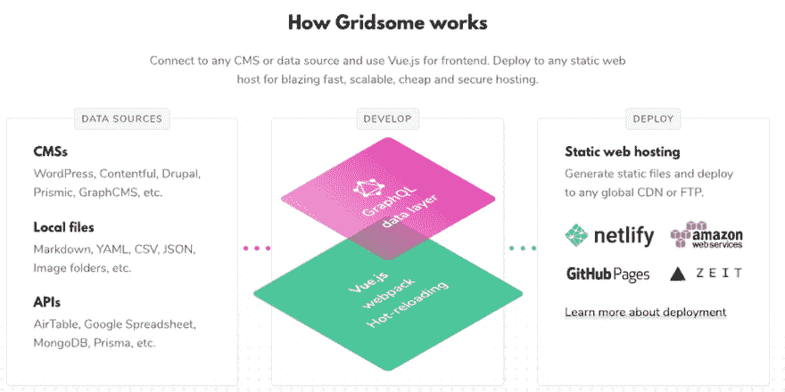
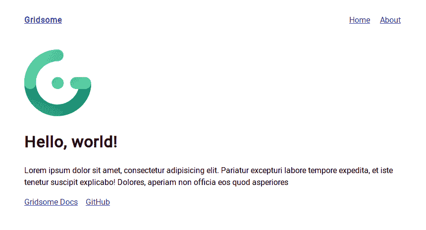

# 我用 Vue & Gridsome 制作的新网站

> 原文：<https://dev.to/aromig/my-new-web-site-made-with-vue-gridsome-94m>

## 新建域

最近我得到了一个新的。开发域名,这样我就可以用一个新的名字和外观重新启动我的网站。我在 3 月 1 日买下了 [romig.dev](https://romig.dev) ，因为我不认为会有任何人会在早期访问期间抢走它。几率有多大？我的赌博赢了。

## 新建站点

很久以来，我一直想对我的个人网站进行一次大的改造。我也不想*就*重做了。我想在建造它的时候学习一些新的东西。

我对学习前端 JavaScript 框架感兴趣已经有一段时间了，而 [Vue.js](https://vuejs.org) 引起了我的注意。它的模板语法和组件结构对我来说很容易理解。在我之前的工作中，我曾经使用过更多的模板驱动结构(例如 PHP & C#)，所以 Vue 的语法是用 HTML 写出我的标记，然后在我需要的地方插入我的组件，这看起来就像在家里一样。这和他们出色的文档让我觉得我可以学到很多关于当前前端框架的知识，而不会感到头痛。

所以我心中有一个框架。我只是需要一个好的起点来建立一个新的网站。不仅仅是一个网站，我还想重新开始写博客。为我过去的作品建立一个新的作品集。为了以后更新不会很痛苦。

## JAMStack

我听说过关于用 [JAMStack](https://jamstack.org/) 模型(**J**avaScript+**A**PI+**M**arkup)建立网站的很酷的事情(在网上和聚会上)。基本思想是，即使内容是动态的，web 站点也将始终服务于静态站点。使用传统的 CMS，从数据库服务器查询内容，并在每次请求内容时下载内容，同时从头开始重建整个页面。

[](https://romig.dev/asseimg/blog/jamstack_explanation.png) 
*贾姆斯塔克解释*

使用从 JAMStack 代码库生成的静态站点，动态内容是从其 API 源预先查询的，静态 HTML 文件被创建，因此当请求内容时，不需要联系数据库。根据您使用的前端框架，可以只更新页面变化的内容区域，而不是整个页面。

这是 JAMStack 的基本要点，但是实现它及其复杂性取决于您将要使用的框架和 API。所有这些，再加上服务静态 HTML 的速度以及没有任何端点可以通过 API 查询利用的额外安全性，给我留下了使用 JAMStack 代码库的良好印象。

## 网格体

然后归结为选择一个静态站点生成器。有几个使用 Vue 框架，但最终我决定使用 [Gridsome](https://gridsome.org) 。Gridsome 引起我注意的是，它可以通过 [GraphQL](https://graphql.org/) 从不同类型的来源检索数据。我可以为我的博客文章编写本地 [Markdown](https://www.markdownguide.org/) 文件，并通过从 [JSON](https://www.json.org/) 文件中抓取某些对象来动态创建我的简历。

[](https://romig.dev/asseimg/blog/how-gridsome-works.png) 
*网格体开发&部署周期*

但是我不知道如何使用 GraphQL。幸运的是，Gridsome 提供了一个 [*游乐场*来探索](https://gridsome.org/docs/querying-data#explore--test-queries)graph QL 模式，并尝试编写自己的查询。经过一些练习，我逐渐掌握了它的工作原理。

### 结构

下面是一个示例 Gridsome 项目结构。

```
project-folder/
  gridsome.config.js
  package.json
└ blog/
    blog-post.md
└ src/
  └ components/
      Footer.vue
      NavMenu.vue
  └ data/
      resume.json
  └ layouts/
      Default.vue
  └ pages/
      About.vue
      Blog.vue
      Index.vue
  └ templates/
      Post.vue
    favicon.png
    main.js
└ static/
  └ assets/
    └ images/

```

Gridsome 中的静态页面由一个布局组件构成，该组件可以将一个组件(来自 pages 文件夹)放入其模板内的一个`<slot />`中。当然，页面可以由单独的可重用组件构成。来源于 API(如博客文章)的动态页面由模板文件夹中的`typeName`(如下面的*获取数据*部分中的代码所示)指定的组件组成。

布局←页面/模板←组件

```
<!-- Layout -->
<template>
  <div>
    <header />
    <slot /><!-- Page or Template gets injected here -->
    <footer />
  </div>
</template> 
```

Enter fullscreen mode Exit fullscreen mode

### 设计版面

从哪里开始？这通常是我在构建界面时考虑的问题。幸运的是，Gridsome 有一个很好的、干净的初始布局，我可以从它开始构建。有这个样板文件很好，因为我可以看到页面之间的关系，就像我上面解释的那样。

[](https://res.cloudinary.com/practicaldev/image/fetch/s--HGgjjvTU--/c_limit%2Cf_auto%2Cfl_progressive%2Cq_auto%2Cw_880/https://romig.dev/asseimg/blog/gridsome-starter.png) 
*Gridsome 首发布局*

首先，我在标题部分(徽标、导航)做了一遍处理，并清除了 Index.vue 页面的主体。直到我把剩下的页面设置好，我才知道我想要什么。导航菜单对响应断点的行为进行了一些迭代，我觉得它现在处于一个很好的位置。

然后我创建了博客页面(它将提供一个分页的文章列表)和相应的帖子模板来显示文章本身。我对项目页面做了同样的处理，它将存放我过去的作品，就像我在旧文件夹中一样。每个博客文章和项目都是各自文件夹中的一个单独的 Markdown 文件。Gridsome 将在构建静态站点时自动检测这些文件，并相应地路由它们。

然后，我制作了 About 页面，并在进行的过程中多次填充内容。构建我的简历页面很有趣，因为我可以将一堆简历封装到单独的组件中，同时将数据从单个 JSON 源文件传递给它们。

几个额外的组件是信息卡，它出现在博客帖子和项目页面的最底部，包含关于我的简短简介，以及包含我的社交媒体存在链接的页脚。不存在的页面怎么办？别担心——我没有忘记创建一个[自定义 404 页面](https://romig.dev/404)。

我做了一些测试，以确保响应行为正常工作，包括在外部设备上进行测试。当我意识到我可以用更干净的方式做某些事情时，我也做了多次重构和调整。

### 获取数据

下面是我的 [gridsome.config.js](https://gridsome.org/docs/config/) 文件中的一部分，我在这里设置了全局元数据并安装了插件，特别是处理访问我的 Markdown 文件及其站点路由的`@gridsome/source-filesystem`插件。

```
module.exports = {
  siteName: "Adam Romig",
  siteUrl: "https://romig.dev",
  siteDescription: "Personal Site & Blog for Adam Romig",
  transformers: {
    remark: {}
  },
  plugins: [
    {
      use: "@gridsome/source-filesystem",
      options: {
        path: "blog/**/*.md",
        typeName: "Post",
        route: "/blog/:slug",
        remark: {
          externalLinksTarget: "_blank",
          externalLinksRel: ["nofollow", "noopener", "noreferrer"],
          plugins: [["gridsome-plugin-remark-shiki", { theme: "light_vs" }]]
        }
      }
    }
  ]
}; 
```

Enter fullscreen mode Exit fullscreen mode

这个插件，以及[grid some Transformer Remark](https://gridsome.org/plugins/@gridsome/transformer-remark)插件(将 Markdown 解析成 HTML)和 [shiki](https://gridsome.org/plugins/gridsome-plugin-remark-shiki) (用于将语法高亮应用到`code`块)使得保持内容&模板独立并易于管理。

然后，我可以为列表页面(pages/Blog.vue)设置一个 GraphQL 查询。

```
<page-query>  query  Posts  ($page:  Int)  {  posts:  allPost  (sortBy:  "date",  order:  DESC,  perPage:  4,  page:  $page)  @paginate  {  totalCount  pageInfo  {  totalPages  currentPage  isFirst  isLast  }  edges  {  node  {  id  title  excerpt  date  (format:  "D MMMM YYYY")  path  cover  }  }  }  }  </page-query> 
```

Enter fullscreen mode Exit fullscreen mode

我可以遍历结果(使用 Vue 的`v-for`指令)并创建文章本身的链接。

```
<div class="post-list">
  <div v-for="post in $page.posts.edges" :key="post.node.id" class="post-item" >
    <g-link :to="post.node.path" class="post-title">
      <span>{{ post.node.title }}</span>
    </g-link>
    <div class="post-date">{{ post.node.date }}</div>
    <p class="post-excerpt">{{ post.node.excerpt }}</p>
  </div>
</div> 
```

Enter fullscreen mode Exit fullscreen mode

显示文章内容的页面是从及其自己的查询生成的。

```
<page-query>  query  Post  ($path:  String!)  {  post:  post  (path:  $path)  {  title  excerpt  date  (format:"D MMMM YYYY")  content  cover  }  }  </page-query> 
```

Enter fullscreen mode Exit fullscreen mode

并注入到适当的模板中(Post.vue)。

```
<template>
  <Layout>
    <section>
      <header>
        <g-image class="post-cover" :src="$page.post.cover" />
        <h2 class="post-title">{{ $page.post.title }}</h2>
      </header>
      <summary>
        <p class="post-excerpt">{{ $page.post.excerpt }}</p>
      </summary>
      <article>
        <p class="post-date">{{ $page.post.date }}</p>
        <div class="post-content" v-html="$page.post.content" />
      </article>
    </section>
    <InfoCard />
  </Layout>
</template> 
```

Enter fullscreen mode Exit fullscreen mode

* * *

从 JSON 文件中为我的简历页面获取数据就像将文件导入 JavaScript 对象一样简单。

```
import resumeJSON from "~data/resume.json";

export default {
  resume: resumeJSON.resume
}; 
```

Enter fullscreen mode Exit fullscreen mode

然后要么直接过账一个字段

```
<p>{{ $options.resume.summary }}</p> 
```

Enter fullscreen mode Exit fullscreen mode

或者遍历一个字段的数组并通过 props 将其发送给一个组件。

```
<div v-for="skillHeading in $options.resume.skills">
  <SkillCard :skillHeading="skillHeading" />
</div> 
```

Enter fullscreen mode Exit fullscreen mode

## 用 Netlify 托管

虽然我已经开始建设网站，但我仍然需要一个地方来托管它。幸运的是，Gridsome 有几个[推荐人](https://gridsome.org/docs/deployment)，我选择了 [Netlify](https://netlify.com) 。部署 JAMStack 站点最棒的部分是 git 触发的持续部署部分。每当我在 GitHub 上做`git push`来更新我的存储库时，这个站点就会用我最近提交的修改来重建。

以这种方式部署更新会使这个过程自动化很多，因为我不需要自己编写构建命令，也不需要通过 FTP 手动发送 dist 文件夹中的更新文件。

Netlify 还允许我用我买的域名建立一个自定义域名，并允许使用[别名](https://adam.romig.dev)。此外，我创建了一个联系表单，该表单将通过 Netlify 发送，并在他们的后端保存提交记录，同时通过电子邮件通知我。

## 结论

请注意，这篇文章并不是关于如何构建一个 Gridsome 站点的教程，而是关于我如何以及为什么构建它的更多内容，而不会涉及太多的细节。尽管我确实希望它能激励你尝试创建一个 JAMStack 站点，不管它是用 Vue 还是 Gridsome 构建的。

用 Vue & Gridsome 创建这个新网站是一次很好的学习经历。我迫不及待地想用 Vue.js 进行更多的实践。我想随着我作为 web 开发人员的成长，这是我将学到更多的前端框架。

我的新网站的源代码可以在它的 [Github 库](https://github.com/aromig/romigdotdev)中找到。