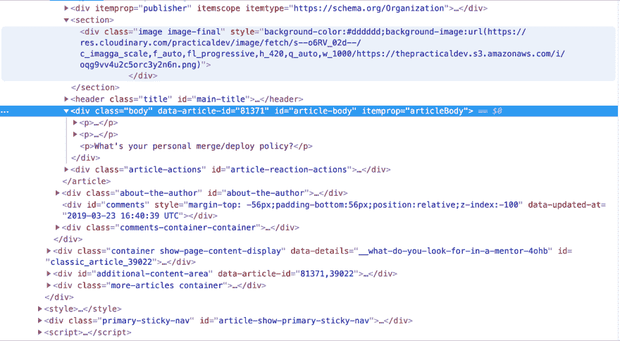
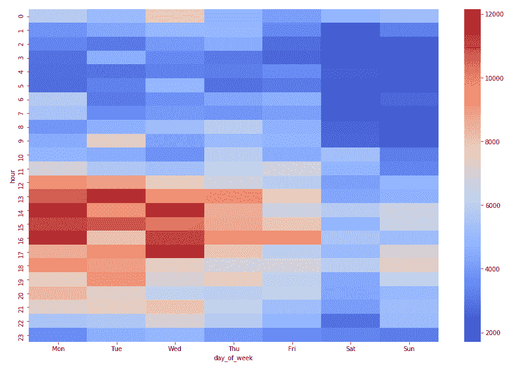
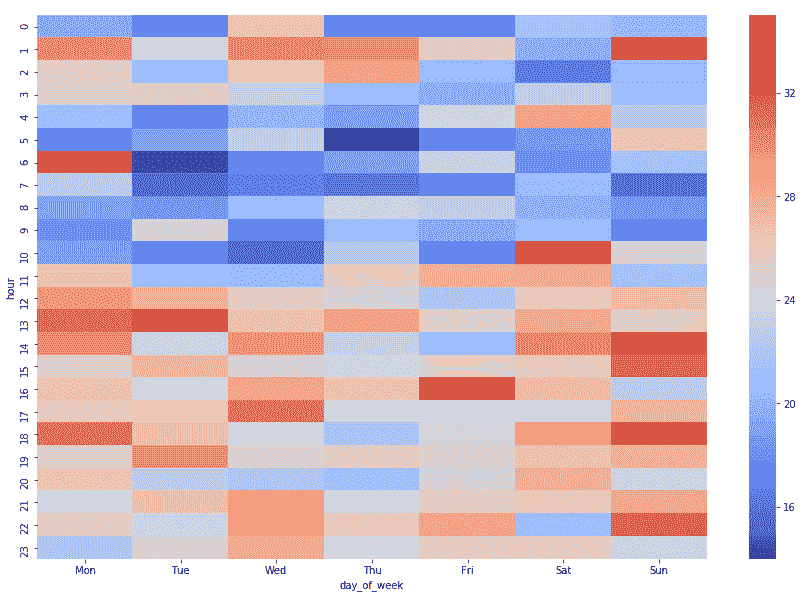

# 在 dev.to 上发布的最佳时间是什么时候？有数据支持的答案🕰🦄🤷‍♂️

> 原文：<https://dev.to/daolf/-what-is-the-best-time-to-post-on-devto-a-data-backed-answer--1kob>

dev.to 是几年前出现的一个很棒的博客平台。我喜欢为它写作和阅读那里发表的内容。但是我最喜欢的，我认为每个人最喜欢的是建立在这个平台上的社区。

众所周知，一个社区会通过不同类型的赞和评论与发帖者进行大量互动。dev.to 上没有“因果报应”,但衡量一篇帖子的受欢迎程度和得分的一种方法是看这篇帖子与社区的互动次数。

评论的数量，当然还有喜欢的数量，这个平台分为三类:独角兽🦄，像❤和书签📕。

我最近想知道在一天的某个时间发布的一篇文章是否比其他文章表现得更好。如果是的话，为了让尽可能多的人阅读，发布博客的最佳时间是什么时候？我有一些直觉，但我想有证据和事实来工作。

我是这样做的:

# 采集数据:

我在这里会很简短，因为我会在以后写一篇更长的帖子来详细解释如何有效地收集这种类型的数据。

我最近注意到，在查看 dom 时，每篇文章都有一个可用的公共 id。

[](https://res.cloudinary.com/practicaldev/image/fetch/s--law1FFS1--/c_limit%2Cf_auto%2Cfl_progressive%2Cq_auto%2Cw_880/https://daolf.cimg/dev-to-stat/article-id.png%23center)

我还知道有一个公共端点，允许您获取如下所示用户信息:

```
http https://dev.to/api/users/<user_id> 
```

Enter fullscreen mode Exit fullscreen mode

所以很自然地，我试着对 article 和...

```
http https://dev.to/api/articles/81371
HTTP/1.1 200 OK
{
    "body_html": "<!DOCTYPE html PUBLIC \"-//W3C//DTD HTML 4.0 Transitional//EN\"  \"http://www.w3.org/TR/REC-html40/loose.dtd\">\n<html><body>\n<p>The other day I was touching up a PR that had been approved and was about to merge and deploy it when, out of habit, I checked the clock. It was 3:45pm, which for me, was past my \"merge before\" time of 3:30pm. I decided to hold off and wait until the next morning. </p>\n\n<p>The whole process got me thinking. Does anyone else have their own personal merge or deploy policies? Is there a time before or after when you say, not today? Is there a day of the week you don't like to merge stuff. A lot of people joke about read-only Fridays, but I have to admit, I kinda follow that rule. Anything remotely high risk I wait until Monday to merge. </p>\n\n<p>What's your personal merge/deploy policy?</p>\n\n</body></html>\n",
    "canonical_url": "https://dev.to/molly_struve/whats-your-personal-mergedeploy-policy-30mi",
    "comments_count": 6,
    "cover_image": "https://res.cloudinary.com/practicaldev/image/fetch/s--o6RV_02d--/c_imagga_scale,f_auto,fl_progressive,h_420,q_auto,w_1000/https://thepracticaldev.s3.amazonaws.com/i/oqg9vv4u2c5orc3y2n6n.png",
    "description": "What's your personal merge/deploy policy?",
    "id": 81371,
    "ltag_script": [],
    "ltag_style": [],
    "path": "/molly_struve/whats-your-personal-mergedeploy-policy-30mi",
    "positive_reactions_count": 13,
    "published_at": "2019-03-22T22:19:36.651Z",
    "readable_publish_date": "Mar 22",
    "slug": "whats-your-personal-mergedeploy-policy-30mi",
    "social_image": "https://res.cloudinary.com/practicaldev/image/fetch/s--MJYBx9D---/c_imagga_scale,f_auto,fl_progressive,h_500,q_auto,w_1000/https://thepracticaldev.s3.amazonaws.com/i/oqg9vv4u2c5orc3y2n6n.png",
    "tag_list": "discuss",
    "title": "What's your personal merge/deploy policy?",
    "type_of": "article",
    "url": "https://dev.to/molly_struve/whats-your-personal-mergedeploy-policy-30mi",
    "user": {
        "github_username": "mstruve",
        "name": "Molly Struve",
        "profile_image": "https://res.cloudinary.com/practicaldev/image/fetch/s--UrIkLrxe--/c_fill,f_auto,fl_progressive,h_640,q_auto,w_640/https://thepracticaldev.s3.amazonaws.com/uploads/user/profile_image/119473/9e74ee0e-f472-4c33-bfb4-79937e51f766.jpg",
        "profile_image_90": "https://res.cloudinary.com/practicaldev/image/fetch/s--apWeHy1C--/c_fill,f_auto,fl_progressive,h_90,q_auto,w_90/https://thepracticaldev.s3.amazonaws.com/uploads/user/profile_image/119473/9e74ee0e-f472-4c33-bfb4-79937e51f766.jpg",
        "twitter_username": "molly_struve",
        "username": "molly_struve",
        "website_url": "https://www.mollystruve.com"
    }
} 
```

Enter fullscreen mode Exit fullscreen mode

答对了。！

我现在要做的就是:第一，如果文章的 id 是连续的，就查找它；第二，如果 1 是真的，就查找最近的文章的 id。两件事都很容易核实。我只是不得不在最近的文章上打开浏览器检查器几次。

我接下来做的是使用 scrappy 调用这个 API 94k 次，并将信息存储在一个清晰的`.csv`中。在以后的帖子里会有更多的内容。

为了做到这一点，我使用了 ScrapingBee，这是我最近推出的一个网络抓取工具😎。

# 我们现在有什么？

在 94k 个 API 调用中，几乎一半都返回了一个`404: resource not found`。我猜这意味着一半的文章从未发表过，但我不确定。我仍然有大约 4 万个数据点，这足以证明我的观点。

我的 csv 文件中的每一行都有许多有用的信息，但是对于我要找的东西，我只需要两件东西:数字或喜欢和出版日期。
希望 API 返回这两件事，参见前面代码片段中的`positive_reaction_count`和`published_at`。

# 丰富数据

为了处理数据，我使用了 pandas，一个著名的 python 库，它甚至是 GitHub 上最著名的 python 包之一。

我会在这里展示一些代码片段，如果你想要更全面的教程，请在评论中告诉我。

用熊猫从 csv 加载数据非常容易:

```
import pandas as pd
df = pd.read_csv('./output.csv') 
```

Enter fullscreen mode Exit fullscreen mode

因为我想知道在 dev.to 上发布的最佳时间/日期，所以我需要将`published_at`列转换成另外两列:`day_of_week` ('Mon '，' Tue '，...)和`hour`。

熊猫允许轻松地添加、转换和操作数据。我需要做的就是这几行:

```
 df['hour'] = pd.to_datetime(df['published_at']).dt.hour

days_arr = ["Mon","Tue", "Wed", "Thu", "Fri", "Sat", "Sun"]

def get_day_of_week(x):
    date = pd.to_datetime(x)
    return days_arr[date.weekday()]

df['day_of_week'] = df['published_at'].apply(get_day_of_week) 
```

Enter fullscreen mode Exit fullscreen mode

我所有的数据现在都存储在 dataframe 中，我的熊猫使用的主要数据结构，因此得名:`df`。

# 一点点数据即

我现在有了我需要的所有信息。

这是我的数据框中的内容:

| 星期几 | 小时 | 阳性反应计数 |
| --- | --- | --- |
| 星期四 | Zero | four |
| 孟人 | one | Thirty-four |
| ... | ... | ... |
| 太阳 | Twenty-two | Forty-one |
| 星期四 | Seventeen | nine |

每行代表一篇文章，我有大约 38k 行。

接下来我自然要做的是按天按小时求和。

以下是如何在熊猫身上做到的:

```
 aggregated_df = df.groupby(['day_of_week', 'hour'])['positive_reaction_count'].sum() 
```

Enter fullscreen mode Exit fullscreen mode

现在我的 df 看起来像这样:

| 天 | 小时 | 阳性反应计数 |
| --- | --- | --- |
| 星期一 | Zero | Four thousand one hundred and ten |
|  | one | Three thousand four hundred and twenty-three |
|  | Two | Two thousand seven hundred and ninety-one |
| ... | ... | ... |
|  | Twenty-two | Four thousand eight hundred and thirty-nine |
|  | Twenty-three | Three thousand six hundred and fourteen |
| ... | ... | ... |
| 星期日 | Zero | One hundred and ten |
|  | one | Four hundred and twenty-three |
|  | Two | Seven hundred and thirty-one |
| ... | ... | ... |
|  | Twenty-two | Four thousand one hundred and twenty-three |
|  | Twenty-three | Two thousand seven hundred and ninety-one |

很好，为了得到我需要的格式的数据，还需要做一些工作。
基本上围绕着旋转的柱子。

```
 pivoted_df = aggregated_df.reset_index().pivot('hour', 'day_of_week', 'positive_reaction_count') 
```

Enter fullscreen mode Exit fullscreen mode

现在我的 df 是这个样子的:

| 小时 | 孟人 | 周二 | ... | 太阳 |
| --- | --- | --- | --- | --- |
| Zero | Four thousand one hundred and ten | Five thousand and seventy-one | ... | Five thousand two hundred and eight |
| one | Three thousand four hundred and twenty-three | Four thousand three hundred and thirty-six | ... | Three thousand two hundred and thirty |
| Two | Two thousand seven hundred and ninety-one | Three thousand and fifty-six | ... | One thousand eight hundred and eighty-two |
| ... | ... | ... | ... | ... |
| Twenty-three | Three thousand six hundred and fourteen | Four thousand five hundred and seventy-four | ... | Three thousand one hundred and forty-nine |

现在，我终于可以使用 [`seaborn`](https://github.com/mwaskom/seaborn) 包来显示一个漂亮的热图了。

```
import seaborn as sns
sns.heatmap(pivoted_sorted , cmap="coolwarm") 
```

Enter fullscreen mode Exit fullscreen mode

这是我得到的信息:

[](https://res.cloudinary.com/practicaldev/image/fetch/s--HLjeaHgu--/c_limit%2Cf_auto%2Cfl_progressive%2Cq_auto%2Cw_880/https://daolf.cimg/dev-to-stat/heatmap_sum.png%23center)

# 分析

我觉得这张热图非常简单，一目了然。地图上突出了两个区域。红色的在左下角，深蓝色的在右上角。

但是首先，因为我们在谈论时间，我们需要知道我们谈论的是哪个时区。
如果你仔细观察`published_at": "2019-03-22T22:19:36.651Z`，你会注意到在时间字符串的末尾有一个`Z`。
这个`Z`表示这个时间串代表 UTC 时间，或者时区`Z` ero。

因此，回到我们的热图，我们注意到周一到周三下午(对于东海岸的人来说是周一和周三早上)是地图上更活跃的区域。星期六和星期天是两个非常平静的日子，尤其是从午夜到中午。

所以，在这里，乍一看，你可能会认为你最好发布这些时间，以最大限度地增加你有很多喜欢的机会。我们需要退后一点。

这张热图显示的是一天中我们总共观察到最多喜欢的时间。它没有考虑到一个事实，即更多的帖子自动意味着更多的喜欢。

所以也许，现在我们还不能确定，我们在热图上看到的红色区域只是意味着我们在平台上观察到更多，只是因为在那些时间有更多的文章被发布。

这个区别很关键，因为我们试图知道的是为了最大化喜欢而发布的最佳时间，而这个地图帮不了我们。

因此，我们需要它来制作相同类型的地图，但不是计算每天一小时内的总喜欢数，而是计算这些喜欢数的平均值。我们也可以计算中间值，我做了，没有太大的差别🙂。

感谢熊猫，我们只需要修改代码中的一个小东西:

```
 # sum -> mean aggregated_df = df.groupby(['day_of_week', 'hour'])['positive_reaction_count'].mean() 
```

Enter fullscreen mode Exit fullscreen mode

这是新的热图:

[](https://res.cloudinary.com/practicaldev/image/fetch/s--WKAwyGAQ--/c_limit%2Cf_auto%2Cfl_progressive%2Cq_auto%2Cw_880/https://daolf.cimg/dev-to-stat/heatmap_sum2.png%23center)

正如您所看到的，热图与之前的热图有很大不同，并且更容易被利用。我们现在观察条形图案。这条蓝色的宽线从周一到周日上午 4 点到 10 点
我们还观察到 UTC 下午的活动高峰。

根据这张热图，我们现在可以确定的是，平均而言，下午发布的
文章比 UTC 日很早发布的文章多 10~20 次正面互动。

我认为这完全与读者/作者比率有关，这两个热图显示的是，即使周末读者少得多，作家也相应地少了。这就是为什么在周末发表的文章会比在一周内发表的文章有相同的互动次数。

## 感谢阅读:

我希望你喜欢这篇文章。

这个系列还远远没有结束，我还有更多关于这个数据集的信息要向您展示。

如果你想了解数据分析的某个方面，请在评论中告诉我，别忘了[订阅](https://www.daolf.com/stay_updated/)我的时事通讯，还有更多(你还可以免费获得我下一本电子书的前几章😎).

如果你想继续阅读一些 python 技巧，去[那里](https://dev.to/daolf/beware-of-python-dictget-194k)，你会喜欢的:)。

如果你喜欢 JS，我已经发表了[一些你可能会喜欢的东西](https://dev.to/daolf/things-you-should-know-about-js-events-4k2l)。

如果你喜欢 git，[我会帮你搞定](https://dev.to/daolf/git-series-13-understanding-git-for-real-by-exploring-the-git-director--5bd0)。