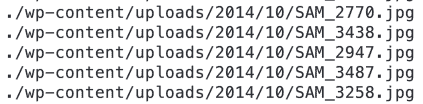

# 如何在 GNU/Linux 和 MacOs 命令行中使用 Regex(正则表达式)找到文件并做一些事情。

> 原文：<https://dev.to/dacog/how-to-find-files-using-regex-regular-expressions-in-gnu-linux-and-macos-command-line-and-do-something-ne>

我需要找到所有匹配正则表达式的文件。在这种情况下，所有带有`300x200`或`400x220`的文件以及带有`png`或`jpg`的文件。

在 BASH 中使用`find`可以很容易地做到这一点，但是文件类型和条件越多，命令就越长。

例如，以下代码将用于查找/tmp 文件夹中的所有 png 和 jpg 文件:

`find /tmp -name '*.png' -or -name '*.jpg'`

## 输入正则表达式:)

> **重要**:MAC OS 和 GNU/Linux (Ubuntu、Debian 等)中的`find`命令..)略有不同，并且不是所有的语法都可以在系统之间使用。

这是一种非常有用的魔法，但是很难学。

### 什么是正则表达式？

> 正则表达式是描述搜索模式的特殊文本字符串。你可以把正则表达式想象成类固醇上的通配符。您可能熟悉通配符表示法，如在文件管理器中查找所有文本文件的`*.txt`。正则表达式的等价物是`.*\.txt`。-[regexbuddy]

**在 Mac 上**
`find -E . -regex '.*\.(jpg|png)'`

**在 Linux 上**
`find ./ -regextype posix-extended -regex '.*(jpg|png)$'`

### 找到所有文件名中有 *300x200* 或 *400x220* 的 jpg 和 png 文件。

**在 Mac 上**
`find -E . -regex '.*(300x200|400x220)\.(jpg|png)'`

**在 Linux 上**
`find ./ -regextype posix-extended -regex '.*(300x200|400x220)\.(jpg|png)$'`

这些命令将找到所有类型为*something-300x200.jpg*或*somethingelse400x220.png*的文件

现在你看到了一个模式。如果您更改 sintax 并在 Linux 的末尾添加一个`$`，那么您可以在 MacOS 和 Linux 上使用相同的正则表达式(`'`之间的部分)。

这里有一些你可能想知道的有用的正则表达式。

### **查找文件名中某处带有`SAM`的所有 png 和 jpg 文件**

`'.*(SAM).*\.(jpg|png)'`
这将找到以下文件

**在 Mac 上**
`find -E . -regex '.*(SAM).*\.(jpg|png)'`
**在 Linux 上**
`find ./ -regextype posix-extended -regex '.*(SAM).*\.(jpg|png)$'`

## 现在我们来学习`xargs`

> xargs 是 Unix 和大多数类似 Unix 的操作系统上的一个命令，用于从标准输入构建和执行命令。它将标准输入转换成命令的参数。-[维基百科]

能够找到所有这些文件是很好的，但是一旦你找到了它们，你应该能够对它们做些什么，对吗？
这就是`xargs`的用武之地。假设您想要删除文件名中包含`SAM`的所有 jpg 和 png 文件。
**在 Mac 上**
`find -E . -regex '.*(SAM).*\.(jpg|png)' | rm`
**在 Linux 上**
`find ./ -regextype posix-extended -regex '.*(SAM).*\.(jpg|png)$' | rm`

很简单，对吧？能够从所有文件夹中删除一些文件真的很方便。例如 Wordpress 和其他系统中所有自动制作的缩略图。假设你要清理一个有几个子文件夹的文件夹，只留下原始文件。在 Mac 上，你可以这样做(添加或移除其他分辨率)并移除名称中带有分辨率的所有文件(例如`something-AAAxBBB.jpg`

`find -E . -regex '.*(1024x576|278x380|506x380|1024x576|508x380|1024x681|550x366|550x309|350x220|380x380|768x768|285x380|768x1024|1024x1024|213x380|576x1024|550x367|253x380|681x1024|1024x768)\.(jpg|png)' | xargs rm`

## 相关链接

*   https://www.linux.com/learn/10-tips-using-gnu-find
*   [[https://stack overflow . com/questions/24552144/find-using-regex-with-variables](https://stackoverflow.com/questions/24552144/find-using-regex-with-variables)]

[来源](https://diegocarrasco.com/how-to-find-files-using-regex-regular-expressions-in-gnulinux-and-macos-command-line-and-do-something/)