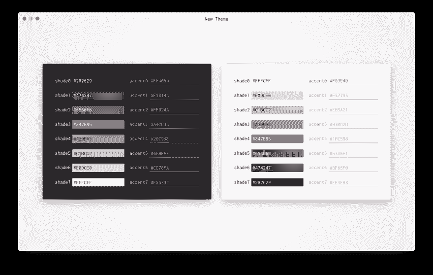
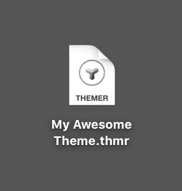

# 从电子到渐进式网络应用

> 原文：<https://dev.to/mjswensen/from-electron-to-progressive-web-app-lhd>

在这篇文章中，我想回顾一下我放弃基于电子应用程序的理由，转而支持 T2 的渐进式网络应用程序。

*   明智地选择你的平台——你受其维护者的支配
*   网址是惊人的
*   你真的无法击败网络的分销模式

# 主题

首先简单介绍一下背景。我的应用程序 [themer](https://github.com/mjswensen/themer) 最初是一个构建在 Node.js 上的命令行工具，它使用一组颜色作为输入，并为各种文本编辑器、终端模拟器和其他工具生成匹配的主题。然而，实际上*为你的个性化主题选择*颜色是乏味和麻烦的。一个朋友建议我构建一个 GUI 来帮助简化这个过程，并在创建个性化主题时提供一个更紧密的反馈循环。鉴于 Electron 捆绑了一个 Node.js 运行时，并且我可以轻松地将我的 CLI 包装在一个适用于所有平台的“原生”GUI 中，Electron 应用程序似乎是一个完美的选择。themer 的 GUI 诞生了:

# 臭虫

在花了大量时间构建 GUI 并将其连接到在 Electron 的节点进程中运行的 CLI 后，我能够捆绑应用程序安装程序，并在 [GitHub releases](https://github.com/mjswensen/themer-gui/releases) 页面上提供下载。直到应用程序被下载了大约 10k 次之后，我才发现[一个非常讨厌的 bug](https://github.com/electron/electron/issues/13596) ，它导致基于电子的应用程序在使用 macOS 原生颜色选择器时崩溃:

<video loop=""><source src="https://mjswensen.com/blog/videos/themer-gui-crash.webm" type="video/webm"> <source src="https://mjswensen.com/blog/videos/themer-gui-crash.mp4" type="video/mp4"></video> 

修复这个问题花了将近八个月的时间，在此期间，themer 的 GUI 的实用性大大降低。

## 外卖

当构建一个特定的平台或框架时，**你受到其维护者的支配**(当然，如果项目是开源的，你可以尝试自己解决问题，但这并不总是可行的)。尽管电子版很受欢迎，但像这样的 bug 在主流网络浏览器中不会持续一周(或者可能根本不会发生)。

# 共享/持续状态

对主题图形用户界面的一个要求是用户应该能够保存(最好是分享)他们的主题。如果没有某种与 GUI 集成的基于云的服务，最好的解决方案就是允许主题的 GUI 从文件系统中读写 JSON。关于 electronic 的一个巧妙之处是，您可以在操作系统中注册一个自定义图标，用于匹配您的自定义扩展名的文件:

我走了整整九步，实现了`Open`、`Save`、`Save As...`，友好的提示以防止意外丢弃未保存的更改，等等。基本上所有你期望从传统桌面程序中得到的东西。这对于持久化主题数据来说已经足够好了，但是不允许与他人轻松共享主题。

在 Web 上，有一种更好的共享应用程序状态的方法:URL。themer 的新 PWA 在 URL 的查询字符串中存储了所有与主题相关的状态，所以分享你的主题就像发送一个链接一样简单(就像[这个](https://themer.dev/?colors.dark.accent0=%23CA3E5A&colors.dark.accent1=%23D8843E&colors.dark.accent2=%23EBB062&colors.dark.accent3=%2381A559&colors.dark.accent4=%2342ABAB&colors.dark.accent5=%234496CD&colors.dark.accent6=%239770B2&colors.dark.accent7=%23B35D8D&colors.dark.shade0=%2313222E&colors.dark.shade7=%23ACBECC&activeColorSet=dark&calculateIntermediaryShades.dark=true&calculateIntermediaryShades.light=true))，保存就像书签一样简单(或者只是使用你浏览器的历史记录)。

## 外卖

网址是网络最精彩、最显著的特征之一。这个简单而强大的状态/位置共享机制是我最喜欢的网络部分之一，也是其他平台明显缺少的部分。

# 分布模型

有一个很棒的开源包叫做 [`electron-builder`](https://www.electron.build/) ，它增加了对推送更新的支持，你的应用可以在后台自动下载。总的来说，它的配置和运行相对容易，但在我的脑海中总有一个声音说:“我希望这个版本的更新代码能够工作；否则，任何人都无法安装超过这一点的更新。”

虽然仍然有可能用 PWA 的`ServiceWorker`搬起石头砸自己的脚，但是更多的缓存和网络代码存在于浏览器本身，从而减少了用户出错的空间。

## 外卖

网络分销模式是无与伦比的。如果您发布的应用程序版本有问题，您只需修复并重新部署即可。平台本身会处理剩下的事情。

# 结论

当然，有一些应用程序需要使用电子代码(比如文件系统访问的 VS 代码，等等。)，在这种情况下，选择构建一个纯粹基于 Web 的应用程序并不像我的小宠物项目那样简单。

电子是一个很棒的软件，构建一个电子应用程序是一次充满学习的愉快经历。然而，在花了一段时间之后，我比以往任何时候都更致力于为我选择的平台——网络——而努力。我迫不及待地想知道 PWAs 和网络技术的未来。

看看这个主题的新 PWA，让我知道你的想法。