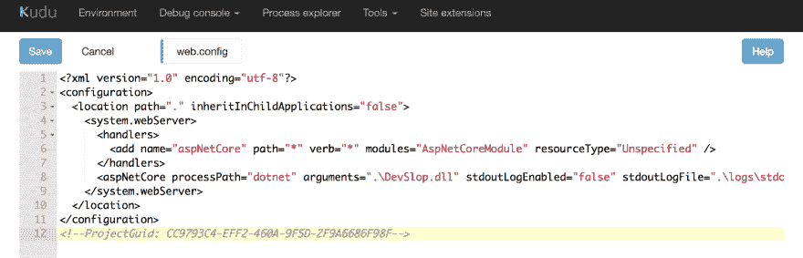
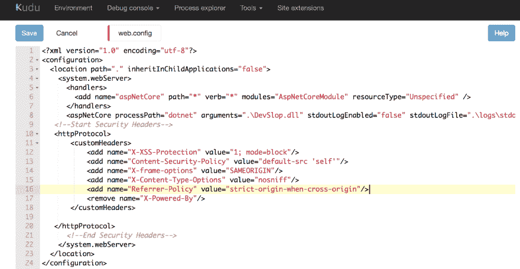
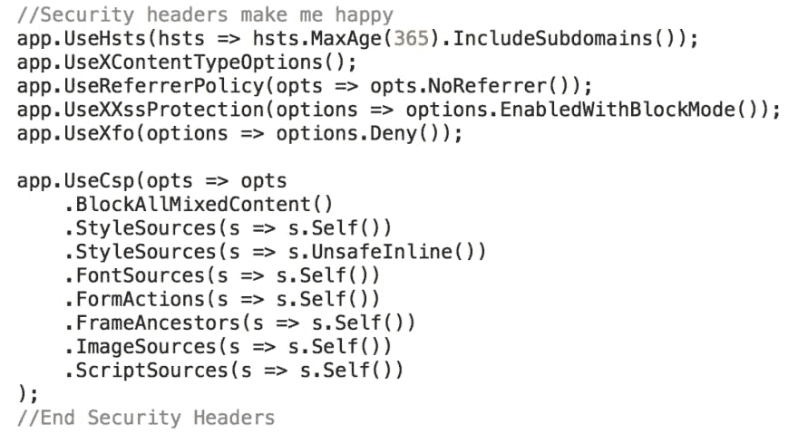
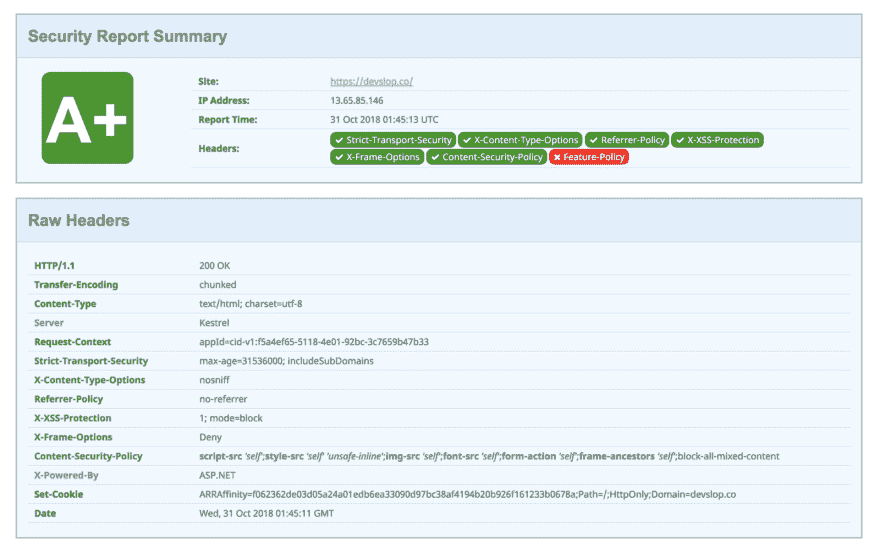

# ASP.Net 和的安全标头。网络核心

> 原文：<https://dev.to/devslop/security-headers-for-aspnet-and-net-core-b36>

对于那些不关注我自己或[弗兰齐斯卡·布勒](https://twitter.com/bufrasch)的人，我们有一个名为 [OWASP DevSlop](https://devslop.co) 的开源项目，在这个项目中，我们通过编写易受攻击的应用程序、创建管道、发布概念证明以及记录我们在 [YouTube 频道](https://aka/ms/DevSlopShow)和我们的博客上所了解的内容来探索 DevSecOps。在这篇文章中，我们将探讨添加安全头到我们的概念验证网站，DevSlop.co。这篇博客文章与 Franziska 的文章 [OWASP DevSlop 的 TLS 和安全标题之旅](https://medium.com/@franbuehler/owasp-devslops-journey-to-tls-and-security-headers-aa892f1ac851)密切相关。如果你喜欢这本，也看看她的。:)

我和 Franziska Bühler 在 OWASP DevSlop 秀第 2 集[第 2 集](https://www.youtube.com/watch?v=-il28nDFgBg&t=3s)、[第 2.1 集](https://www.youtube.com/watch?v=6-mqK3jr6Jg&t=3s&list=PLI9RITMnVbyg-OEn2vbsDnzWi9jGd6_5u&index=5)和[第 2.2 集](https://www.youtube.com/watch?v=uJeUodTRCEs)安装了几个安全头。不幸的是我们发现。Net 核心应用程序没有 web.config，所以下一次我们发布它时，删除了我们添加的漂亮的安全头。虽然这不是个好消息，但这是另一个学习的机会，也给了我一个很好的借口，让我终于写下了我一直承诺的 **Security Headers** 博文。开始了。

[](https://res.cloudinary.com/practicaldev/image/fetch/s--BiBuYaPx--/c_limit%2Cf_auto%2Cfl_progressive%2Cq_auto%2Cw_880/https://thepracticaldev.s3.amazonaws.com/i/hy9wb6dmqphd0xz4ys6o.png)

刚才，我添加回了头，但是我把它们添加到了我的。Net Core app，你可以[看这里](https://www.youtube.com/watch?v=uJeUodTRCEs)。特别感谢[达米恩·博德](https://damienbod.com/2018/02/08/adding-http-headers-to-improve-security-in-an-asp-net-mvc-core-application/)对[的帮助。网芯扭曲](https://docs.microsoft.com/en-ca/dotnet/core/?WT.mc_id=SheHacksPurple-Blog-tajanca)。

如果你想深入了解我们在节目中做了什么以及每个安全标题意味着什么，你应该[阅读 Franziska 的博客文章](https://medium.com/@franbuehler/owasp-devslops-journey-to-tls-and-security-headers-aa892f1ac851)。她解释了每一个步骤，如果你第一次尝试在你的 web.config 中添加安全头(【ASP.Net】T2，而不是[)。网芯](https://docs.microsoft.com/en-ca/dotnet/core/?WT.mc_id=SheHacksPurple-Blog-tajanca))，你一定要看。

web.config 中 ASP.Net 的新代码如下所示:

```
**<! — Start Security Headers ->**
<httpProtocol>
 <customHeaders>
 <add name=”X-XSS-Protection” value=”1; mode=block”/>
 <add name=”Content-Security-Policy” value=”default-src ‘self’”/>
 <add name=”X-frame-options” value=”SAMEORIGIN”/>
 <add name=”X-Content-Type-Options” value=”nosniff”/>
 <add name=”Referrer-Policy” value=”strict-origin-when-cross-origin”/>
 <remove name=”X-Powered-By”/>
 </customHeaders>
 </httpProtocol>
**<! — End Security Headers ->** 
```

Enter fullscreen mode Exit fullscreen mode

[](https://res.cloudinary.com/practicaldev/image/fetch/s--kGYvbliv--/c_limit%2Cf_auto%2Cfl_progressive%2Cq_auto%2Cw_880/https://thepracticaldev.s3.amazonaws.com/i/ofvzgoxzoqyxclab4oqi.png)

还有我的 startup.cs 的新代码(。网芯)，长这样(谢谢达米恩 Bod):

**//安全标题让我开心**
app。使用。MaxAge(365)。include subdomain())；
app。UseXContentTypeOptions()；
app。UseReferrerPolicy(opts =>opts。nore Ferrer())；
app。UseXXssProtection(options = >选项。EnabledWithBlockMode())；
app。UseXfo(options = >选项。deny())；
app。UseCsp(opts = > opts
。BlockAllMixedContent()
。style sources(s =>s . Self())
。style sources(s =>s . unsafeline())
。font sources(s =>s . Self())
。FormActions(s =>s . Self())
。frame ancestors(s =>s . Self())
。image sources(s =>s . Self())
。script sources(s =>s . Self())
)；
**//结束安全头**

[](https://res.cloudinary.com/practicaldev/image/fetch/s--EFk2WggU--/c_limit%2Cf_auto%2Cfl_progressive%2Cq_auto%2Cw_880/https://thepracticaldev.s3.amazonaws.com/i/zsbe9pmu9bb2iwqioskd.png)

在未来的剧集中，我们还将添加:

*   我们 cookies 的安全设置
*   x-允许的跨域策略:无
*   Expect-CT:(我们的提供商目前不支持)
*   功能策略:摄像机“无”；麦克风“无”；说话人“自己”；振动“无”；地理位置“无”；加速度计“无”；环境光传感器“无”；自动播放“无”；加密媒体“无”；陀螺仪‘无’；磁力计‘无’；midi“无”；付款“无”；画中画“无”；usb“无”；VR‘无’；全屏*；

有关所有这些安全头的更多信息，我强烈建议您阅读 [OWASP 安全头指南](https://www.owasp.org/index.php/OWASP_Secure_Headers_Project#xpcdp)。

我们现在在所有重要的地方都取得了好成绩，https://securityheaders.com、https://www.ssllabs.com、T2、http://hardenize.com 和 T5，但是我们希望能进一步提高我们的分数。

更多信息，请在 YouTube 上观看我们的节目！
T3T5】

##### 请使用所有适用于您的安全标题。