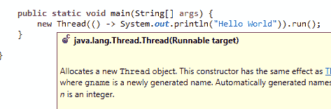

# Java 8:轻松了解 lambda 函数，主要新增功能！

> [https://dev . to/renaldodev/Java-8-容易理解-真菌-lambda-main-news-59b](https://dev.to/rinaldodev/java-8-entenda-facilmente-funes-lambda-a-principal-novidade-59b)

**lambda 函数**的创建是 **Java 8** 的主要新增功能，发布于 **2014** ！现在，您几乎必须了解它们的工作方式，并了解如何在代码中使用它们。

[你更喜欢这个视频内容吗？看这里！](https://www.youtube.com/watch?v=lbCYLgoVpfQ&)

### Java 8 和功能编程

一段时间以来，JavaScript 已经确立为开发的标准语言前端。与此同时，Scala、Kotlin、Python 等语言的出现和普及也在发生。伴随着这些运动，功能编程开始越来越流行。

为了将此功能也引入 Java 中，创建了新的语法“**”lambda 函数“**”。如果你从来没见过，这里是:

```
() -> System.out.println("Hello World") 
```

如果你从来没有见过这样的代码，不要害怕，你会很容易理解它的意思。

* * *

### Java 无 lambda 函数

如果您已经编写 Java 一段时间了，您可能已经编写了类似的代码:

```
public static void main(String[] args) {
    new Thread(new Runnable() {
        @Override
        public void run() {
            System.out.println("Hello World");
        }
    }).run();
} 
```

尽管这个代码运作良好，但它有一个很大的问题:它是**巨大的**。仔细想想，花了 6 行代码来创建线程和打印──这应该是完全无关紧要的。现在，使用 lambda 函数查看同一代码:

```
public static void main(String[] args) {
    new Thread(() -> System.out.println("Hello World")).run();
} 
```

上面的代码由编译器解释，与前面的代码完全相同，只有一行代码，并且更加简洁。而这里最有趣的是，我们还在用**【同样的】** **【构造家】**创造一个`Thread`。IDE 本身也确认了这一点:

[](https://res.cloudinary.com/practicaldev/image/fetch/s--abdSXwrn--/c_limit%2Cf_auto%2Cfl_progressive%2Cq_auto%2Cw_880/https://rinaldo.dev/wp-content/uploads/2019/03/runnable-1.png) 

<figcaption>建设者接收`Runnable`</figcaption>

的实例

编译器知道，这个 lambda 函数是“`Runnable`”的一个实例，即使我们没有明确说明这一点。好吧，但他怎么知道？

* * *

### Java 8 与萨姆概念

当我们理解了或 **SAM** 的概念时，编译器的这种行为就变得简单了。基本上，任何采用单一方法的接口都遵循这一概念。不久，编译器明白其 lambda 功能实际上就是实现了这种唯一的方法。让我们仔细看看。

例如，`Runnable`接口只有`run`方法。这是从 JDK 直接复制的:

```
@FunctionalInterface
public interface Runnable {
    public abstract void run();
} 
```

因此，在使用如上所述的 lambda 函数时，编译器明白它只能是方法`run`的实现。

至于这个班里出现的注释，她只是**信息性的**。它指示编译器在此类不符合成为“**功能接口**的所有要求时，生成一个“**错误”(**error)，即可以从 lambda 函数创建的接口。例如，如果此接口有**两种方法**，则会出现编译错误。尽管如此，此注释**【否】**是强制性的。您可以将 lambda 函数与满足**前提条件**的任何接口一起使用，以将其视为功能性函数。

好吧，那么 lambda 函数只是为了让我在这种情况下减少代码行的数量？不。事实上，lambda 的功能远比看起来有用**。我刚才举的例子只是为了‘T4’了解‘t5’它的工作原理，但它们让你在 Java 中所能做的远比‘T6’有趣。。**

 *** * *

### 功能编程

lambda 函数可以对使用 **JavaScript** 的人使用众所周知的方法，如`filter`、`map`和`forEach`。

以**为例**想象一下，你有一个数字列表。您要列印前 7 个数字乘以 2 的值，但必须是偶数。让我们看一下使用传统 Java 的可能实现:

```
public static void main(String[] args) {
    List<Integer> lista = Arrays.asList(1,5,8,7,4,6,3,2,1,8,5,7,4);
    for (int i = 0; i < 7; i++) {
        Integer numero = lista.get(i);
        if (numero % 2 == 0) {
            System.out.println(numero * 2);
        }
    }
} 
```

这是一种常见的实现，工作正常，如果用 Java 编程一段时间，您可能会习惯于看到它。但是，让我们来看看使用来自 Java 8 的流的相同实现会是什么样子:

```
public static void main(String[] args) {
    List<Integer> lista = Arrays.asList(1,5,8,7,4,6,3,2,1,8,5,7,4);
    lista.stream()
        .limit(7)
        .filter(e -> e % 2 == 0)
        .map(e -> e * 2)
        .forEach(System.out::println);
} 
```

对于不习惯的人来说，这种实施第一次可能会显得奇怪。但是，它更为简洁****【限定】**。你可以确切地知道**这个名单上正在进行的所有操作。很明显，对每个项目(“T3”)都有一个限制(“T0”)、一个过滤器(“T1”)、一个转换(“T2”)和一个操作(“T3”)。****

 ****这是传递给方法`filter`的 lambda 函数的结构:

[](https://res.cloudinary.com/practicaldev/image/fetch/s--Hi3DY5Fp--/c_limit%2Cf_auto%2Cfl_progressive%2Cq_auto%2Cw_880/https://rinaldo.dev/wp-content/uploads/2019/03/explicacao_lambda_lambdas.png) 

<figcaption>方法中传递的 lambda 函数结构`filter`</figcaption>

从学习 lambda 函数和新的流 API 开始，编写一个更容易理解的代码，很快就更容易进行维护。此外，远远少于有利于**虫子**。

* * *

### Java 8 的真正优势

事实上，Java 8 中 lambdas 函数的主要优点是允许使用 **Streams** 。没有它们，几乎不可能轻松使用流。代码太大太复杂了根本没用。如果您想知道如果不使用 lambda 函数，上述实现将会是什么样子，请参见。请永远不要这样做。

```
public static void main(String[] args) {
    List<Integer> lista = Arrays.asList(1, 5, 8, 7, 4, 6, 3, 2, 1, 8, 5, 7, 4);
    Stream<Integer> limit = lista.stream().limit(7);
    // nunca escreva um código assim!
    Stream<Integer> filter = limit.filter(new Predicate<Integer>() {
        @Override
        public boolean test(Integer e) {
            return e % 2 == 0;
        }
    });
    Stream<Integer> map = filter.map(new Function<Integer, Integer>() {
        @Override
        public Integer apply(Integer e) {
            return e * 2;
        }
    });
    map.forEach(new Consumer<Integer>() {
        @Override
        public void accept(Integer t) {
            System.out.println(t);
        }
    });
} 
```

* * *

### Java 未来之路

尽管 lambda 函数对于流 API 的启动非常有用，但这只是开始。使用**lambda**函数，各种 API 正在成为可能。Java 9，以**为例**，带来了[反应流](http://www.reactive-streams.org)，这是著名图书馆[实施的标准【xjava】](https://github.com/ReactiveX/RxJava)。

**不久**我们很可能会在 **Java** 中实现许多具有功能编程和 lambdas 功能的东西，例如 **HTTP** 的请求，**文件的操作】**

想进一步了解 lambda 函数的效用吗？[参见另一篇关于**【流】**以及如何将 lambda 函数与集合一起使用的文章。](https://dev.to/rinaldodev/java-8-streams-pare-de-usar-for-e-simplifique-seu-codigo-4df8)

恭喜！现在**你**知道 Java 8 的 lambda 表达式，你可以利用这一知识把**你的**项目加**快速】**和**在**中生长。****

[你也想访问这个视频内容吗？看这里！](https://www.youtube.com/watch?v=lbCYLgoVpfQ&)

你想收到我写高质量代码**和按时交付项目的最佳提示？ [**然后进入这里**。](https://rinaldo.dev/contato/)**

 **你想每天学习改进你的代码吗？然后在**Twitter**:[**https://Twitter . com/rinalddev**](https://twitter.com/rinaldodev)上跟我来

* * *

**最近有没有看到任何具有 lambda 功能的代码？或者你知道其他我们可以利用的情况吗？请留言！也分享！**

 **你喜欢你学到的东西吗？与他人分享 devs！

post [Java 8:轻松了解 lambda 函数，主要新增功能！](https://rinaldo.dev/java-8-entenda-facilmente-funcoes-lambda-a-principal-novidade/)首先出现在 [rinaldo.dev](https://rinaldo.dev) 中。**********