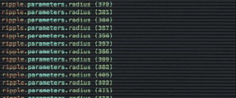
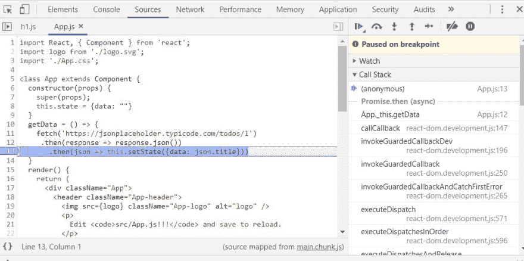
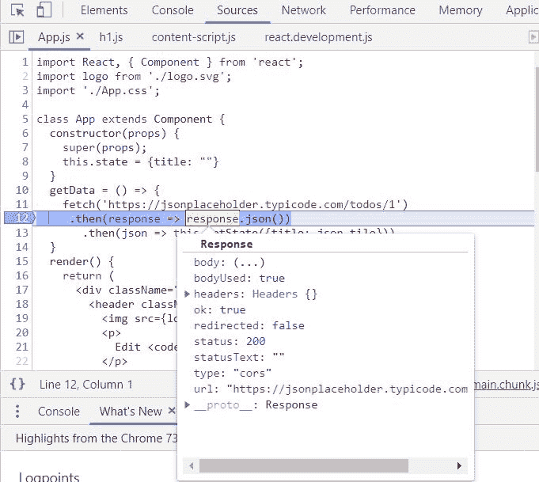
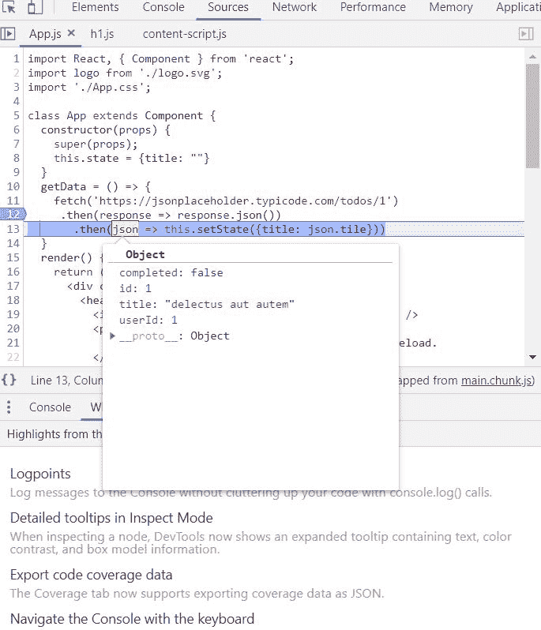

# 伙计，找个调试器来！

> 原文：<https://dev.to/thugdebugger/dude-get-a-debugger-3ige>

T3】

<figcaption>IT JUST DOESN'T F***ING WORK !</figcaption>

上面的描述听起来是不是像你在晚上 9 点喝了几杯啤酒后的样子；在花了几个小时解决一个让你质疑自己在开发者世界中的存在的问题却毫无结果之后？

T3】

<figcaption>MY CONSOLE.LOG()/PRINT() STATEMENTS NOT HELPING !</figcaption>

你是否花了几个小时在你的代码中加入随机的日志记录语句，比如“这里”，“它工作了”，或者只是一些莫名其妙的“hfdhfdhfd”？

## 伙计，找个调试器来！

如果以上听起来像你自己，并且你已经准备好以一种更有条理的方式解决这些平凡的问题来结束你的折磨，那么是时候学习如何使用调试器了。我说调试器，因为调试器不止一个。作为一名数据可视化工程师，我更关注 web 技术，所以我的调试器阵容围绕着流行的 web 浏览器(例如 Chrome 调试器、FireFox 调试器等)展开。)，但其他语言(如 Python)有自己的调试器，甚至 ide 和文本编辑器(如 Visual Studio 和 Visual Studio 代码)也有自己的嵌入式调试器或可供安装的调试器。

## 为什么是一个奇特的调试器？

调试器将允许您在等待令您沮丧的中断状态的最终输出之前，快速发现代码执行中出现的问题。把调试器想象成一种工具，当它遇到问题时，它会暂停程序继续运行，向您显示所述问题的位置以及程序中当时可用的其他数据。例如，如果有一个名为“result”的变量需要在其他地方使用，但从未被声明；引发的错误(未定义)将与“结果”的当前值一起显示在调试器中，您可以很快看到“结果”是未定义的。如果这没有意义，不用担心，我们将在下面有一个更深入的例子来解释更多。

## 历史课:到底是谁把它叫做调试器？

<figure>

<figcaption>Programming Goddess Grace Hopper</figcaption>

</figure>

我坚信理解过去，抓住你想要去的地方。我不会在历史上烦死你，但它是你应该知道的“bug”和“debugger”这两个词的故事的一些关键元素(毕竟这是编程民间传说)。在过去真空管计算的日子里，你有占据房间大小的机器。你可以想象，这种大小的机器可能会有一些除了电子部件以外的小入侵者试图进入内部工作。因此传说在 1945 年 9 月 9 日，一名哈佛技术人员注意到这些巨大机器中的一个有不寻常的地方。在移除面板时，发现了一只蛾，并迅速移除。编程女神和传奇人物 Grace Hoper 随后在笔记中记录了“发现的第一个 bug 实例”，首次在计算机中使用了 bug 一词。接下来的词，de-bug 归结为 remove-bug，因此调试器的使用是为了从你的程序中删除 bug。*WOOO*现在希望我的历史课没有让你太无聊，但现在你有一个编程民间传说可以在下次与像我们一样的书呆子聚会时分享。

## 太好了，现在让我们开始吧！

因此，为了方便每个人访问，我将使用 Google Chrome 浏览器中的调试器。前往[此链接](https://github.com/js1599/Debugger-Learning-Material)并下载培训材料。在进入下一部分之前，一定要 NPM 安装所有的东西

## 那么游戏计划是什么？

理解我们要去哪里的第一步是理解手头的问题。我们将使用这个来自[这里](https://jsonplaceholder.typicode.com/)的伪 API，它将允许我们做假的模拟 API 调用。此时，继续从上面开始下载代码(`npm run start`)。请注意，页面上有一个从上面定义的 API 获取一些数据的按钮，还有一个从 API 调用返回的标题位置。继续点击按钮，再点击两次。什么也没发生，所以我们对代码的期望和现实有问题。使用 Chrome 浏览器，点击 F12，选择“源”，使用键盘快捷键“CTRL + p ”,搜索我们的 App.js 文件。在浏览器中识别出我们之前的文件后，您可以开始在这里添加目标行，称为“断点”,以便更好地了解手头的问题。对“断点”更好的解释是，在代码中选择一个执行“中断”的点，因此称为“断点”。在涉及从 API 返回数据的行(第 12 行)上添加断点，并再次单击按钮。刚刚发生了什么？您应该注意到，您放置断点的那一行是高亮显示的，表明之前选择的断点是“命中”的。现在在这种模式下，你可以做一些事情，并且会注意到一些包含大量数据的事情。

* * *

 On the right is the call stack of the application. As a stack (LIFO), the call stack holds the calls (execution) that were made up to the state of the current breakpoint. Translation: the call-stack is a map of the code your program ran up to the point it hit your break-point. Thus, using the call stack you're able to retrace the steps made by your program to investigate if the error could be prior than expected. Clicking on the files listed in the call stack will jump you into them for a closer investigation. You will also notice on the right the breakpoints you have setup, and the ability to toggle them on and off, as well as other attributes such as the watchers and global breakpoints (to name a few) which I can cover in a more advanced tutorial (just ask). For now, just be concerned with the call stack and breakpoints section.

* * *

Back to the breakpoint we hit earlier; hover over the "response" variable, notice what jumps out, it's the raw data being returned from the API. Seeing that the data is being returned with a valid [200 status code](https://www.restapitutorial.com/httpstatuscodes.html), we now have to use our debugger "step controls" to move closely to the error in order to prevent the error from happening again and us losing our place in the debug state.

* * *

### 调试器步骤控件:

<figure>

<figcaption>You can find these in the right corner, above the call stack in order below.</figcaption>

</figure>

*   继续-运行程序，直到出现错误/下一个断点/完成
*   跳过-您希望跳过即将执行的语句
*   步入-您想要进入将要执行的语句
*   走出去——你因为踏入某些领域而搞砸了，现在你想回到堆栈中去
*   第二步-你想进入堆栈中即将到来的调用

* * *

Now Step Over line 12, and investigate the data object being written to the State object, data property (line 13). Notice how if you hover over `json.tile` it comes back as `undefined`, but hover over the json variable on line 12\. Notice that when hovering over it, you see no property labeled as "tile", but "title" instead. We have a typo of "title" being represented in our state object as "tile". 

* * *

 So, hop back over to your code, and correct the typo, and run the code. IT WORKED! You've successfully debugged a program. That's all there is to it. Just remember to think of it in terms of physical stepping. Do you want to continue walking - Step, do you want to investigate what this evaluates more - step into, walked too far into what you're currently in - Step out, do you want to move over what's coming up - Step Over, and do you want to just run the whole way until another breakpoint, error, or full execution - Continue. But the debugger is good for more than fixing issues, you can also figure out how to improve/add features by using the debugger

* * *

## 让我们发挥创造力。

假设我们需要将他们的街道名称和地理坐标添加到行中，但是不确定这些数据是否存在于我们当前的路线上，以及这些数据在响应中是如何组织的。我们可以重复前面的调试过程

1.  响应完成后添加断点
2.  调查回应
3.  调查我们想要的特定数据是如何构造的
4.  根据您的发现更新您的代码

Voila! If your code is structured correctly, along with the correct results from your findings, then you should now have the geo-cords and street names on each button appropriately. If you want to try this, you can swap out the endpoint to [THIS](https://jsonplaceholder.typicode.com/users)

## 其他调查工具

*   [Fiddler - To“中间人”网络请求](https://www.telerik.com/fiddler)
*   [邮递员——到达终点并进行调查](https://www.getpostman.com/)

## 其他调试器

*   所有主要的浏览器都在各自的开发工具中包含了一个调试器
*   [集成在 Visual Studio IDE 中的调试器](https://docs.microsoft.com/en-us/visualstudio/debugger/debugger-feature-tour?view=vs-2017)
*   [VS-代码-可通过插件获得](https://code.visualstudio.com/Docs/editor/debugging)

* * *

## 谢谢大家！

非常感谢你读了我的第一篇，但不是最后一篇。我希望在未来创造更多，从初学者到更高级的，并随时欢迎建设性的反馈，建议，并回答你可能有的任何问题。

