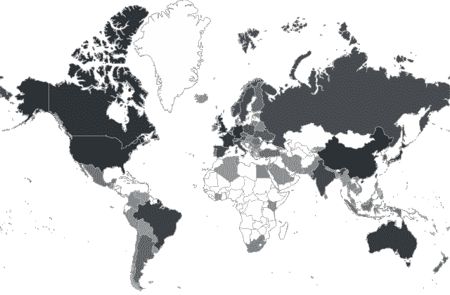

# 世界之星:生成你的 GitHub 观星者的世界地图

> 原文：<https://dev.to/dyatko/worldstar-generate-world-map-of-your-github-stargazers-2cab>

Worldstar 是一个简洁的 CLI 工具，它可以生成一个 SVG 图像和 GitHub repo stargazers 的世界地图。你可以简单地欣赏它或者把它作为 arkit done 添加到你的自述文件[。](https://github.com/dyatko/arkit#fun-stats-stargazers-map-by-worldstar)

