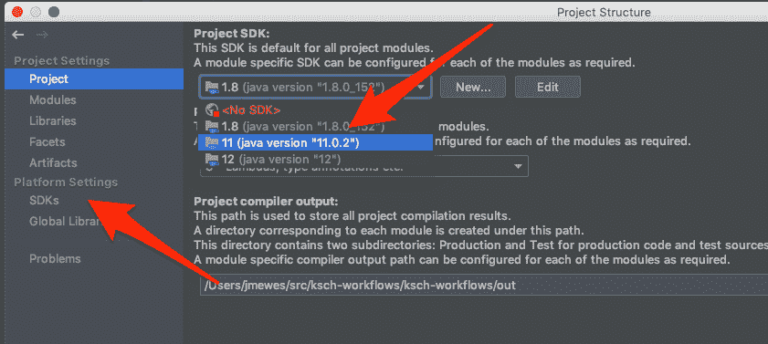
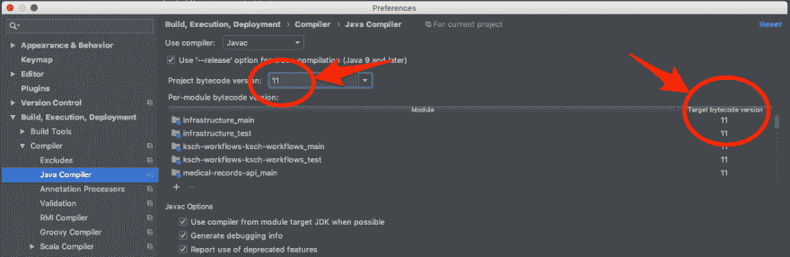

# 关于将 Java 项目从 JDK 8 版升级到 JDK 11 版的报告

> 原文：<https://dev.to/janux_de/report-about-updating-a-java-project-from-jdk-8-to-jdk-11-2klf>

Java 版本 8 已经走到了生命的尽头。自 2019 年 1 月起，免费的商业版不再接收更新(见[oracle.com](https://www.oracle.com/technetwork/java/java-se-support-roadmap.html))。

所以(除非你想转投非主流的 JDK 提供商，比如 [AdoptOpenJDK](https://adoptopenjdk.net/) 或者[亚马逊 Corretto](https://aws.amazon.com/en/corretto/) )是时候将所有 Java 项目升级到最新版本了。或者至少是最新的长期支持版本。

这篇博文是一篇经验报告，讲述了在这条道路上需要完成的步骤。

# 评估现状

## 环境

将要更新的项目相当小。这是一个 **Spring Boot** 应用程序，它使用 **Apache Wicket** 作为 web 框架，使用 **Gradle** 进行构建管理。主要开发环境是 MacBook Pro 和 IntelliJ IDE。

## 已安装的 JVM 概述

在 MacOS 上，在终端上使用这个命令，可以列出系统上安装的所有 JVM:

```
$ /usr/libexec/java_home -V
Matching Java Virtual Machines (3):
    10.0.1, x86_64: "Java SE 10.0.1"    /Library/Java/JavaVirtualMachines/jdk-10.0.1.jdk/Contents/Home
    9.0.1, x86_64:  "Java SE 9.0.1" /Library/Java/JavaVirtualMachines/jdk-9.0.1.jdk/Contents/Home
    1.8.0_152, x86_64:  "Java SE 8" /Library/Java/JavaVirtualMachines/jdk1.8.0_152.jdk/Contents/Home

/Library/Java/JavaVirtualMachines/jdk-10.0.1.jdk/Contents/Home 
```

Enter fullscreen mode Exit fullscreen mode

在这种情况下，它们是通过[自制软件](https://brew.sh/)安装的，所以也可以通过下面的命令提供一个概述:

```
brew cask list 
```

Enter fullscreen mode Exit fullscreen mode

Gradle 正在使用的 JDK 由环境变量`JAVA_HOME`决定。有了`.bash_profile`中类似的指令，版本可以轻松切换:

```
export JAVA_8_HOME=$(/usr/libexec/java_home -v1.8)
export JAVA_9_HOME=$(/usr/libexec/java_home -v9)
export JAVA_10_HOME=$(/usr/libexec/java_home -v10)

alias java8='export JAVA_HOME=$JAVA_8_HOME'
alias java9='export JAVA_HOME=$JAVA_9_HOME'
alias java10='export JAVA_HOME=$JAVA_10_HOME'

# use JDK 8 by default
export JAVA_HOME=$JAVA_8_HOME 
```

Enter fullscreen mode Exit fullscreen mode

# 安装 JDK 11 号

通过自制软件，OpenJDK 11 可以这样安装:

```
brew update
brew tap homebrew/cask-versions
brew search java
brew cask install java11 
```

Enter fullscreen mode Exit fullscreen mode

(详见[stackoverflow.com](https://stackoverflow.com/a/52524114/2339010))。

现在 Java 11 可以加入`.bash_profile` :

```
export JAVA_11_HOME=$(/usr/libexec/java_home -v11)

alias java11='export JAVA_HOME=$JAVA_11_HOME' 
```

Enter fullscreen mode Exit fullscreen mode

启动新的终端选项卡后，它现在应该可以使用了:

```
$ java11
$ java -version
openjdk version "11.0.2" 2019-01-15
OpenJDK Runtime Environment 18.9 (build 11.0.2+9)
OpenJDK 64-Bit Server VM 18.9 (build 11.0.2+9, mixed mode) 
```

Enter fullscreen mode Exit fullscreen mode

# 升级 Java 项目

## 升级依赖关系

> 我今天给你的最紧急的建议是:如果你正在使用 Java 9 或更高版本，升级到你所有工具和依赖项的最新版本。- [马克·赖因霍尔德](https://www.youtube.com/watch?v=wHoRBvt3U6o)

从 Java 8 到 Java 9，语言中引入了一些突破性的变化。因此，如果项目中包含的库依赖于已更改的语言特性，项目可能会遇到问题。因此，通过将所有依赖项更新到最新版本来开始实际的迁移是一个好主意。对于 Gradle，这个过程由 [Gradle 版本插件](https://github.com/ben-manes/gradle-versions-plugin) :
支持

```
$ gradle dependencyUpdates -Drevision=release

-----------------------------------------------------------------
: Project Dependency Updates (report to plain text file)
-----------------------------------------------------------------

The following dependencies are using the latest release version:
 - com.giffing.wicket.spring.boot.starter:wicket-spring-boot-starter:2.1.5
 - javax.xml.bind:jaxb-api:2.3.1
...

The following dependencies have later release versions:
 - com.google.guava:guava [27.0.1-jre -> 27.1-jre]
     https://github.com/google/guava
 - io.spring.dependency-management:io.spring.dependency-management.gradle.plugin [1.0.6.RELEASE -> 1.0.7.RELEASE]
 - org.projectlombok:lombok [1.18.4 -> 1.18.6]
     https://projectlombok.org
 - org.springframework.boot:spring-boot-gradle-plugin [2.1.2.RELEASE -> 2.1.3.RELEASE]
     https://projects.spring.io/spring-boot/#/spring-boot-parent/spring-boot-tools/spring-boot-gradle-plugin
...
 - org.wicketstuff:wicketstuff-annotation [8.2.0 -> 8.3.0]
     http://wicketstuff.org 
```

Enter fullscreen mode Exit fullscreen mode

Gradle 也应该更新到其最新版本:

```
brew upgrade gradle 
```

Enter fullscreen mode Exit fullscreen mode

此外，IDE 及其所有插件都应该是最新的。

## 更新 Gradlefile 中的语言级别

现在我们准备在`build.gradle`文件中增加 Java 版本号:

```
subprojects {
    sourceCompatibility = 11
    targetCompatibility = 11 
```

Enter fullscreen mode Exit fullscreen mode

## 在 IDE 中使用 JDK 11

之后我们需要在 IntelliJ 中切换到 JDK 11 号。这可以通过进入菜单项“文件>项目结构”来完成。可以在 Project SDK 下拉菜单中选择新版本和语言级别。如果还没有，可以在“平台设置”部分添加。

[](https://res.cloudinary.com/practicaldev/image/fetch/s--ZVhBiqxT--/c_limit%2Cf_auto%2Cfl_progressive%2Cq_auto%2Cw_880/https://thepracticaldev.s3.amazonaws.com/i/qv7kx40sv7gkdrugavt1.png)

另外，在“首选项”中检查正在使用的新编译目标:

[](https://res.cloudinary.com/practicaldev/image/fetch/s--H0y2fVyC--/c_limit%2Cf_auto%2Cfl_progressive%2Cq_auto%2Cw_880/https://thepracticaldev.s3.amazonaws.com/i/88bexvv97uxa0k0a41h7.png)

现在构建项目并运行单元测试。如果你幸运的话，没有错误。

## 在终端上使用 JDK 11

然后在终端中尝试这样做:

```
gradle clean check 
```

Enter fullscreen mode Exit fullscreen mode

在这个项目的例子中，只有一个问题:通过终端的构建失败了，因为 Lombok 库不能被加载。对此的修复相当简单，只需在`build.gradle`文件中添加这两个依赖声明:

```
annotationProcessor("org.projectlombok:lombok:${lombokVersion}")
testAnnotationProcessor("org.projectlombok:lombok:${lombokVersion}") 
```

Enter fullscreen mode Exit fullscreen mode

# 最终测试

完成所有更新后，验证应用程序是否仍在正常运行:

```
gradle clean bootRun -Dspring.profiles.active=qa 
```

Enter fullscreen mode Exit fullscreen mode

没有出现进一步的问题。所以总的来说，升级到 Java 11 比预期的要容易:

[https://github . com/ksch-workflows/ksch-workflows/commit/f 5724 e 627 ee aab 2 b 7 FB 7 a2 E4 a 581091 f 4d 0 ee 628](https://github.com/ksch-workflows/ksch-workflows/commit/f5724e627eeaab2b7fb7a2e4a581091f4d0ee628)

# 清理

最后但同样重要的是，过时的 Java 版本可以从开发环境中删除:

## 通过自制软件卸载

```
brew uninstall java9
brew uninstall java10 
```

Enter fullscreen mode Exit fullscreen mode

## 硬删除

如果它们不是通过自制软件安装的，这是删除旧 Java 版本的方法:

```
$ cd /Library/Java/JavaVirtualMachines
$ sudo rm -rf jdk-9.0.1.jdk jdk-10.0.1.jdk 
```

Enter fullscreen mode Exit fullscreen mode