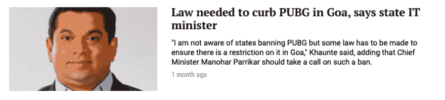
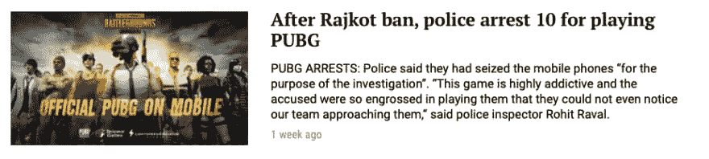
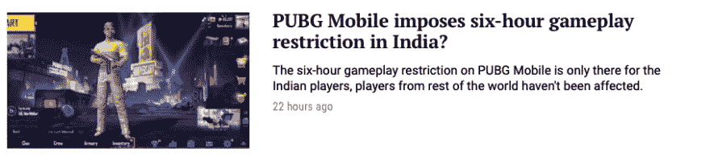

# 反应用成瘾政策/法律会是科技领域的下一个大讨论吗？

> 原文：<https://dev.to/xenoxdev/are-anti-app-addiction-policieslaws-the-next-big-discussion-in-tech-5cgc>

我关注这个新闻“PUBG BAN”有一段时间了。这里有一些新闻剪辑，以了解整个故事。

***终于今天***

他们这样做是因为父母和印度政府的强烈批评。我明白，banhammer 是一种极端的措施，并不能提供长期的解决方案，相反，我们应该教人们更好地控制这些冲动和渴望。但是想想看；如果戒除毒瘾如此容易，那么药物成瘾和药物滥用法就不是什么大事了。使用这种物质是非法的，因为人们无法抵抗诱惑。它们以非常真实的方式改变了人们的大脑化学，今天的数字应用也不例外。

公司雇佣专业人士，让他们的平台尽可能让人上瘾，以实现利润最大化。这种做法已经使用了很长一段时间，不仅是游戏开发商，还有其他平台，如亚马逊和脸书。这些应用在化学层面上影响人类的大脑。每天都有越来越多的人沉溺其中，甚至没有意识到这一点。

因此，在这次讨论中，让我们来探讨这些不断上升的威胁以及我们作为**制定者**的责任。

请在你的评论中保持谦逊和尊重。攻击论点，而不是人。😃
[T5】](https://i.giphy.com/media/d3mlE7uhX8KFgEmY/giphy.gif)