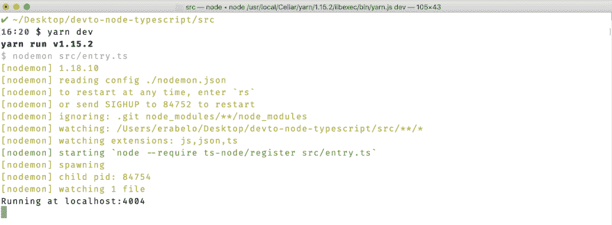
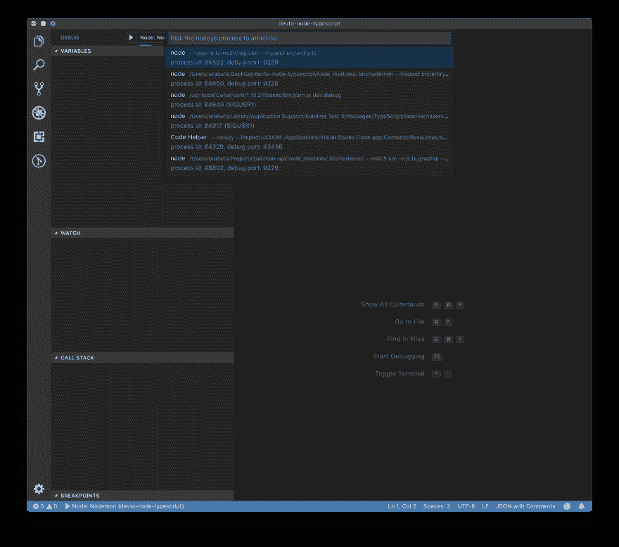
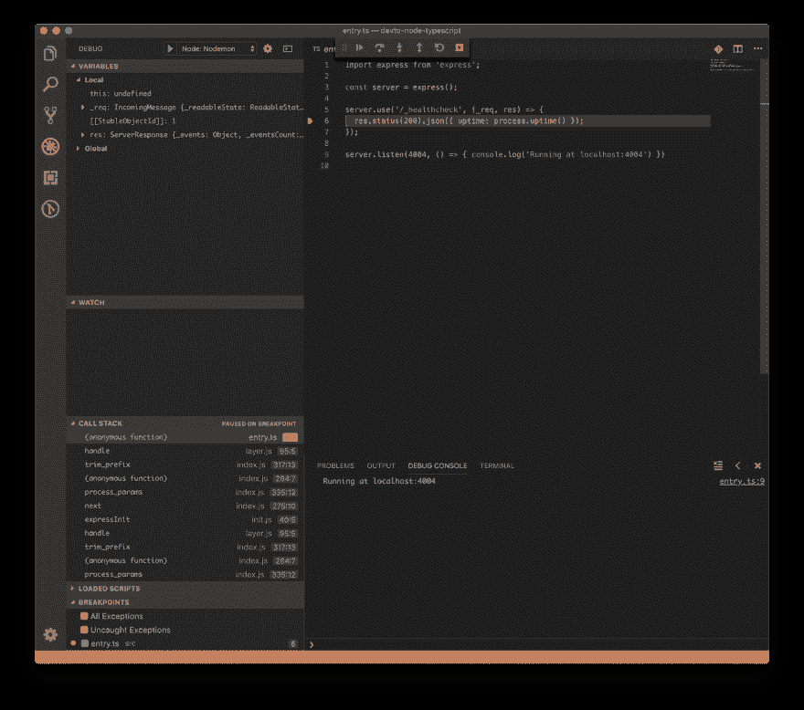
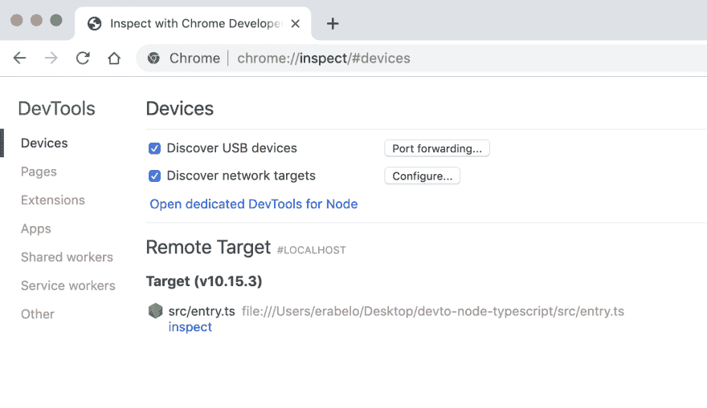
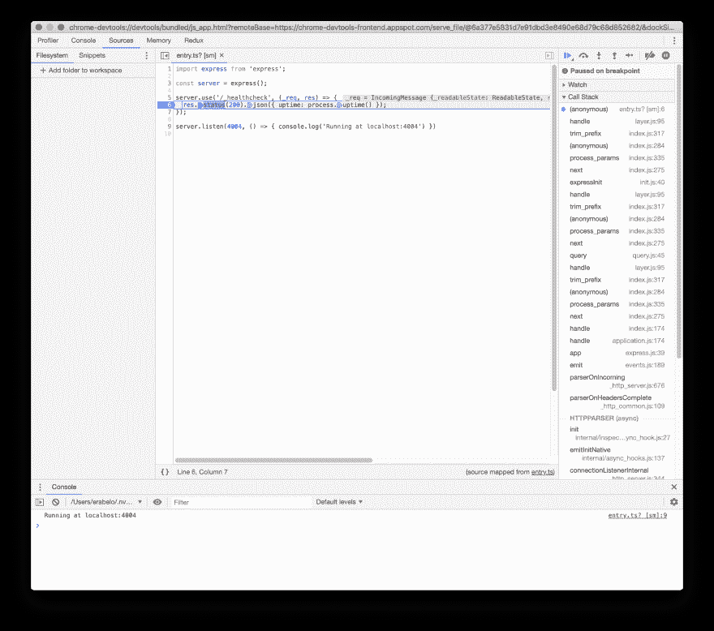

# Node.js，在 VSCode 和 Nodemon 中调试

> 原文：<https://dev.to/oieduardorabelo/nodejs-with-typescript-debug-inside-vscode-and-nodemon-23o7>

设置 Node.js 和 TypeScript 可能很简单。我们的日常工作有时涉及大量的调试，我们还需要重新加载我们的服务器。

让我们来看看如何在 VSCode 中用 TypeScript + Nodemon + Debug 设置 Node.js(额外，您可以在 Chrome DevTools 中调试它)。

少说话，多代码！🤓

# 📦依赖性和配置

```
$ mkdir devto-node-typescript
$ cd $_ 
```

添加我们的依赖项:

```
$ yarn init -y
$ yarn add @types/express@^4.16.1 express@^4.16.4 nodemon@^1.18.10 ts-node@^8.0.3 typescript@^3.3.4000 
```

这是我们的依赖列表:

*   `@types/express@^4.16.1`
*   `express@^4.16.4`
*   `nodemon@^1.18.10`
*   `ts-node@^8.0.3`
*   `typescript@^3.3.4000`

现在，让我们创建我们的`nodemon.json`文件:

```
$ touch nodemon.json
$ vim $_ 
```

并粘贴以下内容:

```
{
  "restartable": "rs",
  "ignore": [".git", "node_modules/**/node_modules"],
  "verbose": true,
  "execMap": { // [A]
    "ts": "node --require ts-node/register"
  },
  "watch": ["src/"],
  "env": {
    "NODE_ENV": "development"
  },
  "ext": "js,json,ts"
} 
```

*   **//【A】**:这里我们对 nodemon 说:“嘿 nodemon，如果我们用一个。ts "文件，请用这一行来执行文件"。因此，现在我们可以执行`nodemon server.ts`，它将使用`ts-node`来编译我们的文件。

要了解更多关于 Nodemon 配置的信息，您可以查看他们的库中的[示例](https://github.com/remy/nodemon/blob/master/doc/sample-nodemon.md)

现在，让我们创建我们的`tsconfig.json`文件:

```
$ touch tsconfig.json
$ vim $_ 
```

并使用:

```
{
  "compilerOptions": {
    "target": "es5",
    "module": "commonjs",
    "outDir": "./dist",

    "strict": true,

    "noUnusedLocals": true,
    "noUnusedParameters": true,
    "noImplicitReturns": true,
    "noFallthroughCasesInSwitch": true,

    "esModuleInterop": true
  },
  "include": ["src/**/*"],
  "exclude": ["node_modules", "**/*.test.ts"]
} 
```

与默认配置没有太大区别(例如，当您运行`tsc --init`时)

我们就快到了，让我们创建一个 **npm 脚本**来启动我们未来的服务器:

```
// ...

"scripts": {
  "dev": "nodemon src/entry.ts"
}

// ... 
```

现在，是时候创建我们的服务器了。

# 💻写我们的服务器和一些路线

正如我们在 nodemon 和 npm 脚本配置中看到的，我们需要创建一个名为`src`的文件夹和一个名为`entry.ts` :
的文件

```
$ mkdir src
$ cd $_
$ touch entry.ts
$ vim $_ 
```

下面我们来写:

```
import express from 'express';

const server = express();

server.use('/_healthcheck', (_req, res) => {
  res.status(200).json({ uptime: process.uptime() });
});

server.listen(4004, () => { console.log('Running at localhost:4004') }) 
```

现在我们可以跑了:

```
$ yarn dev 
```

并查看我们的 Node.js 和运行的 TypeScript + Nodemon 服务器:

[](https://res.cloudinary.com/practicaldev/image/fetch/s--2J8icPzl--/c_limit%2Cf_auto%2Cfl_progressive%2Cq_auto%2Cw_880/https://thepracticaldev.s3.amazonaws.com/i/rgy8804esrcxbwznnsvt.png)

太棒了。🎉

但是等等...缺少了一个重要的部分，我如何调试这个东西？😱

# 📊将调试配置附加到我们的项目

使用 [**nodemon** 我们简单地传递`--inspect`](https://github.com/remy/nodemon#usage) 标志来使我们的节点流程可调试。让我们为此创建一个新的 npm 脚本:

```
// ...

"scripts": {
  // ...
  "dev:debug": "nodemon --inspect src/entry.ts"
}

// ... 
```

如果我们跑:

```
$ yarn dev:debug 
```

我们可以在日志中看到调试选项:

[](https://res.cloudinary.com/practicaldev/image/fetch/s--qpp3haTg--/c_limit%2Cf_auto%2Cfl_progressive%2Cq_auto%2Cw_880/https://thepracticaldev.s3.amazonaws.com/i/86eiaokpflbmxavqo8r8.png)

太好了！让我们创建我们的 VSCode 配置:

```
$ mkdir .vscode
$ cd $_
$ touch launch.json
$ vim $_ 
```

并粘贴以下内容:

```
{
  "version": "0.2.0",
  "configurations": [
    {
      "type": "node",
      "request": "attach",
      "name": "Node: Nodemon",
      "processId": "${command:PickProcess}",
      "restart": true,
      "protocol": "inspector"
    }
  ]
} 
```

该配置基于 VSCode 的[微软配方](https://github.com/Microsoft/vscode-recipes)之一。

让我们打开 VSCode 编辑器，进入“调试”面板:

[](https://res.cloudinary.com/practicaldev/image/fetch/s--m1e1Elb6--/c_limit%2Cf_auto%2Cfl_progressive%2Cq_auto%2Cw_880/https://thepracticaldev.s3.amazonaws.com/i/fdeotq5l6xc7pelu4u1r.png)

随着我们的`yarn dev:debug`运行，让我们按上面截图中的绿色箭头。

首先，我们需要选择指向我们的服务器的进程:

[](https://res.cloudinary.com/practicaldev/image/fetch/s--LiJJcReV--/c_limit%2Cf_auto%2Cfl_progressive%2Cq_auto%2Cw_880/https://thepracticaldev.s3.amazonaws.com/i/ccc394dcbg73e7e2yhes.png)

选择它后，我们可以看到一个浮动的调试面板和一些 UI 更改:

[](https://res.cloudinary.com/practicaldev/image/fetch/s--UHEud0Yy--/c_limit%2Cf_auto%2Cfl_progressive%2Cq_auto%2Cw_880/https://thepracticaldev.s3.amazonaws.com/i/cghe1q7ks62tje7ggxh0.png)

现在，您可以在代码中添加一个断点，并在编辑器中享受 nodemon 重新加载服务器的乐趣:

[](https://res.cloudinary.com/practicaldev/image/fetch/s--DMg0VnJr--/c_limit%2Cf_auto%2Cfl_progressive%2Cq_auto%2Cw_880/https://thepracticaldev.s3.amazonaws.com/i/dcqxhq5picmz2mi11h6n.png)

愉快的经历！❤️ 🎉 😎

# 🌐额外:它也适用于谷歌浏览器开发工具

没错。我们可以采用以下步骤:

*   导航至`chrome://inspect`

[](https://res.cloudinary.com/practicaldev/image/fetch/s--UnchV0rO--/c_limit%2Cf_auto%2Cfl_progressive%2Cq_auto%2Cw_880/https://thepracticaldev.s3.amazonaws.com/i/vioxqtiy503xt9ei0azh.png)

*   点击指向您的服务器的**远程目标**部分中的`inspect`，并使用 Chrome DevTools 调试您的服务器:

[](https://res.cloudinary.com/practicaldev/image/fetch/s--htUlFMPB--/c_limit%2Cf_auto%2Cfl_progressive%2Cq_auto%2Cw_880/https://thepracticaldev.s3.amazonaws.com/i/ae91yd4ge93bxwfe64fb.png)

**注:**我尝试过使用**“为节点打开专用的 dev tools”**选项，但是效果不好:(如果你知道如何让它工作，请与我们分享！

# ☕️，我想要更多！

测试呢？文件夹结构？有默认项目？

不要再说了！对于我个人使用，我有一个小的非固执己见的默认项目:

[https://github.com/oieduardorabelo/node-typescript](https://github.com/oieduardorabelo/node-typescript)

你会发现:

*   Node.js + TypeScript
*   玩笑
*   Nodemon

随意叉，投稿，使用！

编码快乐！🙌