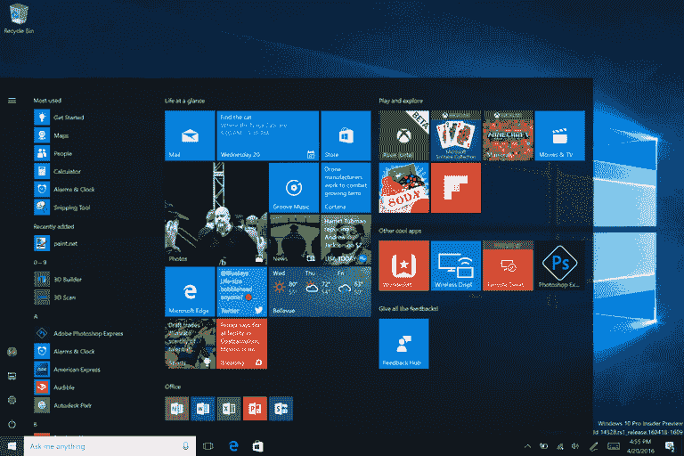
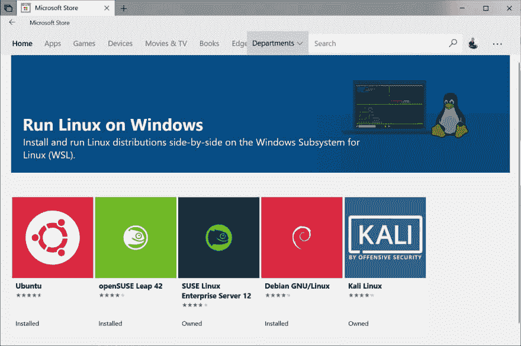
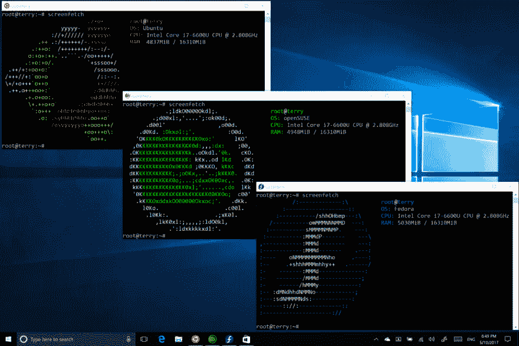

# 在 Windows 2019 上开发的状态:印象深刻！

> 原文：<https://dev.to/vinibrsl/the-state-of-developing-on-windows-2019-impressive-4in4>

多年来，如果你不在微软的堆栈中开发，比如. NET，Windows 被认为是“不适合编程的”。主要的替代品是 Linux 和 macOS。问题是，不是每个开发者都能轻松适应 Linux，或者买得起 Mac。有时你只是想让你所有的软件在没有双引导、虚拟机或兼容层的情况下运行(比如 Wine for Linux)。这就是 Windows 的切入点。

Windows 有很多很容易找到的硬件驱动器，有无数为其开发的软件，当然还有游戏。但是，仍然有人说在 Windows 上开发真的不好，原因有两个:

*   没有可靠的*包管理器*(比如 APT 或 Homebrew)，这使得安装你选择的编程语言更加困难。

*   原生的*命令行 shell* 还不如好的老 Unix shell。

为了同时保持 Unix 和 Windows 的优势，人们通常将 Windows 与 Linux VM 一起使用，这会耗费大量的 CPU 和内存。没有虚拟机或者双引导，如何两全其美？

# 解决方案:Windows Linux 子系统(WSL)

用于 Linux 的 Windows 子系统是一个兼容层，用于在 Windows 上本地运行 Linux 二进制文件。换句话说，您可以在没有虚拟机或双引导的情况下在 Windows 上运行 Linux 发行版。这意味着您可以轻松地安装软件包(如 rbenv、node、git)，在 WSL 中运行 web 服务器，并且仍然可以使用代码编辑器在 Windows 环境中编写代码。

Windows 10 的这一功能仍在不断发展，每次更新都会得到改进。当然，它不会取代完整的 Linux 设置，但是它满足了大多数开发人员的需求。

我主要使用 Windows Subsystem for Linux(WSL)Debian 发行版来开发 Ruby on Rails 和 NodeJS 应用程序。我在 Windows 中编写 Visual Studio 代码，并在 WSL 上运行服务器。如果我愿意，我甚至可以在 Linux 环境中运行我的编辑器。

# WSL 还不完美

尽管 WSL 很好，但它还不够完美。有一些性能问题，特别是 I/O。要解决这些问题，您可能需要花一些时间来搜索和调整您所使用的设置。一旦配置好环境，你就应该有一个*流畅、方便、稳定的混合(Windows + Linux)开发环境*。

正如我之前提到的，WSL 在每一次 Windows 更新中都变得越来越好，I/O 一直是 WSL 关注的主要问题，正如最近的补丁所显示的。

# Windows 不再是坏的了

没错，以前 Windows 不好编程。但那在 2019 年肯定是假的。微软一直在为非 Windows 开发人员弥补失地。

* * *

如果你想试试 WSL，请遵循微软指南。它应该在几分钟内启动并运行。要获得最佳性能，请在使用 Windows Defender 时将其禁用。

* * *

不要忘记[在 Twitter 上关注我](https://twitter.com/vnbrs_)和[查看我的其他帖子](https://medium.com/@vnbrs)。