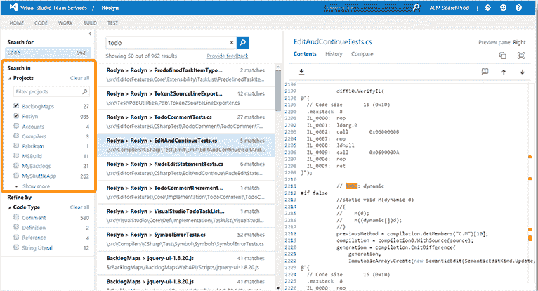

# 使用 Git 别名工作更快

> 原文：<https://dev.to/peterj/work-faster-with-git-aliases-3791>

当我开始编程的时候，还没有 Git。我在一些宠物项目中尝试使用过几次 Visual Sourcesafe ,我唯一记得的关于 Visual Sourcesafe 的事情是数据库经常会被破坏。

[](https://res.cloudinary.com/practicaldev/image/fetch/s--G2UproAM--/c_limit%2Cf_auto%2Cfl_progressive%2Cq_auto%2Cw_880/https://www.codeproject.com/KB/cs/VSSClient/VSSClient.jpg)

如果你对 VSS 的历史和它的问题感兴趣，看看这篇文章或者这里的这篇。

当我开始我的第一份工作时，我工作的团队正在使用一个公司内部的源代码控制系统(我试图记住它的名称，但我不能-我一记住名称就更新帖子。更新:[源仓库](https://arstechnica.com/information-technology/2017/02/microsoft-hosts-the-windows-source-in-a-monstrous-300gb-git-repository/)是名称)。此后不久，我们将源代码转移到使用 Team Foundation 版本控制的 TFS([Team Foundation Server](https://en.wikipedia.org/wiki/Team_Foundation_Server))上。

[](https://res.cloudinary.com/practicaldev/image/fetch/s--cTuI8Dtf--/c_limit%2Cf_auto%2Cfl_progressive%2Cq_auto%2Cw_880/https://docs.microsoft.com/en-us/visualstudio/releasenotes/media/searchacrosscode-0.png)

后来，我们最终转向了 Git。在我职业生涯的开始，我大量使用 Visual Studio，所有的源代码控制命令都可以从用户界面获得(它们也可以从控制台获得，但是大多数工作都是在用户界面中完成的)。

我喜欢 TFS 的一个特性是它能够创建搁置集，并且可以很容易地与他人分享。今天在 Git 中的等价操作可能是创建一个分支并推动它。在我开始使用 Git 后的一段时间里，我仍然会想念搁置集，但是一旦我习惯了 Git 用分支做事情的方式，对搁置集的需求就消失了。

# Git 别名

好了，历史讲够了，我们来谈谈 Git 别名。我的文件里有很多，但是我并不经常使用它们。我仍然喜欢使用图形用户界面(我用的是 [Sourcetree](https://www.sourcetreeapp.com/) ，它对 Windows 和 Mac 都是免费的)，尤其是在合并的时候。

这里是我的完整[的链接。gitconfig 文件](https://raw.githubusercontent.com/peterj/dotfiles/master/git/.gitconfig)——注意，这些文件中的大部分可能来自我的 dotfiles 所基于的回购文件(https://github.com/jfrazelle/mac-dev-setup 和 https://github.com/mathiasbynens/dotfiles[)。](https://github.com/jfrazelle/mac-dev-setup)

除了别名之外，我还为 Git 二进制文件设置了一个别名，所以我不必键入所有三个字母，我可以只键入`g`(我知道这可以节省大量时间和类型:)。

我将别名分组如下——注意在我的配置文件中有更多的别名(与查找、区分、合并等相关)。)，不过，我大概没用过，也是一直没提的原因。我在 GUI 中完成了大部分的搜索和合并工作。

## 基本别名

这些大多是快捷方式，而不是更复杂的命令。

```
# View the current working tree status using the short format
s = status -s

# Clone a repository including all submodules
c = clone --recursive

# List all tags
tags = tag -l

# Lists all remote and local branches
branches = branch -a

# List remotes with URLs
remotes = remote -v 
```

Enter fullscreen mode Exit fullscreen mode

以下命令显示了如何克隆一个回购:

```
g c [repo] 
```

Enter fullscreen mode Exit fullscreen mode

## 用叉子工作

这是你需要经常做的事情。我有两个不同的别名来做这件事——一个将上游主机合并到本地(原始)fork ( `fu`)中，第二个使 fork 与上游主机一致，丢弃所有本地更改(`fuf`)。

```
# Merges upstream master into local (origin) fork
fu = !"git fetch upstream; git checkout master; git merge upstream/master"

# Makes the fork even with the upstream master, discarding all local changes
fuf = !"git fetch upstream; git checkout master; git reset --hard upstream/master; git push origin master --force" 
```

Enter fullscreen mode Exit fullscreen mode

## 树枝

我使用一个名为`go`的别名切换到一个现有的分支，或者创建一个新的分支(如果它不存在的话)。这是我经常使用的命令之一:

```
# Switch to a branch, creating it if necessary
go = "!f() { git checkout -b \"$1\" 2> /dev/null || git checkout \"$1\"; }; f"

# Remove branches that have already been merged with master a.k.a. ‘delete merged’
dm = "!git branch --merged | grep -v '\\*' | xargs -n 1 git branch -d" 
```

Enter fullscreen mode Exit fullscreen mode

## 提交

如果我想将当前的更改添加到最新的提交中(而不是创建新的提交)，我会使用 Amend 别名:

```
# Amend the currently staged files to the latest commit
amend = commit --amend --reuse-message=HEAD 
```

Enter fullscreen mode Exit fullscreen mode

你有什么常用的 Git 别名吗？

更新:我们使用的内部源代码控制被称为 Source Depot(找到一篇关于它的文章[这里](https://arstechnica.com/information-technology/2017/02/microsoft-hosts-the-windows-source-in-a-monstrous-300gb-git-repository/)