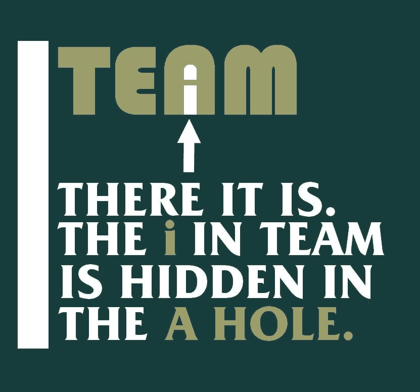

# 内向者社交指南:大声说话

> 原文：<https://dev.to/ambroselittle/an-introverts-guide-to-being-sociable-being-loud-11pi>

*(图片由脸书上的语言书呆子提供)*

“内向者社交指南”系列的下一篇文章..

## 论“大声”

在我关注的为数不多的邮件列表中，一个我非常尊敬的人说，“我们需要关注有思想的人和正确的人。一个人声音大并不代表他们就是对的。这让他们很大声。”为此我有点想拥抱他。但没过多久，我们又有了另一个人反驳:

也不代表他们错了。“声音大是一件主观的事情……如果没有主张某种观点的声音大的人，进步就会变慢。”

诸如此类。不用说，后一个人是我会归类为“大声”的人，不是以一种好的方式，更多的是以一种古怪的方式。我认为这是一个普遍的误解，在我最近观察的圈子里很流行:认为“安静”或“温顺”等同于允许现状继续。

## 虚假的英雄叙事

因此，人们接受了这种观念，即“大声”的人是刺激变化和取得进步的主要人物，也就是说，他们认为令人讨厌的人是英雄。据我所知，他们使用这种想法，主要是作为一个借口，成为一个彻头彻尾的混蛋，并以非常偏执、苛刻和不妥协的方式对待那些与他们意见相左的人。我在小问题上见过这种情况(例如，内部编码风格的争论)，更常见的是，在大的社会问题上。

我明白这个想法的吸引力。不遵守文明的规则是自由的。对自己的正义深信不疑的感觉真好。感觉如此正确，以至于你认为你不必公平、善良、体贴，这种感觉太棒了。看不起那些与你观点不同的人是一件非常令人满足的事情。嘿，如果你能做到所有这些，并在此基础上增加一种成为进步英雄的感觉，哦，伙计，那是一些严重的猫薄荷！这将狭隘、可鄙的偏执变成了一种美德。这完全是自我强化的。

尽管感觉非常非常好，但这是错误的。简单的事实仍然是，你的普通人自然鄙视那些这样做的人。

## 一些真正的英雄

甘地“大声”吗？曼德拉“嗓门大”吗？MLK“大声”吗？林肯“大声”吗？这些都是世界社会进步中最高耸的人物，但我认为没有人会在上述意义上称他们为“响亮”。相反，这些人大多比较温顺，但他们肯定是有坚定信念的人。是他们信念的力量，而不是他们的“响度”，使他们成为值得钦佩和模仿的非凡人物。总的来说，这些人以友善和体贴对待他人而闻名。善良和体贴与坚定的信念并不矛盾。你可以直截了当、毫不含糊地说话，而不会侮辱、贬低或蔑视他人。只是需要额外的努力。

此外，正如卡内基在*中详细讲述的如何赢得朋友和影响他人*一样，善待他人往往会对他们接受你的观点产生巨大的影响。这一点，加上信念和(人们希望)真实的真相和权利，往往比大声宣扬自己的观点更有影响力。

## 科学和思想的进步

如果我们看看有影响力的科学家和哲学家的名单，他们中很少有人可以被解释为“响亮”，但他们的贡献塑造了如此多的东西，推动了如此多的进步。玛丽·居里声音大吗？托马斯·阿奎那“大声”吗？的确，在这个群体中“大声”是异常的。然而，这群人对人类历史的进程产生了不可估量的影响，也就是说，他们在不“响亮”的情况下创造了重大而持久的变革和进步。

可能一个起作用的因素是内向的人倾向于这些类型的学科。通常，我们更喜欢通过工作和创作来表达自己，而不是直接活跃在社交圈里。但我认为，我们很容易接受这样一个信息，即我们不需要在社交上彬彬有礼。毕竟，我们本来就不喜欢社交和社交礼仪，所以如果有人走过来告诉我们这很好，我们不需要，事实上，最好不要，我们都已经准备好接受这个信息了！

但是如上所述，这不是真的。做一个混蛋比做其他任何事都更疏远别人。当你疏远某人时，你会在让他们接受你的观点时制造更多的障碍。如果你的目标是改变他人，那么“大声”——令人讨厌和不体谅他人——不仅不道德，而且是倒退和适得其反的。不能简单地把别人的观点斥为无效。你不能因为他们错了就简单地斥责他们。你不要指望这样的谩骂会导致#中奖。如果有，那是*不顾*这样的行为，而不是因为它。

## 大声不是什么

简单地说，大声并不是坚持你认为正确的事情。简单地说，大声并不是说出你认为正确的事情并采取行动。大声并不是，简单地说，不愿意忍受现状。简单地说，大声并不是为你自己和你认为被虐待的人辩护。

就其本身而言，所有这些东西无疑都是好的。不幸的是，有时人们会把这些活动和令人讨厌混为一谈。当别人的观点本身让你不快时，这种情况就会发生。甚至可能只是因为你不喜欢某人的样子、声音或气味。它可以基于一个人所联系的群体/意识形态。这么多偶然的(有时是无意识的)事情会让你倾向于把别人的行为理解为令人讨厌的*，即使它们实际上并不是*。

## 关于如何不“大声”的一些想法

我绝不试图精确地描绘出厌恶的客观界限是什么；然而，我建议，当问及一个人是否公正地、坚定地行事而不“大声疾呼”时，我们有几件事要考虑:

1.  独立于你更大的目标，考虑正在讨论的行为或话语。如果你去掉你的最终目标(改变或进步)，它本身还是一件好事吗？如果不是，我会建议它可能不应该说或做。与马基雅维利相反，目的不能证明手段的正当性。
2.  考虑对另一方的直接影响。再一次，除了想象的最终目标之外，看看眼前的行动/话语，这个行动会如何影响另一个人？该行为会伤害他人吗？尤其是，你想要伤害吗？如果结果是有害的，你就不应该做。通常，你可以问自己，我会希望别人对我说或做这件事吗？(你知道，黄金法则...)但最好也要记住，别人有不同的感受力，所以最好是站在他们的角度问问自己。“如果我是那个人，我会希望别人对我这样说或这样做吗？”我们永远不会得到 100%正确的答案，但询问这两种版本肯定会有所帮助。
3.  考虑一个合理、公正的第三方是否会认为该行为/言语不体贴或不尊重。如果你深陷其中，要做到这一点可能会很难，如果不是接近不可能的话，但至少试着问问自己这一点会有所帮助。想象一下，如果你个人真的不关心分歧的结果，并从这个角度审视。试着找到一些你实际上不太关心的话题的类比，看看在这种情况下你是否会觉得这种行为令人反感。
4.  考虑你自己的动机。你说/做某事仅仅是因为当时感觉很好吗？如果你生气了，通常就是这样——只是想表达愤怒，而不考虑目的或后果。我经常删除信息，并阻止自己做或说一些事情，因为谢天谢地，我意识到我想做/说只是因为感觉很好。有时候，我甚至允许自己欣赏一场争论或反驳的巧妙之处，但我意识到这不会有什么好结果。(可悲的是，我知道我没能阻止自己更多次！)

我发现像上面这样的考虑有助于判断什么时候声音大或小。在检查他人的行为时，你可以试着反过来考虑同样的问题，但是你必须非常小心地判断动机。当我们试图猜测别人的动机时，很多事情都可能出错。这样做几乎总是会让棘手的情况变得更糟。但至少你可以看看这些行为，并尝试根据上面的前三个考虑来检查它们。

如果你能聚集必要的资源这样做，你通常可以通过考虑这些事情来分散情况。仅仅通过练习就足以把你从悬崖边拉回来。从你自己的角度来看，咬你的舌头可能是更好的选择，至少在短期内。或者努力寻找其他更好的选择。要求澄清(不是领导！)提问也能有很大帮助。

保持尊重、礼貌和温和大有帮助。当然，这是“大声”的反义词所以，如果你至少在试着不要“大声喧哗”，这是一个很好的机会，你不会越界，你仍然可以朝着更大的目标努力，往往会取得更大的成功。从上述意义上来说，“大声”很少是一件好事，它本身当然也不是一件好事。它不是衡量你对一项事业的投入程度，也不是你信念深度的指标。

仔细想想，有点懒于“大声”。不这样需要更多的努力和自律。你可能会说“大声”是“很自然的”，这就是为什么沉溺于这种行为是如此容易和诱人。我们生性自私，不为他人着想，只有通过练习和努力我们才能改变这种状况。这种越来越流行的观点认为“大声”是一件好事，这只是我们放纵自己的低级欲望，通常对实现我们的目标没有什么效果。最好比那更好。