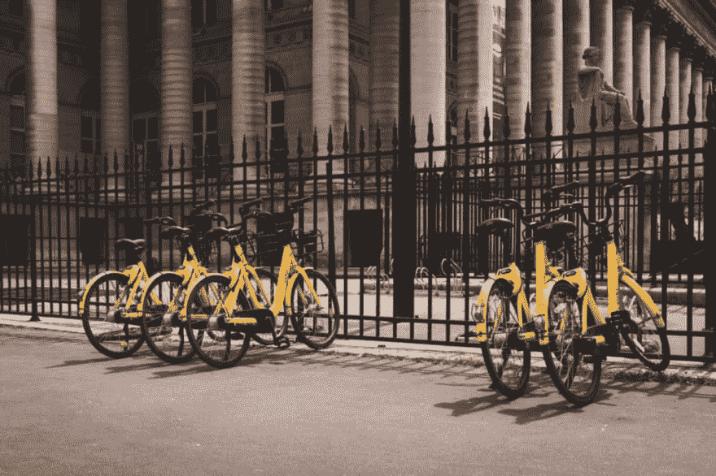

# 孟菲斯智能城市黑客马拉松

> 原文：<https://dev.to/edezekiel/memphis-smart-city-hackathon-28j>

### 参加黑客马拉松

上周末我参加了我的第一次黑客马拉松！这是孟菲斯的“智能城市”黑客马拉松。我和一群来自 web3devs 的区块链开发人员一起编写了一个名为“BlockSaver”的项目这里是 [Github](https://github.com/edezekiel/blocksaver) 链接。

黑客马拉松的主题是交通和移动，特别关注行人安全。孟菲斯每年都有几十起行人死亡事件。

我被这些小组想出的东西惊呆了。一个团队设计了一个视频监控系统，这样公交车就可以“看到”并记录道路上的坑洼。另一个小组开发了一个系统，只要有人走过，它就会自动点亮人行横道。

### 块存储

我的团队开发了一个名为 BlockSaver 的网络应用程序，让用户可以进行地理标记并报告行人安全问题，如人行道破损。我用 React 和基本 CSS 构建了前端的一个重要部分。没错，我们没有为应用程序使用 CSS 框架。我认为这将是一个很好的机会来提高我的一些基本的 CSS 技能。我经常使用 Flexbox，我真的很享受这种体验。

### 区块链

正如我上面提到的，我和一群区块链开发者一起做这个项目。所以，当然我们的应用程序有一些很棒的区块链集成。他们在以太坊网络上创建了一个 ERC20 智能合约，与我们的应用程序绑定。每当有人提交行人安全报告时，智能合同就会在区块链系统上创建一个交易，并给用户一个令牌。