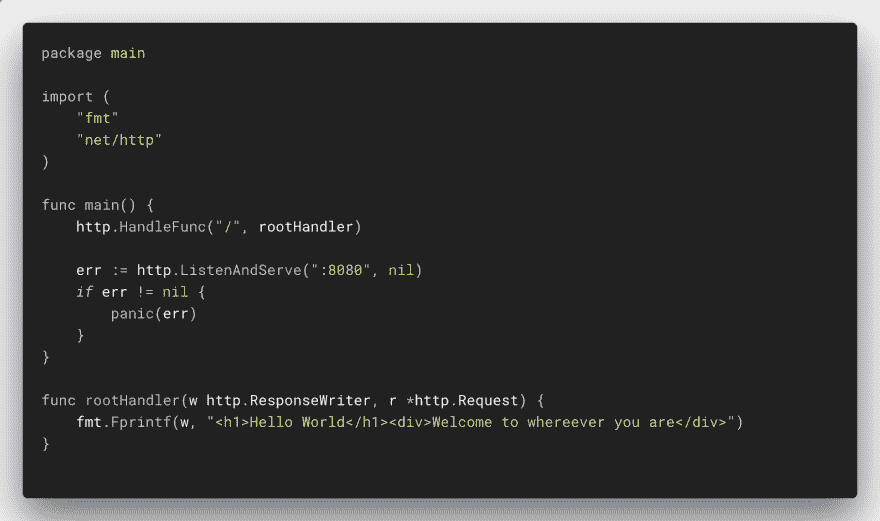
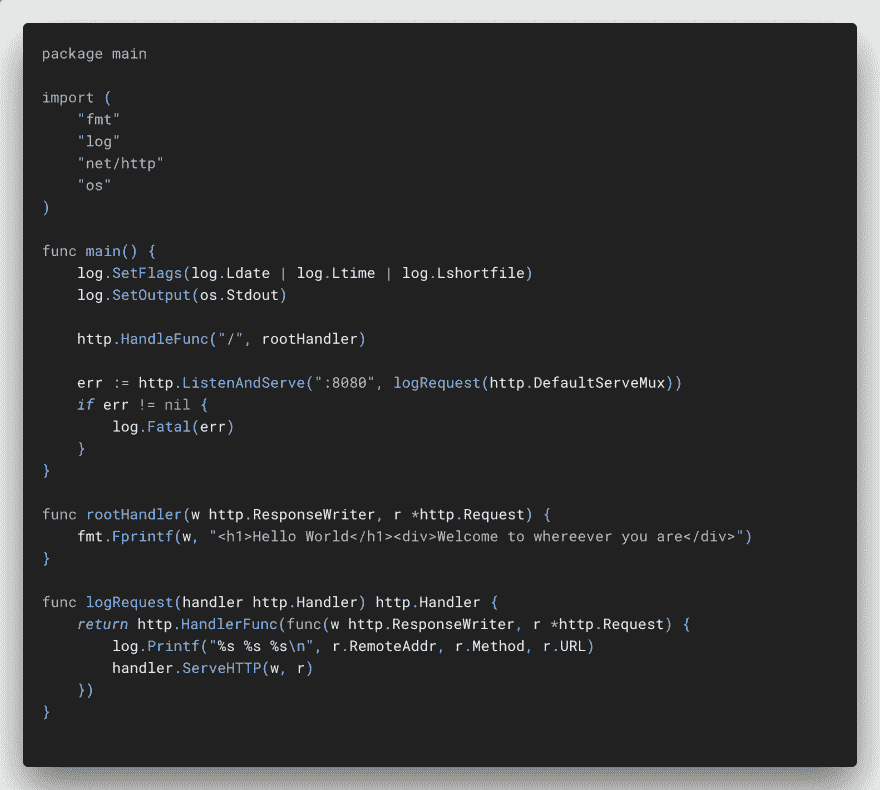
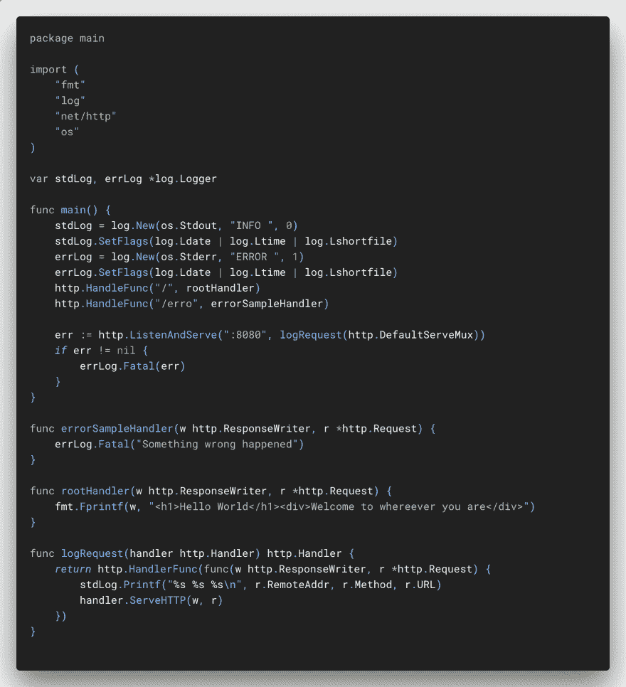

# 使用主管监控 Golang 应用程序

> 原文：<https://dev.to/eminetto/monitoring-a-golang-application-with-supervisor-379e>

亲爱的读者……如果你在这篇文章发表几年后读到这篇文章，你必须明白，在 2018 年，我们对微服务、Docker、Kubernetes 和相关技术感到非常兴奋。

因此，当考虑“应用程序部署”时，我们的第一反应是将所有这些神奇的东西放在一起，在一个复杂的环境中用 Kubernetes、Istio 等等运行我们的 API，或者说一手的微服务。我去过那里，做过那件事…

但是，在这样的时刻，我们总是可以依靠互联网智慧:

[](img/posts/XhK8RJv.jpg)

在这篇文章中，我将提出一个简单的解决方案，我相信它将适用于很多项目:主管。根据主管的网站:

> Supervisor 是一个客户机/服务器系统，它允许用户在类似 UNIX 的操作系统上监视和控制许多进程。

我第一次使用 Supervisor 是在 2008 年，用来监控一些队列消费工人，是用 PHP 开发的。这可以证明两个事实:

1.  我老了；
2.  Supervisor 是一款久经考验的工具。

让我们跳到例子。

## 安装

在这篇文章中，我使用了一个装有 Ubuntu 18.04 的 Linux 盒子，但是在管理员的网站上，我们可以找到关于其他发行版安装过程的说明。

我执行:

```
sudo apt-get update
sudo apt-get install -y supervisor
sudo service supervisor start 
```

Enter fullscreen mode Exit fullscreen mode

我们可以使用以下命令来检查主管的状态:

```
sudo supervisorctl status 
```

Enter fullscreen mode Exit fullscreen mode

我们没有监控任何服务，因此命令结果为空。

让我们在 1.11 版)中创建一个 API 作为我们的服务。我用以下代码创建了一个 *main.go* :

[](img/posts/main.png)

我们现在可以使用以下命令生成二进制文件:

```
sudo go build -o /usr/local/bin/api main.go 
```

Enter fullscreen mode Exit fullscreen mode

下一步是配置 Supervisor 来管理我们的 API。我们需要在以下位置创建一个配置文件:

```
sudo vim /etc/supervisor/conf.d/api.conf 
```

Enter fullscreen mode Exit fullscreen mode

内容如下:

```
[program:api]
directory=/usr/local
command=/usr/local/bin/api
autostart=true
autorestart=true
stderr_logfile=/var/log/api.err
stdout_logfile=/var/log/api.log
environment=CODENATION_ENV=prod 
```

Enter fullscreen mode Exit fullscreen mode

我们需要为主管将要管理的每个流程创建一个这样的文件。在这个文件中，我们定义了我们的进程的名称( *[program:api]* )、将要执行的命令(*command =/usr/local/bin/API*)、如果发生任何类型的错误，管理程序是否应该重新启动服务( *autorestart=true* )以及日志目的地( *stderr_logfile* 和 *stdout_logfile* )。我们可以配置流程(环境)将使用的环境变量以及可以在文档中找到的其他选项。

现在我们需要告诉 Supervisor 重新加载配置文件，包括我们刚刚创建的文件:

```
ubuntu@7648e3e0ef2b:~ sudo supervisorctl reload
Restarted supervisord 
```

Enter fullscreen mode Exit fullscreen mode

让我们检查一下流程状态:

```
root@759cc81a91f0:~ sudo supervisorctl status
api            RUNNING   pid 3032, uptime 0:00:03 
```

Enter fullscreen mode Exit fullscreen mode

正如我们所看到的，该流程仍在运行。

让我们改变我们的 API 来写一些访问日志:

[](img/posts/main_stdout.png)

要更新我们的服务，我们需要执行:

```
sudo supervisorctl stop api
sudo go build -o /usr/local/bin/api main.go 
sudo supervisorctl start api 
```

Enter fullscreen mode Exit fullscreen mode

几次访问之后，我们可以看到日志被存储在/*etc/supervisor/conf . d/API . conf*:
中配置的文件/ *var/log/api.log* 中

```
cat /var/log/api.log 
2018/11/28 23:22:12 main.go:28: 127.0.0.1:42282 GET /
2018/11/28 23:22:13 main.go:28: 127.0.0.1:42284 GET /
2018/11/28 23:22:14 main.go:28: 127.0.0.1:42286 GET /
2018/11/28 23:22:14 main.go:28: 127.0.0.1:42288 GET /
2018/11/28 23:22:14 main.go:28: 127.0.0.1:42290 GET /
2018/11/28 23:22:15 main.go:28: 127.0.0.1:42292 GET /
2018/11/28 23:22:17 main.go:28: 127.0.0.1:42294 GET / 
```

Enter fullscreen mode Exit fullscreen mode

作为最后的测试，让我们再次更改我们的 API，这次模拟一个错误:

[](img/posts/main_stderr.png)

再次更新服务:

```
sudo go build -o /usr/local/bin/api main.go
sudo supervisorctl restart api 
```

Enter fullscreen mode Exit fullscreen mode

让我们访问错误生成 URL:

```
root@759cc81a91f0:~ curl http://localhost:8080/erro
curl: (52) Empty reply from server 
```

Enter fullscreen mode Exit fullscreen mode

正如我们所看到的，错误日志是在预期的位置生成的:

```
root@759cc81a91f0:~ cat /var/log/api.err 
ERROR 2018/11/28 23:42:29 main.go:29: Something wrong happened 
```

Enter fullscreen mode Exit fullscreen mode

当 Supervisor 监控我们的进程时，我们知道 API 又开始运行了，我们可以用命令来证明这一点:

```
root@759cc81a91f0:~ supervisorctl status
api          RUNNING   pid 3857, uptime 0:00:22 
```

Enter fullscreen mode Exit fullscreen mode

有了 Supervisor，你可以依靠一个简单的基础设施来管理你的服务，至少直到项目变得更加复杂，你需要转移到 Kubernetes 这样的东西。