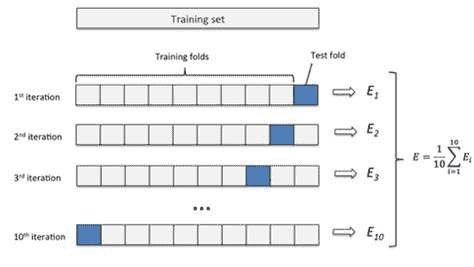
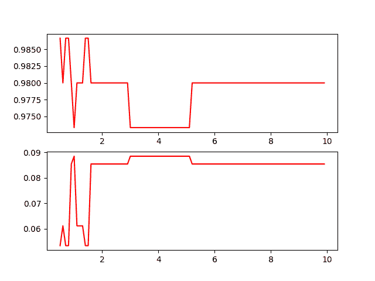

# 谈机器学习(二):交叉验证

> 原文：<https://dev.to/mandrewcito/talking-about-machine-learning-ii-cross-validaton-2odi>

# [T1】简介](#intro)

为了讨论交叉验证，我们首先应该讨论过度拟合。当一个模型用过多的冗余样本进行训练时，就会出现过拟合。我们的模型不能通用。这种情况的一个直接后果是，我们的模型将与我们的训练示例一起工作，但它在真实数据上失败。为了防止这种情况，我们可以将数据集分为两个子集，训练和测试，每个类的这个子集必须有代表性的行数。

在下面的例子中，我们将数据集分成训练测试样本，并对我们的训练进行评分。

```
import numpy as np
from sklearn.model_selection import train_test_split
from sklearn import datasets
from sklearn import svm

iris = datasets.load_iris()
iris.data.shape, iris.target.shape
X_train, X_test, y_train, y_test = train_test_split(iris.data, iris.target, test_size=0.4, random_state=0)

clf = svm.SVC(kernel='linear', C=1).fit(X_train, y_train)
print("Cross validation score = {0}".format(clf.score(X_test, y_test)))
# Cross validation score = 0.9666666666666667 
```

Enter fullscreen mode Exit fullscreen mode

只做一次，将是一个错误。我们必须将完整的数据集分成训练测试，这样，我们就可以确保我们的模型配置正常工作。

# 交叉验证

将我们的数据集分成几部分称为交叉验证。交叉验证有很多变体，我将使用最简单的 [K 倍](https://scikit-learn.org/stable/modules/cross_validation.html#k-fold)。
你可以在这里看看这个品种[。](https://scikit-learn.org/stable/modules/cross_validation.html)

[](https://res.cloudinary.com/practicaldev/image/fetch/s--EjaAO7RW--/c_limit%2Cf_auto%2Cfl_progressive%2Cq_auto%2Cw_880/https://thepracticaldev.s3.amazonaws.com/i/1yykl1fi6oe95mu9enqk.jpeg)T3】

```
from sklearn.model_selection import KFold
clf = svm.SVC(kernel='linear', C=1)
kf = KFold(n_splits=10)
for train, test in kf.split(iris.data):
    clf.fit(X_train, y_train)
    print(clf.score(X_test, y_test)) 
```

Enter fullscreen mode Exit fullscreen mode

Sklearn 有一个抽象交叉验证并返回我们模型分数的函数:

```
from sklearn.model_selection import cross_val_score
clf = svm.SVC(kernel='linear', C=1)
scores = cross_val_score(clf, iris.data, iris.target, cv=10)
for idx, score in enumerate(scores):
    print("Cross validation {0} score = {1}".format(idx + 1, score))

print(scores.mean(), scores.std() * 2)
# Cross validation 1 score = 1.0
# Cross validation 2 score = 0.9333333333333333
# Cross validation 3 score = 1.0
# Cross validation 4 score = 1.0
# Cross validation 5 score = 0.8666666666666667
# Cross validation 6 score = 1.0
# Cross validation 7 score = 0.9333333333333333
# Cross validation 8 score = 1.0
# Cross validation 9 score = 1.0
# Cross validation 10 score = 1.0 
```

Enter fullscreen mode Exit fullscreen mode

# 玩弄惩罚

你可以在之前的帖子里看到关于惩罚的解释。我将展示一个图表，看看不同的惩罚对我们的模型有什么影响。

```
 penalties = list(
    np.arange(
        0.5,
        10.0,
        0.1
        )
    )

means = []
stds  = []

for C in penalties:
    clf = svm.SVC(kernel='linear', C=C)
    scores = cross_val_score(clf, iris.data, iris.target, cv=10)
    means.append(scores.mean())
    stds.append(scores.std() * 2)

import matplotlib.pyplot as plt

# plot the data fig = plt.figure(1)
plt.subplot(211)
plt.plot(penalties, means, 'r')
plt.subplot(212)
plt.plot(penalties, stds, 'r')
plt.show() 
```

Enter fullscreen mode Exit fullscreen mode

[](https://res.cloudinary.com/practicaldev/image/fetch/s--AbiyLorZ--/c_limit%2Cf_auto%2Cfl_progressive%2Cq_auto%2Cw_880/https://thepracticaldev.s3.amazonaws.com/i/vcatiedwjx7rwkw9txge.png)