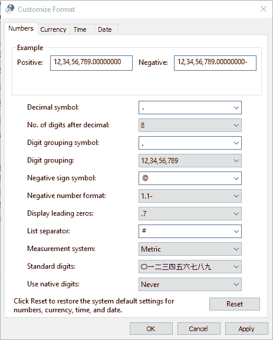
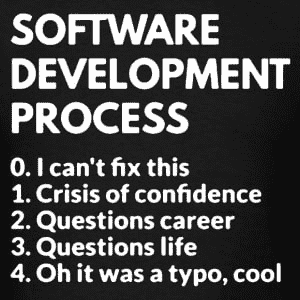

# 破损单元测试的案例

> 原文：<https://dev.to/dealeron/the-case-of-the-broken-unit-test-1chh>

 

<figcaption>照片由[埃里克·穆尔](https://unsplash.com/@ericmuhr)于 [Unsplash](https://unsplash.com)</figcaption>

一个看似美好的日子，我犯了一个错误，在本地运行单元测试。在那里，我关注着自己的事业，刚刚完成了团队主要项目的一个工作单，我决定要努力工作，确保所有测试都正常运行。就在那时，一切都变得糟糕透顶。测试探索者惊呼道。焦虑涌上我的喉咙，恐慌涌上我的背，我开始调试失败的测试。

> `Expected result: -1`
> 
> T1】

@1…一点？！？！没有@1 这种东西，这是一个整数。由于担心情况会更糟，我重新检查了我们的开发分支，以确保我不是那个破坏构建的人。令我恐惧的是，我目睹了同样的大屠杀。

`1 failed ❌`

原来我不是凶手。

打开一张票，我给我坚定的团队成员发了一个警报。

*“开发分支断了，单元测试失败了，不，我不是在开玩笑，这是严肃的事情！*

*“你在说什么？”我听到有人翻墙过来。这是我的团队的技术领导。“我通过了所有的测试。”在那里，在他的屏幕上，就在我眼前的是我们的宝贝在那些单元中翱翔。*

`All green ✔️`

我让我的搭档也这么做。

`All green ✔️`

好吧，现在我知道是我了。我们去找源头。测试伪造的值存储在数据库中，所以我在那里检查。

`@1`

… `@1`？！？这是一个 int 列！

我让我的合作伙伴查询数据库:`-1`

情节变得复杂了。我疯了吗？这些值是不可能的，当然也不应该根据谁在数据存储中查看这些值而改变。

我亲爱的华生，是什么让负号变成了@？这肯定有一个合乎逻辑的解释。绞尽脑汁首先想到的是 culture info . current culture . Eureka！它突然像电击一样向我袭来。我的文化设置！在发现如何做之后，我打开了我的文化设置。这就是罪魁祸首。在格式中，负号被设置为一个@符号。这就说明了一切！

我更正设置并检查数据库:-1。我的信心恢复了，我的神经稳定了，我重新进行了失败的测试。

`All green ✔️`

欢腾！我的卡夫卡式噩梦结束了。生存危机再次结束。事实上，我知道我在做什么。我没有在错误的喜剧中跌跌撞撞，发现自己在每天的交易中目瞪口呆。我通知我的团队成员，他们参与了帮助和任何其他人在听力范围内，我认为会发现这很有趣。“你应该写一篇关于这个的博客文章”我的部门领导在听到我的故事后回应道。我的朋友是你来到这里的原因。

鳍状物

* * *