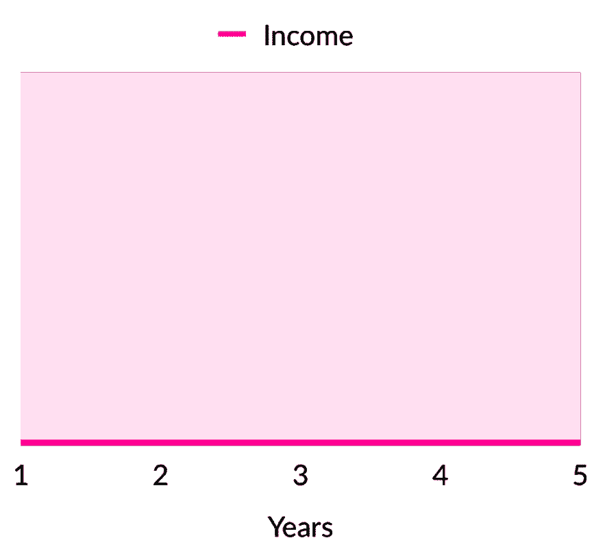
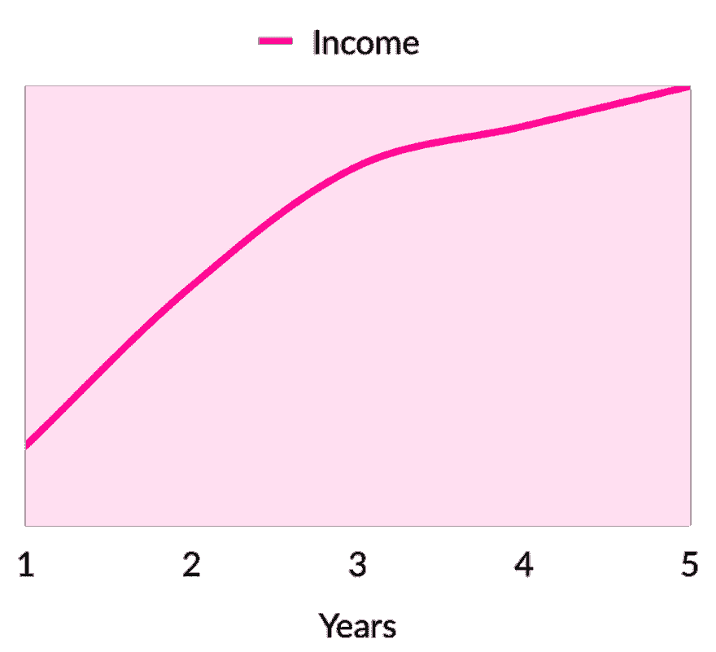

# 做网站开发是为了体验或曝光

> 原文：<https://dev.to/raddevon/doing-web-development-for-experience-or-exposure-21c1>

当你开始你的自由网站开发实践时，一定会有人建议你为他们工作**以获得经验和/或曝光度**。如果这个人擅长销售，这听起来可能是一个有吸引力的前景。

作为一名新开发人员，经验和曝光是你迫切需要的两样东西。让我们来谈谈**你应该*而不是*通过为别人做免费工作**来获得它们的理由，以及你应该如何获得它们。

## 理由 1:他们的报价价值可疑

成功的交易是价值交换——理想的等价交换。每一方都交换对另一方有价值的东西。在大多数自由职业者的网站开发工作中，这是服务的钱。(实际上，这是为服务的*结果*花钱，但是我将在以后的文章中更深入地探讨这个想法。😉)

在“为经验而工作”或“为曝光而工作”的安排中，你交换的服务的价值比你获得的经验或曝光的价值要清楚得多。也许你做的东西最终失败了，但是你工作的受益者至少已经决定他们想要做这个东西。你在建造它。满足感知的需求。看到了吗？价值。

也许你会说你也想要体验或曝光。这可能是真的，但是你如何衡量你将从这个特定项目中获得的经验或曝光的价值呢？

如果你想要体验，你应该专注于正确的体验。你从别人构思的随机项目中获得的经验正是你所需要的机会很小。

如果你想要曝光，**这不会来自于为一个不想为你的工作付钱的人做一个随机的项目**——至少，不会以任何有意义的方式。如果你为微软、苹果或可口可乐做一个项目，那会给你一个很大的曝光率，但你不会免费做。那些公司付钱给他们的工作，因为他们认真对待它。

如果他们真的相信你将获得的经验或曝光的价值，让他们签署一份合同，声明如果你的经验或曝光在 6 个月内没有产生预期的结果，他们将为项目支付全额费用。他们会接受你吗？当然不是！他们对自己带来的价值没有信心，你也不应该投资任何股票。(注意:实际上不要这么做，因为没有人会接受你的观点。我只是在这里提出一个观点。)

## 理由 2:在你得到你的价值之前，他们已经得到了他们所有的价值

 如果你能与尼日利亚王子面对面，在他们递给你一个印有美元符号的大袋子的同时，递给他们你的 5000 美元，我们都会喜欢这个骗局(💰)装着你的几百万。**骗局成功的原因是因为你必须在他们交付*他们的*之前交付*你的*价值。他们拿走你的钱。他们从地球上消失了。每个人都幸福地生活在一起，除了你。**

为曝光或经验而工作也没什么不同。在你获得经验之前，你必须先做工作。在你可以要求作品曝光之前，作品必须交付并为“客户”而活。

一旦他们拥有了他们想要的东西——网站、应用程序或者其他什么——他们为什么还要浪费时间和精力为你做些什么呢？理想情况下，他们会在世界上向任何愿意倾听的人歌颂你，在他们听到有人需要开发软件时推荐你。问题是，除了维护自己的声誉，他们几乎没有任何动机。根据我的经验，想要免费工作的人很少关心他们的名声。

即使是最善意的人，如果他们真的相信他们可以为你提供价值，以换取你的免费工作，他们也会不由自主地受到激励的影响。一旦他们得到了你的工作，而为你提供回报的动力也消失了，你会优先于其他数百项争夺他们时间的任务吗？

## 理由三:免费工作无法成为职业选手

如果你的目标是作为一名网络开发人员赚钱，你永远不会通过做免费的工作来达到这个目标。在这个营地里，你交谈过的每个人都会有一个独特而精彩的理由，为什么做免费工作真的会让你在*这段*时间里获得回报。每一种情况都会被当作一个独一无二的绝佳机会卖给你。唯一的共同点是，你几乎每次都不会从这笔交易中得到什么。

看看你的工作收费前后典型收入增长的对比😜：

 

如果你准备赚钱，唯一的方法就是通过向你的工作收费。当你和一个不打算付钱的人交往时，这对你来说是双重打击。你不仅没有得到 T2 这份工作的报酬，还浪费了你寻找有报酬工作的时间。**不要在那些*不会*付钱的人身上浪费时间，继续寻找，直到你找到那些*会*付钱的人。**

> 免费几乎从来都不是合适的价格，但什么才是呢？我即将出版的书📕回答了这个问题。查看一个[免费章节](https://raddevon.com/freelance-web-development-pricing-rates-estimating-projects-and-turning-a-profit/)！

## 例外:何时免费工作

我不相信绝对……除了那个。这意味着，是的，有时候做免费工作是完全合理的。

### 慈善工作

如果你想为慈善机构或你相信的事业做些工作，那就去做吧！只要确保你能先付账单。

### 为朋友工作

少用这个。你不想成为你所有的朋友都来免费网络工作的傻瓜。再次，确保你能支付账单或者礼貌地拒绝。

### 如果你知道，你可能永远看不到任何东西，你甚至不在乎

如果你对这个项目如此兴奋，即使你知道你很可能不会从它提供的任何体验或曝光中获得一分钱，你仍然*想要做它……这取决于你。也许会有结果，但很可能不会。*

## 做什么相反

### 为经验

慈善工作可以积累经验，但是做自己的项目更好。成为自己的客户。建立一个与你想做的工作相似的项目。建造对你有用的东西或者解决你的问题。建立你梦想多年的创业想法。如果你不知道要建造什么，从[我的项目创意](https://raddevon.com/articles/10-great-web-development-learning-project-ideas/)中获取灵感。

在任何一种情况下，你仍然在免费工作。不同之处在于**您创建了一个资产**。你有一个为你的理想客户量身定做的网站放在你的投资组合里。你有让你生活更轻松的软件。你有一个软件创业的开端。这些中的任何一个都比没有强。

### 为曝光

以我的经验，曝光很少来自单一项目。如果你想曝光，就要成为解决你想为客户解决的问题的专家。你可以做很多看起来像你想做的工作，或者在谈论问题时让自己引人注目。

第一种方法有点先有鸡还是先有蛋的问题。“我无法获得成为专家所需的经验，因为我没有成为专家所需的经验！”这就是我喜欢内容教学法的原因。

这从了解你的理想客户和理解他们的问题开始。很简单，对吧？🙄一旦你记下这些，就开始围绕这些问题的解决方案创建内容。不要只是建立一个博客，然后把内容扔进虚空。找到那些已经拥有你想与之交流的受众的人，把他们推荐到博客帖子、播客、视频或任何你能提供的内容上。

这有助于他们，因为他们试图不断地向饥饿的观众提供内容。这对你有帮助，因为你从他们那里获得了对观众的隐性认可。这是一个伟大的双赢！这种曝光率比你从一些免费项目中获得的任何东西都要高，而且这种曝光率的持久性是那些项目所无法比拟的。

## 为你做你的免费工作！

做免费的工作是必要的，但是你应该为自己做这件事。如果一个潜在客户说你应该免费为 T2 做他们的工作，这并不意味着没有人愿意付钱给你。这只意味着**你需要继续寻找**。最有可能的是，你最终会找到愿意的人。

另一方面，你可能还没有足够的经验去找工作。获得一份网络开发合同是关于建立信任和证明你能做这项工作。如果你还没有这样做，那么**给自己分配一些工作，然后去做**。下次你和潜在客户交谈时，向他们展示你所做的。你将拥有根据客户需求量身定制的体验，他们会感激你的。

通过向人们展示你是专家来建立你的曝光度。向他们展示你关心他们的问题，并且你有解决方案。去你的顾客所在的地方，挥舞你的专家旗帜。当他们需要解决方案时，或者当他们的问题在某种程度上是独特的时，他们就会来找你。