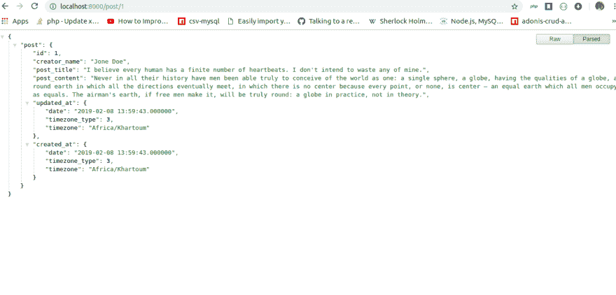
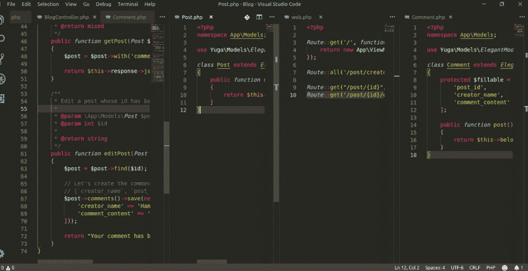

# yuga 框架入门第 3 部分(查询数据库等)

> 原文：<https://dev.to/hsemix/getting-started-with-yuga-framework-part-3-querying-the-database-and-more-4j85>

在今天的教程中，我将带您了解如何对数据库中已经存在的帖子进行评论，这需要首先在数据库中查询该帖子，然后为其添加评论，然后保存更改，所以没有任何进一步的麻烦，让我们开始吧。

## 首先，我们需要在数据库中查询一个给定的帖子，比如 id 为 **1**

宇迦附带了一个 ***ORM*** 可以方便地操作数据库，所以，这就是我们将用来从数据库中查询我们的帖子，但首先，让我们创建一个访问我们的帖子的路径。让我们打开`routes/web.php`文件来创建我们的路线。

```
// routes/web.php

Route::get('/post/{id}', 'BlogController@getPost'); 
```

现在让我们打开`app/Controllers/BlogController.php`并将`getPost`方法添加到我们的类中

```
// app/Controllers/BlogController.php

public function getPost(Post $post, int $id)
{
    $post = $post->find($id);

    return $this->response->json(['post' => $post]);
} 
```

现在让我们转到浏览器并访问[http://localhost:8000/post/1](http://localhost:8000/post/1)

这一定是你的结果
[](https://res.cloudinary.com/practicaldev/image/fetch/s--iWCDutJB--/c_limit%2Cf_auto%2Cfl_progressive%2Cq_auto%2Cw_880/https://thepracticaldev.s3.amazonaws.com/i/vqvepf5vhj9ndip66o9b.png)

### 现在我们来编辑一下

在`routes/web.php`中，让我们添加这条路线

```
// routes/web.php

Route::get('/post/{id}/edit', 'BlogController@editPost'); 
```

在`app/Controllers/BlogController.php`中，让我们将`editPost`方法添加到`BlogController`类中，但是在此之前，让我们首先在`Post`模型和`app/Models`中的`Comment`模型之间创建一个关系

在`app/Models/Post.php`

```
// app/Models/Post.php

public function comments()
{
    return $this->hasMany(Comment::class);
} 
```

在`app/Models/Comment.php`

```
// app/Models/Comment.php

public function post()
{
    return $this->belongsTo(Post::class);
} 
```

在`app/Controllers/BlogController.php`

```
// app/Controllers/BlogController.php

public function editPost(Post $post, int $id): string
{
    $post = $post->find($id);

    // Let's create the comments from here
    // [`creator_name`, `post_id`, `comment_content`]
    $post->comments()->save(new Comment([
        'creator_name' => 'Hamid Semix',
        'comment_content' => 'This is the first comment'
    ]));

    return "Your comment has been saved";
} 
```

现在让我们编辑我们的`getPost`方法，将注释合并到

```
// app/Controllers/BlogController.php

public function getPost(Post $post, int $id)
{
    $post = $post->with('comments')->where('id', $id)->first();

    return $this->response->json(['post' => $post]);
} 
```

在编辑
[](https://res.cloudinary.com/practicaldev/image/fetch/s--K0FnOa8O--/c_limit%2Cf_auto%2Cfl_progressive%2Cq_auto%2Cw_880/https://thepracticaldev.s3.amazonaws.com/i/xzgesoa4vqs7cn57vo6d.png)

这一定是你的结果
[](https://res.cloudinary.com/practicaldev/image/fetch/s--pMKZ6xg9--/c_limit%2Cf_auto%2Cfl_progressive%2Cq_auto%2Cw_880/https://thepracticaldev.s3.amazonaws.com/i/i9879xywb4rqb5swr7yp.png)