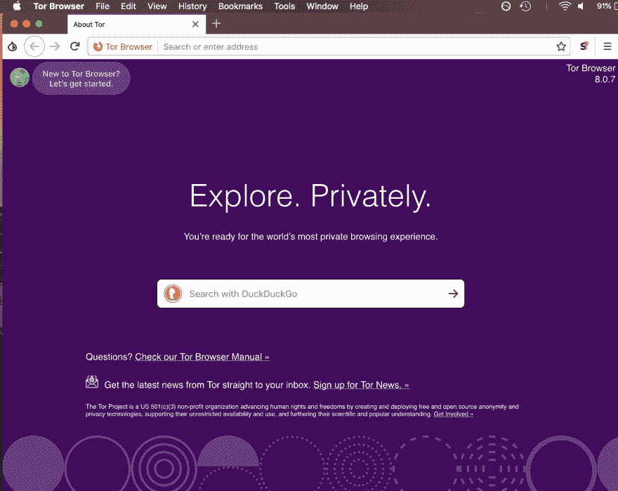
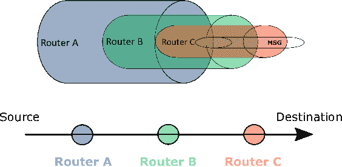
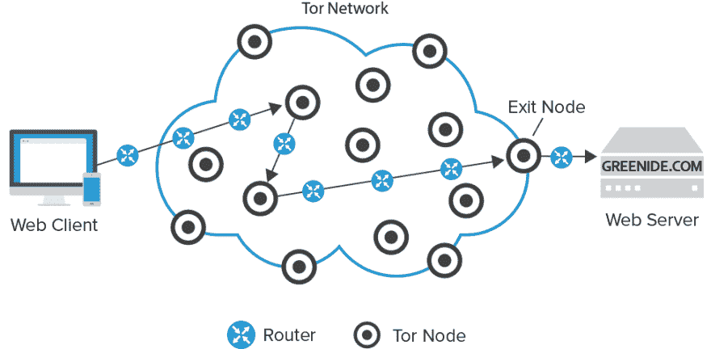

# 黑暗之网...这是什么？

> 原文：<https://dev.to/andershornor/dark-webwhat-is-it-1nni>

通过阅读一些关于这个主题的文章，似乎很容易假设深网和暗网是一回事，但深入研究它们的本质，这似乎并不完全是事实。我认为这种困惑来自于他们似乎共享的可访问性级别。一个是无索引的，另一个是无索引的，有什么区别？嗯，让我告诉你**哈哈**。

首先，我想我应该做一点概述，以澄清我是如何看待这种区别的，然后我将深入探讨并尝试解释一个流行的黑暗网络。据我所知，互联网大致分为两类，每一类都有些许重叠，每一类又包含子类别。如果我错了，请尽管纠正我，但请让我解释一下。

### ——互联网有两个层次，被索引的和不被索引的。-

## **面网**

或者由一台或多台服务器托管的具有特定索引的网站，允许大多数用户通过其互联网服务提供商(ISP)访问它们。这些*‘surface web’*网站的索引存储在少数几个地方之一的缓存中。个人计算机上的高速缓存(即他们的网络浏览器)、ISP 自己的高速缓存，或者分布在世界各地的无数根名称服务器(RNS)和其他低层服务器。所有这些存储的特定互联网协议(IP)地址共同构成了一个通常称为域名系统(DNS)的网络。访问 [Yutaro 的博客文章](https://medium.com/@ytsuji91/asking-for-directions-on-the-internet-domain-name-systems-dns-141af96f04f3)以了解更多，但这是我在这个问题上的知识的基本概述。
现在重要的一点是，这些统一资源定位符(URL)或统一资源标识符(URI)大多通过 DNS 连接到它们的 IP 地址，基本上都是公共访问。只要有人有浏览器和互联网，他们就可以在浏览器的搜索栏中输入 URI 或网址，瞧，他们就到了他们想浏览的网站。在大多数情况下，通过在搜索引擎中键入一些关键字或短语，并筛选数百个页面，可以找到这些链接到 IP 地址的相同 URL，使它们更容易访问。现在真正有趣的事情是，这些公共访问表层网站构成了“互联网”或链接到当今存在的信息的网络的[大约 5%](https://www.thedarkweblinks.com/what-is-the-deep-web/) 或 [.03%](https://computer.howstuffworks.com/internet/basics/how-the-deep-web-works.htm) (取决于你问谁)。现在你可能在想，*“深度网络和黑暗网络呢？”*嗯好问题。

## **深网**

在我看来很奇怪，有点模糊，很难定义。它主要是无索引的，当它不是并且仍然被认为是“深度网络”时，它需要特定的验证才能访问，并且它肯定不会通过常规搜索或搜索引擎显示出来。Deep web 网站在 DNS 中没有经典索引，因此更难定位。虽然有些情况下，这些网站需要直接通过其 IP 地址才能访问，而不是在浏览器中键入一些花哨的 URI 或 URL 来查询 IP 地址缓存。在其他情况下，它们将索引存储在某处的缓存中，但是需要额外的资源来查看页面。对于后一个类别，请考虑付费观看或付费访问内容或应用程序编程接口(API)数据库或医疗和银行信息，它们通过某种级别的加密或令牌系统限制访问。这些信息仍然存在于互联网上，并有一个 URL，在适当的条件下可以通过浏览器访问，但不一定是公共访问或非常容易访问。这些深层网络信息构成了网络的其他大约 95%的信息。

“但是安德斯！那就像是 100%的互联网，那么“酸马紫”又是怎么回事呢

不，我只是在玩，我来这里是想谈谈洋葱地和所有媒体喜欢称之为深度网络的黑暗！但实际上并不是这样，而是-

## **暗网**

所以我说，互联网上有索引和未索引的内容，这就是我的意思，DNS 服务器和其他 URI/URL 连接的 IP 地址的缓存存在，指引用户到他们想去的地方，但这使得密码保护和其他受限制的内容和不受密码保护和受限制的内容以及未索引/非缓存的 URI/URL 之间的区别很难区分。这种模糊的区别似乎给每一个类别相对于彼此和互联网整体的规模的巨大差异带来了一些可信度(*反对互联网实际规模的论点，暂且不提* ( *我的意思是，无论如何，互联网上有多少信息*))，但除了真正的黑暗网络(加上风的低语声)，这种区别与这些无关。

# **暗网**

存在于一个奇怪的网络中，通常隐藏在加密层之下，并通过 surface web 浏览器访问之外的路由器网络进行访问。你可能想知道这是什么意思。这意味着与地面网站不同，这些网站很难访问，只能通过传统路由网络之外的网络访问。除了 Firefox 或 Chrome 等常见且众所周知的浏览器之外，这些网络中的大多数还需要一个浏览器。有些人可能知道在黑暗网络领域流行的一款浏览器， [Tor browser](https://www.torproject.org/projects/torbrowser.html.en)
，当下载并打开时，它看起来就像这样。
[T6】](https://res.cloudinary.com/practicaldev/image/fetch/s--u2En8KtM--/c_limit%2Cf_auto%2Cfl_progressive%2Cq_auto%2Cw_880/https://thepracticaldev.s3.amazonaws.com/i/24va3qt0q0s502qs584v.png)

哇这么相似！它有一个搜索栏，可以访问搜索引擎。它还可以访问人们喜欢浏览的大多数 surface 网站！那又有什么大不了的！？就像超级跑车一样，消音器和扰流器都很花哨，但真正重要的是引擎盖下的东西。

让我花点时间补充一下。所以也许你对黑暗之网及其方方面面有所了解，你可能会想“但是安德斯！黑暗网络的其他方面，如免费网络、T2、I2P 和他们所有的技术呢？”或许在另一篇博文中(尽管这两个和 Tor 有相似之处，比如 onioney layers 之类的)。在这最后一节，我想集中讨论黑暗网络的一个子集，Tor。

### Tor

所以托尔，是什么让它与众不同。第一个也是最明显的区别是，与传统的网络浏览器不同，它可以访问不同域名的 URL，如“.com”或”。org”以及像“.”这样的非常规域名。ly“或者”。乐”，Tor 也可以连接域名”。这需要 Tor 使用的技术来提供一些匿名性。这些技术是通过一些花哨的术语来描述的，我必须承认我并不完全理解，但我会尽我所能来涵盖这些技术，并希望能够向您提供足够的信息，作为一个构建起点，如果您愿意的话，您可以自己研究这些技术。

首先，Tor 使用多层加密技术(因此有洋葱的绰号)来隐藏用户发送的内容，以及一个分布式的重叠路由器网络，这些路由器随机地重新路由信息，这些信息通过不同的路径发送到同一端。我不打算在这里谈论覆盖网络。我不太理解他们。我将继续使用 oniness 和洋葱网络，它让 Tor 成为现在的样子。

这种通常称为洋葱网络的网络始于用户或发起者，用户或发起者与“入口节点”建立连接，入口节点与用户建立安全连接。这个入口节点作为中介，然后连接到另一个节点，通过它自己在用户和第二个节点之间创建一个链接(就像一个人牵着另外两个人的手)。通过该链路，用户然后通过第一节点向第二节点发送加密的消息，只有第二节点可以部分解密到下一节点(由用户确定)可见的程度。在这种交互中，只有入口节点知道用户是谁，但对发送的消息一无所知，并且除了网络中的下一个节点之外，不知道该消息去往何处。同时，第二节点不知道该消息源自何处或其内容，但是知道网络中的下一个节点在哪里。第二节点现在充当中介并连接到第三节点，发起者可以通过第一和第二节点与之交互。然后，发起者向第三节点发送加密的消息，只有它能够解密该消息，继续该链，直到连接到发起者想要连接的最终位置。此时，最后一个节点，即“出口节点”已经通过一系列节点连接到发起者，这些节点不知道该链从哪里开始或者将在哪里结束，也不知道在它所连接的两个节点之外谁连接到这个网络。本质上，链中的每个环节就像一个蒙着眼睛的人将装有不同路由信息的信封传递给旁边的人，直到倒数第二个信封被打开并传递到最后一个地址。现在只有最后一个人知道如何阅读的加密信息可以被阅读，并知道如何解密。这样，网络上的每个节点只知道它前进的节点和它重新路由到的节点，除了知道沿途所有节点的发起者之外，什么都不知道。

但是，信息是如何返回给发起者的呢？这个过程现在反过来了。端节点重新加密，在其所有层中重新封装消息，并将消息发送回发起者。消息通过用于到达发起者想要连接的位置的相同节点传递回来，并且遵循与之前相同的规则。不同之处在于，在这个过程中，发起者解密最后一层加密，并看到它所连接的站点的响应，而不是用加密来包装消息。如果这似乎令人困惑，我认为这些图表可能有助于澄清事情:

第一个概述了加密层的基本结构以及谁可以看到什么:  
，第二个略好地概述了特定于 tor 的特定节点以及从发起者到期望位置的最终路由过程:
 。

现在，这可能是一个简化的解释，但与 surface web Tor 和大多数黑暗网络浏览器相反，它们是匿名连接的网络，通过高度加密的方式链接，并匿名地相互路由。这样，允许搜索引擎和表面网络浏览器操作和跟踪信息的传统路由方法由于缺乏对这种信息的可访问性而受到阻碍。同样的，黑暗之网是无情的，难以接近的，保持它的隐蔽和相对的误解。

无论如何，在这个问题上总是有更多要说的，所以请在下面随意评论，澄清我哪里误入歧途了，或者确定我在哪里可以学到更多。也许在以后的博文中，我会介绍一些其他的黑暗网络浏览器，并重复我没有解释清楚或者不了解 Tor 的地方。感谢阅读！