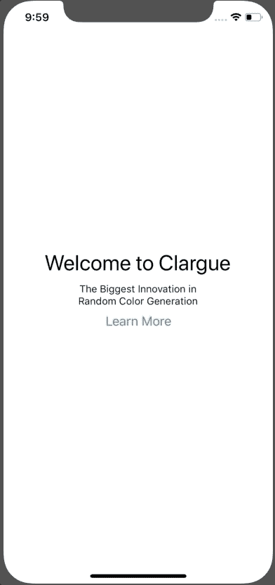
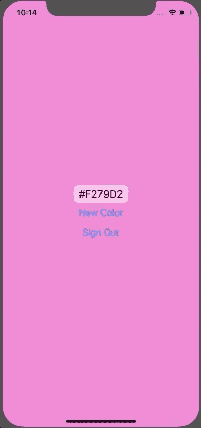

# 在 React Native 中获取用户反馈的最佳实践

> 原文：<https://dev.to/spencercarli/best-practices-for-capturing-user-feedback-in-react-native-56g2>

> 本教程最初发布于 [React 原生学校](https://www.reactnativeschool.com/best-practices-for-capturing-user-feedback-in-react-native)。想看 75+ React 原生教程就去看看吧！

我有一个很讨厌的地方——当应用程序在不好的时候/以不好的方式要求反馈/评论时:

*   当我第一次打开应用程序时
*   正在进行一项重要的活动(比如结账)
*   他们劫持了我的屏幕，不让我做任何事情，除非我做他们的反馈

[https://www.youtube.com/embed/lWIrjSp4kCM](https://www.youtube.com/embed/lWIrjSp4kCM)

> 感谢 [Instabug](https://instabug.com/?utm_source=reactnativeschool) 赞助本课！如果您正在寻找一个一体化的解决方案来捕获用户反馈、错误报告、崩溃报告等，请查看它们！在本课稍后的“获取用户反馈”中，我会提供更多关于如何使用它们的信息。

## 美好时光&寻求反馈的方式

在我们开始动手之前，让我们列出一些您可以寻求反馈并得到良好回应的时间/地点:

1.  当用户完成一个重要的动作(如结账)时。这意味着检测一个动作何时完成，而不仅仅是在给定的时间后要求反馈。
2.  **当他们多次采取类似的行动时。**假设你的应用给了他们一个随机的笑话。假设他们已经按了 15 次“新笑话”按钮。这将是一个很好的机会，问他们为什么不在地板上打滚，喘着气听你从最新的网飞站起来特别节目中剽窃来的笑话。
3.  当他们因沮丧而用力摇晃手机时。也许问他们是否有问题？我的意思是，你多久会看到人们因为高兴而摇手机？

[](https://i.giphy.com/media/1080AfGtovINTq/giphy.gif)

## 捕捉用户反馈的导航设置

这在实践中是什么样子的？我们来看看。

### 示例 App

首先，我们将设置我们的示例应用程序。这是一款名为 *Clargue* 的革命性新应用，它会根据需求为你生成一种随机颜色。这是我们开始的代码。

```
import React from 'react';
import { Text, View, Button, AsyncStorage } from 'react-native';
import randomColor from 'random-color';
import {
  createStackNavigator,
  createAppContainer,
  createSwitchNavigator,
} from 'react-navigation';

class RandomColor extends React.Component {
  state = {
    backgroundColor: randomColor().hexString(),
  };

  newColor = () => {
    this.setState(state => ({
      backgroundColor: randomColor().hexString(),
    }));
  };

  signOut = () => {
    AsyncStorage.removeItem('isOnboarded');
    this.props.navigation.navigate('Onboarding');
  };

  render() {
    return (
      <View
        style={{
          flex: 1,
          alignItems: 'center',
          justifyContent: 'center',
          backgroundColor: this.state.backgroundColor,
        }}
      >
        <View
          style={{
            backgroundColor: 'rgba(255, 255, 255, 0.5)',
            borderRadius: 10,
            paddingHorizontal: 10,
            paddingVertical: 5,
          }}
        >
          <Text
            style={{
              fontSize: 20,
              color: '#000',
            }}
          >
            {this.state.backgroundColor}
          </Text>
        </View>
        <Button title="New Color" onPress={this.newColor} />
        <Button title="Sign Out" onPress={this.signOut} />
      </View>
    );
  }
}

class Entry extends React.Component {
  componentDidMount() {
    AsyncStorage.getItem('isOnboarded').then(isOnboarded => {
      if (isOnboarded == 'true') {
        this.props.navigation.navigate('Main');
      } else {
        this.props.navigation.navigate('Onboarding');
      }
    });
  }

  render() {
    return null;
  }
}

const Onboard1 = ({ navigation }) => (
  <View style={{ flex: 1, alignItems: 'center', justifyContent: 'center' }}>
    <Text style={{ fontSize: 30, marginBottom: 10 }}>Welcome to Clargue</Text>
    <Text>The Biggest Innovation in</Text>
    <Text>Random Color Generation</Text>
    <Button
      title="Learn More"
      onPress={() => navigation.navigate('Onboard2')}
    />
  </View>
);

const Onboard2 = ({ navigation }) => (
  <View
    style={{
      flex: 1,
      alignItems: 'center',
      justifyContent: 'center',
      paddingHorizontal: 40,
    }}
  >
    <Text style={{ marginBottom: 30 }}>
      We use big data and machine learning to get money from investors...
    </Text>
    <Text>and a basic algorithm from Github to select your colors.</Text>
    <Button
      title="Get Started"
      onPress={() => {
        AsyncStorage.setItem('isOnboarded', 'true');
        navigation.navigate('Main');
      }}
    />
  </View>
);

const Navigator = createSwitchNavigator({
  Entry: {
    screen: Entry,
  },
  Onboarding: createStackNavigator(
    {
      Onboard1: {
        screen: Onboard1,
      },
      Onboard2: {
        screen: Onboard2,
      },
    },
    {
      headerMode: 'none',
    }
  ),
  Main: {
    screen: RandomColor,
  },
});

export default createAppContainer(Navigator); 
```

[](https://res.cloudinary.com/practicaldev/image/fetch/s--brq-m0fB--/c_limit%2Cf_auto%2Cfl_progressive%2Cq_66%2Cw_880/https://thepracticaldev.s3.amazonaws.com/i/90omeo078wvn6yr7lqhb.gif)

### 反馈屏幕

您可以用多种方式提出反馈/缺陷报告/评审的请求。我认为最简单的方法是添加一个全局模态屏幕，你可以在应用程序的任何地方访问和展示。对于我们的应用程序，我将通过创建一个新的屏幕(在真实情况下可能会有某种形式)来实现这一点，然后添加一个堆栈导航器作为新的根导航器。

```
// ...

const Navigator = createSwitchNavigator({
  Entry: {
    screen: Entry,
  },
  Onboarding: createStackNavigator(
    {
      Onboard1: {
        screen: Onboard1,
      },
      Onboard2: {
        screen: Onboard2,
      },
    },
    {
      headerMode: 'none',
    }
  ),
  Main: {
    screen: RandomColor,
  },
});

const FeedbackForm = () => (
  <View style={{ flex: 1, justifyContent: 'center', paddingHorizontal: 40 }}>
    <Text>
      How are you liking Clargue? We'll use your feedback to file an issue on
      the open source library - but don't worry! We'll say it's a priority
      because our business depends on a fix!
    </Text>
  </View>
);

const Modals = createStackNavigator(
  {
    Navigator: {
      screen: Navigator,
    },
    Feedback: {
      screen: createStackNavigator({
        FeedbackForm: {
          screen: FeedbackForm,
          navigationOptions: ({ navigation }) => ({
            headerTitle: 'Feedback',
          }),
        },
      }),
    },
  },
  {
    headerMode: 'none',
    mode: 'modal',
  }
);

export default createAppContainer(Modals); 
```

有了这个设置，我们现在可以通过`this.props.navigation.navigate('Feedback')`从应用程序的任何地方打开`Feedback`屏幕，它将出现在当前屏幕的上方。

### 呈现给定数量的动作后的反馈表

我们将只讨论我之前概述的场景之一:在给定数量的操作之后请求反馈。

我们只是基于单个组件中的动作来做这件事，但是你可以在更大的范围内做这件事。假设你想在总共 20 次行动后征求反馈，而不是 5 次单独行动。您可以在 Redux/Context/whatever 中跟踪动作的数量，当该值达到期望的数量时，提示他们(如果他们正在做重要的事情，就不要这样做)！

我要做的就是每当他们采取行动时，增加一个`clickCount` on 状态。当它达到我想要的数字时，它会重置数字并打开反馈屏幕。

```
// ...

class RandomColor extends React.Component {
  state = {
    backgroundColor: randomColor().hexString(),
    clickCount: 0,
  };

  newColor = () => {
    if (this.state.clickCount > 5) {
      this.props.navigation.navigate('Feedback');
      this.setState({ clickCount: 0 });
    } else {
      this.setState(state => ({
        backgroundColor: randomColor().hexString(),
        clickCount: state.clickCount + 1,
      }));
    }
  };

  // ...
}

// ... 
```

[](https://res.cloudinary.com/practicaldev/image/fetch/s--C_iyGtgx--/c_limit%2Cf_auto%2Cfl_progressive%2Cq_66%2Cw_880/https://thepracticaldev.s3.amazonaws.com/i/fyftvsntl65q7wgcak74.gif)

### 给用户一条出路

最后，不要忘记给用户一个明确的方法来摆脱提交反馈！也许是没时间，不想，或者只是不知道搞什么鬼。说清楚了才能出去。留下好印象。

请记住，您正在构建一个为他们提供价值的应用程序。反馈/评论终将到来。不要勉强。

也就是说，让我们在标题中添加一个关闭按钮。

```
const Modals = createStackNavigator(
  {
    Navigator: {
      screen: Navigator,
    },
    Feedback: {
      screen: createStackNavigator({
        FeedbackForm: {
          screen: FeedbackForm,
          navigationOptions: ({ navigation }) => ({
            headerTitle: 'Feedback',
            headerRight: (
              <Button title="Close" onPress={() => navigation.pop()} />
            ),
          }),
        },
      }),
    },
  },
  {
    headerMode: 'none',
    mode: 'modal',
  }
);

export default createAppContainer(Modals); 
```

[](https://res.cloudinary.com/practicaldev/image/fetch/s--3enKTI7X--/c_limit%2Cf_auto%2Cfl_progressive%2Cq_66%2Cw_880/https://thepracticaldev.s3.amazonaws.com/i/epedtss30b13qd5yqhwp.gif)

## 让生活更简单:外包反馈&捕获 Bug 报告

显然，这只是获取反馈和错误报告的一部分。您还需要在后端设置一些东西来捕捉反馈，并将其呈现给开发人员/产品所有者。这就需要您做更多的工作，维护更多的代码。

我喜欢把我的注意力放在我正在构建的产品上，而不是让事情继续下去的支持系统。捕捉反馈和错误报告是必要的事情之一，但我不想构建。

这就是为什么我会使用 Instabug 这样的工具来帮我处理这个问题。您不仅可以捕获用户反馈和错误报告，还可以使用它来检测生产异常和崩溃——这对任何生产应用程序来说都是一个绝对关键的难题。

我对他们的服务很满意——它在我需要的时候起作用，在其他时候不碍事。

如果您有兴趣了解如何实际集成和使用他们的服务，请查看 React Native School 上的[如何在开发和生产中调试 React 原生应用](https://reactnativeschool.com/debugging-in-development-and-production)课程！

## 链接&资源

*   Instabug
*   [检测设备抖动](https://www.npmjs.com/package/react-native-shake)

## 最终代码

```
import React from 'react';
import { Text, View, Button, AsyncStorage } from 'react-native';
import randomColor from 'random-color';
import {
  createStackNavigator,
  createAppContainer,
  createSwitchNavigator,
} from 'react-navigation';

class RandomColor extends React.Component {
  state = {
    backgroundColor: randomColor().hexString(),
    clickCount: 0,
  };

  newColor = () => {
    if (this.state.clickCount > 5) {
      this.props.navigation.navigate('Feedback');
      this.setState({ clickCount: 0 });
    } else {
      this.setState(state => ({
        backgroundColor: randomColor().hexString(),
        clickCount: state.clickCount + 1,
      }));
    }
  };

  signOut = () => {
    AsyncStorage.removeItem('isOnboarded');
    this.props.navigation.navigate('Onboarding');
  };

  render() {
    return (
      <View
        style={{
          flex: 1,
          alignItems: 'center',
          justifyContent: 'center',
          backgroundColor: this.state.backgroundColor,
        }}
      >
        <View
          style={{
            backgroundColor: 'rgba(255, 255, 255, 0.5)',
            borderRadius: 10,
            paddingHorizontal: 10,
            paddingVertical: 5,
          }}
        >
          <Text
            style={{
              fontSize: 20,
              color: '#000',
            }}
          >
            {this.state.backgroundColor}
          </Text>
        </View>
        <Button title="New Color" onPress={this.newColor} />
        <Button title="Sign Out" onPress={this.signOut} />
      </View>
    );
  }
}

class Entry extends React.Component {
  componentDidMount() {
    AsyncStorage.getItem('isOnboarded').then(isOnboarded => {
      if (isOnboarded == 'true') {
        this.props.navigation.navigate('Main');
      } else {
        this.props.navigation.navigate('Onboarding');
      }
    });
  }

  render() {
    return null;
  }
}

const Onboard1 = ({ navigation }) => (
  <View style={{ flex: 1, alignItems: 'center', justifyContent: 'center' }}>
    <Text style={{ fontSize: 30, marginBottom: 10 }}>Welcome to Clargue</Text>
    <Text>The Biggest Innovation in</Text>
    <Text>Random Color Generation</Text>
    <Button
      title="Learn More"
      onPress={() => navigation.navigate('Onboard2')}
    />
  </View>
);

const Onboard2 = ({ navigation }) => (
  <View
    style={{
      flex: 1,
      alignItems: 'center',
      justifyContent: 'center',
      paddingHorizontal: 40,
    }}
  >
    <Text style={{ marginBottom: 30 }}>
      We use big data and machine learning to get money from investors...
    </Text>
    <Text>and a basic algorithm from Github to select your colors.</Text>
    <Button
      title="Get Started"
      onPress={() => {
        AsyncStorage.setItem('isOnboarded', 'true');
        navigation.navigate('Main');
      }}
    />
  </View>
);

const Navigator = createSwitchNavigator({
  Entry: {
    screen: Entry,
  },
  Onboarding: createStackNavigator(
    {
      Onboard1: {
        screen: Onboard1,
      },
      Onboard2: {
        screen: Onboard2,
      },
    },
    {
      headerMode: 'none',
    }
  ),
  Main: {
    screen: RandomColor,
  },
});

const FeedbackForm = () => (
  <View style={{ flex: 1, justifyContent: 'center', paddingHorizontal: 40 }}>
    <Text>
      How are you liking Clargue? We'll use your feedback to file an issue on
      the open source library - but don't worry! We'll say it's a priority
      because our business depends on a fix!
    </Text>
  </View>
);

const Modals = createStackNavigator(
  {
    Navigator: {
      screen: Navigator,
    },
    Feedback: {
      screen: createStackNavigator({
        FeedbackForm: {
          screen: FeedbackForm,
          navigationOptions: ({ navigation }) => ({
            headerTitle: 'Feedback',
            headerRight: (
              <Button title="Close" onPress={() => navigation.pop()} />
            ),
          }),
        },
      }),
      navigationOptions: {
        gesturesEnabled: false,
      },
    },
  },
  {
    headerMode: 'none',
    mode: 'modal',
  }
);

export default createAppContainer(Modals); 
```