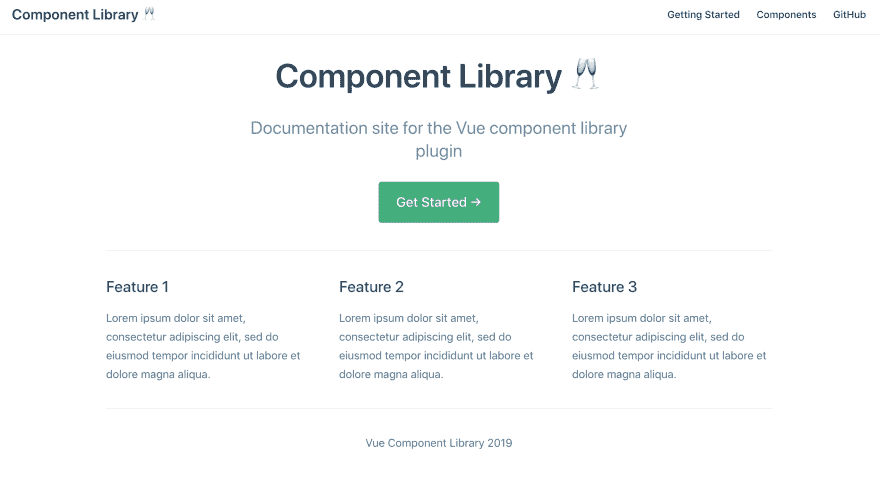
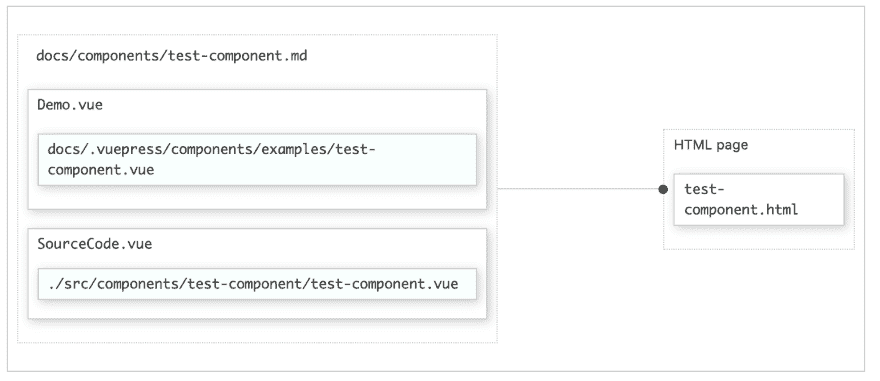
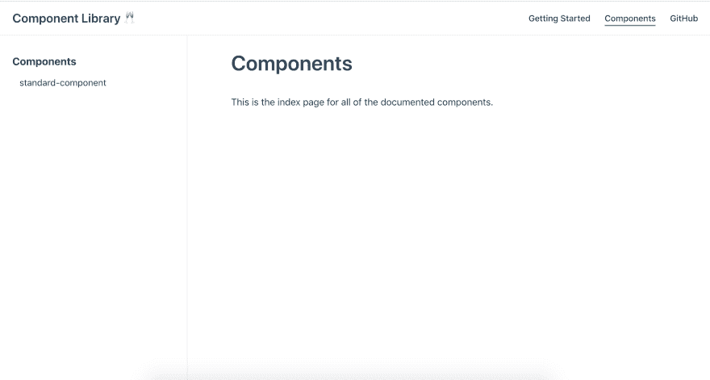
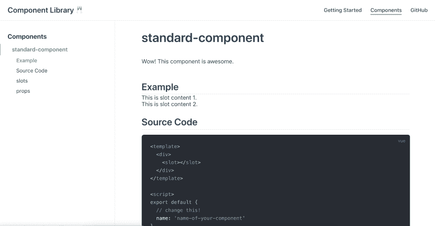

# 创建 Vue.js 组件库:第四部分 VuePress 文档

> 原文：<https://dev.to/siegerts/creating-a-vue-js-component-library-part-iv-documentation-with-vuepress-56h5>

文档时间！

在这篇文章中，我们将使用 [VuePress](https://v1.vuepress.vuejs.org/) 向 Vue 组件库插件添加一个文档元素。这篇文章的最终状态将是一个静态网站，它的结构记录了在同一个项目中*存在的*组件库。

该组件将生成自己的文档！

JavaScript 的独特之处在于，它可以用所有可用的工具和框架创建实时文档站点。VuePress 增加了一些额外的糖衣🍰。我很惊讶自己偶然发现了这么多使用 VuePress 的文档网站。

那么，项目中已经有什么了？

首先，我们创建了一些框架组件作为占位符:

*   [标准分量。视图](https://github.com/siegerts/vue-component-library-template/blob/master/src/components/StandardComponent/StandardComponent.vue)

*   [FunctionalComponent.vue](https://github.com/siegerts/vue-component-library-template/blob/master/src/components/FunctionalComponent/FunctionalComponent.vue)

然后，在上一篇文章中，我们将它们合并成了一个 Vue [插件](https://dev.to/siegerts/consolidating-components-into-a-vue-js-plugin-ndc)。作为参考，这个帖子系列的源代码在这里是。

## [siegerts](https://github.com/siegerts)/[vue-组件-库-模板](https://github.com/siegerts/vue-component-library-template)

### Vue 组件库的支持项目和代码。

如果你还没有跟上这个系列，那么我鼓励你跳回到[简介](https://dev.to/siegerts/creating-a-vue-js-component-library-part-i-introduction-2o9f)并从那里开始。这将为这篇文章的内容提供一个更好的背景。

喝杯咖啡(或茶)，然后开始行动吧。

## 目标

文档网站的要求包括:

✅显示活组件示例

✅组件和文档在同一个项目中

开发过程中，✅的变化会立即反映在文档中(即热重装)

🎂VuePress 提供了特色静态网站的所有元素

### 达到要求的步骤

1.  将 VuePress 添加到项目中
2.  为我们的站点布局和项目元数据定制`config.js`
3.  向 VuePress 文档站点的注册组件库插件
**   创建一个结构来可视化和记录插件中的组件*

 *## 添加 VuePress

如果您不熟悉 VuePress，请先通读文档的[入门](https://v1.vuepress.vuejs.org/guide/getting-started.html#inside-an-existing-project)部分。对于我们的使用，我们将*将 VuePress 添加到现有的应用程序中*。

根据文档，让我们将最新的 VuePress 版本添加到我们的项目中。

```
yarn add -D vuepress@next 
```

Enter fullscreen mode Exit fullscreen mode

如果您正在跟随这个系列，那么您应该已经在`package.json`中有了`scripts`键。该文件位于项目目录的根目录下。

安装 VuePress 后，添加所需的命令:

```
...
"scripts": {
    "serve": "vue-cli-service serve",
    "build": "vue-cli-service build",
+   "docs:dev": "vuepress dev docs",
+   "docs:build": "vuepress build docs",
    "lint": "vue-cli-service lint"
  }
}
... 
```

Enter fullscreen mode Exit fullscreen mode

接下来，使用:
删除 Vue 作为依赖项

```
yarn remove vue 
```

Enter fullscreen mode Exit fullscreen mode

```
...

-"dependencies": {
-    "vue": "^2.6.6"
-  }, 
... 
```

Enter fullscreen mode Exit fullscreen mode

VuePress 已经将 Vue 作为一个[依赖项](https://github.com/vuejs/vuepress/blob/master/packages/%40vuepress/core/package.json)了，所以在这里运行或构建这个站点并不需要它。在发布到 npm 之前，我们将把它作为插件的*对等依赖*添加进来。

我们将使用`docs:dev`来开发和测试我们的组件库，使用`docs:build`来构建用于发布(即部署)的文档站点。

接下来，在项目的根目录下创建一个`docs`目录。VuePress 的配置和内容将放在这里。

```
# create a docs directory
mkdir docs 
```

Enter fullscreen mode Exit fullscreen mode

在`docs`中，创建一个`.vuepress`目录，同时创建一个`README.md`。确保这两个文件都在`docs`目录中。

将以下 YAML 前沿事件放入`README.md` :

```
--------
home: true
heroImage:
actionText: Get Started →
actionLink: /guide
features:
 - title: Feature 1
    details: Lorem ipsum dolor sit amet, consectetur adipiscing elit, sed do eiusmod tempor incididunt ut labore et dolore magna aliqua.
 - title: Feature 2
    details: Lorem ipsum dolor sit amet, consectetur adipiscing elit, sed do eiusmod tempor incididunt ut labore et dolore magna aliqua.
 - title: Feature 3
    details: Lorem ipsum dolor sit amet, consectetur adipiscing elit, sed do eiusmod tempor incididunt ut labore et dolore magna aliqua.
footer: Vue Component Library 2019
-------- 
```

Enter fullscreen mode Exit fullscreen mode

这将成为文档网站主页。

`README.md`文件[需要出现在`docs`目录下](https://v1.vuepress.vuejs.org/guide/getting-started.html#inside-an-existing-project)！

另外，在`docs/`中添加一个`guide.md`文件。我们将用它作为*入门指南*的占位符。继续将下面一行放入该文件:

```
# Getting Started

... 
```

Enter fullscreen mode Exit fullscreen mode

项目结构应该类似于:

```
.
└─ docs/
+ ├── .vuepress/
+ ├─ guide.md
+ └─ README.md 
```

Enter fullscreen mode Exit fullscreen mode

## 自定义`config.js`

按照 VuePress 文档，让我们定制站点的结构和设置。

在`.vuepress`目录下添加一个`config.js`文件:

```
.
└─ docs/
  ├── .vuepress/
+ │   └─ config.js
  ├─ guide.md
  └─ README.md 
```

Enter fullscreen mode Exit fullscreen mode

这是可用选项的子集。这个模板将有助于作为一个起点。在这里实现所有可用的选项有点让人不知所措。

```
// config.js

module.exports = {
  locales: {
    '/': {
      lang: 'en-US',
      title: 'Component Library 🥂',
      description: 'Documentation site for the Vue component library plugin'
    }
  },

  themeConfig: {
    repoLabel: 'Contribute!',
    // git repo here... gitlab, github
    repo: '',
    docsDir: 'docs',
    editLinks: true,
    docsBranch: 'dev',
    editLinkText: 'Help us improve this page!',
    search: false,
    locales: {
      '/': {
        label: 'English',
        selectText: 'Languages',
        lastUpdated: 'Last Updated',
        // service worker is configured but will only register in production
        serviceWorker: {
          updatePopup: {
            message: 'New content is available.',
            buttonText: 'Refresh'
          }
        },
        nav: [
          { text: 'Getting Started', link: '/guide' },
          { text: 'Components', link: '/components/' },
          // external link to git repo...again
          { text: 'GitHub', link: '' }
        ],
        sidebar: {
          '/components/': [
            {
              title: 'Components',
              collapsable: false,
              children: ['standard-component']
            }
          ]
        }
      }
    }
  }
} 
```

Enter fullscreen mode Exit fullscreen mode

让我们一步一步来:

*   用适当的站点标题将根区域设置为`en-US`。

*   添加`themeConfig`。

*   `nav`字段包含一个链接列表，这些链接将出现在网站的顶部导航中。第一个链接将指向显示我们创建的`guide.md`文件的`/guide`。

*   `nav`中的第二个链接指向`/.vuepress`中的`/components/`目录，该目录将包含记录每个组件的降价文件。

*   最后一个链接指向一个外部链接，GitHub repo 链接。

*   接下来，我们添加`sidebar`。这里参考了上面的`/components`路线。当访问该路由时，将出现侧边栏导航，显示任何可用的子路由。

*   我们将使用`children: ['standard-component']`在`sidenav`中添加一个子路由。`standard-component`指组件目录中的降价文件的名称。所以，`/components/standard-component.md`👉`standard-component`。当访问`<root>/components/standard-component`路线时，该降价文件呈现为 HTML。

此时，站点应该能够运行并提供默认页面。让我们确保它的工作。

```
yarn docs:dev

...

VuePress dev server listening at http://localhost:8080/ 
```

Enter fullscreen mode Exit fullscreen mode

[](https://res.cloudinary.com/practicaldev/image/fetch/s--B8JUSL3R--/c_limit%2Cf_auto%2Cfl_progressive%2Cq_auto%2Cw_880/https://dev-to-uploads.s3.amazonaws.com/i/l00luwvmrvx8aog511do.png)

`/components`路线将暂时显示一个`404`页面。这没关系，因为我们将在下一节中解决这个问题。

很好，现在让我们添加组件库插件。

## 注册组件插件

我们还想在同一个`.vuepress/`目录中创建和修改`enhanceApp.js`。

```
.
└─ docs/
  ├── .vuepress/
+ │   ├─ enhanceApp.js
  │   └─ config.js
  ├─ guide.md
  └─ README.md 
```

Enter fullscreen mode Exit fullscreen mode

我们将从`./../../src/main.js`入口点导入库插件，并在文档组件中注册为插件。

还记得我们在上一篇文章中创建的[插件](https://dev.to/siegerts/consolidating-components-into-a-vue-js-plugin-ndc)吗？我们正在这里使用它！

#### `enhanceApp.js`

这允许插件在站点内可用。[增强文件](https://v1.vuepress.vuejs.org/guide/basic-config.html#app-level-enhancements)的结构使得*应用级*调整变得容易。

此处可以添加的其他项目包括:

*   附加 Vue 插件
*   注册全局组件，或者
*   添加额外的路由器挂钩

```
// enhanceApp.js

import ComponentLibrary from './../../src/main.js'

export default ({ Vue, options, router, siteData }) => {
  Vue.use(ComponentLibrary)
} 
```

Enter fullscreen mode Exit fullscreen mode

这是我们的组件插件☝️！

`enhanceApp.js`覆盖允许将额外的功能添加到应用程序中。在这个上下文中，*应用程序*指的是文档站点。组件库插件包含在同一个基础项目中，但是*不是*应用程序。

这些组件现已在文档网站上面向全球发布。现在，我们需要为每一个构建实际的文档页面。

这一部分有点棘手，所以请继续关注我💪。

## 可视化并记录组件

目标是展示库插件中每个组件的实例及其源代码。

为此，首先需要几个文件。

1.  创建一个示例文件。这是一个单个文件组件(SFC ),以不同的`props`等显示不同状态的组件。这些文件将位于`.vuepress/components/examples`中。

2.  在`/components`中为每个插件组件创建一个降价文件。这些页面将成为 HTML 页面。在这个文件中，我们将利用两个全局*表示性*组件`Demo.vue`和`SourceCode.vue`，将每个插件组件和示例 SFC 链接在一起。

我们将为站点的文档方面创建两个与表示相关的组件，`Demo.vue`和`SourceCode.vue`。这些组件*不是 Vue 插件的*部分，但是我们可以用来构建网站页面。我们将利用 VuePress 中的[全球组件](https://v1.vuepress.vuejs.org/guide/using-vue.html#using-components)。

[](https://res.cloudinary.com/practicaldev/image/fetch/s--nQHxNQRG--/c_limit%2Cf_auto%2Cfl_progressive%2Cq_auto%2Cw_880/https://dev-to-uploads.s3.amazonaws.com/i/n62xp1zbctjrnngjob4a.png)

<small>使用一个假设的示例组件，*测试组件*。</small>

#### 演示。视图

该组件将包含在组件的文档降价文件`./docs/components/*.md`中。它将包装要记录的组件，并将其注入 markdown 页面。在这种情况下，它将被设置为包装包含插件组件示例的 Vue 文件。

#### SourceCode.vue

该组件将包装一个导入代码片段的`<slot></slot>`。在我们的使用中，代码片段将是被记录的组件的源代码。为此，VuePress 有一个很棒的特性，允许[导入我们将使用的代码片段](https://v1.vuepress.vuejs.org/guide/markdown.html#import-code-snippets)。

### 创造`Demo.vue`

我们希望创建一个结构，允许我们将每个组件呈现到它的文档页面中。这样，组件的实例就显示在文档的旁边。

在`.vuepress/components`目录中添加`Demo.vue`组件:

```
.
└─ docs/
  ├── .vuepress/
+ │   ├─ components/
+ │   │  └─ Demo.vue
  │   ├─ config.js
  │   └─ enhanceApp.js
  ├─ guide.md
  └─ README.md 
```

Enter fullscreen mode Exit fullscreen mode

```
<!-- Demo.vue -->
<template>
  <div>
    <component :is="componentName" />
  </div>
</template>

<script>
  export default {
    props: {
      componentName: { type: String, required: true }
    }
  }
</script> 
```

Enter fullscreen mode Exit fullscreen mode

这是一个简单的组件，它将组件文件名引用作为一个`prop`，并使用特殊属性`:is`将其呈现为一个[动态组件](https://vuejs.org/v2/guide/components.html#Dynamic-Components)。

### 创造`SourceCode.vue`

```
.
└─ docs/
  ├── .vuepress/
  │   ├─ components/
  │   │  ├─ Demo.vue
+ │   │  └─ SourceCode.vue
  │   ├─ config.js
  │   └─ enhanceApp.js
  ├─ guide.md
  └─ README.md 
```

Enter fullscreen mode Exit fullscreen mode

```
<!-- SourceCode.vue -->
<template>
  <div>
    <slot></slot>
  </div>
</template> 
```

Enter fullscreen mode Exit fullscreen mode

### 添加第一个文档页面

#### 示例文件

对于第一个组件的文档，创建一个`example`目录和一个 Vue 组件来显示从插件中选择的组件的例子。在本例中，创建一个`standard-component.vue`来演示本系列前面的标准组件:

*   `StandardComponent.vue`带有名称属性`standard-component`

作为复习，组件看起来像[这个](https://github.com/siegerts/vue-component-library-template/blob/master/src/components/StandardComponent/StandardComponent.vue)。

```
.
└─ docs/
  ├── .vuepress/
  │   ├─ components/
+ │   │  ├─ examples/
+ │   │  │  └─ standard-component-doc.vue
  │   │  ├─ Demo.vue
  │   │  └─ SourceCode.vue
  │   ├─ config.js
  │   └─ enhanceApp.js
  ├─ guide.md // refers to the `/guide` route
  └─ README.md // need to have this == homepage! 
```

Enter fullscreen mode Exit fullscreen mode

在这个示例文件中，放入以下代码，用不同的`slot`内容演示`standard-component`。

```
<template>
  <div>
    <standard-component>
      This is slot content 1.
    </standard-component>

    <standard-component>
      This is slot content 2.
    </standard-component>
  </div>
</template> 
```

Enter fullscreen mode Exit fullscreen mode

#### 降价路线文件

需要的最后一个文件是 markdown 文件。首先，在`docs/`中添加一个`components`目录。然后，将另一个`README.md`文件添加到该目录，如下所示。这是必要的，并将作为网站`/components`路线的索引页面。

```
.
└─ docs/
  ├── .vuepress/
  │   ├─ components/
  │   │  ├─ examples/
  │   │  │  └─ standard-component-doc.vue
  │   │  ├─ Demo.vue
  │   │  └─ SourceCode.vue
  │   ├─ config.js
  │   └─ enhanceApp.js
+ ├─ components/
+ │  ├─ README.md
+ │  └─ standard-component.md
  ├─ guide.md
  └─ README.md 
```

Enter fullscreen mode Exit fullscreen mode

在`README.md`文件中，添加:

```
# Components

This is the index page for all the documented components. 
```

Enter fullscreen mode Exit fullscreen mode

在`.vuepress/config.js`中，站点的`/components/`路线链接到这个标记为`children: ['standard-component']`的降价文件。

```
// config.js from earlier
...
sidebar: {
  '/components/': [
    {
      title: 'Components',
      collapsable: false,
      children: ['standard-component']
    }
  ]
}

... 
```

Enter fullscreen mode Exit fullscreen mode

这意味着 VuePress 将在项目根目录的`docs/components`目录中查找，并与同名的 markdown 文件进行匹配。

因此，让我们创建将与`components/standard-component`路线相关联的降价文件。

将以下内容添加到`docs/components` :
中的`standard-component.md`

```
# standard-component

Wow! This component is awesome.

## Example

<Demo componentName="examples-standard-component-doc" />

## Source Code

<SourceCode>
<<< @/src/components/StandardComponent/StandardComponent.vue
</SourceCode>

## slots

...

## props

... 
```

Enter fullscreen mode Exit fullscreen mode

`components/standard-component.md`文件成为文档站点的`components/standard-component.html`路径！

刷新站点将激活`/components`和`/components/standard-component`路线:

[](https://res.cloudinary.com/practicaldev/image/fetch/s--GdhICFBH--/c_limit%2Cf_auto%2Cfl_progressive%2Cq_auto%2Cw_880/https://dev-to-uploads.s3.amazonaws.com/i/ss1lc4o1vl1j5wu2uxcn.png)

[](https://res.cloudinary.com/practicaldev/image/fetch/s--fEB9KSoJ--/c_limit%2Cf_auto%2Cfl_progressive%2Cq_auto%2Cw_880/https://dev-to-uploads.s3.amazonaws.com/i/zker0tsxigb1xfqx2nii.png)

注意到什么了吗？markdown 使用前面的`Demo.vue`和`SourceCode.vue`组件来显示示例文件和源代码！

*   `<Demo componentName="examples-standard-component-doc" />`

    *   注意这里的`componentName`道具，`examples-standard-component`。VuePress 需要相对于全球组件的`.vuepress/components/`目录用连字符连接目录结构。所以，`examples-standard-component-doc`相当于`.vuepress/components/examples/standard-component-doc.vue`路径。
*   `<<< @/src/components/StandardComponent/StandardComponent.vue`

    *   这一行将源代码片段注入到`SourceCode.vue`实用程序组件的默认`slot`中。

## 结论

哇，升级得真快😉。这是一个通用的设置，当新的组件被添加到插件时可以重复这个设置——添加另一个示例 Vue 文件和一个 markdown 组件文件。现在，当您在开发模式中进行更改时，站点会立即反映这些更改。

在下一篇文章中，我们将[将新的文档站点部署到 Netlify](https://dev.to/siegerts/creating-a-vue-js-component-library-part-v-deploying-documentation-to-netlify-4263) 中。之后，我们将在 **npm** 上发布组件库插件以供发布。

一如既往，如果您有任何问题或建议，请联系我们🐶。*