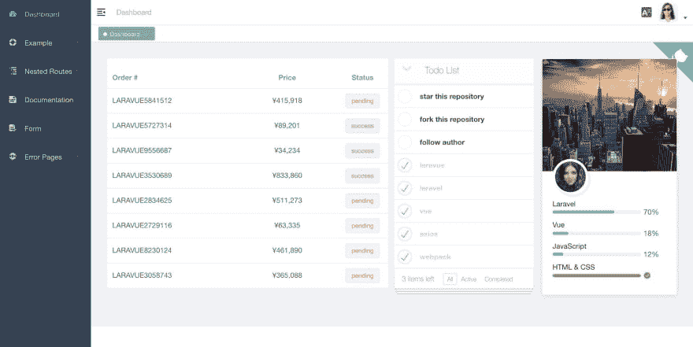
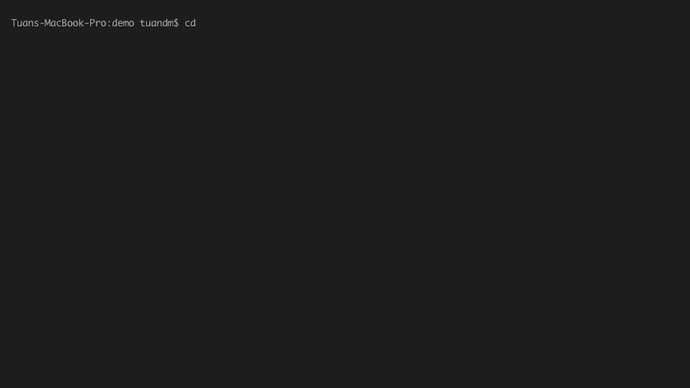

# 拉勒维核心-拉勒维包建立一个美丽的仪表板

> 原文：<https://dev.to/tuandm/laravue-core---a-laravel-package-to-build-a-beautiful-dashboard-5aia>

# 拉勒维核心

## 简介

上个月，我在[本帖](https://dev.to/tuandm/laravel--vuejs--laravue---a-beautiful-dashboard-for-laravel-3h11)中介绍了我们的 [Laravue](https://github.com/tuandm/laravue) 项目，该项目将使用 VueJS 为 Laravel 构建一个管理界面，开发进度相当不错，上周我们发布了一些测试版。然而，Laravue 被定位为企业仪表板解决方案，不适合用于现有项目。今天我想介绍 [Laravue core](https://github.com/tuandm/laravue-core) -一个 Laravel 包，它提供了 Laravue 的所有核心功能，并且易于集成到任何 Laravel 项目中。

屏幕上显示程序运行的图片

*   演示: [https://core.laravue.dev](https://core.laravue.dev)
*   源代码:[https://github . com/tuandm/laravue-core](https://github.com/tuandm/laravue-core)

## 入门

Laravue-core 提供了一个有用的命令来设置一切，只需用 composer 获得`tuandm/laravue-core`包，键入`php artisan laravue:setup`然后继续提示即可——非常简单。

更多细节请参考[安装指南](https://github.com/tuandm/laravue-core#installing)

## 下一步

*   我们将尝试发布新版本的[流明](https://lumen.laravel.com/) -它非常有吸引力。
*   测试系统正在开发中——我们希望尽可能多地覆盖这个库
*   文档将很快发布——包括组件手册和开发指南。
*   我们将添加有用的 Laravel 包，如 spatie/laravel-permission 或 CRUD 支持。

我希望这个包能帮助你为你的 Laravel 项目建立一个漂亮的管理界面。我非常感谢任何反馈，意见，建议，甚至明星，...他们让我和这个图书馆变得更好。谢谢你。