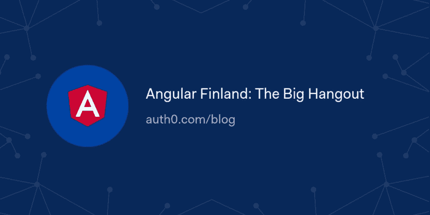

# 棱角分明的芬兰:大聚会

> 原文：<https://dev.to/auth0/angular-finland-the-big-hangout-2n5h>

我很荣幸能够在 2019 年 3 月 14 日由 Angular Finland 举办的小型会议 Big Hangout 2019 上发言。会议由 Tieto 在紧邻赫尔辛基的埃斯波主办。它还得到了其他芬兰科技公司的赞助，如 flavour、Finitec、Gofore(举办了 after party)和 Innofactor(慷慨赞助了我的 travel other there！).

[读读🅰️🎡](https://auth0.com/blog/angular-finland-big-hangout/?utm_source=dev&utm_medium=sc&utm_campaign=angularfi_hangout)

