# 免费完整课程列表

> 原文：<https://dev.to/alicannklc/free-full-course-list-3pof>

Python 全程
[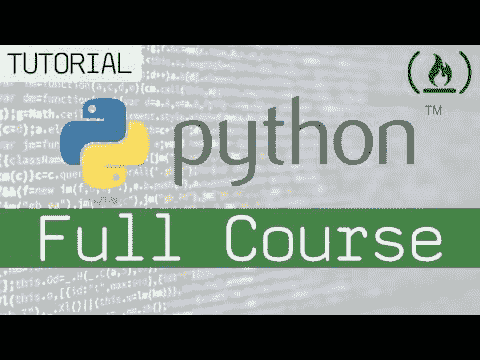](https://www.youtube.com/watch?v=rfscVS0vtbw)

学习 JavaScript -初学者全教程 [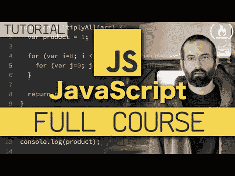](https://www.youtube.com/watch?v=PkZNo7MFNFg)

Learn Vue.js -初学者全教程

Swift 教程-初学者全程
[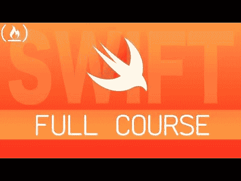](https://www.youtube.com/watch?v=comQ1-x2a1Q)

SQL -初学全教程
[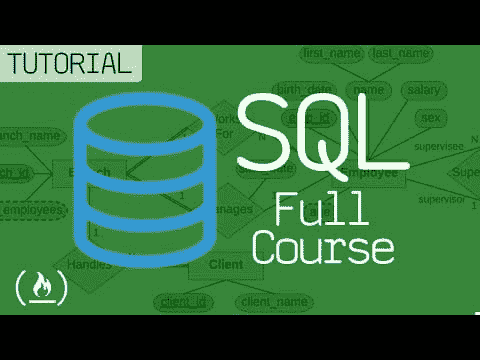](https://www.youtube.com/watch?v=HXV3zeQKqGY)

Ruby 编程语言-全程
[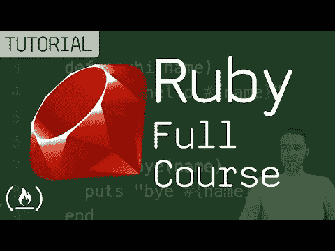](https://www.youtube.com/watch?v=t_ispmWmdjY)

Python Django Web 框架-初学者全教程
[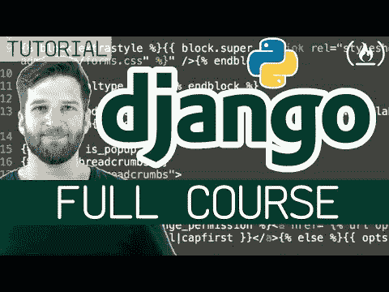](https://www.youtube.com/watch?v=F5mRW0jo-U4)

HTML 全教程-建网站教程
[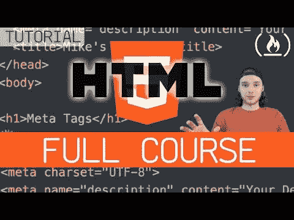](https://www.youtube.com/watch?v=pQN-pnXPaVg)

【主题开发】

Express.js & Node.js 初学者课程-全教程
[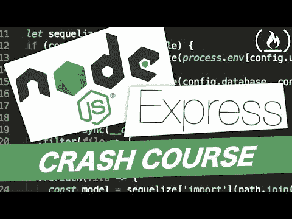](https://www.youtube.com/watch?v=G8uL0lFFoN0)

围棋教程/ Golang 初学者速成班
[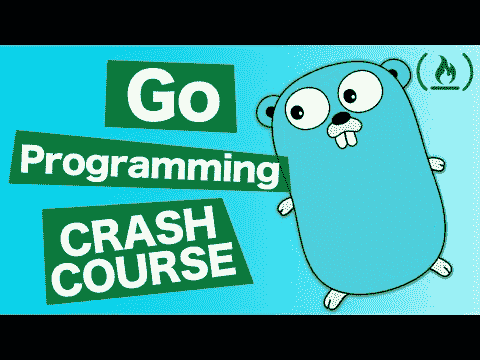](https://www.youtube.com/watch?v=Xj5lo2-ZvRg)

Unity FPS 生存游戏教程-第一人称射击游戏 Dev
[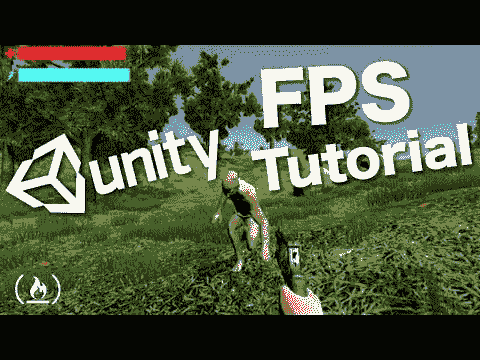](https://www.youtube.com/watch?v=Sqb-Ue7wpsI)

神经网络与 JavaScript -使用 Brain.js
[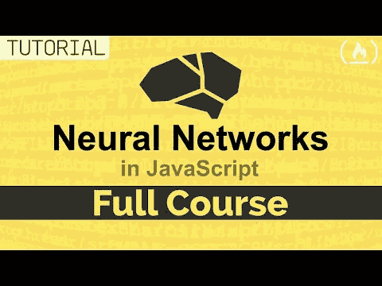](https://www.youtube.com/watch?v=6E6XecoTRVo) 全教程

CSS 完整课程-包括 Flexbox 和 CSS 网格教程
[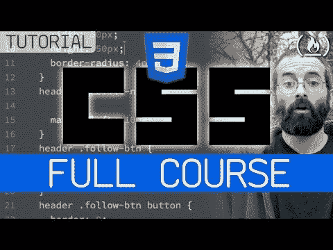](https://www.youtube.com/watch?v=ieTHC78giGQ)

Learn React.js -初学者全教程-教程 2019
[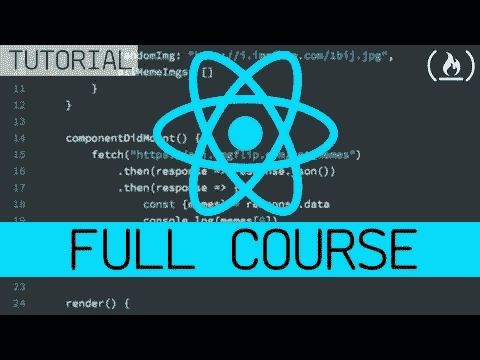](https://www.youtube.com/watch?v=DLX62G4lc44)

道德黑客 101: Web 应用渗透测试——初学者全教程

Learn Node.js -初学者全教程
[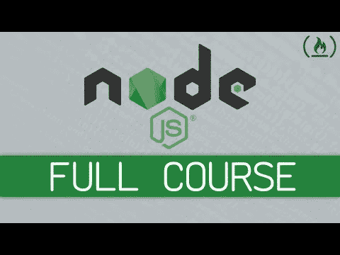](https://www.youtube.com/watch?v=RLtyhwFtXQA)

学习 TensorFlow.js -深度学习和神经网络用 JavaScript
[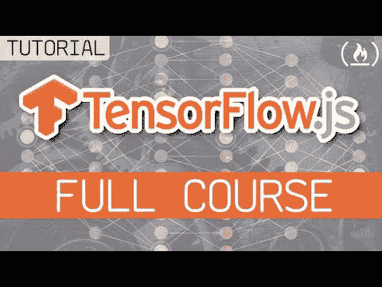](https://www.youtube.com/watch?v=EoYfa6mYOG4)

学习角度-完整教程

[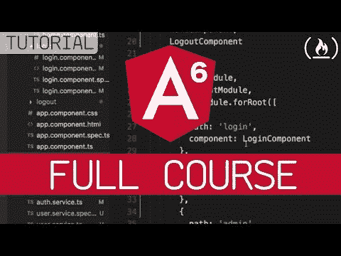](https://www.youtube.com/watch?v=2OHbjep_WjQ)

盖茨比-初学者全教程
[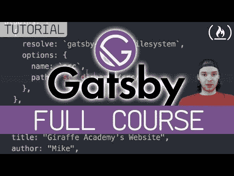](https://www.youtube.com/watch?v=mHFAM0CXviE)

HTML 和 CSS 教程-为初学者创建一个网站
[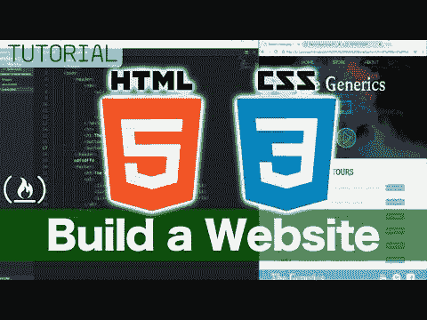](https://www.youtube.com/watch?v=kMT54MPz9oE)

JavaScript 游戏开发入门-全教程
[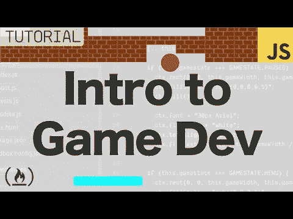](https://www.youtube.com/watch?v=3EMxBkqC4z0)

GraphQL 服务器中级教程-包含 Typescript、PostgreSQL 和 Redis 的样板文件
[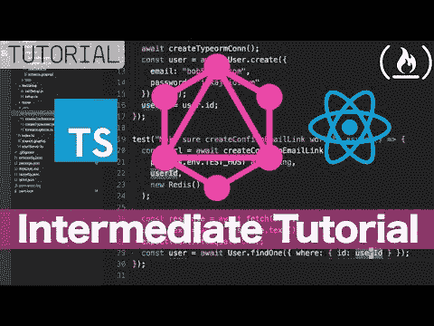](https://www.youtube.com/watch?v=-iwjiiCGiO0)

程序员数学教程-集合与逻辑全教程
[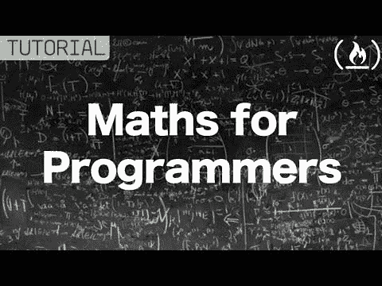](https://www.youtube.com/watch?v=2SpuBqvNjHI)

MongoDB 全教程 w/ Node.js，Express，& mongose
[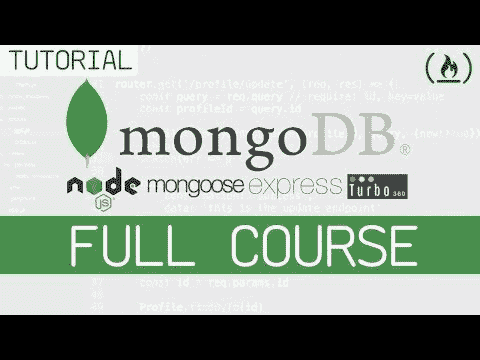T3】](https://www.youtube.com/watch?v=4yqu8YF29cU)

React Native -初学者入门课程
[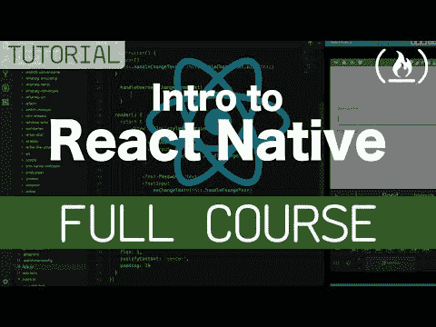](https://www.youtube.com/watch?v=frvXANSaSec)

C#教程-初学者全教程
[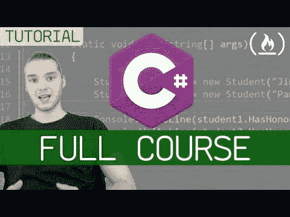](https://www.youtube.com/watch?v=GhQdlIFylQ8)

C++初学者教程-全程
[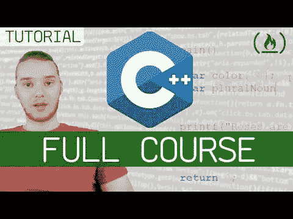](https://www.youtube.com/watch?v=vLnPwxZdW4Y)

帕格模板引擎-初学者全教程
[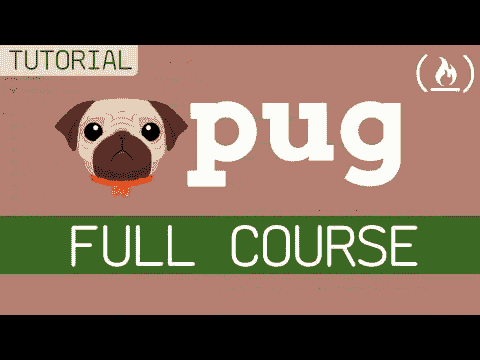](https://www.youtube.com/watch?v=kt3cEjjkCZA)

Vue.js & Firestore 教程-完整项目
[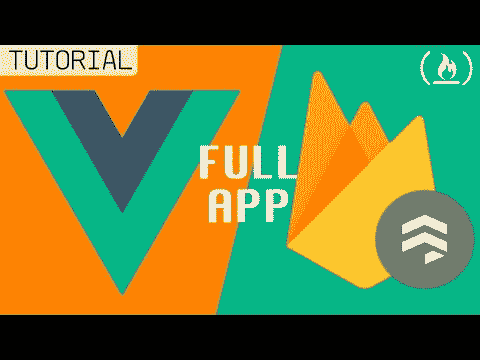](https://res.cloudinary.com/practicaldev/image/fetch/s--K5ttw4E---/c_limit%2Cf_auto%2Cfl_progressive%2Cq_auto%2Cw_880/https://img.youtube.com/vi/vwHtFjdC2_M/0.jpg)

布尔玛 CSS 框架-完整教程
[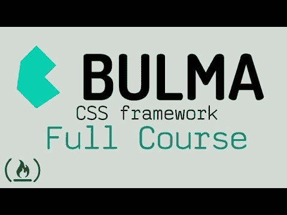](https://www.youtube.com/watch?v=LBzZLzu2GKo)

JavaScript ES6、ES7、ES8:在出血的边缘学会编码(全程)
[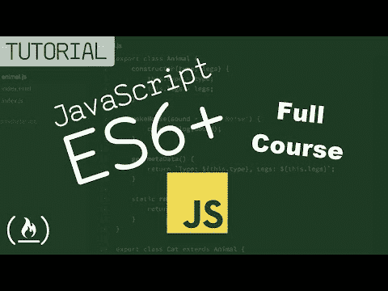](https://www.youtube.com/watch?v=nZ1DMMsyVyI)

JavaScript 简介

一个视频学会 Redux——Redux/React 教程

GraphQL 全程-新手到专家

React 基础——初学者全教程
[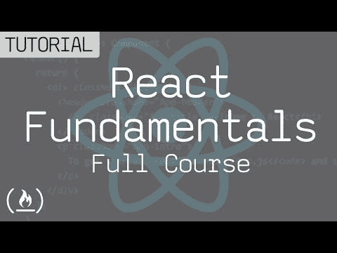](https://www.youtube.com/watch?v=6Ied4aZxUzc)

Php 全程
[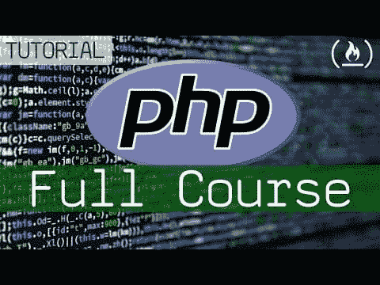](https://www.youtube.com/watch?v=OK_JCtrrv-c)

Python Django 框架全教程——用 Docs
[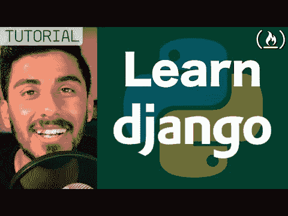](https://www.youtube.com/watch?v=cI3FOYIMSYE) 学习

SQL -初学全教程

c 编程初学者教程
[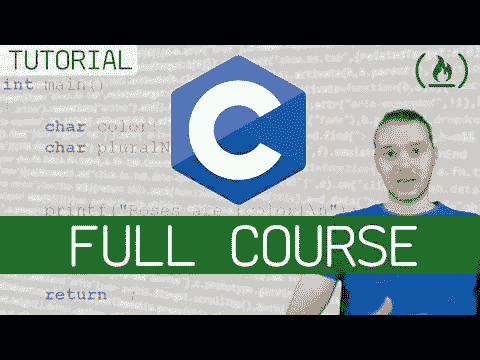](https://www.youtube.com/watch?v=KJgsSFOSQv0)

JavaScript 中的数据结构与算法——初学者全教程
[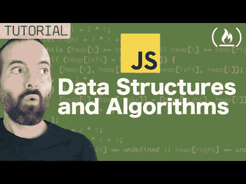](https://www.youtube.com/watch?v=t2CEgPsws3U)

学习 HTML5 -带代码示例的完整课程
[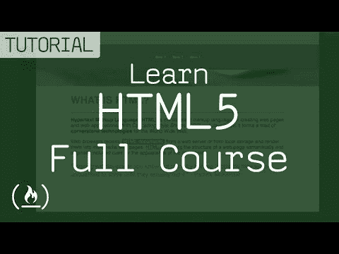](https://www.youtube.com/watch?v=DPnqb74Smug)

学习 Java 8 -初学者全教程
[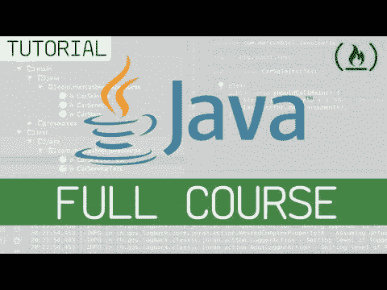](https://www.youtube.com/watch?v=grEKMHGYyns)

数据库设计课程——学习如何为初学者设计和规划一个数据库
[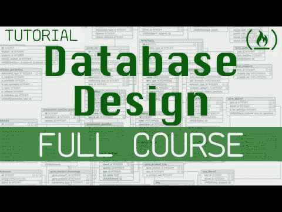](https://www.youtube.com/watch?v=ztHopE5Wnpc)

原生安卓 App 教程:WhatsApp 克隆

C#从初学者到进阶完整教程——编码竞技场
[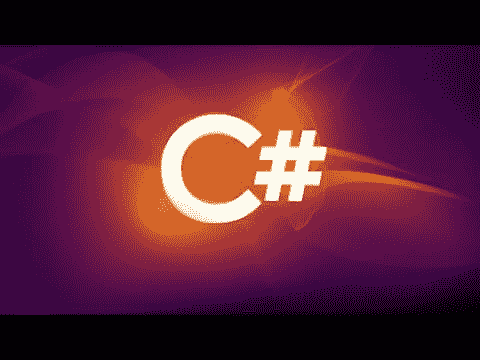](https://www.youtube.com/watch?v=2KTyAj0JCpI)

用 Visual Studio 代码进行 C++开发(2018)
[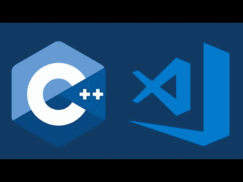](https://www.youtube.com/watch?v=UHS-aenkPPg)

CSS 速成班绝对初学者
[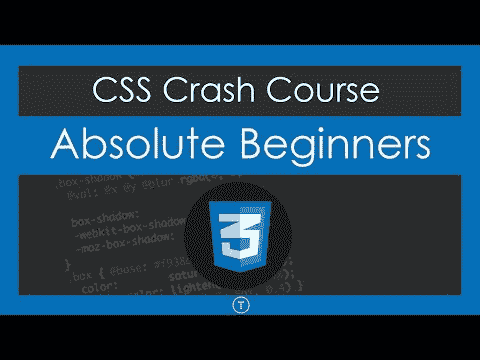](https://www.youtube.com/watch?v=yfoY53QXEnI)