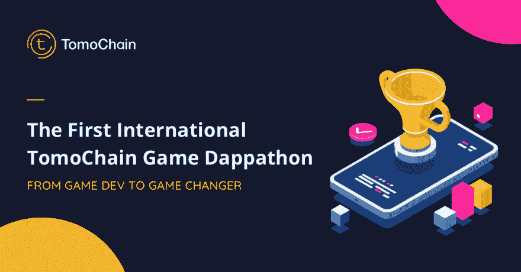
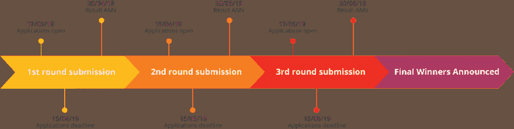

# 呼唤天才游戏开发者——tomo chain 的 DAPPATHON

> 原文：<https://dev.to/vannguyenthu1/a-call-for-talented-game-developers---tomochains-dappathon-2bke>

2018 年，dapps 市场营收 67 亿。其中超过 30%是游戏玩家(来源:dapp.com)

TomoChain 非常支持开发者加入区块链运动，并向他们介绍 dapp 开发。

我们正在举办我们的第一个以 dappathon 为中心的国际比赛，来自世界任何地方的任何人都可以参加。

## **关于这个比赛你应该知道的:**

*   赢得 **20，000 美元**的现金奖励
*   让游戏和区块链行业的领导者来评判你的游戏
*   成为第一批在区块链制造游戏的人
*   这个比赛是国际性的，你可以从世界任何地方参加
*   三轮提交，第一轮提交截止日期为 4 月 15 日

## **比赛形式**

目标很简单:在 Tomochain 区块链上构建一个工作游戏。

将有三轮提交，申请从今天开始，截止日期是一个月后的 4 月 15 日。第二轮从 4 月 15 日到 5 月 15 日，第三轮从 5 月 17 日到 6 月 15 日。

每轮比赛将颁发获胜者和奖品，所有获胜者将被邀请参加 7 月份的展示活动。

你可以访问官方比赛页面[这里](https://tomochain.com/tomochain-game-contest/)了解详情，每周更新，并到[注册你的兴趣](https://tomochain.com/tomochain-game-contest/)。

## **你是开发商吗？**

你对这次比赛有疑问吗？

在 [Discord](https://discordapp.com/invite/2S6GdpJ) (#gamecontest)上加入我们的游戏竞赛频道，我们的团队将支持你构建你的第一个区块链游戏

对这个活动感兴趣？
如需媒体、赞助或其他咨询，可通过此处联系我:
电报:@jakepang
电子邮件:[jake@tomochain.com](//jake@tomochain.com)

*奖品将按照美元等值以 TOMO 形式发放。