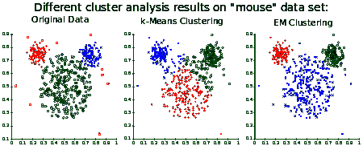
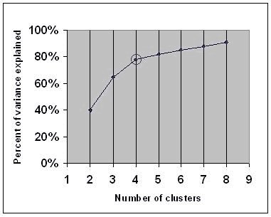

# 无监督学习:聚类

> 原文：<https://dev.to/swyx/unsupervised-learning-clustering-42mi>

*这是我学习[佐治亚理工学院/优达城机器学习课程](https://www.udacity.com/course/machine-learning--ud262)的系列课堂笔记中的第 14 篇。课堂教材是汤姆·米切尔的[机器学习。](https://www.cs.ubbcluj.ro/~gabis/ml/ml-books/McGrawHill%20-%20Machine%20Learning%20-Tom%20Mitchell.pdf)*

[](https://res.cloudinary.com/practicaldev/image/fetch/s--zhY6Fone--/c_limit%2Cf_auto%2Cfl_progressive%2Cq_auto%2Cw_880/https://upload.wikimedia.org/wikipedia/commons/thumb/0/09/ClusterAnalysis_Mouse.svg/450px-ClusterAnalysis_Mouse.svg.png)

## 定义基本聚类问题

我们想把一组物体分组。

形式上，

```
Given:
- set of objects X
- inter object distances D(x,y)

Output:
- Partition Pd(x) = Pd(y)
  if x & y in same cluster 
```

`D`(距离算法)可以是您根据领域知识选择的任何相似性度量。

## 单个联动聚类

最简单的聚类算法是单链。

*   首先将每个对象视为一个集群(因此有 n 个对象和 n 个集群)
*   将簇间距离定义为两个簇中最近的两个点之间的距离
*   合并两个最接近的集群
*   重复`n-k`次以到达`k`个集群。

这有助于你建立一个层次凝聚的集群结构。通过从顶部开始在`k`层切断树，你可以得到预定数量的簇，这很方便。

除了最靠近的*2 个点，您还可以修改该算法，使用最远离*的* 2 个点或每个聚类的平均(均值、中值)点。*

SLC 是确定性的，并且还会生成最小生成树。运行时间为`O(n^3)`。然而，由于“最近点”规则，它会生成一些非直观的聚类。所以我们需要更好的东西。

## K-均值聚类

尝试:

*   随机选择 k 个“中心”
*   每个中心都“声称”其所有最近的点
*   通过平均聚类点来重新计算中心
*   重复直到收敛(重新计算没有任何变化)

中心不一定是任何点，它只是群集的“中心”。

K-Means 可以被视为一个优化问题，因为我们总是试图在每一轮中获得越来越好的答案。用最优化术语来说，我们可以对每组**配置**(中心)进行**评分**，并且我们尝试从**邻居**转移到试图改进的邻居。

如果我们假设我们知道“真实的”分区`P(x)`，我们可以对`center of P(x) - x`之间的平方误差求和，以获得最小化的误差分数。“邻居”有点不太直观——它是一轮结束时可能的移动集合，基本上，你可以移动分区，也可以移动中心。

你可以证明 K-means 聚类:

*   在每一步总是改进或保持不变(当你移动分区时，只有在误差下降时才移动，当你移动中心时，通过重新计算中心，你立即跳到给定分区的最小误差)，也就是“误差单调非递增”
*   收敛(因为你有有限数量的配置)，只要你有一个方法来做一致的平局打破

如果你还记得随机优化这一章，这听起来很像爬山，你根据邻居的分数选择并移动到他们那里。这也意味着它会陷入局部最优(基于随机起点的不良聚类)，所以唯一的解决办法是随机重启。

还有一种边缘情况，如果一个点在两个完全收敛的簇之间是等距离的，那么它不确定地是其中一个簇的一部分。为了解决这个问题，我们将使用一种允许共享的算法...

## 软聚类(最好！)也称为期望最大化或高斯混合

这里的主要技巧是像我们在 MIMIC 中做的那样，假设点来自概率分布。尝试:

*   假设数据是由具有已知方差的`k`个可能高斯中的一个生成的
*   来自高斯样本 Xi
*   重复 n 次

任务是找到一个“k 均值”的假设`h=<u1, u2,... uk>`，最大化数据的概率(又名最大似然)。高斯的最大似然均值只是数据的均值，所以这里没有什么新东西。然而，您可以使用`k`隐藏变量(分区 1 中的`[0,1]`成员到`k`)以类似于 k-Means 聚类的方式运行算法。不是总是在误差度量上改进，而是在概率度量上改进。运行算法是一个期望最大化的过程。

期望最大化的性质:

*   单调非减似然性
*   理论上可能不会收敛(因为高斯函数的范围是无限的，但实际上是无限的)
*   不能分歧
*   会卡住
*   适用于任何发行版

## 实用问题:挑选`k`:手肘、轮廓等等

虽然你可以依靠领域知识来选择`k`，但是有算法可以帮助选择[“肘”，即在集群数量与解释能力](https://en.wikipedia.org/wiki/Elbow_method_%28clustering%29)之间权衡的“最佳”点。

[](https://res.cloudinary.com/practicaldev/image/fetch/s--9HDCgl_f--/c_limit%2Cf_auto%2Cfl_progressive%2Cq_auto%2Cw_880/https://upload.wikimedia.org/wikipedia/commons/c/cd/DataClustering_ElbowCriterion.JPG)

你可以选择任意数量的“好的”度量来量化集群质量: [adj. Mutual Information](https://en.wikipedia.org/wiki/Adjusted_mutual_information) ，Homogeneity，Completeness，以及 [V_Measure](http://scikit-learn.org/stable/modules/generated/sklearn.metrics.v_measure_score.html) ( [见原文](http://www.aclweb.org/anthology/D07-1043))。

有很多方法可以做到这一点，更多信息请参见维基百科的文章。

[侧影轮廓](https://en.wikipedia.org/wiki/Silhouette_(clustering))有助于目视检查群集的适当性。

## 实际问题:可视化集群

使用`t-SNE`非常有用:

[https://www.youtube.com/embed/NEaUSP4YerM](https://www.youtube.com/embed/NEaUSP4YerM)

2018 年 2 月可能出现了更好的替代方案: [UMAP](https://github.com/lmcinnes/umap) ，和[利益值得考虑](https://github.com/lmcinnes/umap#benefits-of-umap)。以下是作者对这一观点的解释:

[https://www.youtube.com/embed/nq6iPZVUxZU](https://www.youtube.com/embed/nq6iPZVUxZU)

## (撇开理论不谈)克莱因伯格不可能定理

聚类算法有三个可取的特性:

*   丰富性(只要我们调整变量，就可以描述任何聚类)
*   比例不变性(不管单位如何都一样)
*   一致性(每次群集都相同)

SLC 始终如一，但并不富裕。你可以修改 SLC 的停止点，让它更丰富，但是你会失去尺度不变性。

如此等等。这是一个被证明的定理，这三个性质是相互矛盾的。

乔恩·克莱因伯格的原始论文叫做[聚类的不可能性定理](https://www.cs.cornell.edu/home/kleinber/nips15.pdf)。

## 我们系列的下一个

关于此主题的更多说明:

*   [期望值最大化算法](https://www.cc.gatech.edu/~dellaert/em-paper.pdf)
*   [K-Means vs 高斯混合模型](https://davidrosenberg.github.io/ml2015/docs/13.mixture-models.pdf) -一个不错的幻灯片
*   用于视觉词汇生成的高斯混合模型的监督学习

希望这是对集群的一个好的介绍。我正在计划更多的初级读本，希望您能就以下方面提供反馈和问题:

*   [概述](https://dev.to/swyx/machine-learning-an-overview-216n)
*   监督学习
    *   [决策树](https://dev.to/swyx/machine-learning-classification-learning--decision-trees-1mbh)
    *   [回归](https://dev.to/swyx/supervised-learning-regression-4d17)
    *   [神经网络](https://dev.to/swyx/supervised-learning-neural-networks-mpo)
    *   [基于实例的学习(K 最近邻)](https://dev.to/swyx/supervised-learning-instance-based-learning-and-k-nearest-neighbors-kge)
    *   [集成学习(AdaBoost)](https://dev.to/swyx/supervised-learning-ensemble-learning-lim)
    *   [内核方法&支持向量机](https://dev.to/swyx/supervised-learning-support-vector-machines-3mgk)
    *   [计算学习理论](https://dev.to/swyx/supervised-learning-computational-learning-theory-160h)
    *   [VC 尺寸](https://dev.to/swyx/supervised-learning-vc-dimensions-10b)
    *   [贝叶斯学习](https://dev.to/swyx/supervised-learning-bayesian-learning-403l)
    *   [贝叶斯推理](https://dev.to/swyx/supervised-learning-bayesian-inference-4l72)
*   无监督学习
    *   [随机优化](https://dev.to/swyx/unsupervised-learning-randomized-optimization-4c1i)
    *   [信息论](https://dev.to/swyx/unsupervised-learning-information-theory-recap-4iem)
    *   [聚类](https://dev.to/swyx/unsupervised-learning-clustering-42mi)
    *   [功能选择](https://dev.to/swyx/unsupervised-learning-feature-selection-84f)
    *   功能转变-3 月 11 日开始的一周
*   强化学习
    *   马尔可夫决策过程-3 月 25 日的一周
    *   “真实”RL-4 月 1 日开始的一周
    *   博弈论-4 月 15 日的一周