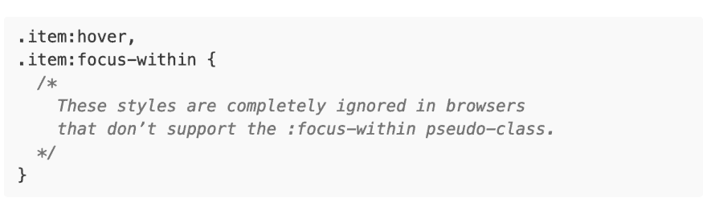
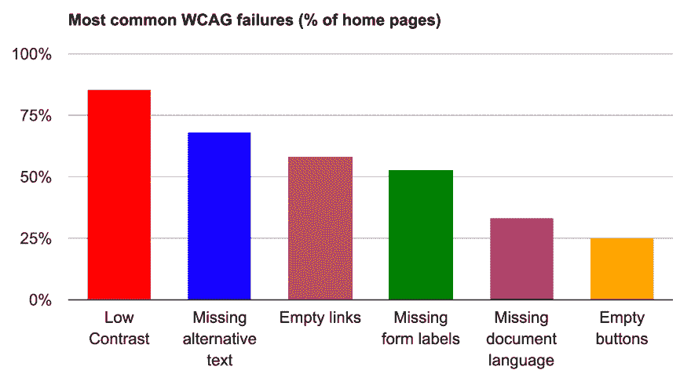

# 每周网络平台新闻#3

> 原文：<https://dev.to/simevidas/weekly-web-platform-news-3-13fg>

*这是从 2 月 28 日到 3 月 11 日发表在 [https://webplatform.news](https://webplatform.news) 上的新闻精选。*

* * *

*   [Catalin Rosu](https://mobile.twitter.com/catalinred/status/1098554446781534209) :如果浏览器不支持选择器列表中的至少一个选择器，则<mark>整体样式规则无效</mark>。因此，您可能希望避免对其他选择器不广泛支持的选择器进行分组。

    

    **注意:**CSS 选择器模块在[第 4.1 节](https://drafts.csswg.org/selectors/#grouping)中解释了该规则。

* * *

*   [Andrey Sitnik](https://mobile.twitter.com/sitnikcode/status/1100757711971590145) :如果你的网站加载了大量资源(例如，3D 可视化)，考虑基于 <mark>saveData 属性</mark>有条件地*加载它们，这表明用户想要减少他们的数据使用。*

    

    **注意:**在某些浏览器中，当用户启用“数据保护程序”或“加速”模式时,`navigator.connection.saveData`属性被设置为`true`(谷歌也为桌面浏览器提供了“数据保护程序”扩展)。

* * *

*   我们分析了大约 73 万个网站的主页。最常见的(自动)<mark>可检测的无障碍问题</mark> :

    

* * *

*   [安德烈·西特尼克](https://mobile.twitter.com/sitnikcode/status/1101868403399294976):如果你基于用户视窗宽度的变化动态地执行一项任务(例如，加载一个只支持桌面的组件)，考虑使用 <mark>matchMedia 函数</mark>而不是`'resize'`事件处理程序。

    

* * *

*   Scott O'Hara : Chrome 支持标准的 HTML <mark><对话框>元素</mark>，但不幸的是，这种实现仍然不适合创建模态对话框，因为它没有提供完全可访问的用户体验。

    > 要构建一个完全可访问的模态对话框，你最好现在忽略`<dialog>`元素，实现一个完全自定义的版本，或者问问自己是否真的需要模态。

* * *

*访问 [https://webplatform.news](https://webplatform.news) 获取最新的 web 开发新闻。*