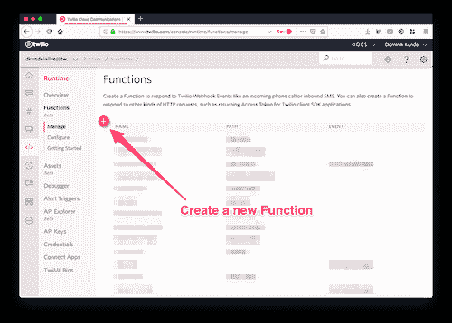
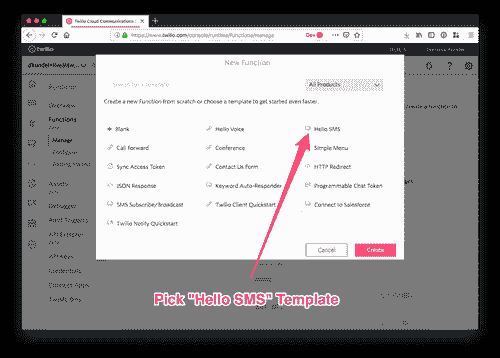
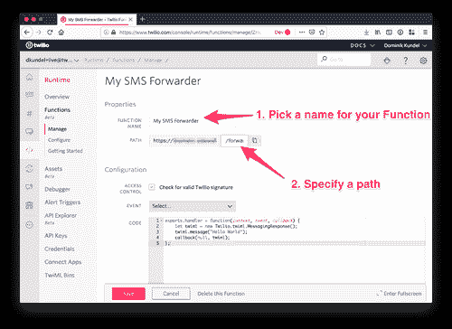
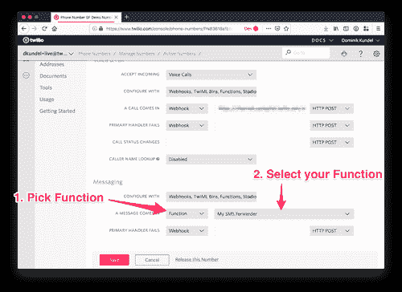
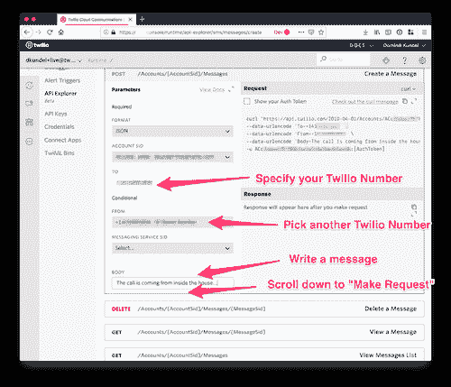
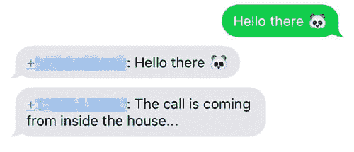
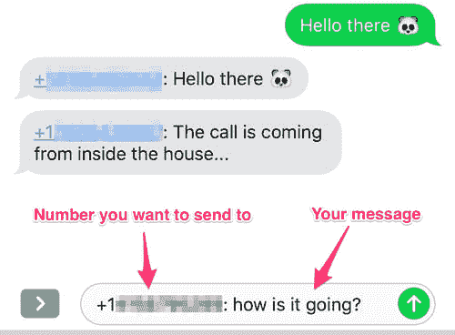
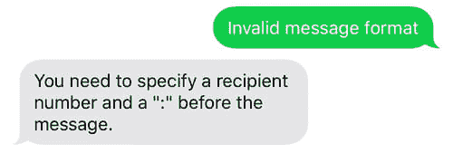

# 使用 Twilio 和 JavaScript 的短信转发和响应

> 原文：<https://dev.to/twilio/sms-forwarding-and-responding-using-twilio-and-javascript-2175>

有各种各样的原因，为什么你有时不想给别人你的电话号码，但仍然希望收到短信，并能够回复。也许你想在网上卖东西，也许你想建立一种方式让人们在活动中举报违反行为准则的行为，或者也许你只是不信任新认识的人要了你的号码。在过去，我展示了如何使用 TwiML bin 快速[设置消息转发，几乎不需要编码。但是，它不允许您使用该号码进行回复。让我们看看如何使用 Twilio 函数来改变这种情况。](https://www.twilio.com/blog/2016/11/set-up-an-sms-forwarding-number-in-5-minutes-with-twilio.html)

## 创建 Twilio 函数

在我们开始之前，请确保您有一个 Twilio 帐户。在这里免费报名:[www.twilio.com/try-twilio](http://www.twilio.com/try-twilio)

登录后，进入 [Twilio 控制台](https://www.twilio.com/console/runtime/functions/manage)运行时部分的[功能](https://www.twilio.com/console/runtime/functions/manage) [部分](https://www.twilio.com/console/runtime/functions/manage)。创建一个新的 Twilio 函数并选择“Hello SMS”模板。

[](https://res.cloudinary.com/practicaldev/image/fetch/s--oQ2A_3vl--/c_limit%2Cf_auto%2Cfl_progressive%2Cq_auto%2Cw_880/https://s3.amazonaws.com/com.twilio.prod.twilio-doimg/D7AfdHsSmoJ_FAxu1YJVET4OKtqdHe328GnRKNrURT7jB_.width-500.png)

[](https://res.cloudinary.com/practicaldev/image/fetch/s--SCAVXZiq--/c_limit%2Cf_auto%2Cfl_progressive%2Cq_auto%2Cw_880/https://s3.amazonaws.com/com.twilio.prod.twilio-doimg/oOCOOTJbt2EdvsgCH7Dmxf1JJtI-S-uANATB7PpKyU8IdM.width-500.png)

将 Twilio 函数的名称改为能提示您它做什么的名称。我将我的命名为“我的短信转发器”，并给它路径`/forward-sms`。

[](https://res.cloudinary.com/practicaldev/image/fetch/s--mGTfbJpC--/c_limit%2Cf_auto%2Cfl_progressive%2Cq_auto%2Cw_880/https://s3.amazonaws.com/com.twilio.prod.twilio-doimg/mKUKLx3oj0Nk4Mfu677oO2mkxoiHCE7hkVPVY61ep2UL9q.width-500.png)

现在我们的功能只是一个返回“Hello World”的自动应答器。为了实际转发与我们之前的博文类似的短信，请按照以下方式更新代码:

```
exports.handler = function(context, event, callback) {
    const MY_NUMBER = 'YOUR_NUMBER_HERE';

    let twiml = new Twilio.twiml.MessagingResponse();
    twiml.message({ to: MY_NUMBER }, `${event.From}: ${event.Body}`);
    callback(null, twiml);
}; 
```

确保将`YOUR_NUMBER_HERE`替换为您希望接收短信的电话号码。

在 Twilio 函数中，我们可以使用`event.`访问 webhook 数据，如`From`号或消息`Body`。新的`twiml.message`行将返回将短信转发到指定号码所需的 TwiML，其中包含发送短信的人的号码和原始消息正文。

单击“保存”按钮保存代码。前往 Twilio 控制台中的[电话号码部分，选择您想要用于短信转发的号码或购买一个新号码。](https://www.twilio.com/console/phone-numbers/incoming)

进入配置屏幕后，滚动到页面底部，在“有消息进来”下选择值“函数”，然后选择函数的名称。在我的情况下，这是“我的短信转发器”。[](https://res.cloudinary.com/practicaldev/image/fetch/s--FxOJeWjp--/c_limit%2Cf_auto%2Cfl_progressive%2Cq_auto%2Cw_880/https://s3.amazonaws.com/com.twilio.prod.twilio-doimg/j85CydNoaP664NQ3_0AkcxFApBps6nOe-iVE6IN8jYqEHQ.width-500.png)

然后点击“保存”，拿起你的手机给它发短信。您应该会看到回复，其中包含您的电话号码和您发送的信息:

[](https://res.cloudinary.com/practicaldev/image/fetch/s--mxjubBc7--/c_limit%2Cf_auto%2Cfl_progressive%2Cq_auto%2Cw_880/https://s3.amazonaws.com/com.twilio.prod.twilio-doimg/ewrJdtyy9UnwlQZZKGv4FSnvH6AgYkQMYXicdNs6bk1AxK.width-500.png)

如果你想看看它是否正常工作，请朋友或同事发短信给你的 Twilio 号码，你应该会看到他们的消息。或者，获取第二个 Twilio 号码，并使用 [API Explorer 的“消息创建”功能](https://www.twilio.com/console/runtime/api-explorer/sms/messages/create)向您的转发号码发送短信。

[ ](https://res.cloudinary.com/practicaldev/image/fetch/s--l3PC6gdS--/c_limit%2Cf_auto%2Cfl_progressive%2Cq_auto%2Cw_880/https://s3.amazonaws.com/com.twilio.prod.twilio-doimg/pjn4dO8oHpKWbKIeLhnTPv93_YyDhZR0tK8j8UnRbrCRy6.width-500.png) [ ](https://res.cloudinary.com/practicaldev/image/fetch/s--DCaPrlki--/c_limit%2Cf_auto%2Cfl_progressive%2Cq_auto%2Cw_880/https://s3.amazonaws.com/com.twilio.prod.twilio-doimg/8V8C4I-MryInn4P5OJ-zOg7rRSRJIEmlnnlMiXj99Hbf-y.width-500.png)

### 回复消息

既然我们已经解决了消息转发，那么我们如何回复这些消息呢？如果你想用你的真实号码回复，那很简单，从短信上复制号码，然后用你的手机写下来。如果你想继续使用你的屏蔽号码，那就没那么容易了。

现在，如果你回复任何短信，它将触发相同的短信网络钩子，基本上只是回显给你。我们将通过添加以下逻辑来修改此行为:

检查消息是否来自我们自己的号码:

*   来自其他人->像我们之前一样转发短信
*   消息来自我们->解析消息以接收预期收件人并转发消息

为了找出预期的接收者，我们将建立一个我们所有的回应都必须遵循的特定模式。这与我们目前转发邮件的方式相同:

`RECIPIENT_NUMBER: MESSAGE_BODY`。

更新您的 Twilio 函数代码以应用此逻辑:

```
exports.handler = function(context, event, callback) {
    const MY_NUMBER = 'YOUR_NUMBER_HERE';

    let twiml = new Twilio.twiml.MessagingResponse();
    if (event.From === MY_NUMBER) {
        const separatorPosition = event.Body.indexOf(':');
        if (separatorPosition < 1) {
            twiml.message('You need to specify a recipient number and a ":" before the message.');
        } else {
            const recipientNumber = event.Body.substr(0, separatorPosition).trim();
            const messageBody = event.Body.substr(separatorPosition + 1).trim();
            twiml.message({ to: recipientNumber }, messageBody);
        }
    } else {
        twiml.message({ to: MY_NUMBER }, `${event.From}: ${event.Body}`);    
    }
    callback(null, twiml);
}; 
```

单击 save 并等待，直到部署了更新的功能(将出现一个绿色框，表示部署成功)。

拿起你的手机，试着给朋友或你的另一个 Twilio 号码发短信。SMS 必须采用`+RECEIPIENT_NUMBER: message`的格式。

[](https://res.cloudinary.com/practicaldev/image/fetch/s--FBQYRhkl--/c_limit%2Cf_auto%2Cfl_progressive%2Cq_auto%2Cw_880/https://s3.amazonaws.com/com.twilio.prod.twilio-doimg/avrBABDY2vzPM-vXHPyJ-PwiYxoHrrC9xvFg_M5JMQC2r1.width-500.png)

其他人应该只会收到您发送的文本。如果您将它发送到另一个 Twilio 号码，请使用[查看您的消息日志](https://www.twilio.com/console/sms/logs)。

您也可以尝试发送不符合格式的文本，您应该会收到邮件格式不正确的回复。

[](https://res.cloudinary.com/practicaldev/image/fetch/s--65_P-WMP--/c_limit%2Cf_auto%2Cfl_progressive%2Cq_auto%2Cw_880/https://s3.amazonaws.com/com.twilio.prod.twilio-doimg/Bls-Ek3S-PMS1FascYyTe3xRuCN1nxAQBPOm8C5bTSBg2S.width-500.png)

### 恭喜恭喜！

就是这样。您已经设置了一个短信转发号码，当您不想给出自己的普通电话号码时，可以随时使用该号码。但这真的只是开始。通过 [Twilio 函数](https://www.twilio.com/functions)，您可以访问 npm 生态系统。所以，为什么不挂一个[谷歌电子表格](https://www.twilio.com/blog/2017/03/google-spreadsheets-and-javascriptnode-js.html)或者你喜欢的联系人主机的 API 来查找名字，而不是写下电话号码来回复呢。或者创建一个被阻止的电话号码列表。或者你有一个完全不同的想法，我很想听听你的想法。

请随时联系我:

*   电子邮件:[dkundel@twilio.com](//mailto:dkundel@twilio.com)
*   推特: [@dkundel](https://twitter.com/dkundel?lang=en)
*   GitHub: [dkundel](https://github.com/dkundel)
*   网页:[dkundel.com](https://dkundel.com/)