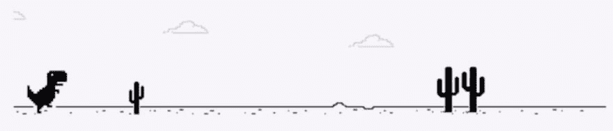
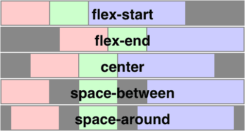
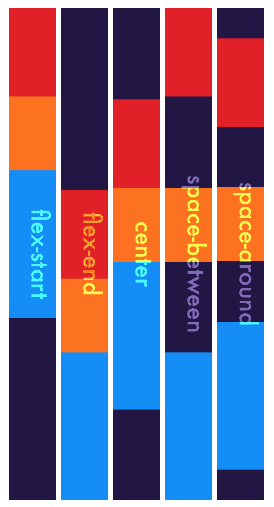
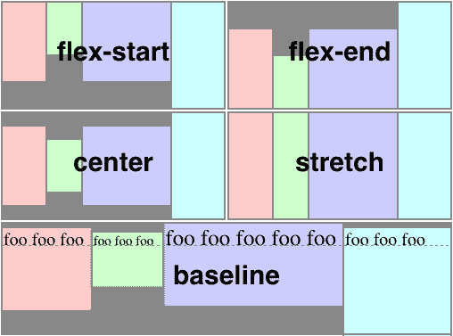
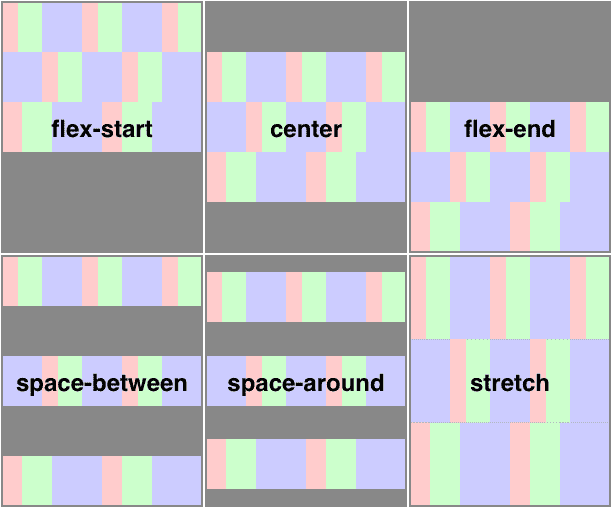
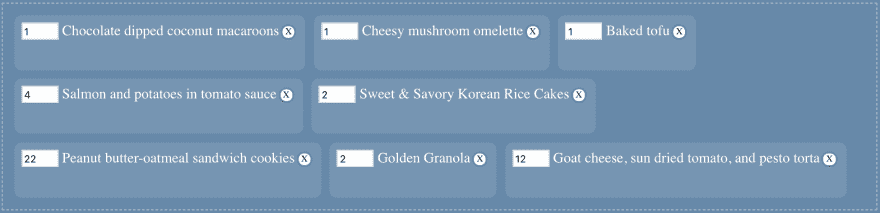
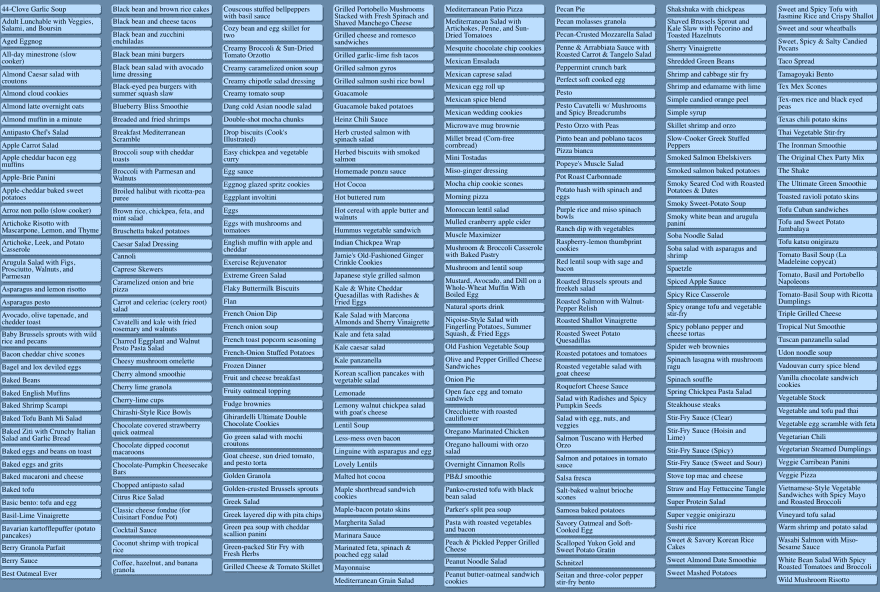
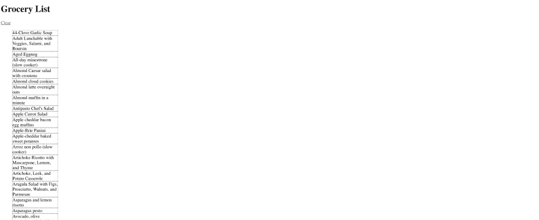

# 你也垃圾邮件 Flex Box 吗？

> 原文：<https://dev.to/wgao19/do-you-spam-flex-box-also-b24>

这是*不是*一篇关于如何使用 flex box 的帖子。为此，你可能会对以下帖子(应用程序)感兴趣:

*   [Flexbox Froggy](https://flexboxfroggy.com/)
*   [Flexbox 完整指南](https://css-tricks.com/snippets/css/a-guide-to-flexbox/)

我已经无情地使用 flex box 快两年了。我猜分享来自[这篇惊人的帖子](https://hackernoon.com/11-things-i-learned-reading-the-flexbox-spec-5f0c799c776b)的类似动机，对于每个 flex 拳击手来说，只有一天像“今天就是这一天”。

当我阅读规范时，我现在特别喜欢做的是，我想深入研究早期版本，试图回答这些问题:它的目的是什么(我是否在正确的情况下使用它)？它*不是*的目的是什么(我是不是用错了)？

## flex box 是干什么用的？

Flex box 是一个布局模块。到 flex box 布局模块诞生时，已经有了以下布局模块:

*   块布局，设计用于布局文档
*   嵌入式布局，设计用于布局文本
*   表格布局，设计用于以表格格式布置 2D 数据
*   定位布局，为非常明确的定位而设计，不太考虑文档中的其他元素

在 flex box 规范的编辑之一 Tab Atkins 的早期文章中，他写道:

> flexbox 布局的定义方面是灵活性——Flexbox 子组件可以变得**灵活**，这意味着它们将一起工作来分配可用空间，根据需要拉伸或收缩它们的宽度和高度，以完全填充 Flexbox。

我认为这是描述 flexbox 功能的最好的一句话。我不知道他们为什么不把这一行写进说明书。但这是一个很好的想法。

现在，对我来说，flex box 究竟是如何让项目一起工作来创建 flex 布局的，仍然是一个陌生的领域。所以我想我会想了解更多。

## 伸缩框偏向指定的主轴

在 flex box 之前，我们都有一个粗略的感觉，垂直和水平空间的操作有点不同。Like `margin: auto`给出水平居中的项目，但不做任何垂直的事情。用规范的话来说:

> 与块和内联布局不同，块和内联布局的布局计算偏向于[块和内联流动方向](https://www.w3.org/TR/css3-writing-modes/#abstract-box)，灵活布局偏向于**灵活方向。**

当 flex 方向是默认的`row`时，如果你没有给容器设置一个确定的宽度，它会给你这个理论上可以永远继续下去的 T-Rex 轨迹(？).垂直方向成为横轴。通常情况下，*将内容*沿主轴对齐，*将项目*沿横轴对齐。

[](https://res.cloudinary.com/practicaldev/image/fetch/s--avdG3jIH--/c_limit%2Cf_auto%2Cfl_progressive%2Cq_auto%2Cw_880/https://d2mxuefqeaa7sj.cloudfront.net/s_7FC7454BD521E52E89C9AB7899682ED5AF3E74159AC1909BB1DF8BD8579F27BA_1553012151533_image.png)

另一方面，如果你的主轴是垂直的，你只要把你的头转 90 度，你就会得到一个类似的行为，我相信我们都知道这一点。

有了这种主轴和横轴的思维定势，我想说 **flex box 比任何其他维度的**都更一维。是的，你*可以*嵌套伸缩框来创建二维布局。但是每个单独的柔性盒恰好有一个主轴。它非常像数轴。您可以结合两个(或多个)数轴来建立座标系统。但是每个数轴都向自己的方向延伸。

而`align-content`允许跨换行对齐，某些计算和对齐是在 flex 项目和 flex 容器之间协调完成的。它们就像小小的花苞，只比一维多一点点。

## 伸缩项协同工作来分配空间

flex box 之前的布局模块不允许项目相对于其对等项调整其宽度和高度，也不允许分配剩余空间。借助 flex box，我们可以:

**在主轴上对齐内容**

[](https://res.cloudinary.com/practicaldev/image/fetch/s--xn86Gs4v--/c_limit%2Cf_auto%2Cfl_progressive%2Cq_auto%2Cw_880/https://d2mxuefqeaa7sj.cloudfront.net/s_7FC7454BD521E52E89C9AB7899682ED5AF3E74159AC1909BB1DF8BD8579F27BA_1552929490264_image.png)

我意识到规范提供的例子偏向于默认的伸缩方向。所以我继续实现上面的可视化，将`flex-direction`设置为`column`。我希望生活就像简单地说`flex-direction: column`一样简单。结果我可能只是捅了捅蜂窝，一大堆更多的规格溢出来给我看🤓这很有趣，你也应该这样做。

[](https://res.cloudinary.com/practicaldev/image/fetch/s--NllRL0Sh--/c_limit%2Cf_auto%2Cfl_progressive%2Cq_auto%2Cw_880/https://d2mxuefqeaa7sj.cloudfront.net/s_7FC7454BD521E52E89C9AB7899682ED5AF3E74159AC1909BB1DF8BD8579F27BA_1553015145680_image.png)

[https://codepen.io/wgao19/embed/OqoyJd?height=600&default-tab=result&embed-version=2](https://codepen.io/wgao19/embed/OqoyJd?height=600&default-tab=result&embed-version=2)

**在横轴上对齐项目**

柔性盒项目的灵活性也适用于横轴。这些项目将查看它们的同类有多高或多宽，并可能根据对齐方案收缩或拉伸。

对于盒子模型，[我上周遇到的问题](https://dev.to/wgao19/content-width-determination-with-the-box-model-5mb)，项目也伸展到相同的宽度。我想指出的是，的*是基于容器宽度的，而容器宽度又是从其子容器的内容宽度中推导出来的。Flex box 项目从其他 Flex 项目的尺寸、flex 容器的可用空间和对齐方案的组合因素中获得额外的灵活性。*

[](https://res.cloudinary.com/practicaldev/image/fetch/s--cBL4nm4R--/c_limit%2Cf_auto%2Cfl_progressive%2Cq_auto%2Cw_880/https://d2mxuefqeaa7sj.cloudfront.net/s_7FC7454BD521E52E89C9AB7899682ED5AF3E74159AC1909BB1DF8BD8579F27BA_1552929510935_image.png)

**当 flex 项目换行到多行时分配空间**

当您包装 flex 项目并因此获得多行 flex 布局时，这些行也可以分配可用空间。这个，其实感觉，挺没用的(？)酷👹

[](https://res.cloudinary.com/practicaldev/image/fetch/s--Faf46XPE--/c_limit%2Cf_auto%2Cfl_progressive%2Cq_auto%2Cw_880/https://d2mxuefqeaa7sj.cloudfront.net/s_7FC7454BD521E52E89C9AB7899682ED5AF3E74159AC1909BB1DF8BD8579F27BA_1552928926030_image.png)

## 更强大的自动边距用于居中对齐

据我所知，这不是 flex box 的直接设计意图，而是一个方便的结果，您可以使用 flex box 进行水平*和垂直*对齐。也许如此方便，以至于在说明书中很少有[地方](https://www.w3.org/TR/css-flexbox-1/#auto-margins)提到这一点，甚至在摘要中:

> 可以容易地操纵孩子的水平和垂直对齐。

我一直认为我滥用 flex-box 只是为了垂直对齐。现在我知道这不是一个黑客或任何东西，这是一个功能！

虽然，你知道不是:

```
.parent {
  diaplay: flex;
  align-items: center;
  justify-content: center;
} 
```

你其实可以:

```
.parent {
  display: flex;
}
.child {
  margin: auto;
} 
```

[https://codepen.io/wgao19/embed/gEKymm?height=600&default-tab=result&embed-version=2](https://codepen.io/wgao19/embed/gEKymm?height=600&default-tab=result&embed-version=2)

## 弹性算法

[规范的第 9 节，柔性布局算法](https://www.w3.org/TR/css-flexbox-1/#layout-algorithm)是规范性的。这意味着阅读需要额外的检查。但我想一个好主意是先阅读标题，在这种情况下，标题相当具有陈述性:

9.1。初始设置
9.2**。生产线长度确定**确定可用的主空间+交叉空间，准备假设的项目尺寸、弹性基础尺寸

9.3。主尺寸确定确定项目沿主轴的尺寸。这是参考可用空间和伸缩因子的步骤，并且循环直到所有项目的长度被排序
9.4。确定十字尺寸提议然后确定十字尺寸，确定每条弯曲线的尺寸(如果适用)，处理弯曲线上的拉伸，处理可见性折叠情况(再次查看一次)，最后确定每个项目的十字尺寸

👆和👇是灵活性的魔法。

9.5。主轴线对齐
9.6**。横轴对齐**

这些标题被进一步分解成更小的步骤，你可以耐心地一个接一个地看。更复杂的步骤，即主要尺寸的确定，将在第 9.7 节中单独讨论。虽然即使你没有阅读所有的细节，你也已经对这个过程有了一个大致的了解。

## Flex box 不是万能的😭

所以我继续寻找用 flex box 实现的页面。我有一个很好的候选人，至少我是这么认为的。在阿特金的网站(他的公开简介上的 xanthir.com 网址坏了，你需要前面的 www)的[标签上有一个名为](https://www.xanthir.com)[食谱](https://www.xanthir.com/recipes/)的页面，在这个页面下有一个[食谱规划器](https://www.xanthir.com/recipes/grocery-list.php)，让你从大约三百个食谱中挑选，并根据配料生成购物清单。您可以将它们拖到页面顶部的对话框中，组成一个购物清单。Tab Atkins 的名字位于编辑列表的首位，所以我天真地以为我会在这里看到一些 flex box。

### 我应该伸缩框吗

我的意思是，如今我们都太习惯于浏览器默认设置为 div(感谢[惠晶](https://www.chenhuijing.com/)指出这一点，在我有机会犯错误之前就把我从错误中引导出来)。每当我看到一个横向布局的设计，我都会加入一个`display: flex`。

我现在称之为“垃圾邮件 flex box”🙈你垃圾邮件 flex box 也🇸🇬？

[](https://res.cloudinary.com/practicaldev/image/fetch/s--WscUGeNi--/c_limit%2Cf_auto%2Cfl_progressive%2Cq_auto%2Cw_880/https://d2mxuefqeaa7sj.cloudfront.net/s_7FC7454BD521E52E89C9AB7899682ED5AF3E74159AC1909BB1DF8BD8579F27BA_1552926553170_image.png)

这个顶部包含一系列您选择的配料的盒子。我检查了这个相当不错的 flex box 布局的候选，唉，不，没有 flex box🤔。它们只是内嵌的盒子。它们分成几行，每行中的项目不对齐([可视格式化模型:内联格式化上下文](https://www.w3.org/TR/CSS2/visuren.html#inline-formatting))。不需要柔性盒。

### 我能伸缩盒子吗

在页面的下半部分是包含数百个食谱的主要部分。

考虑到我正在寻找 flex box，而且我已经阅读了整个规范！我想至少我可以用 flex box 做到这一点。我还发现了这个部分的其他一些特性:

*   这些项目从上到下，然后从左到右列出
*   每个项目都有一个固定的宽度，或者说“列”，放大或缩小视窗不会改变宽度
*   但是，它会增加或减少列数，项目会自动重排，同时保持列大致在同一水平结束

这看起来像是 flex box 的公平候选吗？

[](https://res.cloudinary.com/practicaldev/image/fetch/s--6DRu_g7u--/c_limit%2Cf_auto%2Cfl_progressive%2Cq_auto%2Cw_880/https://d2mxuefqeaa7sj.cloudfront.net/s_7FC7454BD521E52E89C9AB7899682ED5AF3E74159AC1909BB1DF8BD8579F27BA_1552927343539_image.png)

所以我继续[将 html 转储到 CodePen](https://codepen.io/wgao19/pen/OqEeqX) 中并开始使用它，首先给列表项
添加一个固定的宽度

```
li {
  width: 160px;
} 
```

显然应该有一些 flex box 魔法

```
ul {
  display: flex;
  flex-direction: column;
  flex-wrap: wrap;
  align-content: space-between;
} 
```

…我已经开始讨厌打字了。如果你很好奇，下面是它现在的样子。请注意，我的 flex 容器现在的主轴垂直延伸到无穷大。

[](https://res.cloudinary.com/practicaldev/image/fetch/s--2Qo_RdNB--/c_limit%2Cf_auto%2Cfl_progressive%2Cq_auto%2Cw_880/https://d2mxuefqeaa7sj.cloudfront.net/s_7FC7454BD521E52E89C9AB7899682ED5AF3E74159AC1909BB1DF8BD8579F27BA_1552928475151_image.png)

然后我就卡住了。我希望我的 flex 项目能够换行，这意味着我需要一个明确的主轴长度。但是我怎么知道它应该有多长呢？

[https://codepen.io/wgao19/embed/OqEeqX?height=600&default-tab=result&embed-version=2](https://codepen.io/wgao19/embed/OqEeqX?height=600&default-tab=result&embed-version=2)

我的理解是，这种具有上述特征的布局是 flex box 无法实现的。

用我们的数字系统来类比这个问题。您可以在容器上设置明确的约束，就像[位值数字系统](https://en.wikipedia.org/wiki/Positional_notation)中的基数一样。每当没有足够的空间时，flex 项目就会换行，就像我们如何在数字系统中敲击数字 9 → 10，或者 13:00 如何变成 1pm。您也可以不设置约束，在这种情况下，您只需将项目堆叠在一行中。但是你不能，比如说，看你的项目扩展了多少，然后决定一个约束。

布局是用`column-width`完成的，这个属性在 [CSS 编写模式模块第 4 级](https://www.w3.org/TR/css-writing-modes-4/#auto-multicol)中有描述，但是可能在 [CSS 多列布局模块第 1 级](https://www.w3.org/TR/css-multicol-1)中有定义。我想我会在以后的文章中探讨这个问题。

关于 flex box，我还想写几个主题:

1.  分割 Flex 布局
2.  关于灵活的长度确定和对齐的一些微调理解，例如
    *   弹性基础
    *   自动边距和对齐项目之间的项目居中差异:居中

直到下次:]

# 链接

*   [CSS 灵活框布局模块一级](https://www.w3.org/TR/css-flexbox-1/)
*   [我在阅读 flexbox 规范时学到的 11 件事](https://hackernoon.com/11-things-i-learned-reading-the-flexbox-spec-5f0c799c776b)
*   [Flexbox Froggy](https://flexboxfroggy.com/)
*   [Flexbox 完整指南](https://css-tricks.com/snippets/css/a-guide-to-flexbox/)