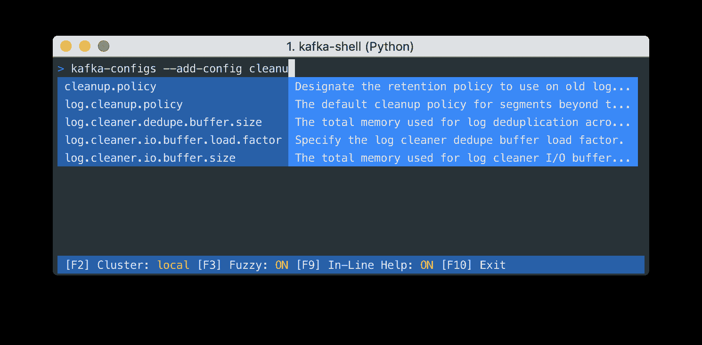
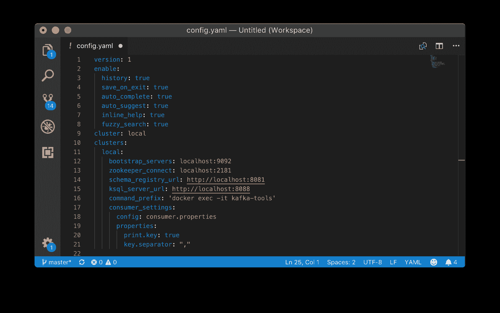
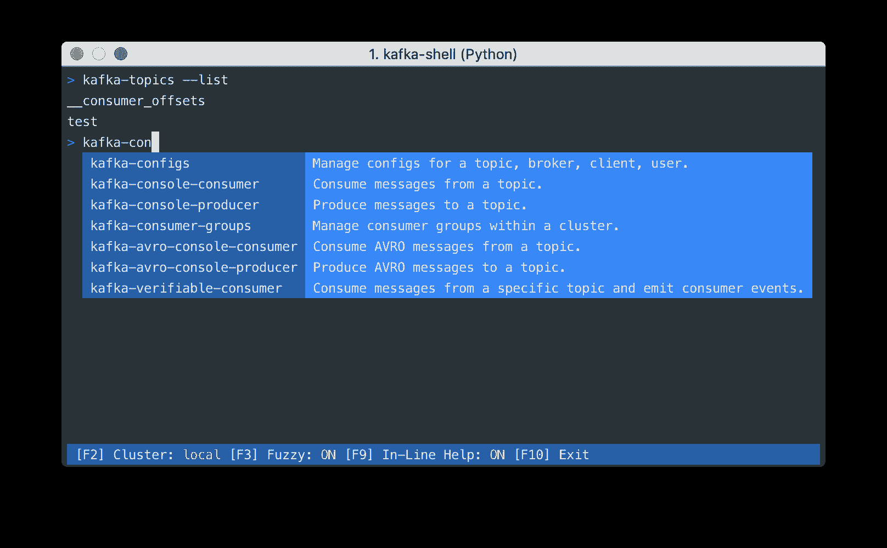

# Kafka Shell -增强您的 Apache Kafka CLI

> 原文：<https://dev.to/devshawn/kafka-shell---supercharge-your-apache-kafka-cli-2keg>

# 卡夫卡的外壳

你正在使用 Apache Kafka 命令行工具吗？有没有在记住可用的选项或记住集群的 URL 方面遇到过困难？卡夫卡壳来救场了！

[Kafka Shell](https://github.com/devshawn/kafka-shell) 是一款超级交互式 Kafka Shell，构建在现有 Kafka 命令行工具之上。它的特点是自动完成，自动历史建议，键盘命令等等。这是我刚刚发布的一个开源项目，用 Python 构建的。

## 特性

Kafka 命令、选项和配置选项的自动完成。

[](https://camo.githubusercontent.com/33e27a2cab87d8e8eddeb1ba10e6cc2f75ec980f/68747470733a2f2f692e696d6775722e636f6d2f666b777a4f6b762e706e67)

将自动添加到正在运行的命令中的群集、模式注册表和属性的配置。

[](https://camo.githubusercontent.com/5202bd45b24b607602fd10a7c80e0a8ebec13336/68747470733a2f2f692e696d6775722e636f6d2f334a6a4978794c2e706e67)

## 支持的命令

Kafka shell 目前支持很多最流行的 Kafka 命令行工具，比如 Kafka-topics、kafka-console-consumer 等等。我计划在得到一些初步反馈后再添加其余的！

*   `kafka-topics`
*   `kafka-configs`
*   `kafka-console-consumer`
*   `kafka-console-producer`
*   `kafka-avro-console-consumer`
*   `kafka-avro-console-producer`
*   `kafka-verifiable-consumer`
*   `kafka-verifiable-producer`
*   `kafka-broker-api-versions`
*   `kafka-consumer-groups`
*   `kafka-delete-records`
*   `kafka-log-dirs`
*   `kafka-dump-log`
*   `kafka-acls`
*   `ksql`

## 立即获取

让我知道你的想法——我希望这有助于改进与 Apache Kafka 的合作。:)

##  [德夫肖恩](https://github.com/devshawn) / [卡夫卡-谢尔](https://github.com/devshawn/kafka-shell)

### ⚡A 增压，交互式 Kafka 外壳建立在现有的 Kafka CLI 工具之上。

<article class="markdown-body entry-content container-lg" itemprop="text">

# 卡夫卡-贝壳

[](https://travis-ci.org/devshawn/kafka-shell)[](https://codecov.io/gh/devshawn/kafka-shell)[](https://camo.githubusercontent.com/a08678832e8bdc86f42cb7178074f2cadbf449e4/68747470733a2f2f696d672e736869656c64732e696f2f707970692f762f6b61666b612d7368656c6c2e7376673f636f6c6f723d626c7565)[](https://camo.githubusercontent.com/80ae9845243ba290d74b433e5afa7554d1000347/68747470733a2f2f696d672e736869656c64732e696f2f707970692f707976657273696f6e732f6b61666b612d7368656c6c2e737667)[](https://raw.githubusercontent.com/devshawn/kafka-shell/master/LICENSE)

基于现有 Kafka CLI 工具构建的超级交互式 Kafka shell。

[](https://camo.githubusercontent.com/93262b8faa2313ffb7dfeccb60662b23c2b0b5f6/68747470733a2f2f692e696d6775722e636f6d2f62316f4e545a5a2e706e67)

Kafka shell 允许您配置一个集群列表，当运行该命令时，会自动添加当前所选集群的属性，如`--bootstrap-server`和`--zookeeper`。不再需要记住长的服务器地址或端口！

## 装置

卡夫卡外壳需要`python`和`pip`。Kafka shell 是现有 Kafka 命令行工具的包装器，因此这些工具必须存在于您的`PATH`中。

您可以使用 pip 安装 kafka-shell:

```
pip install kafka-shell
```

## 使用

卡夫卡外壳是一个交互式外壳。您可以通过以下方式从终端运行它:

```
kafka-shell
```

从这里，您可以开始输入`kafka`,自动补全将开始生效。

**键盘命令**

*   **改变集群**:可以通过按`F2`循环选择运行的集群命令。
*   **模糊搜索**:默认情况下，命令的模糊搜索被启用…

</article>

[View on GitHub](https://github.com/devshawn/kafka-shell)