# forestore 数据库结构和安全性:

> 原文：<https://dev.to/andersjr1984/firestore-database-structure-and-security-3gdb>

这是一个关于我如何在 Firebase 的 Firestore 中构建我的 NoSQL 数据库的快速解释，这种方式允许我保护我的用户的数据，并且不允许用户在一个简单的摄影商业网站中更改某些数据。我是一个程序员新手，所以 Firebase 的 Firestore 对我来说是一个很好的解决方案，因为它简单，文档和 YouTube 教程质量很高。说到 YouTube 教程，这仅仅是托德·克佩尔曼先生在 YouTube 系列[了解云 Firestore](https://www.youtube.com/watch?v=v_hR4K4auoQ&list=PLl-K7zZEsYLluG5MCVEzXAQ7ACZBCuZgZ) 中讨论的表面内容。如果你想了解一个已经编程三个月的人如何利用视频来保护他们的数据库，请继续阅读！如果你想要一个详细的讨论，观看视频，因为他们摇滚。

如果你想看安全规则的实施，请访问[绿猫头鹰摄影](https://green-owl-photography.firebaseapp.com/)。
想给我工作的人，请访问我的[作品集](https://andersjr1984.github.io/portfolio/)。

*   数据结构
*   Firebase 安全规则和测试(超级棒的东西！)

#### 数据结构:

1.  Firestore 允许您在根级别存储一个集合，然后在每个子级别存储文档。文档可以存储对象或集合。这意味着数据库中的每个奇数节点是一个集合，每个偶数节点是一个文档。这让你困惑吗？如果是这样，让我向您展示一个简单的 get 请求，它从用户的集合中提取数据，然后检查 orderData 子集合。
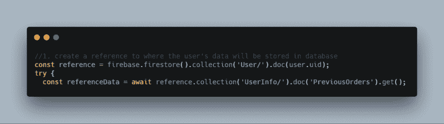
3.  在您第一次在 my site 上进行身份验证后，会在您的特定用户 ID 下创建一个由 Firebase Auth 系统生成的文档。我将继续向您展示匿名用户第一次登录时会创建什么。购物车中的商品设置在“images”文档中，而您的“userInfo”设置为先前订单和默认地址的空对象。
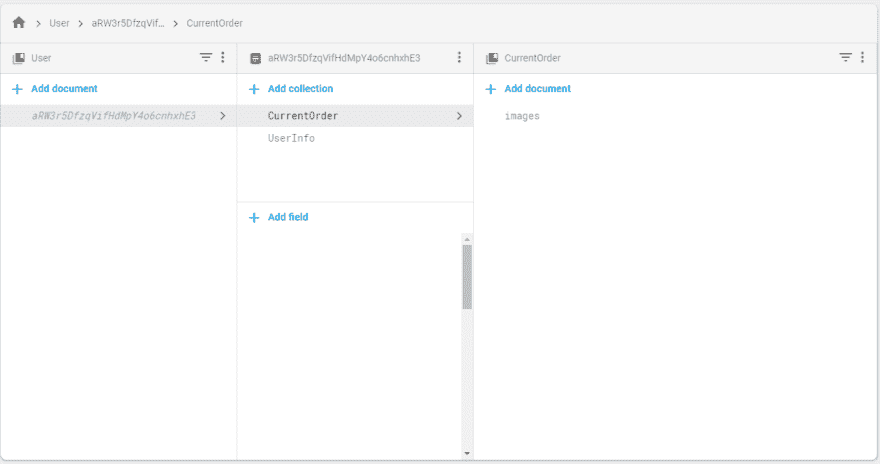
5.  当您浏览我的网站时，您将添加图片，输入送货地址(如果您正在跟进，请随意输入一个假的送货地址，让我发笑)，并创建一个订单。这只是一个投资组合项目，所以它不创建订单，它只是创建一个随机的 5 位订单 ID 来模拟使用 Pwinty API 创建订单。所有这些数据都存储在 CurrentOrder 子集合中。这里创建了几个文档，比如 images(也称为 cart)、shipmentInfo(也称为 shipment information)和 orderData(也称为我存储来自 Firebase 函数或 API 调用的任何返回的地方，比如 pwintyId)。请记住，orderData 只存储在 Firebase 函数中，当我谈到安全规则时，记住这些信息非常重要。以下是完成后数据结构的外观:
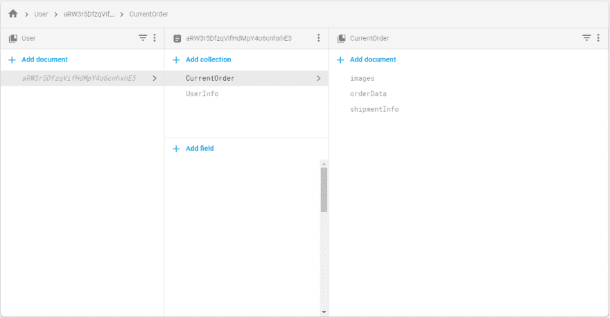
7.  一旦您“承诺付款”，订单的相关数据将通过 Firebase 函数发送到上一个订单的页面，Firebase 函数将重置当前订单信息，包括删除数据库的 shipmentInfo 和 images 部分。5 位数的订单 ID 用作此文档对象的关键字。在我完成一个订单后，我会让你看一下以前订单的数据库数据:
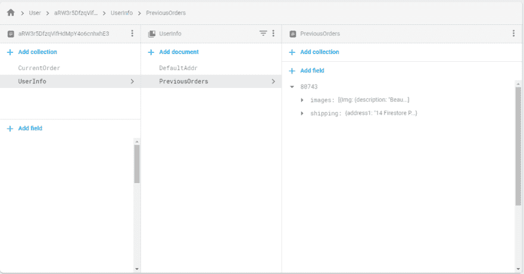
9.  我的应用程序有一个以前订单的侦听器，它会在数据库中用户以前订单的任何更新时更新应用程序帐户页面的状态。以下是完成订单示例后的代码和帐户页面:
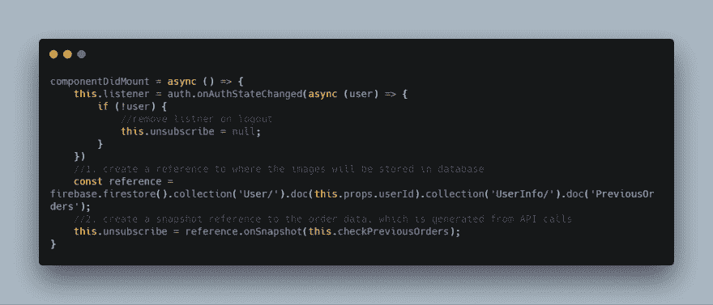
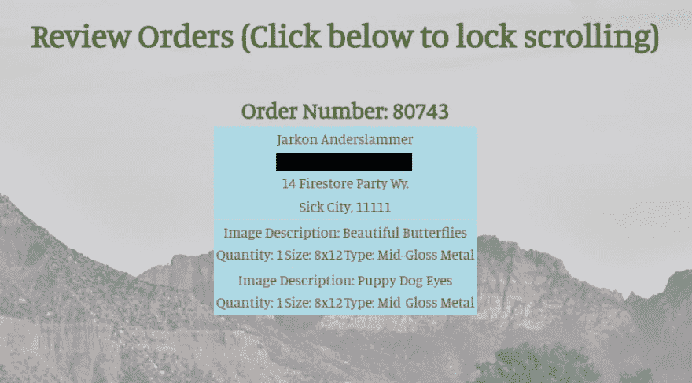
12.  我希望这向你展示了我是如何组织数据的。我现在将深入研究如何保护这些数据！

#### 安全规则和规则测试:

1.  安全规则比我在这里介绍的要健壮得多。正如我前面提到的，Firestore 安全规则视频非常棒，是任何 Firebase 开发人员的必看视频。
2.  我将首先向您展示我所有的安全规则，然后我将讨论每个具体的规则。
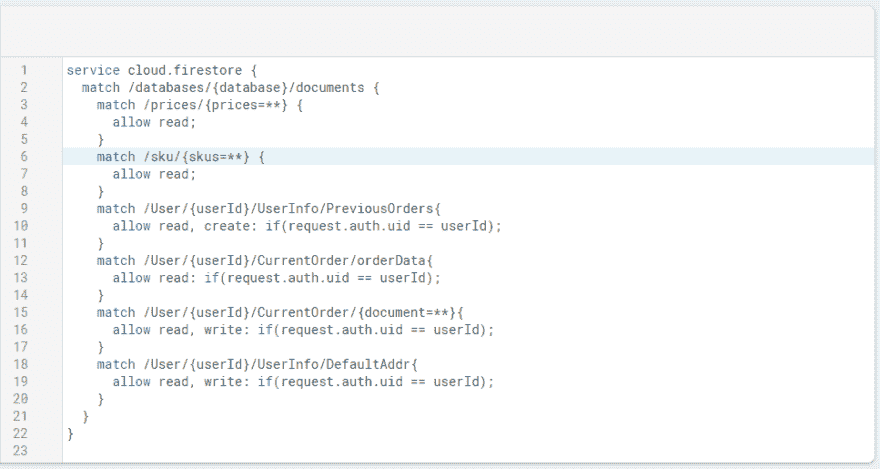
4.  让我们从顶部开始，讨论价格和 SKU。创建任何订单都需要价格数据和 sku 数据，因此我们需要能够在用户登录之前读取这些信息。这些数据是通过 Firebase 函数更新的，所以我们不想让客户端进行任何写入或更新。这就是为什么我们只允许读取。为了确保我们不能更新价格，让我们进入模拟器，看看当我们模拟价格更新时会发生什么。我们得到一个友好的“模拟写被拒绝”的消息。我们还想确保可以运行 get 命令，所以让我们来测试一下！
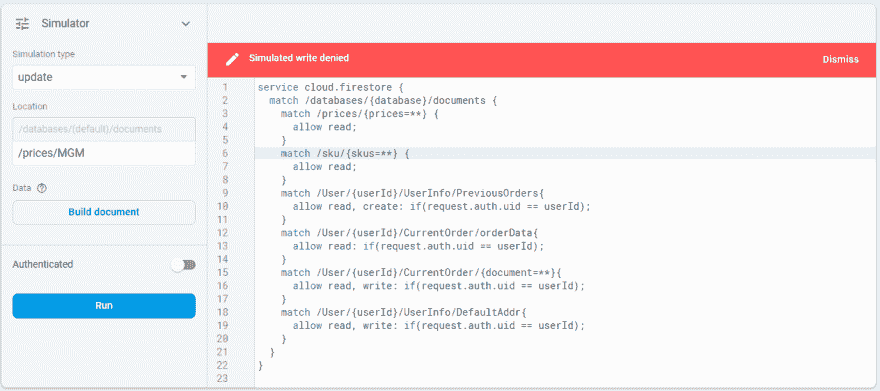
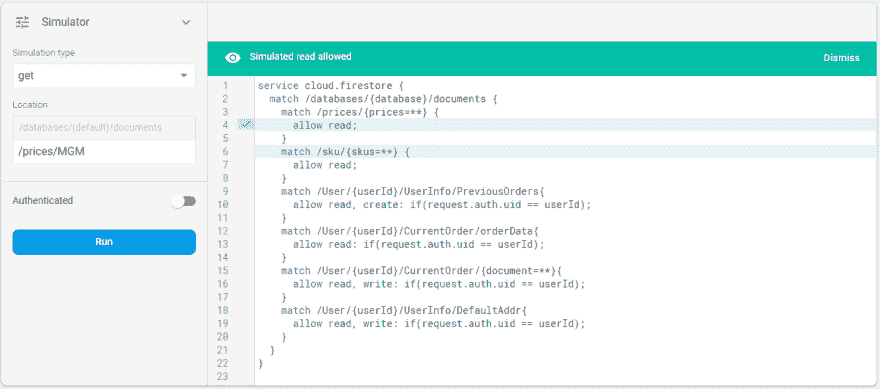
7.  让我们回想一下我们之前讨论的 PreviousOrders 文档。一旦用户在我们的网站上通过身份验证，我们就为他们的帐户创建一个空白的先前订单对象。正如您在规则中看到的，我们允许读取和创建，但是所有的更新都是通过 Firebase 函数完成的。该网站的未来版本可能会将此移动到 Firebase 函数，我们不想给客户任何余地来创建一个用欺诈性的以前订单填充的 PreviousOrders 对象，但我想在这篇文章中保留它。我已经将模拟的 userId 装箱，我也将它输入到 userId authenticate 部分。
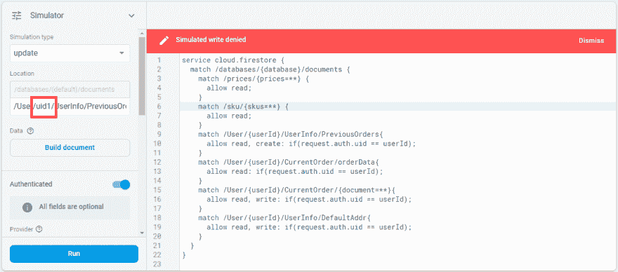
9.  现在让我们看看当前订单/订单数据。正如我前面提到的，orderData 是我们从 Firebase 函数 API 调用中收到的信息，比如 Pwinty Order Id。我们不希望客户端除了读取这些数据之外还能做任何事情。但是，如果查看第五条规则，它允许对 CurrentOrder 集合中的任何文档进行任何读写操作。如果我们尝试更新 orderData，您认为会发生什么情况？让我们运行一个快速更新测试来看看。

11.  哦不！允许用户更新 orderData 信息。我们如何解决这个问题？通过禁止对 orderData 的任何写入。让我们在调整规则后再看一遍。我添加了第 14 行以禁止任何写操作，并更新了第 16 行的通配符和第 17 行的布尔语句，以确保 orderData 不是更新的文档。其他订单数据，如 shipmentInfo 和图像，仍然可以在客户端应用程序中创建和更新。这仍然允许客户端读取 orderData。
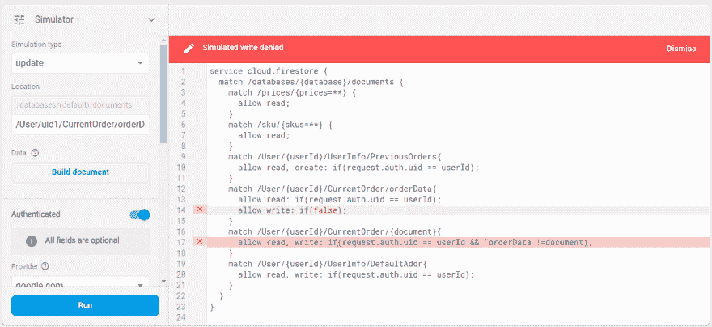
13.  我们删除了第 16 行中的通配符，但是我们希望确保 shipmentInfo 和 Images 可以被创建和更新。让我们做个测试来确定。哇哦！它工作了。
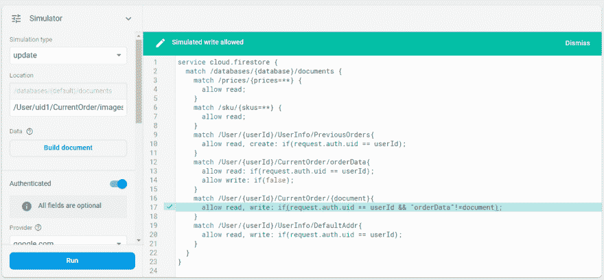
15.  让我们看看默认地址，以确保用户可以读取、创建和更新他们的默认地址。
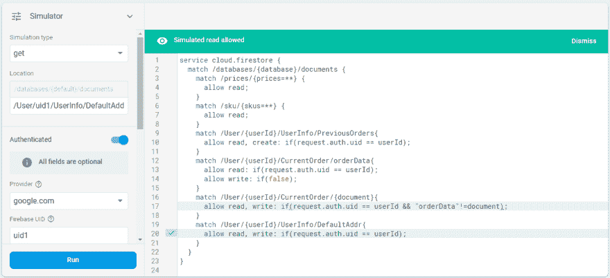
17.  现在我们要确保 mal1 不能访问 uid1 的 sweet 数据，让我们在模拟器中使用通配符！
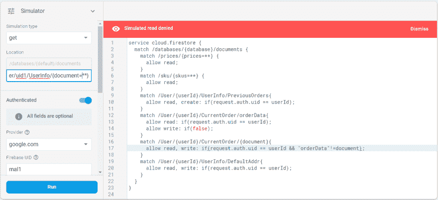
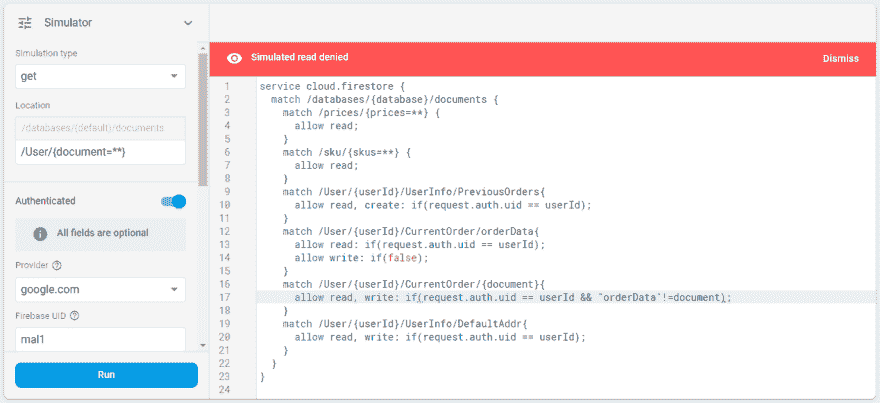

这就是我为我的应用程序创建的简单安全规则。谢谢你的来访！