# dev.to Repo 回顾过去三周的情况

> 原文：<https://dev.to/devteam/devto-repo-recap-from-the-past-three-weeks-27m1>

欢迎回到另一个回购回顾，在这里我们(通常)涵盖上周对 [dev.to 库](https://github.com/thepracticaldev/dev.to)和[iOS 回购](https://github.com/thepracticaldev/dev-ios)的贡献。这一期涵盖 2 月 24 日至 3 月 15 日。

有些人可能想知道为什么这篇文章这么长！我决定改变过去一周的形式和内容，而不是前一周的变化。这将更符合帖子的标题，我认为更新会更有趣。不管怎样，我们开始吧！

# 特性

*   我们发布了组织通知！如果你是这个组织的一员，你可能已经在[你的通知](https://dev.to/notifications)中看到了。请查看 PR 以了解技术细节，并查看 changelog 帖子以了解更多细节。

# [ 组织通知 #1762](https://github.com/thepracticaldev/dev.to/pull/1762) 

[](https://github.com/Zhao-Andy) **[Zhao-Andy](https://github.com/Zhao-Andy)** posted on [<time datetime="2019-02-07T23:06:15Z">Feb 07, 2019</time>](https://github.com/thepracticaldev/dev.to/pull/1762)

## 这是什么类型的公关？(勾选所有适用选项)

*   [x]功能

## 描述

这为组织添加了通知！<g-emoji class="g-emoji" alias="tada" fallback-src="https://github.githubassets.cimg/icons/emoji/unicode/1f389.png">🎉</g-emoji>

实施细节:

*   任何组织的`member`成员都可以查看组织的通知。
*   任何查看组织通知的组织成员都会将其标记为`read`。
*   路线有:`/notifications/org/:org_id`和`/notifications/comments/:org_id`。这为属于多个组织的人保持了灵活性。
*   没有针对`posts`的过滤器，因为组织无法关注人员(因此无法接收新帖子的通知)。
*   组织可以在其组织帖子上接收新的评论和反应通知，以及新关注者的通知。
*   组织通知不计入钟形图标。
*   通知可以属于用户**或组织**。非此即彼，不可兼得。我可以添加一个数据库约束，但这需要一些定制的 SQL。不确定*是否完全*必要。

我忘记了一个功能——我写这篇文章的时候想起来了——组织可以向他们的追随者发送新帖子通知。如果我们需要，我可以把这个加进去。我认为这不会花太多时间在 T2。刚加了这个<g-emoji class="g-emoji" alias="+1" fallback-src="https://github.githubassets.cimg/icons/emoji/unicode/1f44d.png">👍</g-emoji>

## 相关车票&单据

解决#1222

## 手机&桌面截图/录音(如有 UI 改动)

### 移动查看

[](https://user-images.githubusercontent.com/17884966/52448716-c49c0900-2b02-11e9-8f97-95fe7bb4b6e8.png)

### 桌面视图

[](https://user-images.githubusercontent.com/17884966/52448682-ae8e4880-2b02-11e9-81e1-9161c7c9fb85.png)

## 【可选】哪个 gif 最能描述这个 PR 或者给你的感觉？

[](https://camo.githubusercontent.com/a907508891f497c54415bf7ae39f41b5f74828a7/68747470733a2f2f6d656469612e67697068792e636f6d2f6d656469612f7978354367326f4e49466d6d594e764641422f67697068792e676966)

[View on GitHub](https://github.com/thepracticaldev/dev.to/pull/1762)[](/devteam) [## 新功能:组织通知！

### 开发团队的 Andy Zhao(他/他)2 月 25 日 191 分钟阅读

#changelog #meta](/devteam/new-feature-organization-notifications-4fp8)

*   [@ben](https://dev.to/ben) 增加了额外的连胜徽章奖励，专门奖励八周和十六周连胜！这里有一个[八周连胜徽章的例子。](https://dev.to/badge/8-week-streak)

# [ 增加额外的连胜徽章奖励 #1896](https://github.com/thepracticaldev/dev.to/pull/1896) 

[](https://github.com/benhalpern) **[benhalpern](https://github.com/benhalpern)** posted on [<time datetime="2019-02-25T21:27:12Z">Feb 25, 2019</time>](https://github.com/thepracticaldev/dev.to/pull/1896)

## 这是什么类型的公关？(勾选所有适用选项)

*   [ ]重构
*   [x]功能
*   [ ]错误修复
*   [ ]文档更新

## 描述

条纹徽章<g-emoji class="g-emoji" alias="tada" fallback-src="https://github.githubassets.cimg/icons/emoji/unicode/1f389.png">🎉</g-emoji>

[View on GitHub](https://github.com/thepracticaldev/dev.to/pull/1896)

*   我们现在有一个指标，显示谁是评论线程的原作者！感谢[@ sadarshannayinar](https://dev.to/sadarshannaiynar)主投稿！

# [ 【修复# 403】——给评论用户  #461](https://github.com/thepracticaldev/dev.to/pull/461) 添加 OP 徽章

[](https://github.com/sadarshannaiynar) **[sadarshannaiynar](https://github.com/sadarshannaiynar)** posted on [<time datetime="2018-08-24T17:32:59Z">Aug 24, 2018</time>](https://github.com/thepracticaldev/dev.to/pull/461)

## 这是什么类型的公关？(勾选所有适用选项)

*   [ ]重构
*   [x]功能
*   [ ]错误修复
*   [ ]文档更新

## 描述

在原始海报的评论中添加类似于“问我任何问题”的“OP”徽章

## 相关车票&单据

#403

## 手机&桌面截图/录音(如有 UI 改动)

[](https://user-images.githubusercontent.com/8450195/44598833-fe49b380-a7f1-11e8-83df-34e1e9bcffa0.png)

## 添加到文档中？

*   [ ]文档开发到
*   [ ]自述文件
*   [x]不需要文档

[View on GitHub](https://github.com/thepracticaldev/dev.to/pull/461)

*   @aspittel 为 V2 编辑器添加了自动保存功能！查看她的更新日志，了解更多细节。

# [ 特写/自动保存编辑 #1633](https://github.com/thepracticaldev/dev.to/pull/1633) 

[](https://github.com/aspittel) **[aspittel](https://github.com/aspittel)** posted on [<time datetime="2019-01-23T18:10:29Z">Jan 23, 2019</time>](https://github.com/thepracticaldev/dev.to/pull/1633)

## 这是什么类型的公关？(勾选所有适用选项)

*   [ ]重构
*   [x]功能
*   [ ]错误修复
*   [ ]文档更新

## 描述

添加自动保存草稿的基本功能

## 相关车票&单据

[https://github . com/thepractical dev/dev . to/issues/442 # issue-353140423](https://github.com/thepracticaldev/dev.to/issues/442#issue-353140423)

## 手机&桌面截图/录音(如有 UI 改动)

## 添加到文档中？

*   [ ]文档开发到
*   [ ]自述文件
*   [x]不需要文档

[View on GitHub](https://github.com/thepracticaldev/dev.to/pull/1633)[](/aspittel) [## 变更日志:V2 编辑器自动保存！

### 阿里·斯皮特尔 2 月 28 日 191 分钟阅读

#meta #changelog](/aspittel/changelog-v2-editor-autosave--2m9)

*   我们为帖子增加了一个“经验等级”属性。它仍然是实验性的，意在作为一个“温和的指标”。更多细节请见本的更新日志:

# [ 添加历练等级平均到文章 #1922](https://github.com/thepracticaldev/dev.to/pull/1922) 

[](https://github.com/benhalpern) **[benhalpern](https://github.com/benhalpern)** posted on [<time datetime="2019-02-27T23:23:02Z">Feb 27, 2019</time>](https://github.com/thepracticaldev/dev.to/pull/1922)

## 这是什么类型的公关？(勾选所有适用选项)

*   [ ]重构
*   [x]功能
*   [ ]错误修复
*   [ ]文档更新

## 描述

这个特性让用户能够输入他们的*经验水平*，以便适度地影响他们在主页上看到的内容。

目前，如果你是一个非常有经验的开发人员(自我描述为 9/10)，主页可能对你没有用处，因为由于读者数量的原因，很多内容可能倾向于更初学者的东西。这提供了一些定制，以便有一个稍微更相关的主屏幕。

一个职位的经验等级将由群众投票决定。目前它是为 mods 设计的，也许这个可以扩展，但是我们不想为普通用户提供太多的选择。

正如我们看到的那样，我们可以用推理信号来补充这一功能，但总的来说，让用户掌控自己的体验是件好事。

### 添加到/mod

[](https://camo.githubusercontent.com/b6eba3038f4c43f316a5edcb5b0beaef44487b62/68747470733a2f2f636c2e6c792f6331326637653562353631322f496d616765253230323031392d30322d32372532306174253230362e32312e3131253230504d2e706e67)

这是通过投票产生一个平均值来实现的。

对于最终用户来说，这是一个相当无声的公关，虽然我们最终可以用网站的机制做更多的事情，因为我们将有一个内容有多先进的体面近似值。

## 【可选】哪个 gif 最能描述这个 PR 或者给你的感觉？

[](https://camo.githubusercontent.com/aaa607ccf87530d728a511bc20cb4dcf78085d8b/68747470733a2f2f6d656469612e67697068792e636f6d2f6d656469612f5a65524779585933346a6956792f67697068792e676966)

[View on GitHub](https://github.com/thepracticaldev/dev.to/pull/1922)[](/devteam) [## 新的实验特性:帖子的“目标经验等级”

### 开发团队的 Ben Halpern 月 28 日 192 分钟阅读

#meta #changelog](/devteam/new-experimental-feature-target-experience-level-for-posts-2g3j)

*   [@m1guelpf](https://dev.to/m1guelpf) 添加了 Blogcast 液体标签，基于自己的[个人副业](https://dev.to/m1guelpf/building-a-product-in-a-week-5eo1)！谢谢你米格尔。

# [ 特写/博客液体标签 #1891](https://github.com/thepracticaldev/dev.to/pull/1891) 

[](https://github.com/m1guelpf) **[m1guelpf](https://github.com/m1guelpf)** posted on [<time datetime="2019-02-25T18:36:55Z">Feb 25, 2019</time>](https://github.com/thepracticaldev/dev.to/pull/1891)

## 这是什么类型的公关？(勾选所有适用选项)

*   [ ]重构
*   [x]功能
*   [ ]错误修复
*   [x]文档更新

## 描述

我使用 Blogcast 来生成我的文章的音频版本，由于 Dev.to 不允许原始嵌入，我想我应该尝试添加它。

(声明: [Blogcast](https://blogcast.host) 不是免费产品(0.50 美元/篇)，我是创作者。如果这些事情让你拒绝捐款，我完全理解。只是想做点贡献，没有恶意<g-emoji class="g-emoji" alias="smile" fallback-src="https://github.githubassets.cimg/icons/emoji/unicode/1f604.png">😄</g-emoji>)

## 相关车票&单据

*   不适用的

## 手机&桌面截图/录音(如有 UI 改动)

*   不适用的

## 添加到文档中？

*   [ ]文档开发到

*   [ ]自述文件

*   [ ]不需要文档

*   [x]液体标签文档页面

## 【可选】哪个 gif 最能描述这个 PR 或者给你的感觉？

[](https://camo.githubusercontent.com/2da359c8119a0b22296ffa5b5aaa6d1b5cefb32d/68747470733a2f2f6d656469612e67697068792e636f6d2f6d656469612f4c6e7936527730346e734f4f632f67697068792e676966)

[View on GitHub](https://github.com/thepracticaldev/dev.to/pull/1891)

*   我们增加了里程碑通知！当你点击了一定数量的观点或反应，你会得到通知，我们都会庆祝！更新日志中的更多细节。

# [ 添加里程碑通知 #1920](https://github.com/thepracticaldev/dev.to/pull/1920) 

[](https://github.com/Zhao-Andy) **[Zhao-Andy](https://github.com/Zhao-Andy)** posted on [<time datetime="2019-02-27T19:37:36Z">Feb 27, 2019</time>](https://github.com/thepracticaldev/dev.to/pull/1920)

## 这是什么类型的公关？(勾选所有适用选项)

*   [x]功能

## 描述

此 PR 添加了里程碑通知！当您的帖子达到以下内容时，就达到了里程碑:

*   1024、2048、4096、8192、16384、32768、65536、131072、262144、524288 或 1048576 总视图
*   64、128、256、512、1024、2048、4096 或 8192 个总反应

这个特性考虑了用户和组织的帖子，并且对于我们想要添加的任何其他类型的里程碑都是灵活的。

## 相关车票&单据

第 1647 号决议

## 手机&桌面截图/录音(如有 UI 改动)

[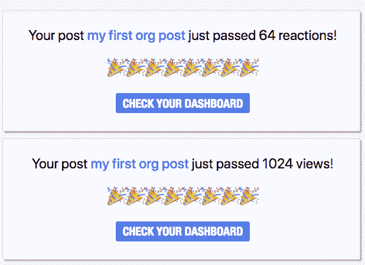](https://user-images.githubusercontent.com/17884966/53517619-15b57200-3a9d-11e9-8285-9f1138fbe60e.png)

## 【可选】哪个 gif 最能描述这个 PR 或者给你的感觉？

[](https://camo.githubusercontent.com/ec49d0e91878a73a86553305f8c0c1d9ffd0911b/68747470733a2f2f6d656469612e67697068792e636f6d2f6d656469612f79384d7a31796a313373336b492f67697068792d646f776e73697a65642e676966)

[View on GitHub](https://github.com/thepracticaldev/dev.to/pull/1920)[](/devteam) [## 新功能:里程碑通知！

### 开发团队的 Andy Zhao(他/他)3 月 1 日 191 分钟阅读

#meta #changelog](/devteam/new-feature-milestone-notifications-3g8b)

*   作为里程碑通知推送的一部分， [@thesoreon](https://dev.to/thesoreon) 添加了一些更多的庆祝 gif！请随意投稿，遵循与本 PR 相似的模式。谢谢， [@thesoreon](https://dev.to/thesoreon) ！

# [ 添加 gif 到 random _ gif . Rb# 1945](https://github.com/thepracticaldev/dev.to/pull/1945)

[](https://github.com/Thesoreon) **[Thesoreon](https://github.com/Thesoreon)** posted on [<time datetime="2019-03-02T07:56:56Z">Mar 02, 2019</time>](https://github.com/thepracticaldev/dev.to/pull/1945)

## 这是什么类型的公关？(勾选所有适用选项)

*   [ ]重构
*   [x]功能
*   [ ]错误修复
*   [ ]文档更新

## 描述

它附加新的 gif 来生成里程碑通知

## 添加到文档中？

*   [ ]文档开发到
*   [ ]自述文件
*   [x]不需要文档

## 【可选】哪个 gif 最能描述这个 PR 或者给你的感觉？

[](https://camo.githubusercontent.com/5593ba20594eca121984c6faace0c08398c39641/68747470733a2f2f6d656469612e67697068792e636f6d2f6d656469612f4766336655307150744936756b2f67697068792e676966)

[View on GitHub](https://github.com/thepracticaldev/dev.to/pull/1945)

*   [@ben](https://dev.to/ben) 添加了 pro dashboard 的初始版本。更多的细节来了！

# [ 专业仪表板基础知识 #1971](https://github.com/thepracticaldev/dev.to/pull/1971) 

[](https://github.com/benhalpern) **[benhalpern](https://github.com/benhalpern)** posted on [<time datetime="2019-03-04T19:43:23Z">Mar 04, 2019</time>](https://github.com/thepracticaldev/dev.to/pull/1971)

## 这是什么类型的公关？(勾选所有适用选项)

*   [ ]重构
*   [x]功能
*   [ ]错误修复
*   [ ]文档更新

## 描述

这是一个概念功能，将在私人测试版中存在一段时间。它将帮助一些有特殊需求的用户，并作为一般展示特性的试验场。这是基本的第一步，只是为了了解宇宙。

[View on GitHub](https://github.com/thepracticaldev/dev.to/pull/1971)

*   您现在可以在 v2 编辑器中使用标记模板了！这意味着访问[https://dev.to/new/discuss](https://dev.to/new/discuss)会自动将讨论标签添加到你的新帖子中。本公关:

# [ 添加标签模板到 v2 编辑器 #1972](https://github.com/thepracticaldev/dev.to/pull/1972) 

[](https://github.com/benhalpern) **[benhalpern](https://github.com/benhalpern)** posted on [<time datetime="2019-03-04T20:08:52Z">Mar 04, 2019</time>](https://github.com/thepracticaldev/dev.to/pull/1972)

## 这是什么类型的公关？(勾选所有适用选项)

*   [ ]重构
*   [x]功能
*   [ ]错误修复
*   [ ]文档更新

## 描述

## 相关车票&单据

## 手机&桌面截图/录音(如有 UI 改动)

## 添加到文档中？

*   [ ]文档开发到
*   [ ]自述文件
*   [ ]不需要文档

## 【可选】哪个 gif 最能描述这个 PR 或者给你的感觉？

[](gif_link)

[View on GitHub](https://github.com/thepracticaldev/dev.to/pull/1972)

*   [@wuz](https://dev.to/wuz) 还新增了一些里程碑的 gif。谢谢你，科林！

# [ 添加新 gif 到 random _ gif . Rb# 1944](https://github.com/thepracticaldev/dev.to/pull/1944)

[](https://github.com/wuz) **[wuz](https://github.com/wuz)** posted on [<time datetime="2019-03-02T01:08:22Z">Mar 02, 2019</time>](https://github.com/thepracticaldev/dev.to/pull/1944)

## 这是什么类型的公关？

*   [x]功能

## 描述

这为随机 gif 文件添加了更多的成功/庆祝 gif！

## 相关车票&单据

不适用的

## 手机&桌面截图/录音(如有 UI 改动)

## 添加到文档中？

*   [x]不需要文档

## 哪个 gif 最能描述这次公关或者给你的感觉？

这是我加的所有的。他们都是很好的代表！[](https://camo.githubusercontent.com/fb573e9fd305c46fa06a6aba7cc0e6c67d5b61a7/68747470733a2f2f6d656469612e67697068792e636f6d2f6d656469612f6c304b3438466b4c666553437a5241344d2f323030775f642e676966)[](https://camo.githubusercontent.com/2253d9e98b0fc1bfcaa0fa6b9f2351db44c9bc64/68747470733a2f2f6d656469612e67697068792e636f6d2f6d656469612f336f377144526431446c463750325450334f2f323030775f642e676966)[](https://camo.githubusercontent.com/6784d4cb0dc7dc3309410ad928c4253c6fb45caa/68747470733a2f2f6d656469612e67697068792e636f6d2f6d656469612f32366830717436554f756d73624a6b79492f323030775f642e676966)[](https://camo.githubusercontent.com/2803299ab34669580d6d01c0f7b5976bb9e1629b/68747470733a2f2f6d656469612e67697068792e636f6d2f6d656469612f336f3771444f7a5a41684f736c6649674d4d2f323030775f642e676966)[](https://camo.githubusercontent.com/253ff2013c87396bbcb0b1ed083bfae60602abfe/68747470733a2f2f6d656469612e67697068792e636f6d2f6d656469612f6c304b34676c42697638326c5a305a756f2f323030775f642e676966)[](https://camo.githubusercontent.com/b7e6b6989e7d312c78cdf2c57d4f49713b610841/68747470733a2f2f6d656469612e67697068792e636f6d2f6d656469612f336f3771444d37465a4a4734776d66385a4f2f323030775f642e676966)

[View on GitHub](https://github.com/thepracticaldev/dev.to/pull/1944)

*   我们将`x`分钟前的特性添加到 feed 中最近的帖子中。本公关:

# [ 给最近的帖子添加前段时间的 #1981](https://github.com/thepracticaldev/dev.to/pull/1981) 

[](https://github.com/benhalpern) **[benhalpern](https://github.com/benhalpern)** posted on [<time datetime="2019-03-05T18:12:52Z">Mar 05, 2019</time>](https://github.com/thepracticaldev/dev.to/pull/1981)

## 这是什么类型的公关？(勾选所有适用选项)

*   [ ]重构
*   [x]功能
*   [ ]错误修复
*   [ ]文档更新

## 描述

对于当天发布的帖子，指出该帖子是在多少秒、分钟、小时之前发布的。

[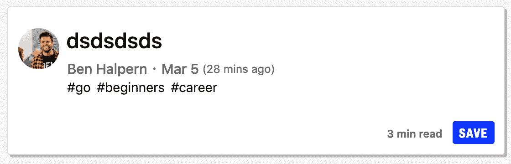](https://camo.githubusercontent.com/151b9fd015f5086aea7eade75aad1793c77f51ee/68747470733a2f2f636c2e6c792f3737623435316235363638352f496d616765253230323031392d30332d30352532306174253230312e31322e3134253230504d2e706e67)

[View on GitHub](https://github.com/thepracticaldev/dev.to/pull/1981)

*   做了一个 PR，它根据你的时间区域显示评论的时间戳！谢谢，[@韵](https://dev.to/rhymes)！

# [ 根据用户的区域设置显示评论发布时间戳 #1970](https://github.com/thepracticaldev/dev.to/pull/1970) 

[](https://github.com/rhymes) **[rhymes](https://github.com/rhymes)** posted on [<time datetime="2019-03-04T17:21:06Z">Mar 04, 2019</time>](https://github.com/thepracticaldev/dev.to/pull/1970)

## 这是什么类型的公关？(勾选所有适用选项)

*   [ ]重构
*   [x]功能
*   [ ]错误修复
*   [ ]文档更新

## 描述

这个公关主要做两件事:

*   在每个`comment-date`标签中嵌入 ISO 8601 时间戳
*   将时间戳显示为标题(因此由悬停触发),并带有转换为用户/浏览器区域设置的字符串

它包含一些额外的东西:

*   我已经把主文件夹中的`.eslintrc.js`移到了`app/assets/javascripts`，并设置了正确的 ECMA 版本。原因是我的 VS 代码一直抱怨代码不是 ES2016，它不是，它是 ECMA 5。“现代”JavaScript 所在的文件夹是`app/javascript`，它已经有了自己的 ESLint 配置文件。

*   我已经删除了`app/assets/javascripts/utilities/getLocalTime.js`,因为它没有在任何地方使用，而且它包含了一个已经包含在 [initializeTimeFixer.js](https://github.com/thepracticaldev/dev.to/blob/master/app/assets/javascripts/initializers/initializeTimeFixer.js) 中的重复函数

注意:我不能用“阅读列表->评论活动”的评论来测试它，因为我被永远占用的异步作业淹没了。如果任何人有关于如何处理这些(除了删除它们)的建议，请让我知道。这是我在当地的现状:

[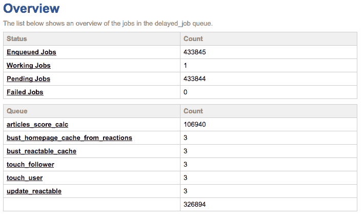](https://user-images.githubusercontent.com/146201/53750481-2d7c6400-3eaa-11e9-9635-34d428db08be.png)

## 相关车票&单据

关闭#406

## 手机&桌面截图/录音(如有 UI 改动)

例如，如果我将浏览器设置为意大利语，看起来会是这样:

[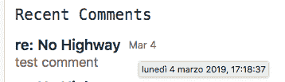](https://user-images.githubusercontent.com/146201/53750004-f9ed0a00-3ea8-11e9-9db2-577145126846.png)

## 添加到文档中？

*   [ ]文档开发到
*   [ ]自述文件
*   [x]不需要文档

## 【可选】哪个 gif 最能描述这个 PR 或者给你的感觉？

[](https://camo.githubusercontent.com/a90a2036c3a5d2b1dcc2e525aee18ca28632116b/68747470733a2f2f6d656469612e67697068792e636f6d2f6d656469612f4150384e4d6e316d4c63496a432f67697068792e676966)

[View on GitHub](https://github.com/thepracticaldev/dev.to/pull/1970)

*   @rykilleen 为任何使用键盘导航的人增加了“跳过内容”功能。谢谢你，赖克林！

# [ 为跳转链接添加标记和样式 #2062](https://github.com/thepracticaldev/dev.to/pull/2062) 

[](https://github.com/RyKilleen) **[RyKilleen](https://github.com/RyKilleen)** posted on [<time datetime="2019-03-14T03:09:34Z">Mar 14, 2019</time>](https://github.com/thepracticaldev/dev.to/pull/2062)

## 这是什么类型的公关？(勾选所有适用选项)

*   [ ]重构
*   [x]功能
*   [ ]错误修复
*   [ ]文档更新

## 描述

这种样式和标记的改变为只使用键盘导航的用户提供了一个有用的链接，可以直接跳转到站点的内容。更多信息和 WC3 链接在这个问题上！

如果有任何关于过渡风格的问题，我很乐意消除！在过去的经验中，我们发现它吸引了那些可能没有注意到 UI 变化的用户的注意力。谢谢！

## 相关车票&单据

#1153

## 手机&桌面截图/录音(如有 UI 改动)

[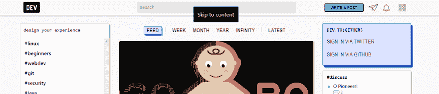 ](https://user-images.githubusercontent.com/4615840/54328507-8b185b00-45e4-11e9-873b-5e4928a218ec.PNG) [ 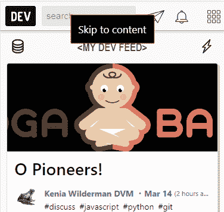](https://user-images.githubusercontent.com/4615840/54328508-8b185b00-45e4-11e9-8e8d-88d4f45ae15d.PNG)

## 添加到文档中？

*   [ ]文档开发到
*   [ ]自述文件
*   [x]不需要文档

## 【可选】哪个 gif 最能描述这个 PR 或者给你的感觉？

[](https://camo.githubusercontent.com/5d15d1eb7314df0bd181cc3d9c96b4d50e165875/68747470733a2f2f6d656469612e67697068792e636f6d2f6d656469612f336f7a387852734350313463416e437449412f67697068792e676966)

[View on GitHub](https://github.com/thepracticaldev/dev.to/pull/2062)

*   我们最近为您添加了自定义显示设置的设置。这包括我们的黑暗模式的测试版，以及帖子的字体设置。本公关:

# [ 允许用户配置使用夜间模式(测试版)和无衬线文章正文 #2072](https://github.com/thepracticaldev/dev.to/pull/2072) 

[](https://github.com/benhalpern) **[benhalpern](https://github.com/benhalpern)** posted on [<time datetime="2019-03-15T16:27:34Z">Mar 15, 2019</time>](https://github.com/thepracticaldev/dev.to/pull/2072)

## 这是什么类型的公关？(勾选所有适用选项)

*   [ ]重构
*   [x]功能
*   [ ]错误修复
*   [ ]文档更新

## 描述

一些用户可能出于各种原因想要夜间阅读模式或无衬线字体:个人偏好、可访问性等。

该配置提供了选项<g-emoji class="g-emoji" alias="smile" fallback-src="https://github.githubassets.cimg/icons/emoji/unicode/1f604.png">😄</g-emoji>

无衬线: [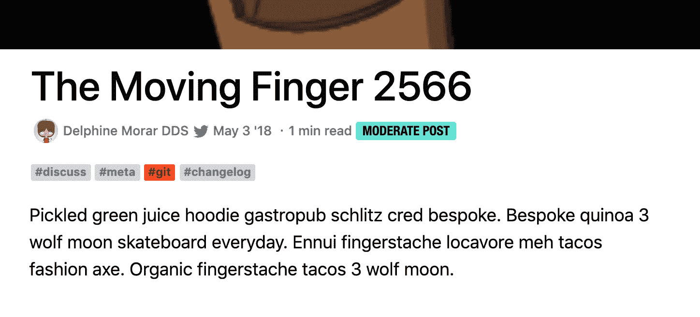](https://camo.githubusercontent.com/16a90784343ee87ab81693cd8dd3bbad0a74a628/68747470733a2f2f636c2e6c792f3330643139316533393730372f496d616765253230323031392d30332d3135253230617425323031322e32322e3131253230504d2e706e67)

仍然有工作要做，让夜间模式看起来刚刚好，但这个公关应该加快，因为更多的人会开始使用它。感谢 [@link2twenty](https://dev.to/link2twenty) 在主题方面的出色工作。

实现无衬线 css 可以做主题风格，但我不确定，所以我这样做了。我们可以以后再改变。

[View on GitHub](https://github.com/thepracticaldev/dev.to/pull/2072)

*   您现在可以更轻松地与人聊天了！如果您和其他人互相关注，那么您会在他们的个人资料上看到一个聊天按钮。更多相关功能即将推出。谢谢， [@mariocsee](https://dev.to/mariocsee) ！

# [ 实现打开收件箱进行开发连接 #1563](https://github.com/thepracticaldev/dev.to/pull/1563) 

[](https://github.com/mariocsee) **[mariocsee](https://github.com/mariocsee)** posted on [<time datetime="2019-01-15T21:06:30Z">Jan 15, 2019</time>](https://github.com/thepracticaldev/dev.to/pull/1563)

## 这是什么类型的公关？(勾选所有适用选项)

*   [x]功能

## 描述

这种公关增加了开放收件箱的用户，他们希望允许其他人在不互相跟随的情况下发送消息。

列`inbox_type`被添加到用户，默认值为“private”。目前唯一的选择是“开放”这可以在`settings/misc`下更改。

“private”的`inbox_type`保留了 DEV Connect 的先前(默认)行为，其中只有相互跟随的用户可以相互发送消息。现在，如果您查看您关注的用户以及关注您的用户，聊天按钮将显示在该按钮旁边。

“打开”的`inbox_type`会在您的个人资料上显示一个聊天按钮，并允许任何用户(无论您是否相互关注)在 DEV Connect 上与您打开聊天。这是通过调用`users_controller`中的`open_chat`方法并创建一个聊天通道(如果你和用户之间还没有打开收件箱的聊天通道)并将你重定向到`dev.to/connect/@username`来实现的。

### 待办事项:

*   [x]添加初始消息(打开新频道时，顶部的默认消息是“您和@ mozellmrsprohaska 已连接，因为...”，但是带有“open”`inbox_type`该消息是错误的，并且为了清楚起见需要被改变)
*   [x]如果 inbox_type 处于打开状态，由于取消关注而变为非活动状态的聊天可以再次变为活动状态
*   `follows_controller`的[x] Rspec 测试通过了`show`中的给定变化

## 相关车票&单据

解决#1460

## 手机&桌面截图/录音(如有 UI 改动)

### 在`settings/misc`中更改收件箱类型

[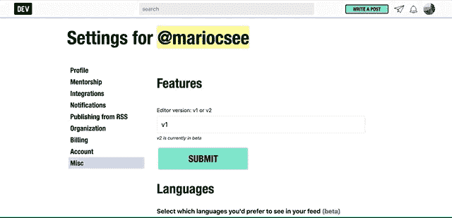](https://user-images.githubusercontent.com/13403332/53375034-2690a700-3928-11e9-88bb-b2b44fccb7bb.gif)

### 关注后退按钮让用户关注你

[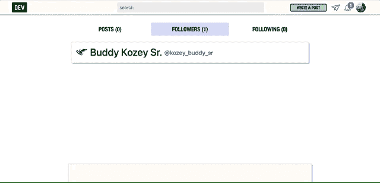](https://user-images.githubusercontent.com/13403332/53375063-35775980-3928-11e9-890c-6eb5ae3cd755.gif)

### 你关注的和关注你的用户都有一个聊天按钮，重定向到你们之间的聊天频道

[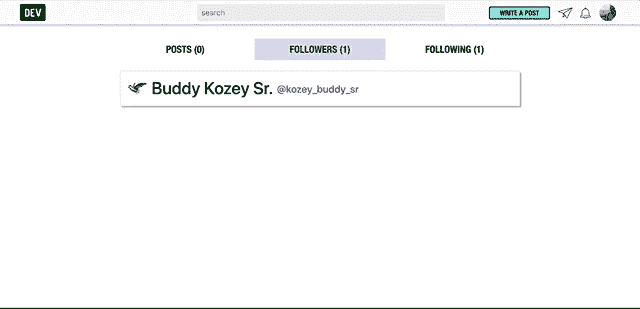](https://user-images.githubusercontent.com/13403332/53375138-62c40780-3928-11e9-9c6f-1f9dce0c1324.gif)

### 手动将收件箱类型更改为“打开”以便在本地环境中进行测试

[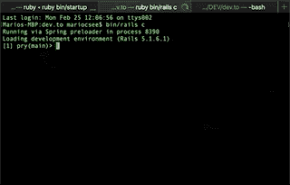](https://user-images.githubusercontent.com/13403332/53375314-e7af2100-3928-11e9-9f04-ceda504cf86f.gif)

### 为打开收件箱的用户新增聊天类型

[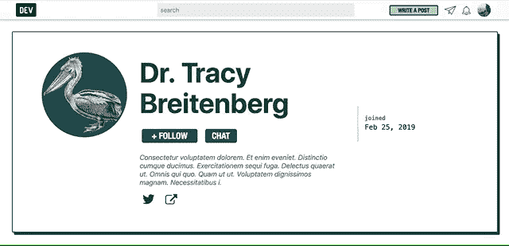](https://user-images.githubusercontent.com/13403332/53375332-f1388900-3928-11e9-8d47-cb33ee964209.gif)

### 

## 添加到文档中？

*   [x]不需要文档

[View on GitHub](https://github.com/thepracticaldev/dev.to/pull/1563)

*   [@mariocsee](https://dev.to/mariocsee) 在帖子的右边栏添加了作者的用户名。谢谢，马里奥！

# [ 添加用户名到文章作者信息 #1912](https://github.com/thepracticaldev/dev.to/pull/1912) 

[](https://github.com/mariocsee) **[mariocsee](https://github.com/mariocsee)** posted on [<time datetime="2019-02-26T21:10:35Z">Feb 26, 2019</time>](https://github.com/thepracticaldev/dev.to/pull/1912)

## 这是什么类型的公关？(勾选所有适用选项)

*   [x]重构

## 描述

在作者粘性导航和关于作者部分添加了用户名。

## 相关车票&单据

解决#265

## 手机&桌面截图/录音(如有 UI 改动)

[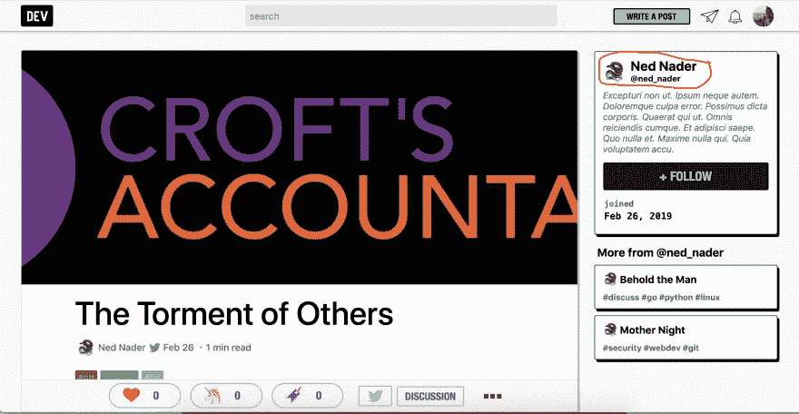](https://user-images.githubusercontent.com/13403332/53446405-e4776c00-39e0-11e9-919b-31d1ae91405a.png)

本文末尾的关于作者部分在开发中没有出现，但是我在处理它的文件中做了修改。

## 添加到文档中？

*   [x]不需要文档

[View on GitHub](https://github.com/thepracticaldev/dev.to/pull/1912)

# Bug 修复/其他贡献

*   [@picocreator](https://dev.to/picocreator) 添加了`SEND_LOGS_TO_TIMBER`环境变量来启用或禁用对 Timber 的日志记录(我们的日志记录服务)。谢谢， [@picocreator](https://dev.to/picocreator) ！

# [ 特性:` SEND_LOGS_TO_TIMBER` env 变量启用或禁用木材记录 #1933](https://github.com/thepracticaldev/dev.to/pull/1933) 

[](https://github.com/PicoCreator) **[PicoCreator](https://github.com/PicoCreator)** posted on [<time datetime="2019-03-01T04:13:13Z">Mar 01, 2019</time>](https://github.com/thepracticaldev/dev.to/pull/1933)

## 这是什么类型的公关？(勾选所有适用选项)

*   [ ]重构
*   [x]功能
*   [ ]错误修复
*   [ ]文档更新

## 描述

为开发/生产模式添加了默认为假/真的`SEND_LOGS_TO_TIMBER`环境变量。

这允许在“生产”模式下禁用木材配置。

PS:我不是一个 ruby 开发人员-所以有人真的应该在合并前仔细检查

## 相关车票&单据

[https://github.com/thepracticaldev/dev.to/pull/1844](https://github.com/thepracticaldev/dev.to/pull/1844)-为船坞建造简化生产模式

## 添加到文档中？

*   [x]不需要文档

## 【可选】什么 gif 最能描述它给你的感觉？

[](https://user-images.githubusercontent.com/17175484/53615928-44f1ed80-3c1b-11e9-9afb-1829441ac069.jpg)

[View on GitHub](https://github.com/thepracticaldev/dev.to/pull/1933)

*   感谢 [@lightalloy](https://dev.to/lightalloy) 启用了`delayed_job` web 界面，这应该可以帮助我们调试失败的后台作业。

# [ 为管理员启用延迟 _ 作业 web 界面 #1967](https://github.com/thepracticaldev/dev.to/pull/1967) 

[](https://github.com/lightalloy) **[lightalloy](https://github.com/lightalloy)** posted on [<time datetime="2019-03-04T13:03:57Z">Mar 04, 2019</time>](https://github.com/thepracticaldev/dev.to/pull/1967)

## 这是什么类型的公关？(勾选所有适用选项)

*   [x]功能

## 描述

为生产(和其他)环境中的管理员启用了 delayed_job web 界面。

## 相关车票&单据

#1857

[View on GitHub](https://github.com/thepracticaldev/dev.to/pull/1967)

*   [@lightalloy](https://dev.to/lightalloy) 修复了取消关注某人时后台工作的问题。谢谢安娜。

# [ 修复延迟工作相关错误如下#1621  #1835](https://github.com/thepracticaldev/dev.to/pull/1835) 

[](https://github.com/lightalloy) **[lightalloy](https://github.com/lightalloy)** posted on [<time datetime="2019-02-20T14:06:53Z">Feb 20, 2019</time>](https://github.com/thepracticaldev/dev.to/pull/1835)

## 这是什么类型的公关？(勾选所有适用选项)

*   [x]重构
*   [x]错误修复

## 描述

修复与被破坏的`Follow`相关的`Delayed::DeserializationError: ActiveRecord::RecordNotFound`。

*   将异步方法移动到单独的作业中
*   添加了检查以确保 follow 仍然存在
*   增加了`Follow`模型的规格，(用于`after_create` / `after_save`回调行为)
*   出于调试目的，我还为`dev`环境添加了 gem `delayed_job_web`

我保留了以前使用过的旧方法`#touch_user`、`#touch_user_followed_at`和`#create_chat_channel_without_delay`、`#send_email_notification_without_delay`，以防会有作业在部署时被创建但没有被执行。

## 相关车票&单据

#1621

[View on GitHub](https://github.com/thepracticaldev/dev.to/pull/1835)

*   [@lightalloy](https://dev.to/lightalloy) 也开始了将一些 Rails 模型回调移入后台作业的过程。

# [ 半身像上的缓存物品销毁而不是重新保存物品#1621  #1801](https://github.com/thepracticaldev/dev.to/pull/1801) 

[](https://github.com/lightalloy) **[lightalloy](https://github.com/lightalloy)** posted on [<time datetime="2019-02-14T10:38:36Z">Feb 14, 2019</time>](https://github.com/thepracticaldev/dev.to/pull/1801)

## 这是什么类型的公关？(勾选所有适用选项)

*   [x]重构

## 描述

在当前实现中，当一个文章被销毁时,(被销毁的)文章组织的所有“兄弟”文章被重新保存。重新保存会触发几个回调，这会创建许多 delayed_jobs。这需要大量的时间和资源。没有必要重新保存文章，这足以破坏他们的缓存。

重构后的项目销毁会发生什么:

*   他们的缓存被破坏了，而不是重新保存组织文章
*   用户文章缓存被异步终止

## 相关车票&单据

#1621 与票据不直接相关(不修复错误)，但包含相关代码的重构。

[View on GitHub](https://github.com/thepracticaldev/dev.to/pull/1801)

*   [@glennmen](https://dev.to/glennmen) 和 [@arnellebalane](https://dev.to/arnellebalane) 用`app/views`中的文件承担了修复林挺问题的任务！我已经包含了所有这些网站的 GitHub 链接。非常感谢， [@glennmen](https://dev.to/glennmen) 和 [@arnellebalane](https://dev.to/arnellebalane) ！

    *   [链接到所有林挺 PRs](https://github.com/thepracticaldev/dev.to/pulls?utf8=%E2%9C%93&q=is%3Apr+fix+linting+issues+in+app%2Fviews%2F)
*   [@ben](https://dev.to/ben) 解决了一个交叉发布的帖子不能以正确顺序显示的小错误。谢谢你，本！

# [ 调整文章排名算法，在可用的地方使用 cross posted _ at# 1917](https://github.com/thepracticaldev/dev.to/pull/1917)

[](https://github.com/benhalpern) **[benhalpern](https://github.com/benhalpern)** posted on [<time datetime="2019-02-27T15:16:27Z">Feb 27, 2019</time>](https://github.com/thepracticaldev/dev.to/pull/1917)

## 这是什么类型的公关？(勾选所有适用选项)

*   [ ]重构
*   [ ]功能
*   [x]错误修复
*   [ ]文档更新

## 描述

如果帖子是在别处首次发表的，那么当前交叉发表的文章会受到算法的影响。这就解决了问题。

[View on GitHub](https://github.com/thepracticaldev/dev.to/pull/1917)

*   [@sashka](https://dev.to/sashka) 增加了验证徽章图像的测试。谢谢你，萨斯卡！

# [ 为验证徽章图像添加测试 #1909](https://github.com/thepracticaldev/dev.to/pull/1909) 

[](https://github.com/SashkaSh) **[SashkaSh](https://github.com/SashkaSh)** posted on [<time datetime="2019-02-26T17:17:42Z">Feb 26, 2019</time>](https://github.com/thepracticaldev/dev.to/pull/1909)

## 这是什么类型的公关？(勾选所有适用选项)

*   [x]重构
*   [ ]功能
*   [ ]错误修复
*   [ ]文档更新

## 描述

为验证徽章图像添加测试

## 添加到文档中？

*   [ ]文档开发到
*   [ ]自述文件
*   [x]不需要文档

## 【可选】哪个 gif 最能描述这个 PR 或者给你的感觉？

[](gif_link)

[View on GitHub](https://github.com/thepracticaldev/dev.to/pull/1909)

*   [@lightalloy](https://dev.to/lightalloy) 修复了一个与移除反应相关的后台作业错误。谢谢安娜。

# [ 修复与反应相关的延迟作业错误#1621  #1883](https://github.com/thepracticaldev/dev.to/pull/1883) 

[](https://github.com/lightalloy) **[lightalloy](https://github.com/lightalloy)** posted on [<time datetime="2019-02-25T11:32:35Z">Feb 25, 2019</time>](https://github.com/thepracticaldev/dev.to/pull/1883)

修复与被破坏的`Reaction`相关的`Delayed::DeserializationError: ActiveRecord::RecordNotFound`。

```
* moved async methods to separate jobs

* added checks to ensure that a record still exists

* added specs for the `Reaction` model, (for the `after_save` callbacks behavior) 
```

我保留了以前使用的旧方法`#touch_user_without_delay`、`#update_reactable_without_delay`、`#occasionally_sync_reaction_counts`、`#bust_reactable_cache_without_delay`，以防会有作业在部署时被创建但没有被执行。

[View on GitHub](https://github.com/thepracticaldev/dev.to/pull/1883)

*   @mariocsee 修复了一个问题，在播客的一集上留下的评论不会立即出现。谢谢，马里奥！

# [ 播客剧集评论刷新 #1931](https://github.com/thepracticaldev/dev.to/pull/1931) 

[](https://github.com/mariocsee) **[mariocsee](https://github.com/mariocsee)** posted on [<time datetime="2019-02-28T20:06:51Z">Feb 28, 2019</time>](https://github.com/thepracticaldev/dev.to/pull/1931)

## 这是什么类型的公关？(勾选所有适用选项)

*   [x]错误修复

## 描述

花了几分钟试图找出#1788，并在我向下滚动后看到了安迪的评论...所以我在他建议的地方插了一句。我想将来会有一个公共关系，它会有意图的行为去`send_new_comment_notifications`评论播客剧集。

我在下面的截图中附上了一些控制台错误，但没有破坏开发中的任何东西。

## 相关车票&单据

第 1788 号决议

## 手机&桌面截图/录音

### @赵-安迪评论 1788

[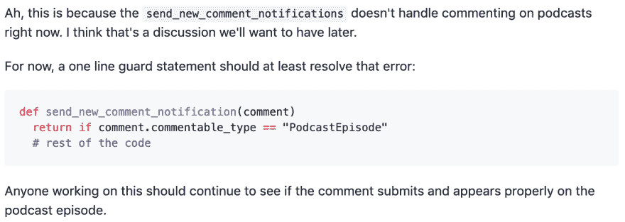](https://user-images.githubusercontent.com/13403332/53594858-ce48e780-3b69-11e9-99d7-3cfd2824f994.png)

### 控制台

[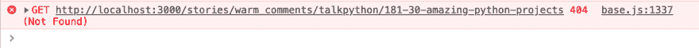](https://user-images.githubusercontent.com/13403332/53594914-f5071e00-3b69-11e9-9a76-6ee667ea0009.png)

[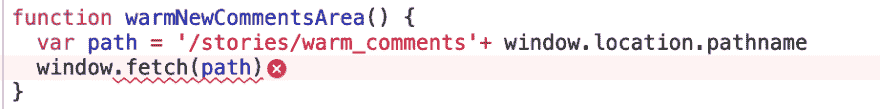](https://user-images.githubusercontent.com/13403332/53594918-f89aa500-3b69-11e9-9d58-497341913c60.png)

## 添加到文档中？

*   [x]不需要文档

[View on GitHub](https://github.com/thepracticaldev/dev.to/pull/1931)

*   [@lightalloy](https://dev.to/lightalloy) 修复了`SAVE(D)`按钮在阅读列表中无法正确渲染的 bug。谢谢安娜。

# [ 文章加载后更新保存(d)按钮状态，修复#1785  #1927](https://github.com/thepracticaldev/dev.to/pull/1927) 

[](https://github.com/lightalloy) **[lightalloy](https://github.com/lightalloy)** posted on [<time datetime="2019-02-28T12:17:54Z">Feb 28, 2019</time>](https://github.com/thepracticaldev/dev.to/pull/1927)

## 这是什么类型的公关？(勾选所有适用选项)

*   [x]错误修复

## 描述

*   文章加载后更新“保存(d)”按钮状态(在阅读列表中)
*   做了几个`eslint`要求的样式修正，仍然不得不为`initializeReadingListIcons.js`文件禁用几个副本

目前，按钮的状态会在页面加载时更新几次，我认为这并不总是需要的。但是逻辑是在主页、阅读列表和其他文章页面之间共享的，所以我决定保持原样。

## 相关车票&单据

#1785 这可能修复了#1395，但理想情况下，我会建议对这个问题进行更多的研究和代码重构。

## 手机&桌面截图/录音(如有 UI 改动)

[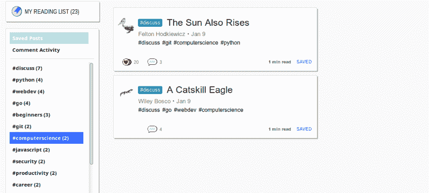](https://user-images.githubusercontent.com/30115/53565861-af4b5500-3b6b-11e9-91fb-b569b5264517.png)

[View on GitHub](https://github.com/thepracticaldev/dev.to/pull/1927)

*   [@押韵](https://dev.to/rhymes)重构了`ArticlesController#feed`(文章控制器，提要动作)。下面来看看吧！谢谢，[@韵](https://dev.to/rhymes)！

# [ 简化文章控制器#提要 #1932](https://github.com/thepracticaldev/dev.to/pull/1932) 

[](https://github.com/rhymes) **[rhymes](https://github.com/rhymes)** posted on [<time datetime="2019-02-28T23:46:52Z">Feb 28, 2019</time>](https://github.com/thepracticaldev/dev.to/pull/1932)

在 feed 方法的逻辑中有不必要的复杂性，这样每个路径之间的区别应该更清楚。

## 这是什么类型的公关？(勾选所有适用选项)

*   [x]重构
*   [ ]功能
*   [ ]错误修复
*   [ ]文档更新

## 描述

我看到了 ArticlesController#feed，注意到 ORM 逻辑有点复杂，并且在每个 if/else 子句中重复出现。由于 AR 是一个懒惰且可组合的 ORM，我决定简化逻辑。

## 添加到文档中？

*   [ ]文档开发到
*   [ ]自述文件
*   [x]不需要文档

[View on GitHub](https://github.com/thepracticaldev/dev.to/pull/1932)

*   [@vizvamitra](https://github.com/vizvamitra) 修复了一个与 RSS feed 相关的 bug，需要启动测试。谢谢@vizvamitra！

# [ 修复文章提要不按用户/组织过滤文章 #1941](https://github.com/thepracticaldev/dev.to/pull/1941) 

[](https://github.com/vizvamitra) **[vizvamitra](https://github.com/vizvamitra)** posted on [<time datetime="2019-03-01T23:00:28Z">Mar 01, 2019</time>](https://github.com/thepracticaldev/dev.to/pull/1941)

## 这是什么类型的公关？(勾选所有适用选项)

*   [ ]重构
*   [ ]功能
*   [x]错误修复
*   [ ]文档更新

## 描述

#1932 中引入了一个错误，导致用户/组织订阅源中出现不需要的文章。`@articles`范围没有根据`:username`参数进行适当的更新。

## 相关车票&单据

#1940

## 添加到文档中？

*   [ ]文档开发到
*   [ ]自述文件
*   [x]不需要文档

修复#1940

[View on GitHub](https://github.com/thepracticaldev/dev.to/pull/1941)

*   @shindakun 删除了 RSS 阅读器中多余的正斜杠。谢谢， [@shindakun](https://dev.to/shindakun) ！

# [ 在 RSS 提要构建器中移除杂散的正斜杠 #1943](https://github.com/thepracticaldev/dev.to/pull/1943) 

[](https://github.com/shindakun) **[shindakun](https://github.com/shindakun)** posted on [<time datetime="2019-03-01T23:16:04Z">Mar 01, 2019</time>](https://github.com/thepracticaldev/dev.to/pull/1943)

## 这是什么类型的公关？(勾选所有适用选项)

*   [ ]重构
*   [ ]功能
*   [x]错误修复
*   [ ]文档更新

## 描述

*   RSS 中的链接和 GUID 字段中的 URL 有一个额外的斜杠。该 PR 消除了第 17 和 18 行的杂散`/`。

## 相关车票&单据

关闭#1942

## 添加到文档中？

*   [ ]文档开发到
*   [ ]自述文件
*   [x]不需要文档

## 【可选】哪个 gif 最能描述这个 PR 或者给你的感觉？

[](https://camo.githubusercontent.com/85e13a7b334b58ba5e3ed705420068e5a94bb3a4/68747470733a2f2f6d65646961302e67697068792e636f6d2f6d656469612f6c3253705a7669505364636f6b434462472f67697068792e676966)

[View on GitHub](https://github.com/thepracticaldev/dev.to/pull/1943)

*   @jbbn 将 GitDocs 添加到我们的“关键应用技术/服务”文档中。谢谢， [@jbbn](https://dev.to/jbbn) ！

# [ 添加 GitDocs 到”🔑关键应用技术/服务”【跳过 ci】# 1951](https://github.com/thepracticaldev/dev.to/pull/1951)

[](https://github.com/jbbn) **[jbbn](https://github.com/jbbn)** posted on [<time datetime="2019-03-02T20:33:10Z">Mar 02, 2019</time>](https://github.com/thepracticaldev/dev.to/pull/1951)

## 这是什么类型的公关？(勾选所有适用选项)

*   [ ]重构
*   [ ]功能
*   [ ]错误修复
*   [X]文档更新

## 描述

我刚把 GitDocs 加到了“<g-emoji class="g-emoji" alias="key" fallback-src="https://github.githubassets.cimg/icons/emoji/unicode/1f511.png">🔑</g-emoji>文档的“关键应用技术/服务”部分。

## 相关车票&单据

## 手机&桌面截图/录音(如有 UI 改动)

## 添加到文档中？

*   [ ]文档开发到
*   [ ]自述文件
*   [X]不需要文档

## 【可选】哪个 gif 最能描述这个 PR 或者给你的感觉？

[](https://camo.githubusercontent.com/01c7fd267a4b9d5227d9c3d9e48be7124348d775/68747470733a2f2f6d656469612e67697068792e636f6d2f6d656469612f575a344d384d3256626175456f2f67697068792e676966)

[View on GitHub](https://github.com/thepracticaldev/dev.to/pull/1951)

*   @lightalloy 减少了显示文章 flare 标签时的查询次数。谢谢安娜。

# [ 显示文章时少做查询耀斑标签 #1957](https://github.com/thepracticaldev/dev.to/pull/1957) 

[](https://github.com/lightalloy) **[lightalloy](https://github.com/lightalloy)** posted on [<time datetime="2019-03-04T08:31:45Z">Mar 04, 2019</time>](https://github.com/thepracticaldev/dev.to/pull/1957)

## 这是什么类型的公关？(勾选所有适用选项)

*   [x]重构

## 描述

*   视图变量中的缓存 flare 标记
*   重构后的`FlareTag`
*   将`FlareTag`规格移到它自己的文件中

[View on GitHub](https://github.com/thepracticaldev/dev.to/pull/1957)

*   [@glennmen](https://dev.to/glennmen) 修复了[早期恶搞书籍生成器](https://dev.to/orlygenerator)中存在“混合内容”的问题。谢谢， [@glennmen](https://dev.to/glennmen) ！

# [ 修复早期恶搞书籍生成器中的混合内容错误 #1993](https://github.com/thepracticaldev/dev.to/pull/1993) 

[](https://github.com/Glennmen) **[Glennmen](https://github.com/Glennmen)** posted on [<time datetime="2019-03-06T18:17:31Z">Mar 06, 2019</time>](https://github.com/thepracticaldev/dev.to/pull/1993)

## 这是什么类型的公关？(勾选所有适用选项)

*   [ ]重构
*   [ ]功能
*   [x]错误修复
*   [ ]文档更新

## 描述

我浏览了一下路由文件，发现了一些有趣的页面。我还注意到这个页面不能正常工作，2 张图片不能正确显示。1 修复了第一个，第二个好像不存在了但是看网址好像是心形 GIF。如果任何人有一个好的替代让我知道，我会添加它，因为现在我已经隐藏它，所以你不会看到一个破碎的图像。

## 相关车票&单据

## 手机&桌面截图/录音(如有 UI 改动)

之前: [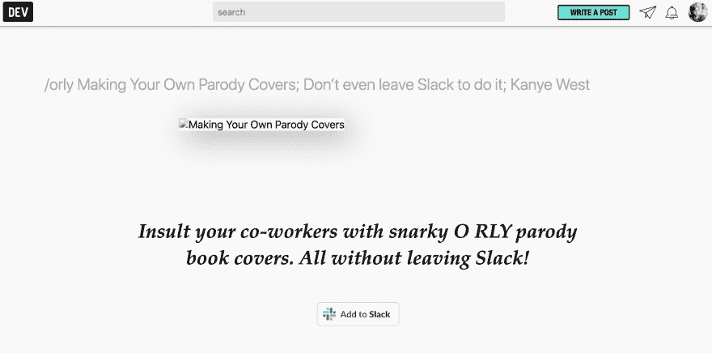](https://user-images.githubusercontent.com/11406433/53903124-2b99d880-4043-11e9-8509-a64ef7846aba.png) [ ](https://user-images.githubusercontent.com/11406433/53903192-597f1d00-4043-11e9-8da9-75297e104898.png)

之后: [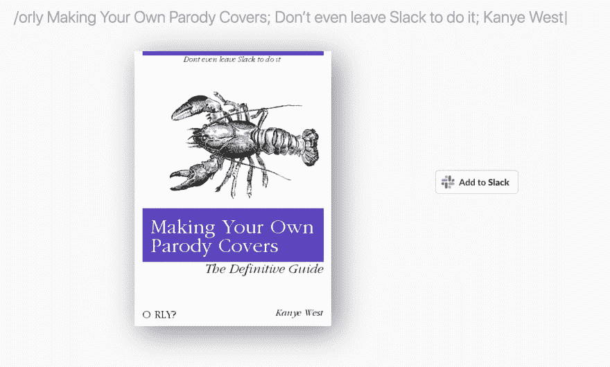](https://user-images.githubusercontent.com/11406433/53903233-7b789f80-4043-11e9-9334-118b56af7656.png) [ 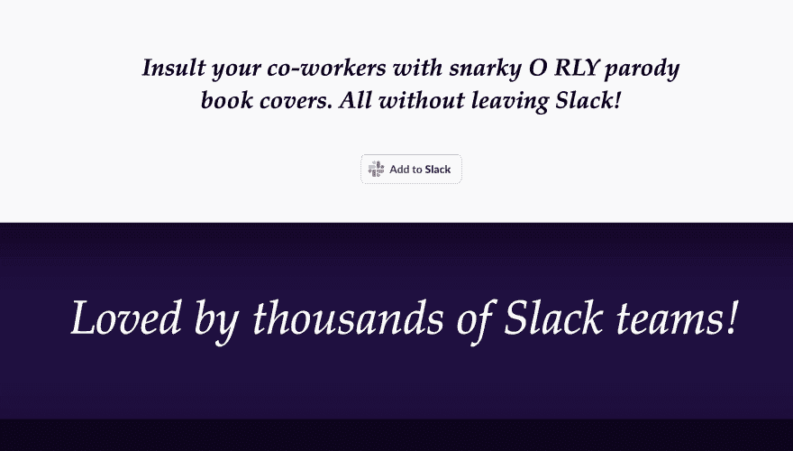](https://user-images.githubusercontent.com/11406433/53903257-8d5a4280-4043-11e9-84b7-bd5383e930e8.png)

## 添加到文档中？

*   [ ]文档开发到
*   [ ]自述文件
*   [x]不需要文档

## 【可选】哪个 gif 最能描述这个 PR 或者给你的感觉？

[](https://camo.githubusercontent.com/20cd2219a87e8a250daa35a2983ae57190a78e51/68747470733a2f2f6d656469612e67697068792e636f6d2f6d656469612f514e46684f6f6c5665437a5051324d7838352f67697068792e676966)

[View on GitHub](https://github.com/thepracticaldev/dev.to/pull/1993)

*   [@mkrl](https://dev.to/mkrl) 清理了 GitHub Liquid tag 嵌入中锚和图像的相对路径。谢谢， [@mkrl](https://dev.to/mkrl) ！

# [ 清除 GitHub 液体标签中锚点和图像的相对路径嵌入 #1987](https://github.com/thepracticaldev/dev.to/pull/1987) 

[](https://github.com/mkrl) **[mkrl](https://github.com/mkrl)** posted on [<time datetime="2019-03-06T09:33:03Z">Mar 06, 2019</time>](https://github.com/thepracticaldev/dev.to/pull/1987)

## 这是什么类型的公关？(勾选所有适用选项)

*   [ ]重构
*   [ ]功能
*   [x]错误修复
*   [ ]文档更新

## 描述

对`a`和`img`元素运行`clean_relative_path!`。

## 相关车票&单据

修复#1976

## 手机&桌面截图/录音(如有 UI 改动)

## 添加到文档中？

*   [ ]文档开发到
*   [ ]自述文件
*   [x]不需要文档

[View on GitHub](https://github.com/thepracticaldev/dev.to/pull/1987)

*   @glebec 修复了 Runkit 标签中双引号无法正确解析的问题。谢谢， [@glebec](https://dev.to/glebec) ！

# [  fix(runkit):序言中允许双引号 #1938](https://github.com/thepracticaldev/dev.to/pull/1938) 

[](https://github.com/glebec) **[glebec](https://github.com/glebec)** posted on [<time datetime="2019-03-01T21:11:35Z">Mar 01, 2019</time>](https://github.com/thepracticaldev/dev.to/pull/1938)

## 这是什么类型的公关？(勾选所有适用选项)

*   [ ]重构
*   [ ]功能
*   [x]错误修复
*   [ ]文档更新

注意:这本身不是 WIP 但是，如果没有验证它仍然解决了最初 PR (#1808) 的任何(未指明的)安全问题，则不应合并它。

## 描述

将`>`字符恢复为 runkit 前导码的净化字符串，从而重新允许双引号作为有效的 JS 标记。

## 相关车票&单据

关闭#1937。

## 添加到文档中？

*   [ ]文档开发到
*   [ ]自述文件
*   [x]不需要文档

[View on GitHub](https://github.com/thepracticaldev/dev.to/pull/1938)

*   [@hkrogstie](https://dev.to/hkrogstie) 修复了一个错误，即`undefined`被返回用于一篇帖子的“`x`分钟前”文本。谢谢， [@hkrogstie](https://dev.to/hkrogstie) ！

# [ 修复以前返回的未定义，显示在老帖子的发帖日期之后 #2002](https://github.com/thepracticaldev/dev.to/pull/2002) 

[](https://github.com/haved) **[haved](https://github.com/haved)** posted on [<time datetime="2019-03-08T12:02:57Z">Mar 08, 2019</time>](https://github.com/thepracticaldev/dev.to/pull/2002)

## 这是什么类型的公关？(勾选所有适用选项)

*   [ ]重构
*   [ ]功能
*   [x]错误修复
*   [ ]文档更新

## 描述

重写 timeAgo 函数，使其永远不会返回 undefined。新的可选参数允许调用者指定包含时间前字符串的截止值。默认值是从前面的代码中提取的

## 相关车票&单据

修复了第 1995 号问题

## 手机&桌面截图/录音(如有 UI 改动)

## 添加到文档中？

*   [ ]文档开发到
*   [ ]自述文件
*   [x]不需要文档

[View on GitHub](https://github.com/thepracticaldev/dev.to/pull/2002)

*   [@davidcelis](https://dev.to/davidcelis) 在允许的乳齿象实例中添加了`xoxo.zone`。谢谢， [@davidcelis](https://dev.to/davidcelis) ！

# [ 添加 xoxo.zone 到允许的乳齿象实例 #2009](https://github.com/thepracticaldev/dev.to/pull/2009) 

[](https://github.com/davidcelis) **[davidcelis](https://github.com/davidcelis)** posted on [<time datetime="2019-03-08T20:04:41Z">Mar 08, 2019</time>](https://github.com/thepracticaldev/dev.to/pull/2009)

## 这是什么类型的公关？(勾选所有适用选项)

*   [ ]重构
*   [ ]功能
*   [x]错误修复
*   [ ]文档更新

## 描述

又一个乳齿象的例子。TBH，白名单看起来很奇怪。有很多乳齿象的例子

## 添加到文档中？

*   [ ]文档开发到
*   [ ]自述文件
*   [x]不需要文档

## 【可选】哪个 gif 最能描述这个 PR 或者给你的感觉？

[](https://camo.githubusercontent.com/361d244f8cce76106eaa147ccea20b1f4391dab9/68747470733a2f2f6d656469612e67697068792e636f6d2f6d656469612f42495a6b774674753278446c532f67697068792e676966)

[View on GitHub](https://github.com/thepracticaldev/dev.to/pull/2009)

*   @turnerj 修复了我们的一个 API 控制器中的一个打字错误。谢谢， [@turnerj](https://dev.to/turnerj) ！

# [ 修复代理键头 #2013](https://github.com/thepracticaldev/dev.to/pull/2013) 

[](https://github.com/Turnerj) **[Turnerj](https://github.com/Turnerj)** posted on [<time datetime="2019-03-09T11:53:27Z">Mar 09, 2019</time>](https://github.com/thepracticaldev/dev.to/pull/2013)

## 这是什么类型的公关？(勾选所有适用选项)

*   [ ]重构
*   [ ]功能
*   [x]错误修复
*   [ ]文档更新

## 描述

在代理键头中有一个拼写错误，它将用户名参数称为“userame ”,这影响了键的有用性。

[View on GitHub](https://github.com/thepracticaldev/dev.to/pull/2013)

*   [@lightalloy](https://dev.to/lightalloy) 优化了我们主控制器的几块。谢谢安娜。

# [# 1988](https://github.com/thepracticaldev/dev.to/pull/1988)

[](https://github.com/lightalloy) **[lightalloy](https://github.com/lightalloy)** posted on [<time datetime="2019-03-06T10:45:41Z">Mar 06, 2019</time>](https://github.com/thepracticaldev/dev.to/pull/1988)

## 这是什么类型的公关？(勾选所有适用选项)

*   [x]重构

## 描述

*   添加了文章路径的索引，因为在检索文章时按路径查询很流行
*   仅选择标签颜色所需的列
*   在检索粘性文章集合时进行较少的 SQL 查询

[View on GitHub](https://github.com/thepracticaldev/dev.to/pull/1988)

*   [@keshavbiswa](https://dev.to/keshavbiswa) 修复了一个错误，即一篇文章的“`x`分钟前”文本只显示在提要中的交替文章中。谢谢， [@keshavbiswa](https://dev.to/keshavbiswa) ！

# [ 修复时间前的 bug。 #2015](https://github.com/thepracticaldev/dev.to/pull/2015) 

[](https://github.com/keshavbiswa) **[keshavbiswa](https://github.com/keshavbiswa)** posted on [<time datetime="2019-03-09T16:25:33Z">Mar 09, 2019</time>](https://github.com/thepracticaldev/dev.to/pull/2015)

## 这是什么类型的公关？(勾选所有适用选项)

*   [ ]重构
*   [ ]功能
*   [x]错误修复
*   [ ]文档更新

## 描述

最近一页的时间标签在每一个替代的帖子上被渲染。

## 相关车票&单据

#2012

## 手机&桌面截图/录音(如有 UI 改动)

## 添加到文档中？

不需要文件。

[View on GitHub](https://github.com/thepracticaldev/dev.to/pull/2015)

*   [@lightalloy](https://dev.to/lightalloy) 重构了向后台作业发送新关注者通知的过程，并在此过程中添加了一些检查。谢谢安娜。

# [ 当可关注标签为#2041   #2050](https://github.com/thepracticaldev/dev.to/pull/2050) 时不要发送新关注者通知

[](https://github.com/lightalloy) **[lightalloy](https://github.com/lightalloy)** posted on [<time datetime="2019-03-13T10:34:46Z">Mar 13, 2019</time>](https://github.com/thepracticaldev/dev.to/pull/2050)

## 这是什么类型的公关？(勾选所有适用选项)

*   [x]错误修复

## 描述

*   添加了检查，以确保在发送通知之前可跟踪的是`User`或`Organization`
*   添加规格

## 相关车票&单据

#2041

[View on GitHub](https://github.com/thepracticaldev/dev.to/pull/2050)

*   [@韵脚](https://dev.to/rhymes)更新标签点时做了一个生活质量的改变。现在只允许数字作为值。谢谢，[@韵](https://dev.to/rhymes)！

# [ 仪表盘:使用数值输入为标记点 #2057](https://github.com/thepracticaldev/dev.to/pull/2057) 

[](https://github.com/rhymes) **[rhymes](https://github.com/rhymes)** posted on [<time datetime="2019-03-13T16:15:13Z">Mar 13, 2019</time>](https://github.com/thepracticaldev/dev.to/pull/2057)

## 这是什么类型的公关？(勾选所有适用选项)

*   [ ]重构
*   [ ]功能
*   [x]错误修复
*   [ ]文档更新

## 描述

目前仪表板->下面的页面标签允许输入文本而不是数字。因为这些是浮点，所以在提交页面后它们将被拒绝，使用一个 HTML 数字输入，将`step`设置为`any`，任何有效的数字(整数或浮点)都被接受。

这是受 1346 号上 [@link2twenty](https://dev.to/link2twenty) 的[评论](https://github.com/thepracticaldev/dev.to/issues/1346#issuecomment-449409607)的启发(本着提交更小的 PRs eheh 的精神)

## 手机&桌面截图/录音(如有 UI 改动)

正数

[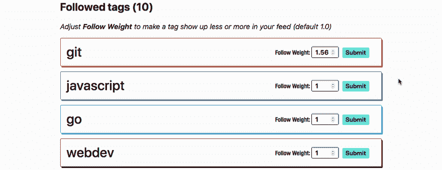](https://user-images.githubusercontent.com/146201/54295357-21cc2400-45b3-11e9-8795-17e627460701.gif)

负数

[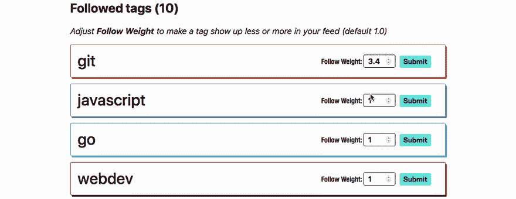](https://user-images.githubusercontent.com/146201/54295535-82f3f780-45b3-11e9-8512-450e76c6162f.gif)

## 添加到文档中？

*   [ ]文档开发到
*   [ ]自述文件
*   [x]不需要文档

[View on GitHub](https://github.com/thepracticaldev/dev.to/pull/2057)

*   @turnerj 修复了聊天通知状态中的一个错别字。谢谢， [@turnerj](https://dev.to/turnerj) ！

# [ 修复通知状态上的错别字 #2047](https://github.com/thepracticaldev/dev.to/pull/2047) 

[](https://github.com/Turnerj) **[Turnerj](https://github.com/Turnerj)** posted on [<time datetime="2019-03-13T00:53:42Z">Mar 13, 2019</time>](https://github.com/thepracticaldev/dev.to/pull/2047)

## 这是什么类型的公关？

*   [x]错误修复

## 描述

“通知” <g-emoji class="g-emoji" alias="frowning_face" fallback-src="https://github.githubassets.cimg/icons/emoji/unicode/2639.png">☹</g-emoji> “通知”<g-emoji class="g-emoji" alias="slightly_smiling_face" fallback-src="https://github.githubassets.cimg/icons/emoji/unicode/1f642.png">🙂</g-emoji>

[View on GitHub](https://github.com/thepracticaldev/dev.to/pull/2047)

*   @aspittel 给了 pro dashboard 一个 dashboard-y 的改造。谢谢你，阿里！

# [ 给 pro 仪表盘一个仪表盘-y 改头换面 #2058](https://github.com/thepracticaldev/dev.to/pull/2058) 

[](https://github.com/aspittel) **[aspittel](https://github.com/aspittel)** posted on [<time datetime="2019-03-13T18:35:02Z">Mar 13, 2019</time>](https://github.com/thepracticaldev/dev.to/pull/2058)

## 这是什么类型的公关？(勾选所有适用选项)

*   [x]重构
*   [ ]功能
*   [ ]错误修复
*   [ ]文档更新

## 描述

重新设计了专业仪表板！

## 手机&桌面截图/录音(如有 UI 改动)

[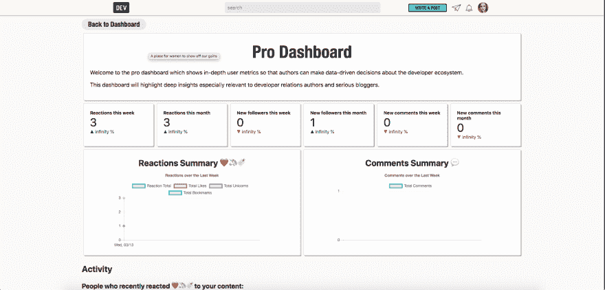](https://user-images.githubusercontent.com/12969662/54305155-153cd100-459d-11e9-859f-f65a989b0ecf.png)

## 添加到文档中？

*   [ ]文档开发到
*   [ ]自述文件
*   [x]不需要文档

## 【可选】哪个 gif 最能描述这个 PR 或者给你的感觉？

[](https://camo.githubusercontent.com/5aea50f63aeae99d9ab82ad67bb220bc2b5f8176/68747470733a2f2f6d656469612e67697068792e636f6d2f6d656469612f336f737859633261786a434a4e73435879452f67697068792e676966)

[View on GitHub](https://github.com/thepracticaldev/dev.to/pull/2058)

*   @keshavbiswa 使用 Rubocop(我们使用的 Ruby linter)启用了两个风格相关的 cop。谢谢， [@keshavbiswa](https://dev.to/keshavbiswa) ！

# [](https://github.com/thepracticaldev/dev.to/pull/2056)

[](https://github.com/keshavbiswa) **[keshavbiswa](https://github.com/keshavbiswa)** posted on [<time datetime="2019-03-13T15:44:40Z">Mar 13, 2019</time>](https://github.com/thepracticaldev/dev.to/pull/2056)

## 这是什么类型的公关？(勾选所有适用选项)

*   [x]重构
*   [ ]功能
*   [ ]错误修复
*   [ ]文档更新

## 描述

启用了 Rubocop.yml 中的样式/别名，并修复了所有相关问题。

*   风格/别名
*   样式/属性

## 相关车票&单据

#2021

## 添加到文档中？

*   [ ]文档开发到
*   [ ]自述文件
*   [x]不需要文档

[View on GitHub](https://github.com/thepracticaldev/dev.to/pull/2056)

# 新的问题和讨论

*   @juliatorrejon 请求了一个可以将标签组织成主题和子主题的功能。随意插话。谢谢， [@juliatorrejon](https://dev.to/juliatorrejon) ！

# [ 按主题和副主题组织和分组标签 #1864](https://github.com/thepracticaldev/dev.to/issues/1864) 

[](https://github.com/JuliaTorrejon) **[JuliaTorrejon](https://github.com/JuliaTorrejon)** posted on [<time datetime="2019-02-24T18:10:44Z">Feb 24, 2019</time>](https://github.com/thepracticaldev/dev.to/issues/1864)

**您的功能请求是否与某个问题相关？请描述一下。**在搜索特定主题和/或副主题时，标签的可用性并不完全清楚。

**描述您想要的解决方案**我认为，如果能够按照工具、编程语言、技巧等主题在下拉列表中进行组织和分组，标签的功能会更有价值；而这些又有详细的副主题。例如:

[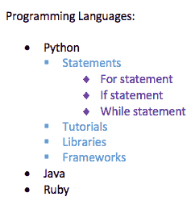](https://user-images.githubusercontent.com/29682284/53303141-d8fc3780-385e-11e9-8cdf-5c34340d0751.png)

**附加语境**实际查看我的标签 [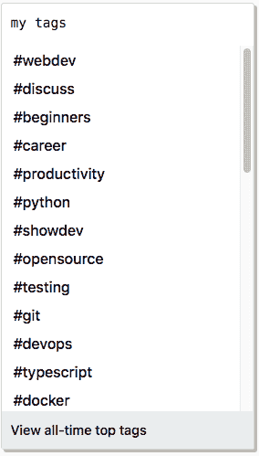](https://user-images.githubusercontent.com/29682284/53299293-ffef4500-382f-11e9-864e-b45686c5fe4b.png)

[View on GitHub](https://github.com/thepracticaldev/dev.to/issues/1864)

*   [@fredogonzalezr](https://dev.to/fredogonzalezr) 请求了一个可以用电子邮件登录的功能。谢谢@fredogonzalezr！

# [ 添加邮箱登录 #1865](https://github.com/thepracticaldev/dev.to/issues/1865) 

[](https://github.com/fredddiex) **[fredddiex](https://github.com/fredddiex)** posted on [<time datetime="2019-02-24T21:20:17Z">Feb 24, 2019</time>](https://github.com/thepracticaldev/dev.to/issues/1865)

**您的功能请求是否与某个问题相关？请描述一下。**当前的帐户登录方式并不最适合保护我们的帐户访问安全。

使用 GitHub 或 Twitter 是可以的，但我们必须记住，他们是从 dev.to 中分离出来的社区，他们有自己的规则和准则来决定哪些帐户必须被删除或暂停。

此外，由于他们是科技巨头，可能很难联系他们对我们帐户的任何问题的支持，因此在这些服务中失去对我们帐户的访问可能意味着失去对我们 dev.to 帐户的访问。

**描述您想要的解决方案**增加使用电子邮件地址登录的可能性，这样我们可以保持我们的帐户访问安全，并与任何第三方 OAuth 提供商的可能问题分开。

**描述您考虑过的替代方案**增加另一个 OAuth 提供商，如 Google，例如，一个非面向社区的服务，您的帐户被暂停、删除或丢失更不寻常。*(这正在#1595 中讨论)*

另一个解决方案可能是取消我当前 Twitter/GitHub 帐户的链接，然后在从 dev.to 注销之前链接一个新的帐户。但如果你的帐户被暂停，无法登录，这就没有用了。

**附加背景**我的 Twitter 账户遇到了问题，我试图寻求他们的支持，但没有得到任何回应。我发现的最好的解决办法是删除我的帐户，并开始一个新的。

这意味着如果我不更改与我的 dev.to 帐户关联的 Twitter 帐户，我也将无法访问 dev.to 的帐户。(向开发团队发送电子邮件，因为这不可能从仪表板上实现)。

[View on GitHub](https://github.com/thepracticaldev/dev.to/issues/1865)

*   @swyx 请求了一个可以自动生成文章目录的功能。谢谢， [@swyx](https://dev.to/swyx) ！

# [ 【特征请求】自动生成目录 #1868](https://github.com/thepracticaldev/dev.to/issues/1868) 

[](https://github.com/sw-yx) **[sw-yx](https://github.com/sw-yx)** posted on [<time datetime="2019-02-24T23:13:40Z">Feb 24, 2019</time>](https://github.com/thepracticaldev/dev.to/issues/1868)

**您的功能请求是否与某个问题相关？请描述一下。**

Markdown header 标签现在有了 anchor 标签，所以我们可以为文章生成目录。

这鼓励了开发者使用更多可浏览的长表单内容。

或者，我们可以让 TOC 浮动在侧边栏中。

**描述您想要的解决方案**

可能使用一个 TOC 生成器，像 https://ecotrust-canada.github.io/markdown-toc/的

**描述你考虑过的替代方案**

什么都不做

**附加上下文**

我最后一次在这里[https://github.com/thepracticaldev/dev.to/issues/183](https://github.com/thepracticaldev/dev.to/issues/183)提交这个请求是在我以前工作的 github 账户上。一个先决条件是在每个标题上添加 id，这是在 11 月完成的。是时候重新考虑这个想法了！

[View on GitHub](https://github.com/thepracticaldev/dev.to/issues/1868)

*   [@simevidas](https://dev.to/simevidas) 请求增加对`<mark>`元素支持的特性

# [ 考虑增加对<标志>元素  #1870](https://github.com/thepracticaldev/dev.to/issues/1870) 的支持

[](https://github.com/simevidas) **[simevidas](https://github.com/simevidas)** posted on [<time datetime="2019-02-25T04:40:23Z">Feb 25, 2019</time>](https://github.com/thepracticaldev/dev.to/issues/1870)

`<mark>`元素对于突出显示文本中的某些单词和短语很有用，这减少了“文本墙”问题。浏览器已经使用黄色背景呈现该元素。

我要求 Dev.to 不要从文章的 HTML 输出中去掉`<mark>`元素。作者可以在 Markdown 中正常使用该元素。

关于`<mark>`如何提高内容可读性的一个例子:

[](https://user-images.githubusercontent.com/716405/53314639-c6feb100-38bf-11e9-927d-9d35b7d34cdd.png)

[View on GitHub](https://github.com/thepracticaldev/dev.to/issues/1870)

*   [@lkopacz](https://dev.to/lkopacz) 提出了一个`<video>`标签不尊重帖子容器`<div>`的 bug。谢谢， [@lkopacz](https://dev.to/lkopacz) ！

# [<markdown 中的视频>标签不尊重博文容器 #1885](https://github.com/thepracticaldev/dev.to/issues/1885) 

[](https://github.com/lkopacz) **[lkopacz](https://github.com/lkopacz)** posted on [<time datetime="2019-02-25T12:41:07Z">Feb 25, 2019</time>](https://github.com/thepracticaldev/dev.to/issues/1885)

**描述 bug** 我从我的个人博客交叉发布了我所有的博客帖子，在最近的一篇帖子中，我使用了许多没有使用 YouTube 或 Vimeo 的视频标签。

**重现**重现行为的步骤:

1.  去 https://dev.to/new 创建一个新帖子。
2.  在 Markdown 中，添加如下所示的“视频”标签

```
<video controls style="max-width: 590px;">
  <source src="https://www.a11ywithlindsey.com/marcy-sutton-clapping-tweet-1fca86b197aff683ffd0a940e70e5737.mp4" type="video/mp4">
</video> 
```

3.  在前面的问题，保留`published: false`，但添加所有必要的领域保存职位，以便您可以视频页面。
4.  去邮报看看视频。它超出了博客文章容器。

**预期行为**视频应该具有容器的最大宽度。

**截图** [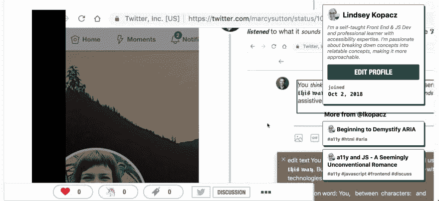](https://user-images.githubusercontent.com/6540866/53337945-67f56800-38d0-11e9-88dd-6d6c1c3a36d4.png)

**桌面(请填写以下信息):**

*   操作系统:Mac Mojave
*   浏览器:Chrome 版本 72.0.3626.109
*   版本:10.14.3

[View on GitHub](https://github.com/thepracticaldev/dev.to/issues/1885)

*   @mrm8488 请求了一个可以自动给文章添加标签的功能。谢谢， [@mrm8488](https://dev.to/mrm8488) ！

# [ 给帖子自动添加标签 #1934](https://github.com/thepracticaldev/dev.to/issues/1934) 

[](https://github.com/mrm8488) **[mrm8488](https://github.com/mrm8488)** posted on [<time datetime="2019-03-01T15:28:29Z">Mar 01, 2019</time>](https://github.com/thepracticaldev/dev.to/issues/1934)

我在想**标记帖子“级别”**(初级、中级、专业等)的功能。我认为用户很难确定他/她的帖子属于哪个“级别”。

幸运的是，现在我们可以使用机器学习和 last NLP 方法来自动完成那种任务。

另一方面，我们甚至可以将这种技术用于标签文章类别，而不是友好的评论等等。

我们需要什么？我们需要一个包含标签帖子的大数据集来开始工作。

[View on GitHub](https://github.com/thepracticaldev/dev.to/issues/1934)

*   @butonix 提出了一个问题，在开发模式下，在 v2 编辑器中上传封面图片会出错。谢谢， [@butonix](https://dev.to/butonix) ！

# [ 封面上传错误 #1935](https://github.com/thepracticaldev/dev.to/issues/1935) 

[](https://github.com/Butonix) **[Butonix](https://github.com/Butonix)** posted on [<time datetime="2019-03-01T17:17:10Z">Mar 01, 2019</time>](https://github.com/thepracticaldev/dev.to/issues/1935)

**描述 bug** 上传一张图片，得到一个错误。

**重现**重现行为的步骤:

1.  转到'[http://localhost:3000/new](http://localhost:3000/new)'
2.  点击“/图片/封面图片”上传图片

```
Heads up:
main_image: is not a valid URL 
```

**截图** [](https://user-images.githubusercontent.com/29381099/53654523-f6664280-3c5e-11e9-9f77-dd4e4e0dbaa7.png)

[View on GitHub](https://github.com/thepracticaldev/dev.to/issues/1935)

*   @giorgosk 报告了一个问题，一篇文章可能会在评论区的“更多文章”中出现两次。谢谢， [@giorgosk](https://dev.to/giorgosk) ！

# [ 帖子相关内容在  #1949](https://github.com/thepracticaldev/dev.to/issues/1949) 帖子的评论后出现两次

[](https://github.com/GiorgosK) **[GiorgosK](https://github.com/GiorgosK)** posted on [<time datetime="2019-03-02T14:58:00Z">Mar 02, 2019</time>](https://github.com/thepracticaldev/dev.to/issues/1949)

一个相关的帖子在帖子和评论后出现两次

**转载**在这个帖子上看到过【https://dev.to/psnebc/install-drupal-console-536g[和](https://dev.to/psnebc/install-drupal-console-536g)这两个帖子是“101 条 Bash 命令和给新手到专家的提示”，出现在两个不同的地方。看看截图，但也许你可以看到它访问的网址

注意:两次我试图访问的网址，我得到了第一个“500 错误”，然后在第二次尝试，我会得到实际内容。也许这是巧合。

**预期行为**也许这个空间应该给另一个职位

**截图** [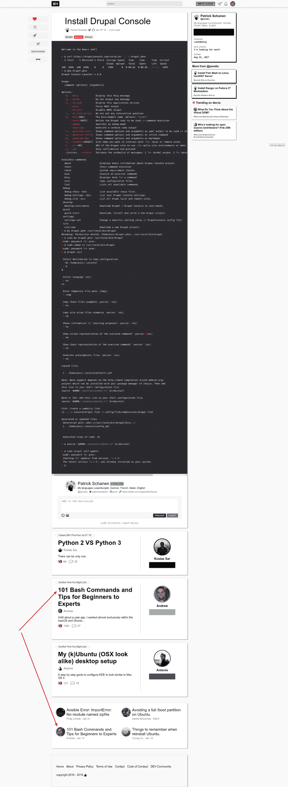](https://user-images.githubusercontent.com/520704/53683668-3c2d1480-3d0c-11e9-80a3-b80faba4cdab.png)

[View on GitHub](https://github.com/thepracticaldev/dev.to/issues/1949)

*   @maheshhost 请求了一个功能，你可以在阅读帖子后滚动到顶部。谢谢， [@maheshhost](https://dev.to/maheshhost) ！

# [ 上卷 #1952](https://github.com/thepracticaldev/dev.to/issues/1952) 

[](https://github.com/maheshhost) **[maheshhost](https://github.com/maheshhost)** posted on [<time datetime="2019-03-03T05:20:25Z">Mar 03, 2019</time>](https://github.com/thepracticaldev/dev.to/issues/1952)

请添加“滚动到顶部”按钮。我每天从 dev.to 阅读技术博客，一些博客太长了，所以最后我们需要再次滚动到顶部，所以如果有一个滚动到顶部的按钮，对读者来说很容易到达顶部。

谢谢你

[View on GitHub](https://github.com/thepracticaldev/dev.to/issues/1952)

*   @ oscheller 报告了一个错误，跟随一个团队不能在“跟随”仪表板中正确显示。谢谢，[@奥谢勒](https://dev.to/oscherler)！

# [ 跟随一个团队似乎没有做什么事情【1958 号](https://github.com/thepracticaldev/dev.to/issues/1958)

[](https://github.com/oscherler) **[oscherler](https://github.com/oscherler)** posted on [<time datetime="2019-03-04T10:03:02Z">Mar 04, 2019</time>](https://github.com/thepracticaldev/dev.to/issues/1958)

**描述 bug**

dev.to 上似乎有团队的概念，帖子是由团队的一个成员写的，但是列在团队名下。但是这些帖子上的 Follow 按钮似乎没有任何作用，

**重现**

重现该行为的步骤:

1.  转到'[https://dev . to/vuevixens/hands-on-vue js-for-初学者-part-6-5e7l](https://dev.to/vuevixens/hands-on-vuejs-for-beginners-part-6-5e7l)'；

    作者是玛丽娜·莫斯蒂(Marina Mosti)，但这篇文章是在 Vue Vixens 标题下提交的，下面的按钮是为 Vue Vixens (vuevixens)准备的:

[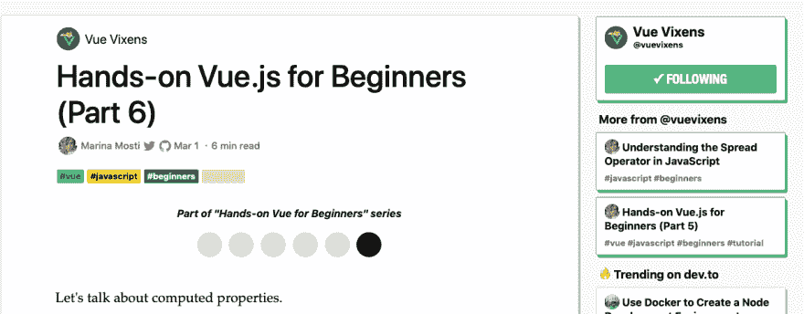](https://user-images.githubusercontent.com/189712/53725547-84634880-3e6c-11e9-8896-05a918368f3b.png)

2.  点击“关注”；
3.  转到'[https://dev.to/dashboard/following](https://dev.to/dashboard/following)'；
4.  你既没有跟踪 Vue Vixens，也没有跟踪 Marina Mosti
5.  等待玛丽娜·莫斯蒂发布一个新的令人敬畏的帖子；
6.  你没有收到通知。

**预期行为**

1.  Vue Vixens 出现在你下一页的某个地方；
2.  每当 Vue Vixens 团队的任何成员发布新帖子时，您都会收到通知。

除非我误解了整个团队。；-)

**桌面(请填写以下信息):**

*   操作系统:苹果操作系统 10.14
*   浏览器 Safari 12

[View on GitHub](https://github.com/thepracticaldev/dev.to/issues/1958)

*   [@john_papa](https://dev.to/john_papa) 请求一个功能，其中标签应该链接到标签本身，无论它们出现在哪里。谢谢， [@john_papa](https://dev.to/john_papa) ！

# [ 在标签出现的任何地方创建链接 #1991](https://github.com/thepracticaldev/dev.to/issues/1991) 

[](https://github.com/johnpapa) **[johnpapa](https://github.com/johnpapa)** posted on [<time datetime="2019-03-06T14:25:29Z">Mar 06, 2019</time>](https://github.com/thepracticaldev/dev.to/issues/1991)

当我在很多地方看到一个帖子时，我希望能够点击标签来查看更多这样的内容。在这一点上，一个始终如一的 UX 也会有所帮助。

这是我的仪表板中一篇文章的摘要视图，其中的标签不是今天的链接

[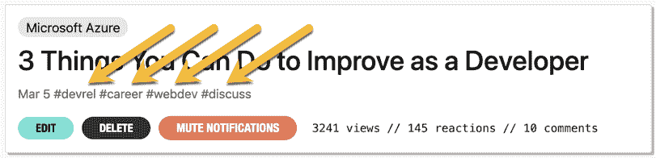](https://user-images.githubusercontent.com/1202528/53888047-860a4900-3ff1-11e9-9c96-644076b23328.png)

这是链接，页面上有下划线[https://dev.to/t/webdev](https://dev.to/t/webdev)

[](https://user-images.githubusercontent.com/1202528/53888098-a5a17180-3ff1-11e9-8c74-2e75fedd1c19.png)

这里是帖子本身带有颜色的链接

[](https://user-images.githubusercontent.com/1202528/53888145-beaa2280-3ff1-11e9-8090-89ce970f6b50.png)

[View on GitHub](https://github.com/thepracticaldev/dev.to/issues/1991)

*   [@joshcheek](https://dev.to/joshcheek) 报告了一个关于页面过期的问题。谢谢， [@joshcheek](https://dev.to/joshcheek) ！

# [ 关于页面过时的 #1992](https://github.com/thepracticaldev/dev.to/issues/1992) 

[](https://github.com/JoshCheek) **[JoshCheek](https://github.com/JoshCheek)** posted on [<time datetime="2019-03-06T17:22:30Z">Mar 06, 2019</time>](https://github.com/thepracticaldev/dev.to/issues/1992)

关于页面的[与](https://dev.to/about)[自述](https://github.com/thepracticaldev/dev.to/tree/a17cfe7d335cbf15fd70208e9cb6e3904cfe0a20#core-team)不一致

[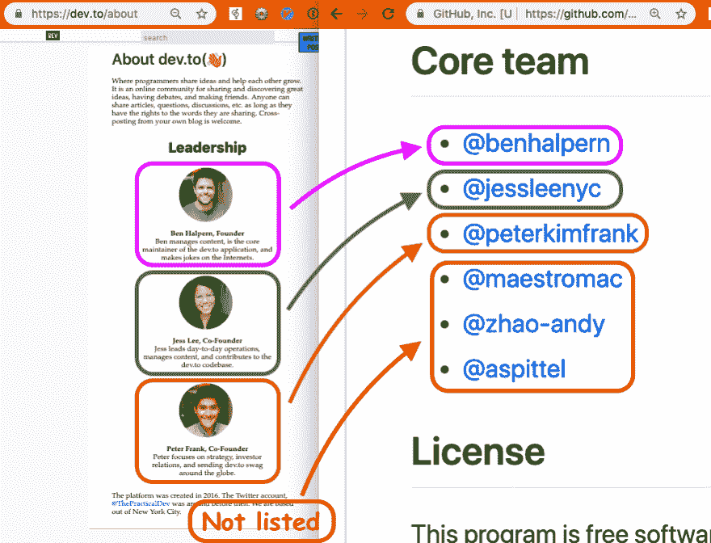](https://user-images.githubusercontent.com/77495/53900373-09cc3180-4002-11e9-9847-9ac688918df1.png)

[View on GitHub](https://github.com/thepracticaldev/dev.to/issues/1992)

*   [@twhite](https://dev.to/twhite) 报告了更改用户名会超时的问题。谢谢，@ twhite！

# [ 更改用户名导致 503“首字节超时” #1994](https://github.com/thepracticaldev/dev.to/issues/1994) 

[](https://github.com/twhite96) **[twhite96](https://github.com/twhite96)** posted on [<time datetime="2019-03-06T22:44:50Z">Mar 06, 2019</time>](https://github.com/thepracticaldev/dev.to/issues/1994)

描述 bug 对 bug 的清晰简洁的描述。更改用户名时，Varnish 缓存第一个字节超时错误

**重现**重现行为的步骤:

1.  转到个人资料
2.  点击用户名
3.  键入新用户名
4.  按提交
5.  503 第一个字节超时 Guru 中介

预期行为对你预期会发生的事情的清晰简明的描述。点击提交后，我希望更改我的用户名

**截图**如果适用，添加截图来帮助解释您的问题。

[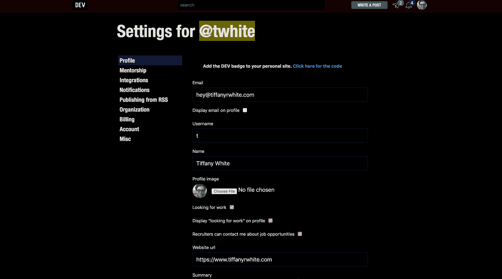](https://camo.githubusercontent.com/e6983f07deee74dfd40929b2713973ffccf6135d/68747470733a2f2f636c2e6c792f3239346364313033396339612f53637265656e253235323532305265636f7264696e6725323532353230323031392d30332d30362532353235323061742532353235323030352e343325323532353230504d2e676966)

**智能手机(请填写以下信息):**

*   设备:2015 款 iMac 5k 27 英寸
*   操作系统:macOS 10.14.4

**附加上下文**在此处添加关于该问题的任何其他上下文。

我已经尽我所能了，但这似乎是服务器的问题。

[View on GitHub](https://github.com/thepracticaldev/dev.to/issues/1994)

*   [@lightalloy](https://dev.to/lightalloy) 写了一个问题，详细说明了将异步通知方法移动到 ActiveJob 的过程。谢谢安娜。

# [ 将异步通知方法移动到活动作业 #1996](https://github.com/thepracticaldev/dev.to/issues/1996) 

[](https://github.com/lightalloy) **[lightalloy](https://github.com/lightalloy)** posted on [<time datetime="2019-03-07T13:05:38Z">Mar 07, 2019</time>](https://github.com/thepracticaldev/dev.to/issues/1996)

*   将异步通知方法移动到单独的活动作业
*   传递实体`id`而不是对象
*   在跟进之前，检查实体是否存在

这些方法可能会导致延迟作业错误(#1621)，因此应该首先解决:

*   【x】`send_new_follower_notification`# 2030
*   [x] `send_reaction_notification`
*   [x] `send_new_comment_notifications`

其他异步方法:

*   [x] `send_to_followers`
*   【x】`send_new_badge_notification`# 2474
*   【x】`send_welcome_notification`# 2485
*   [x] `send_moderation_notification`
*   [x] `send_mention_notification` [@copasetickid](https://dev.to/copasetickid)
*   [x] `send_tag_adjustment_notification`
*   【x】`send_milestone_notification`# 2804
*   [x][@ Cyril efr](https://dev.to/cyrillefr)
*   [x][@ Cyril efr](https://dev.to/cyrillefr)
*   [x]`update_notifications`[@轻合金](https://dev.to/lightalloy)

[View on GitHub](https://github.com/thepracticaldev/dev.to/issues/1996)

*   [@bnb](https://dev.to/bnb) 报告了一个大`manifest.json`图标与小图标不同的问题。谢谢， [@bnb](https://dev.to/bnb) ！

# [ 大的“manifest.json”图标与主图标不同。 #1999](https://github.com/thepracticaldev/dev.to/issues/1999) 

[](https://github.com/bnb) **[bnb](https://github.com/bnb)** posted on [<time datetime="2019-03-07T22:49:09Z">Mar 07, 2019</time>](https://github.com/thepracticaldev/dev.to/issues/1999)

描述 bug 对 bug 的清晰简洁的描述。

随着 Chrome 新推出的桌面 PWA 功能，`manifest.json`中的 100%方形`512x512`图像被加载，而不是圆形的`192x192`版本。在桌面/macOS 上，方形版本看起来没有圆形版本那么精致。

[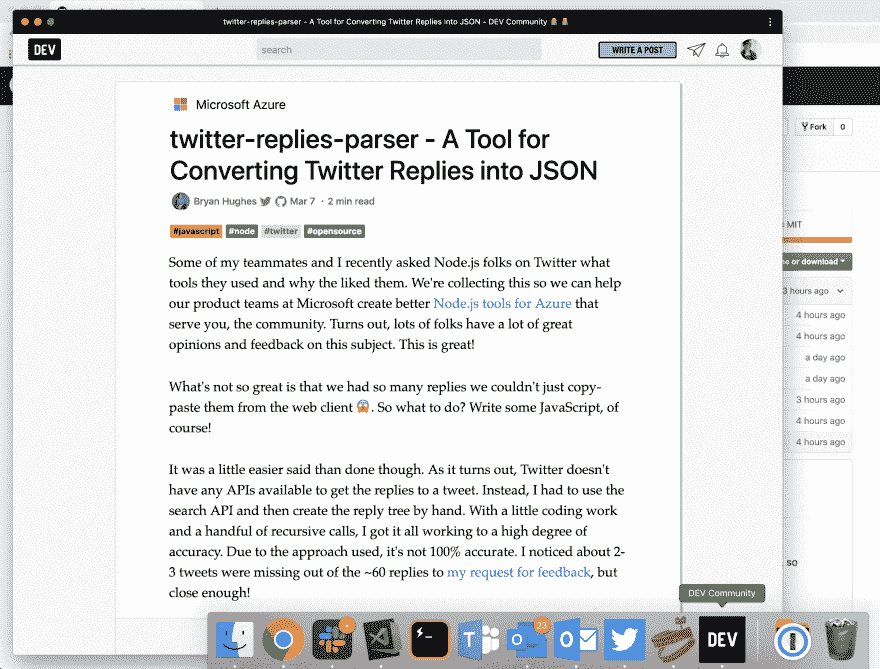](https://user-images.githubusercontent.com/502396/53994598-c1476d80-4100-11e9-8ce7-31a3fa8c7541.png)

**重现**重现行为的步骤:

1.  从桌面上的 Chrome 菜单将 dev.to 添加到您的桌面:

*   单击垂直圆点菜单>安装开发人员社区

2.  打开应用程序
3.  参见图标<g-emoji class="g-emoji" alias="smile" fallback-src="https://github.githubassets.cimg/icons/emoji/unicode/1f604.png">😄</g-emoji>

**预期行为【512x512 应使用圆角版图像，而不是方形版。**

**桌面(请填写以下信息):**

*   操作系统:[例如 iOS] macOS
*   浏览器[例如 chrome、safari] Chrome
*   版本[例如 22] 72.0.3626.119

[View on GitHub](https://github.com/thepracticaldev/dev.to/issues/1999)

*   @michael-tharrington 报告了在 Safari 上上传封面图片会出错的问题。谢谢你，迈克尔！

# [ 发布在 Safari 上传封面图片 #2008](https://github.com/thepracticaldev/dev.to/issues/2008) 

[](https://github.com/michael-tharrington) **[michael-tharrington](https://github.com/michael-tharrington)** posted on [<time datetime="2019-03-08T19:50:23Z">Mar 08, 2019</time>](https://github.com/thepracticaldev/dev.to/issues/2008)

一位用户报告在 Safari 中上传封面图像时遇到问题:

“嘿嘿战队！

只是想联系一下，因为我想我发现了 Safari 上传图片的问题。

我试着上传我的帖子[https://dev.to/michael/silencing-the-lizard-brain-4leg](https://dev.to/michael/silencing-the-lizard-brain-4leg)的封面图片，但是每次我点击完成，什么都不会出现。

最后想到看看控制台窗口，在 Safari 上看到了这个..."

[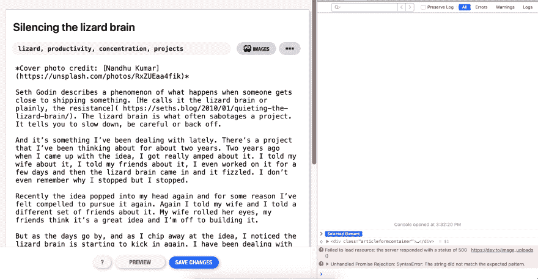](https://user-images.githubusercontent.com/16007075/54051952-0fb44500-41b1-11e9-9f14-834c539248c0.png)

**附加上下文**

*   他们使用我们的 v2 编辑器。
*   如果有帮助的话，这里还有一个图片链接——[https://unsplash.com/photos/RxZUEaa4fik](https://unsplash.com/photos/RxZUEaa4fik)

[View on GitHub](https://github.com/thepracticaldev/dev.to/issues/2008)

*   [@mcataford](https://dev.to/mcataford) 请求了一个通知可以有时间戳的功能。谢谢@麦卡塔福德！

# [ 时间戳通知 #2010](https://github.com/thepracticaldev/dev.to/issues/2010) 

[](https://github.com/mcataford) **[mcataford](https://github.com/mcataford)** posted on [<time datetime="2019-03-08T23:52:53Z">Mar 08, 2019</time>](https://github.com/thepracticaldev/dev.to/issues/2010)

**您的功能请求是否与某个问题相关？请描述一下。**今天早些时候，我查看了我的通知历史记录，注意到每张通知卡都没有时间戳，如果你试图查看更大的通知流，并需要了解有关回复何时发布的详细信息，这可能会有点混乱。

[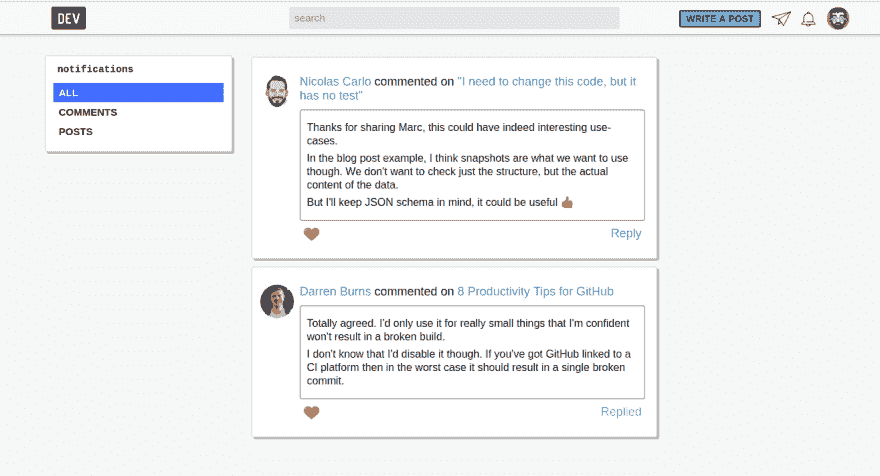](https://user-images.githubusercontent.com/6210361/54062272-12c02d00-41d3-11e9-903d-6e59876729ed.png)

**描述您想要的解决方案**每个通知的时间戳应该在通知选项卡中可见。

**描述你考虑过的替代方案**打开每个通知，这很快就会变得很麻烦。

我很乐意接手这项工作，但我不确定这是否是因为某些技术限制而被故意遗漏的功能。如果通知周围有额外的时间上下文，那就太棒了。

[View on GitHub](https://github.com/thepracticaldev/dev.to/issues/2010)

*   [@heyitry](https://dev.to/heyitry) 报告了一个错误，更改用户名有时可能不会更新帖子的路径，并阻止您查看和编辑帖子。谢谢， [@heyitry](https://dev.to/heyitry) ！

# [ 试图访问未完成/未发布的帖子  #2014](https://github.com/thepracticaldev/dev.to/issues/2014) 时出错

[](https://github.com/joshuaalm) **[joshuaalm](https://github.com/joshuaalm)** posted on [<time datetime="2019-03-09T15:30:18Z">Mar 09, 2019</time>](https://github.com/thepracticaldev/dev.to/issues/2014)

**描述 bug** 试图完成一个长期被忽视的未完成的帖子，我得到一个错误 500。

**重现**重现行为的步骤:

1.  转到我的仪表板
2.  点击四篇未发表文章中最后三篇的标题或编辑按钮
3.  参见错误

**预期行为**查看和/或编辑帖子

**桌面(请填写以下信息):**

*   操作系统:Windows 10 1809
*   浏览器 Mozilla
*   66.0b12 版

可能与此相关的是，我最初注册了一个与我的 Twitter 账户相关的账户，然后开始使用我的 GitHub 账户，在提交了一个与此相关的问题后，我的账户被修复了。可能后面的帖子是在我的 GitHub 账户成为我登录 dev.to 的主要手段之后创建的。

[View on GitHub](https://github.com/thepracticaldev/dev.to/issues/2014)

*   [@lightalloy](https://dev.to/lightalloy) 做了一个启用 Rubocop 的参考问题。如果你想帮助我们解决其中的任何一个问题，就来看看吧！谢谢安娜。

# [ 启用 rubo cops# 2021](https://github.com/thepracticaldev/dev.to/issues/2021)

[](https://github.com/lightalloy) **[lightalloy](https://github.com/lightalloy)** posted on [<time datetime="2019-03-11T09:01:50Z">Mar 11, 2019</time>](https://github.com/thepracticaldev/dev.to/issues/2021)

**您的功能请求是否与某个问题相关？请描述一下。**目前，许多`rubocop`警察被禁用(见`.rubocop.yml`)，我认为启用大部分警察会有好处。通过这种方式，至少新代码将遵循指导原则。

**描述你想要的解决方案**我喜欢我们处理视图林挺问题的方式(#1842)类似的方法也适用于 ruby 代码&rubocop

我建议的工作流程是:

*   从`.rubocop.yml`启用 1 个 cop
*   如果可能，修复相关问题
*   如果这不可能(或者不是最佳的)，就在`.rubocop_todo.yml`中添加异常(已经有一些例子了)
*   提出拉取请求

对于一些警察来说，代码中没有违规，所以他们可能只是被启用。如果这个问题得到批准，我可以准备一份警察名单。

[View on GitHub](https://github.com/thepracticaldev/dev.to/issues/2021)

*   [@rhymes](https://dev.to/rhymes) 报告了数据导出无法正常工作的问题。谢谢，[@韵](https://dev.to/rhymes)！

# [ 数据导出不工作 #2031](https://github.com/thepracticaldev/dev.to/issues/2031) 

[](https://github.com/rhymes) **[rhymes](https://github.com/rhymes)** posted on [<time datetime="2019-03-11T14:38:23Z">Mar 11, 2019</time>](https://github.com/thepracticaldev/dev.to/issues/2031)

**描述 bug**

几天前，我请求将我在 dev.to 上的内容导出，请求者生成了通知消息，但我从未收到过电子邮件。

我回去检查了一下[https://dev.to/settings/misc](https://dev.to/settings/misc)，发现该功能仍然被禁用:

[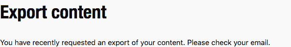](https://user-images.githubusercontent.com/146201/54131796-5d2fec80-4413-11e9-92ee-d62aacfa42ed.png)

这意味着负责导出的异步作业尚未完成。要么卡住了，要么已经死了。这也可能是我没有收到邮件的原因。

**重现**重现行为的步骤:

1.  前往[https://dev.to/settings/misc](https://dev.to/settings/misc)
2.  向下滚动到“导出内容”
3.  请求出口
4.  等待

**预期行为**

我希望工作能够及时完成，电子邮件能够及时送达，功能能够重新启用。

**桌面(请填写以下信息):**

*   操作系统:苹果操作系统 10.14
*   浏览器:Firefox
*   版本:66

[View on GitHub](https://github.com/thepracticaldev/dev.to/issues/2031)

*   [@jess](https://dev.to/jess) 要求我们在 markdown 中支持`<details>` / `<summary>`标签。谢谢杰西。

# [ 支持<明细> / <汇总>标签在 markdown  #2045](https://github.com/thepracticaldev/dev.to/issues/2045) 

[](https://github.com/jessleenyc) **[jessleenyc](https://github.com/jessleenyc)** posted on [<time datetime="2019-03-12T19:21:53Z">Mar 12, 2019</time>](https://github.com/thepracticaldev/dev.to/issues/2045)

**您的功能请求是否与某个问题相关？请描述一下。**

<details>/ <summary>tags are support in github markdown and I'd like to use them on DEV as well.</summary></details>[View on GitHub](https://github.com/thepracticaldev/dev.to/issues/2045)

*   @john_papa 请求了一个功能，可以将 GitHub repo 中的代码嵌入到帖子中。谢谢， [@john_papa](https://dev.to/john_papa) ！

# [ 嵌入 GitHub 代码 #2046](https://github.com/thepracticaldev/dev.to/issues/2046) 

[](https://github.com/johnpapa) **[johnpapa](https://github.com/johnpapa)** posted on [<time datetime="2019-03-12T20:53:10Z">Mar 12, 2019</time>](https://github.com/thepracticaldev/dev.to/issues/2046)

我试着在 github 的一篇帖子里嵌入了几行代码。它不起作用，但如果起作用的话，那就太酷了。

我认为这将是预期的格式

{ % github[https://github.com/johnpapa/vscode-peacock/blob/master/.vscodeignore#L12-L17](https://github.com/johnpapa/vscode-peacock/blob/master/.vscodeignore#L12-L17) %}

[View on GitHub](https://github.com/thepracticaldev/dev.to/issues/2046)

*   @eyuzwa 请求了一个可以隐藏或标记已读通知的功能。谢谢， [@eyuzwa](https://dev.to/eyuzwa) ！

# [ 给通知  #2048](https://github.com/thepracticaldev/dev.to/issues/2048) 增加一个“已读”按钮

[](https://github.com/erikyuzwa) **[erikyuzwa](https://github.com/erikyuzwa)** posted on [<time datetime="2019-03-13T02:30:25Z">Mar 13, 2019</time>](https://github.com/thepracticaldev/dev.to/issues/2048)

**您的功能请求是否与某个问题相关？请描述一下。**不是“令人沮丧”，而是我不知道如何删除我列表中的一个通知。我只看到心脏和“保存”按钮。点击文章也不会将其从通知列表中删除(至少对我来说是这样)。

**描述您想要的解决方案**最好有一个“x”或“read”按钮来确认通知并让它消失。

**描述您考虑过的替代方案**我在查看通知时刷新了页面，并阅读了一篇通知链接的文章。这两个操作都不会删除任何通知。

**附加上下文**在此添加关于功能请求的任何其他上下文或截图。

[View on GitHub](https://github.com/thepracticaldev/dev.to/issues/2048)

*   @jess 发起了一个关于我们如何提供工具来联系那些想要帮助编辑帖子的人的讨论。请随意插话！谢谢杰西。

# [ 求/志愿求编辑帮忙 #2055](https://github.com/thepracticaldev/dev.to/issues/2055) 

[](https://github.com/jessleenyc) **[jessleenyc](https://github.com/jessleenyc)** posted on [<time datetime="2019-03-13T15:15:56Z">Mar 13, 2019</time>](https://github.com/thepracticaldev/dev.to/issues/2055)

**您的功能请求是否与某个问题相关？请描述一下。**将需要帮助编辑帖子的人与愿意提供帮助的人联系起来。正如[https://github . com/the practical dev/dev . to/issues/464 # issue comment-472454990](https://github.com/thepracticaldev/dev.to/issues/464#issuecomment-472454990)所描述的，以及我们听说的一些趣闻，发布它可能会令人生畏。

**描述你想要的解决方案**我们可以让人们在他们的帖子上请求帮助，并向任何具有“志愿编辑”角色的人发送通知，但我们需要对未发布的帖子进行某种形式的版本控制或评论系统。

**描述你考虑过的替代方案**也许开始时，我们可以简单地将人们彼此联系起来，让他们在平台外处理细节。

[View on GitHub](https://github.com/thepracticaldev/dev.to/issues/2055)

*   我提出了一个问题，登录可能需要很长时间，主要是因为我们有大量的 SQL 查询。

# [# 2061](https://github.com/thepracticaldev/dev.to/issues/2061)中用于签约的 SQL 查询金额较低

[](https://github.com/Zhao-Andy) **[Zhao-Andy](https://github.com/Zhao-Andy)** posted on [<time datetime="2019-03-13T22:03:39Z">Mar 13, 2019</time>](https://github.com/thepracticaldev/dev.to/issues/2061)

目前，一些人(包括我自己)正在经历长时间的登录，这通常会超时，从而阻止人们登录。

查看[天窗](https://oss.skylight.io/app/applications/K9H5IV3RqKGu/recent/6h/endpoints?query=omniauthcallbackscontroller)我们可以看到请求平均花费 2.7 秒。在`#github`或`#twitter`动作中我们可以看到有很多重复的查询: [](https://user-images.githubusercontent.com/17884966/54316514-593ccf80-45b7-11e9-9c7b-0474d7697589.png)

这肯定可以重构，查询的数量也可以减少。需要重构的主要(可能是唯一)文件是 [authorization_service.rb 文件](https://github.com/thepracticaldev/dev.to/blob/master/app/services/authorization_service.rb)。

当然，这应该小心处理，因为这会影响人们如何授权自己进入应用程序。登录过程应该仍然有效，重构不应该导致任何奇怪的数据泄漏(可能很难完成，但是记住这一点是有好处的)。

[View on GitHub](https://github.com/thepracticaldev/dev.to/issues/2061)

*   @kayis 报告了一个在搜索页面上更改文章标题的问题。谢谢， [@kayis](https://dev.to/kayis) ！

# [ 改变一篇文章的标题会把我带到一个搜索页面 #2068](https://github.com/thepracticaldev/dev.to/issues/2068) 

[](https://github.com/kay-is) **[kay-is](https://github.com/kay-is)** posted on [<time datetime="2019-03-15T13:47:09Z">Mar 15, 2019</time>](https://github.com/thepracticaldev/dev.to/issues/2068)

**描述 bug** 我创建了一篇新文章并保存了它。然后我想改变标题，它把我带到了一个显示给用户的标题为“搜索结果-开发者社区”的页面，而**的网址仍然包括旧标题**。

**重现**重现行为的步骤:

1.  创建新文章
2.  保存
3.  改标题
4.  保存
5.  在搜索结果页面结束

**预期行为**获取一个新的 URL 并再次出现在编辑器中。

**桌面(请填写以下信息):**

*   操作系统:macOS Mojave
*   浏览器:Firefox
*   版本:65.0.1 (64 位)

[View on GitHub](https://github.com/thepracticaldev/dev.to/issues/2068)

# 开发-iOS

我们最近没有任何新的问题或 PRs 合并。请随意查看 [iOS 回购](https://github.com/thepracticaldev/dev-ios)，或者在 App Store 下载[我们的 iOS 应用。](https://itunes.apple.com/us/app/dev-community/id1439094790)

随着我们过渡到回购摘要的新格式，我将在周五发布另一个版本，涵盖 3 月 16 日(上周六)至 3 月 22 日(下周五)。再次感谢阅读！