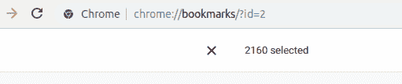
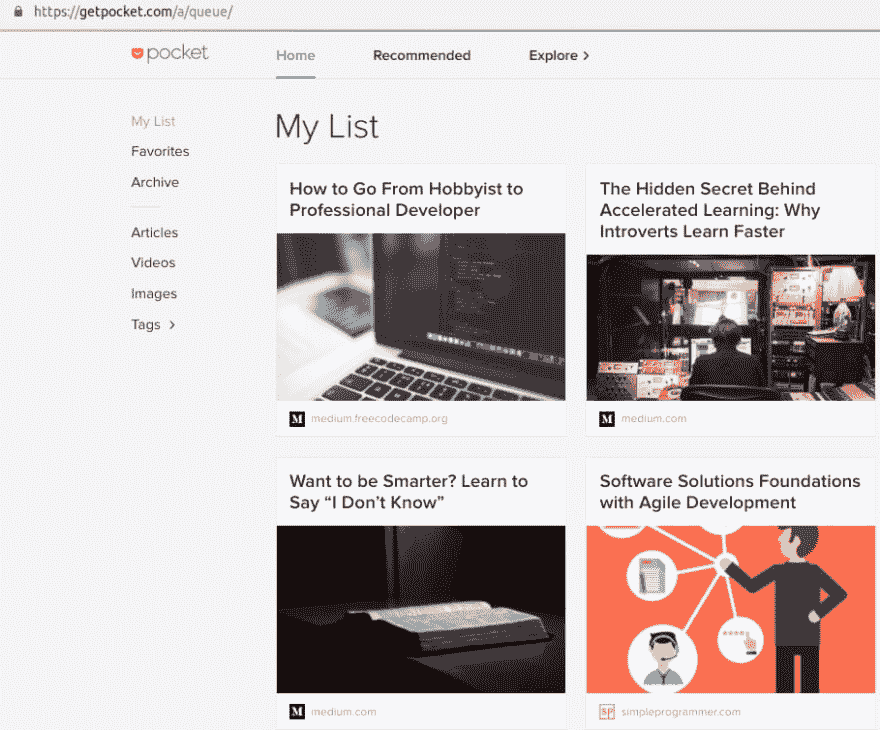
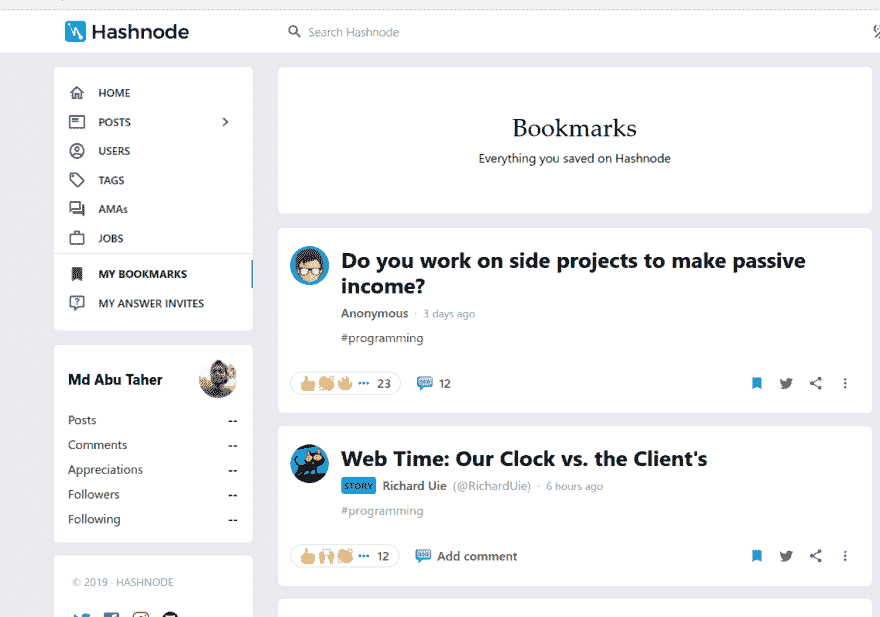
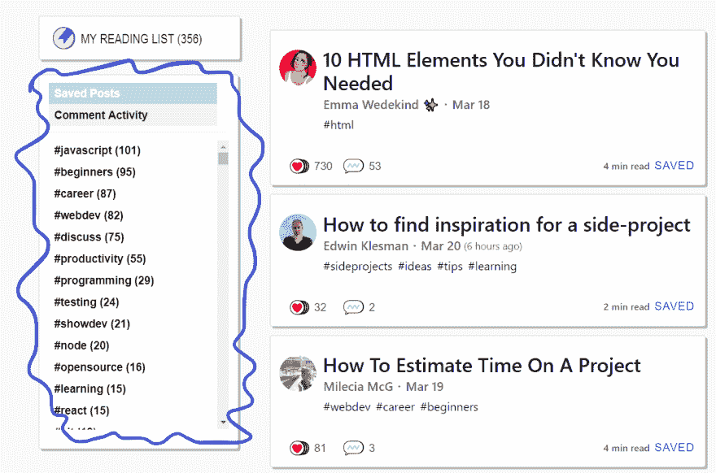
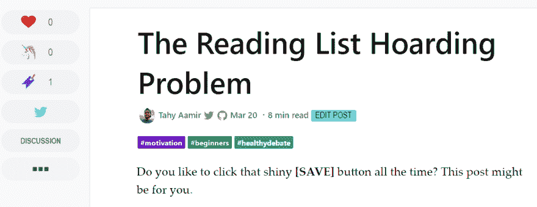

# 阅读清单囤积问题

> 原文：<https://dev.to/entrptaher/the-reading-list-hoarding-problem-27jj>

你喜欢一直点击那个闪亮的**【保存】**按钮吗？这篇文章可能是给你的。

下面是本台目前的阅读情况列表，

注意:当我第一次开始写这篇文章时，它是 328，现在是 356😱，我怎么能写一个我自己都摆脱不掉的帖子呢？朋友，在我写作的时候，我有一个阅读清单囤积的问题，我想摆脱它。这篇文章献给我。我只是想分享一下我的经历。

同样去我的书签标签，那里至少有 2k+书签。
[T3】](https://res.cloudinary.com/practicaldev/image/fetch/s--0C6E4WLo--/c_limit%2Cf_auto%2Cfl_progressive%2Cq_auto%2Cw_880/http://i.imgur.com/tLYj63D.png)

这里是口袋的现状，

Hashnode 还有一个被过度使用的书签特性:

我有过 feeds，pinterest，medium，facebook 保存的帖子，以及数百个其他解决方案，只是为了以后保存一些东西。

如果我没记错的话，我买过书，课程，教程，收藏在几百个文件夹里，就像书单囤积一样，我看完书单的时间？它从来没有来过。我只是后来忘记看了，因为我的生活很忙。

任何地方都有 2%到 6%的成年人患有囤积症。是的，在我看来，这是一种混乱，甚至在互联网上也存在。

因此，我们需要谈论它。

# 囤积者的类型

囤积者有几种类型，你可能是其中之一。

### “我以后可能会看”囤积者

一些读者有一个很好的收藏，所有的分类都很恰当，包括他们渴望阅读的标题。然而，这些读者中的一些人一看到另一个令人敬畏/受欢迎的帖子/媒体，就完全忘记了他们之前列表的存在。

一旦他们把它存起来，他们就开始想他们现在怎么没有时间去读它，并发誓有一天会很快读完它，但很快就会忘记他们的誓言。

随着他们找到更多可能会在以后阅读的精彩帖子，这个循环还在继续。

### “我爱这个作家，我以后会看的”囤积者

他们将 linustechtips(或*插入热门技术名称*)发布的所有/任何视频、莫莉·斯特鲁维或艾玛·韦德金德(Emma Wedekind)或(*插入你最喜欢/最受欢迎的作家*)写的任何帖子加入书签。

它表达了对作者的爱和欣赏。没关系，鼓励他们生产更多有价值的内容。

但是作为一个囤积者，阅读清单越来越多，大多数人只是忘记阅读。一旦有人说了反对他们最喜欢的作家的话，或者如果他们在保存的列表中找不到内容，他们就会精神崩溃。

### 《这篇帖子改变了我的人生》囤积者

他们阅读帖子，开始将他们的生活与内容联系起来，他们带着如此大的热情阅读它，以至于它最终对他们的生活产生了巨大的影响。

在那之后，似乎没有其他的职位像那一个一样重要。他们可能会收藏一些其他的帖子，但最终会一遍又一遍地阅读同一个帖子。

他们存一个帖子只是为了存，他们读一个帖子只是为了改变他们的生活。

### “我会再读一遍这个”囤积者

有时他们并不像上面提到的“冲击囤积者”那样狂热，但是他们可能会偶尔再读一遍这篇文章来提神。

他们会很好地使用内容，有时在研究中，有时在他们的内容中。

然而，一旦书签处理一次或几次，它们就不会删除它。他们不爱它，但他们也不删除它。

### “我不同意，我必须适当证明”囤积者

通常上述其他人可能会保存并在一段时间内阅读内容。很少有人会花时间一行一行地分析帖子，并与他人分享他们的评论。

有些人分享简短的评论，推文或视频，但这部分的囤积者不是他们。

他们对帖子形成了一个非常明确的观点，读了几遍，编辑了一个理由列表来证明他们的感觉。通过巧妙运用要点和尊重的话语，他们以极具说服力的方式向其他读者展示了他们的案例。

他们读了内容，最后总是在某个地方发现错误。不管你怎么跟他们讲道理，他们都不会让步。

然而，这并不总是消极的，有时这种囤积者会带来非常有用的信息和对话。你会从他们的观点中学到很多，并有机会从一个完全不同的角度重新思考一些事情。

# 你是哪种囤积者？有关系吗？

除此之外，还有其他类型的囤积者，但没关系。至少他们在囤积链接，做一些可能在某个时候带来价值的事情。他们只是时不时地试图逃避现实，内心保持平静。

一旦他们承认了自己的问题，他们最终会比那些实际上根本不采取任何行动的人带来更多。

# 坏方囤积居奇

*   您正在增加**垃圾使用量**。你做的无用的事情越多，服务器空间就会被占用越多，能源消耗越多，全球变暖越严重。就因为你救了一些没用的东西。
*   很难找到重要的东西。如果你想找到你开始时保存的东西，大多数时候你会很难向下滚动并选择重要的一个。
*   它让你**失去焦点**。你不知道该学什么了。你想同时学习 web 开发、移动开发、项目管理、服务器管理和其他所有东西。
*   它让你焦虑不安。你什么时候能看到那份庞大的清单？你想学的新东西呢？谁来过滤掉你不想学的东西呢？
*   它会导致你出现冒名顶替综合症。你觉得还有很多东西要学。每个人都比你知道得多，分享了很多有价值的信息。你属于这里吗？

# 清除囤积

这将是一个漫长的旅程，就像没有收件箱一样。你需要确凿的证据证明你是一个囤积者，你必须说服自己。(就像我接受自己囤积链接一样)。

### 获得动力

克服囤积需要一些令人印象深刻的承诺。所以在你开始之前，你首先需要真正有动力去做。获得动力将有助于你保持计划的一致性。

*   列出你想要停止囤积的强有力的理由。比如“我想能够更好的理解这个作家”，“我想尽快学习 JavaScript”。我不知道，你的清单，你的推理。
*   每当你觉得你的决定正在改变时，回顾一下这个列表。它会让你想起你自己。

### 了解囤积和收集的区别

囤积者会保存过多的链接/物品，之后很难丢弃或阅读它们。这很难找到，他们大多不知道他们是书签和它去哪里。有时他们会记得他们在第 1000 个书签附近有这个书签，但在任何地方都没有实际的名字。它只是去那里，什么也不做。

收藏家热衷于收集物品作为业余爱好。很多东西都可以收藏。他们想收集什么完全取决于他们。他们组织和显示链接。他们用自己的内容帮助别人，“上周我读过的 10 本书”，“10 大公共演讲技巧”等等。

### 起步慢

不要去删除每个地方的所有链接。不要一次扔掉所有的书，不要把所有的垃圾都扔进垃圾箱，不要删除所有的代码，只是随机地从头开始。

每周/每月打开一个或多个收藏。第一周浏览一个作家/类别，第二周浏览另一个，等等。

### 一次处理一个帖子

不要“暂时”保存东西，这没多大帮助。一件事情只处理一次，这样你就不会重复处理同一个链接。

如果是帖子，就好好读。如果是视频的话，适当看一下。决定你是否应该在那一刻完整地观看/阅读。

一次一个帖子。

### 缩小并组织它

一大团千行乱码 vs 一小团千行乱码。是啊，都很糟糕。乱七八糟的可怕。

然而，一次考虑一小段代码，组织它。这可能需要时间，但是在一天/一周结束的时候，你会有一些满足感。

链接也是一样，如果你试图一次组织所有的链接，你会很沮丧。平稳慢慢处理就好。只需要专注于处理和缩短它。

需要时缩小规模，但不要强求。

### 利用组织功能

在 dev.to 上，你可以按类别/标签查看保存的帖子，pocket 和其他工具也可以让你这样做。

最好能物尽其用。如果你正在学习 javascript，请继续学习，如果你是初学者或试图帮助初学者，请继续学习，如果你在测试方面有问题，请转到#testing tag。清单会清理干净，你会有一个积极健康的心态。

### 抛掉无趣的扑救

你想学 devOps(只是说个例子)，存了一堆链接。但是现在你对它不感兴趣了。

*   扔掉它。把它从你的列表中删除。
*   把它发给真正会从帖子中受益的人。这会增加交流，让你对社区更有帮助。

### 不要拖延

如果你不设定最后期限，你留在阅读清单上的东西将会永远留在那里。在你的日历、白板或便利贴上做个记录。如果你没有在那个时候阅读这篇文章，无条件删除它。

### 保持简单

你不需要一次学会所有的东西。仅仅因为你将来可能想学习 kotlin、rust、c、java、php、python、机器学习，并不意味着你应该只为它们收集链接。它会留在那里，如果你不需要就不要收走。

不要把它留在那里，如果你把它清理干净，它会让你变得更好。清理阅读清单将有助于你理解囤积的坏处，你可以在现实生活中应用它，摆脱书籍，课程和许多其他囤积习惯。

请不要把这篇文章留到以后。喜欢它，并与你的朋友分享，以确保他们也从中受益。

# 防止囤积

不要只阅读随机的帖子。暂时不要单击保存按钮。试着理解这个观点，并快速浏览一下这篇文章。

保持专注和有条理。你的清单会更有质量。这个习惯会在你生活的其他方面帮助你。

如果你觉得这个问题失控了。寻求专业帮助。如果它以一种显著的方式影响着你的生活，那就更是如此。极度囤积是你有其他潜在问题的迹象。

**改为**、**搞**、**分**而不是**存**。这是做出贡献和采取行动的一种方式。

收集课程、链接和书籍只是为了不再阅读？那是一些严重的问题。你现在应该采取行动了！

也许我错了，也许这从来就不是问题。请在评论中告诉我你对此的看法。

编辑:有趣的是这个帖子得到的第一反应也是一个[保存]反应。
[T3】](https://res.cloudinary.com/practicaldev/image/fetch/s--eBf84AOM--/c_limit%2Cf_auto%2Cfl_progressive%2Cq_auto%2Cw_880/https://i.imgur.com/Ze7EY6G.png)