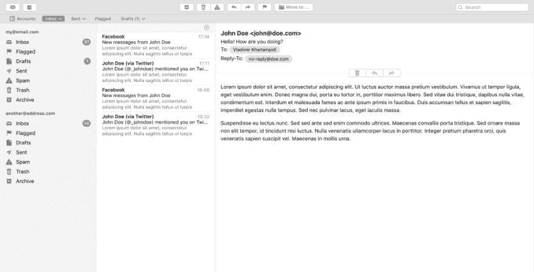
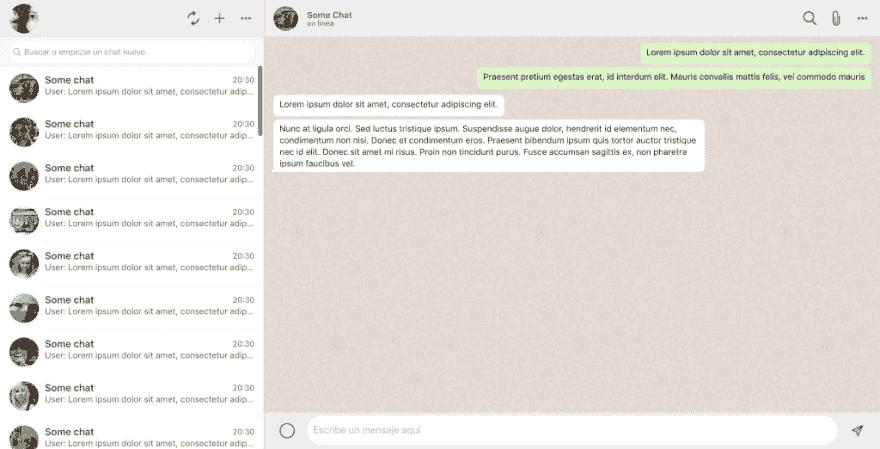
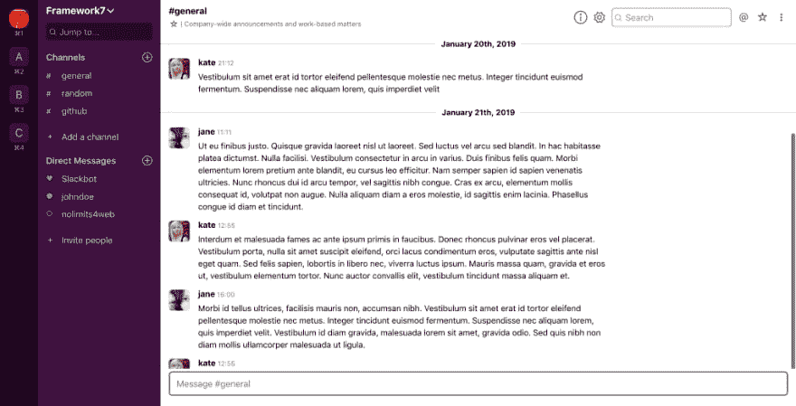
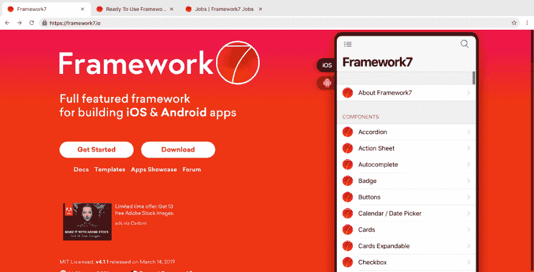
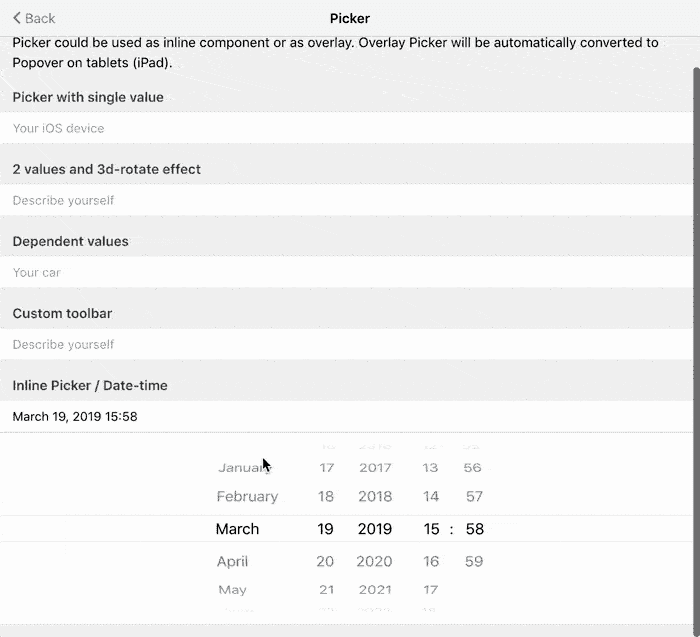
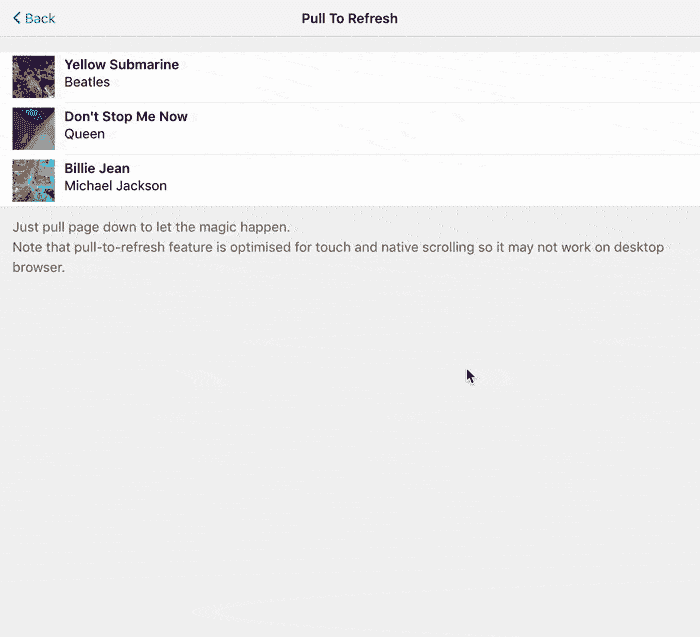
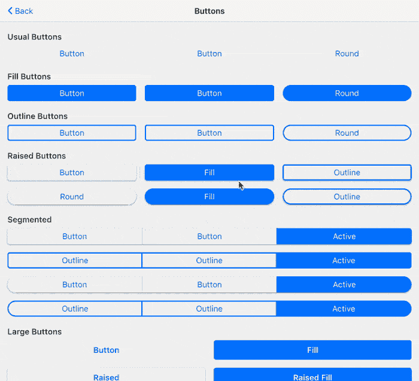
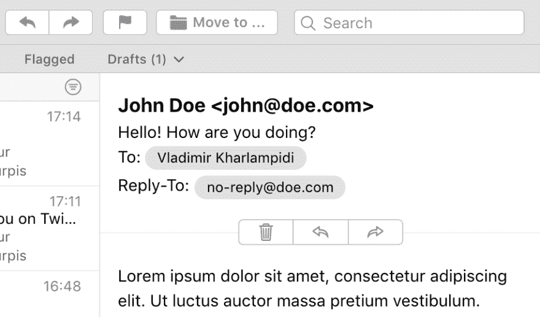

# 认识 Aurora -新框架 7 桌面主题

> 原文：<https://dev.to/framework7/meet-aurora-new-framework7-desktop-theme-4j68>

借助现代网络技术，我们可以构建任何类型的应用程序:本地移动应用程序(使用 Cordova 或 WebView)、网络应用程序、渐进式网络应用程序、本地桌面应用程序(使用 electronic)。Framework7 及其不可及的现成组件和 UI 是所有人的绝佳选择。

但当涉及到原生桌面应用和桌面相关功能时，可能很难选择哪个更适合——iOS 或 MD 主题，这是 Framework7 可能缺乏的一点点领域，成为桌面应用的不那么明显的选择。

现在，桌面应用程序有了解决方案。

## 极光

所以现在来了**极光** - **全新的桌面主题，它现在是 Framework7 的一部分，可以从 Framework7 4.2.0** 中获得。

我们已经重新设计和调整了 Aurora 主题中的每一个组件，使其在桌面应用中的外观、感觉和行为更好。

Aurora 主题的主要思想是提供更接近桌面应用的风格，所以使用这个主题需要更少的努力来定制它。

我们决定用一些不相关的名字，而不是称之为桌面，以避免在 API 和风格上与“桌面”混淆。

下面是您可以使用 Aurora 快速构建的一个秘密峰值:

<figure>[](https://res.cloudinary.com/practicaldev/image/fetch/s--oXfc1wDP--/c_limit%2Cf_auto%2Cfl_progressive%2Cq_auto%2Cw_880/https://cdn-images-1.medium.com/max/1024/1%2ADMoam_HJbGuo8MW4rmQZmg.png) 

<figcaption>macOs 邮件 app</figcaption>

</figure>

<figure>[](https://res.cloudinary.com/practicaldev/image/fetch/s--4YcgBFal--/c_limit%2Cf_auto%2Cfl_progressive%2Cq_auto%2Cw_880/https://cdn-images-1.medium.com/max/1024/1%2Ay3b00qz9LDZteHiVjfcN4Q.png) 

<figcaption>Whatsapp 桌面 app</figcaption>

</figure>

<figure>[](https://res.cloudinary.com/practicaldev/image/fetch/s--3Ym-u36t--/c_limit%2Cf_auto%2Cfl_progressive%2Cq_auto%2Cw_880/https://cdn-images-1.medium.com/max/1024/1%2AY8455YMhD0OJZdVoO6Qn-Q.png) 

<figcaption>桌面懈怠 app</figcaption>

</figure>

<figure>[](https://res.cloudinary.com/practicaldev/image/fetch/s---oh6-PmJ--/c_limit%2Cf_auto%2Cfl_progressive%2Cq_auto%2Cw_880/https://cdn-images-1.medium.com/max/1024/1%2AohU9Lqh3vmftbvYycGEQaA.png) 

<figcaption>谷歌 Chrome</figcaption>

</figure>

所有这些 Aurora 演示布局都可以在 [Framework7 Recipes](https://github.com/framework7io/framework7-recipes) 资源库中找到，您可以在那里现场观看。

## 启用极光

要启用极光主题，我们只需要在应用程序参数
中指定`theme: 'aurora'`

```
new Framework7({
  theme: 'aurora',
}) 
```

如果我们有`theme: 'auto'`的话，只有在[电子](https://electronjs.org)环境下运行 app，极光才会自动启用。

## API 变更

没有任何突破性的变化，但有一堆新的极光相关的参数和属性添加到组件。

所有 app 和组件的主题相关参数，以前都有主题名前缀，如`app.touch.iosTouchRipple`、`view.iosSwipeBack`、`navbar.mdCenterTitle`，现在有了`aurora`前缀，如`auroraTouchRipple`、`auroraSwipeBack`、`auroraCenterTitle`等。

所有的按钮和同类的修改器类和组件道具也可以使用`aurora`后缀，例如`button-round-aurora`只在极光主题中使按钮变圆。

## 主题条件渲染

在 Framework7 Vue 和 React 中，以及在 Framework7 路由器组件中，我们使用`this.$theme.ios`和`this.$theme.md`来区分基于主题的输出。现在，如果你开发极光主题，你还需要考虑`this.$theme.aurora`属性，这将是真正的主题。

在 Framework7 核心 html 模板中，我们在元素上使用了`if-ios` / `ios-only`和`if-md` / `md-only`类，如果使用了其他主题，这些类会被自动移除(或隐藏)。随着 Aurora 的发布，这组类扩展到:

*   `if-ios` -元素将只为 iOS 主题渲染
*   `if-not-ios` -除 iOS 之外的主题元素将被移除/隐藏
*   `if-md` -元素将只为 MD 主题渲染
*   `if-not-md` -除 MD 之外的主题元素将被移除/隐藏
*   `if-aurora` -元素将只为极光主题渲染
*   `if-not-aurora` -除极光之外的主题元素将被移除/隐藏

因此，在以前的版本中，当我们只有两个主题时，我们使用下面的代码来隐藏导航条的后退按钮文本

```
<div class="navbar">
  <div class="navbar-inner sliding">
    <div class="left">
      <a href="#" class="link back">
        <i class="icon icon-back"></i>
        <span class="if-ios">Back</span>
      </a>
    </div>
    ...
  </div>
</div> 
```

但是现在这段代码也将隐藏 Aurora 主题中的 back 按钮文本。所以如果我们也为极光主题开发，我们需要把它改成:

```
<div class="navbar">
  <div class="navbar-inner sliding">
    <div class="left">
      <a href="#" class="link back">
        <i class="icon icon-back"></i>
        <span class="if-not-md">Back</span>
      </a>
    </div>
    ...
  </div>
</div> 
```

## 带鼠标滚轮的拾取器

仅仅只有桌面外观是不够的。你知道 Framework7 对细节的关注是非常突出的。如此多的组件在桌面上也表现得更好。

Picker 基本上是一个只能触摸的组件，绝对不是鼠标友好的组件。现在可以用鼠标滚轮滚动选取器值，默认情况下是启用的。

[](https://res.cloudinary.com/practicaldev/image/fetch/s--svTWDF2F--/c_limit%2Cf_auto%2Cfl_progressive%2Cq_66%2Cw_880/https://cdn-images-1.medium.com/max/700/1%2AyYl9t-SYJIqGEJt9ae1GwA.gif)

## 用鼠标滚轮拉动刷新

另一个不适合桌面的功能和组件现在可以使用鼠标滚轮。要启用它，我们只需向 PTR 内容添加`data-ptr-mousewheel="true"`属性。

[](https://res.cloudinary.com/practicaldev/image/fetch/s--cU08Hsh_--/c_limit%2Cf_auto%2Cfl_progressive%2Cq_66%2Cw_880/https://cdn-images-1.medium.com/max/700/1%2A7VkhaL-h_a-Yx36iV5FYng.gif)

## 徘徊不定

当然还有盘旋。按钮、列表按钮和列表链接在极光主题中有悬停效果:

[](https://res.cloudinary.com/practicaldev/image/fetch/s--yrl5SQHj--/c_limit%2Cf_auto%2Cfl_progressive%2Cq_66%2Cw_880/https://cdn-images-1.medium.com/max/700/1%2A9GwAL084jU2yvjG5rniDZg.gif)

## 新建 Appbar 组件

Aurora 带有新的 Appbar 组件，该组件设计用于 Aurora 主题的桌面应用程序。它是主应用程序栏，看起来和 Navbar/Toolbar 差不多，动作在整个应用程序的顶部。

例如，在 macOs Mail 演示应用程序布局中，您可以在应用程序顶部看到两个应用程序栏:

<figure>[](https://res.cloudinary.com/practicaldev/image/fetch/s--oXfc1wDP--/c_limit%2Cf_auto%2Cfl_progressive%2Cq_auto%2Cw_880/https://cdn-images-1.medium.com/max/1024/1%2ADMoam_HJbGuo8MW4rmQZmg.png) 

<figcaption>顶部有两个 Appbars 的 macOs 邮件应用</figcaption>

</figure>

## 内嵌搜索栏

这是 4.2.0 更新中新增的搜索栏修改。它有一个简化的布局，正如标题所说，它更容易集成到其他组件和自定义布局。比如，在上面的 macOs 邮件应用演示布局中的 Appbar。

<figure>[](https://res.cloudinary.com/practicaldev/image/fetch/s--zIUJsFGd--/c_limit%2Cf_auto%2Cfl_progressive%2Cq_auto%2Cw_880/https://cdn-images-1.medium.com/max/916/1%2AdYuKkiNEJrtiFoeWI8gjig.png)

<figcaption>app bar 中的内嵌搜索栏</figcaption>

</figure>

## 结论

Framework7 最初是作为一个纯移动框架开发的。Framework7 的第一个版本正好在 5 年前发布🎉在这段时间里，它在用户界面质量方面变得遥不可及。Aurora 是我们 Framework7 的 5 周年庆典，Aurora 是我们迈向桌面应用的巨大下一步，使 Framework7 更加跨平台友好！没有你们——应用开发者，这一切都不会发生！

你现在已经可以通过更新你的 Framework7 版本到 4.2.0 来尝试 Aurora 主题了。

这个版本包含了更多新的微特性、修复和改进。查看[完整变更日志](https://github.com/framework7io/framework7/blob/master/CHANGELOG.md)了解更多详情。

作为后续步骤，建议检查:

*   [框架 7 极光-更新文档](http://framework7.io/docs/)
*   [框架 7 论坛](http://forum.framework7.io) -获得 F7 支持的最佳场所
*   新的[框架 7 配方](https://github.com/framework7io/framework7-recipes)存储库，带有新的 Aurora 演示布局

## P.S

如果你热爱 Framework7，你可以在 pat reon:[https://www.patreon.com/vladimirkharlampidi](https://www.patreon.com/vladimirkharlampidi)或在 [Framework7 商店](https://teespring.com/stores/framework7)购买一件漂亮的品牌 t 恤来支持这个项目