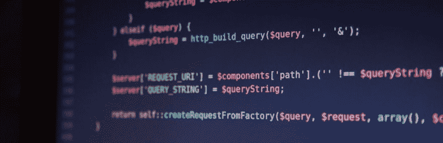

# PHP 应用程序的嵌入式 Docker 堆栈

> 原文：<https://dev.to/kovah/a-drop-in-docker-stack-for-php-apps-112e>

很长一段时间，我使用 MAMP 专业管理我的本地开发环境。尽管 MAMP 团队在安装过程中做了出色的工作，但要让所有东西都运行在本地安装的 PHP 版本上还是相当麻烦的。接着，我的第一个拉勒维尔项目带来了家园，但我从未真正习惯它。
最后，大约一年前，我第一次尝试 Docker。我开始在工作中用它做更大的项目。在过去的几个月里，我逐渐为所有私人项目实现了一个可靠的 Docker 设置。因为我认为这个堆栈非常可靠，而且最重要的是，只需很少的配置就非常容易使用，所以我想与您分享它，因为它快速地加快了我的开发过程。

## 为什么要用 Docker？

MAMP 的应用程序运行得非常好。但是它有一个主要的缺陷:所有的应用程序共享相同的 PHP 配置。如果应用程序使用相同的数据库服务器和缓存服务(如 Redis)。Docker 为每个应用程序创建隔离的容器，只有应用程序可以在其中运行和访问。这不仅带来了更好的安全性(即使不像 T2 那样只对开发重要)，还为每个应用程序提供了一个固定的环境。这意味着你可以完全按照你的应用需求来配置 PHP、数据库和网络服务器，而不需要关心其他应用或者在配置之间切换。

* * *

## 嵌入式 Docker 堆栈

由于我从事的大多数项目都是用普通 PHP、更大的 Laravel 堆栈或基于 PHP 的 CMS(如 Wordpress 或 Drupal)开发的，我可以很容易地将我配置的小 Docker 堆栈从一个应用程序复制到另一个应用程序，只需进行一次调整，或者更好的是根本不需要调整。

你可以在 [Github](https://github.com/Kovah/Docker-Stack) 上找到这个 Docker 栈的所有文件。

开始之前，需要在您的机器上安装 [Docker](https://www.docker.com/get-started) 。

### 整体架构上的微服务

开发和部署基于 Docker 的应用程序有两种方法:要么将所有使用过的服务和配置放入一个容器中，要么将设置分成几个 Docker 容器，这些容器相互通信，就像微服务架构一样。

就我个人而言，我更喜欢将所有服务放在一个单独的容器中，进行单独的配置。因此，我没有使用 PHP 基本映像并在其中安装 MySQL、nginx 和 Redis，而是为每个服务使用特定于服务的映像。三大优势:

*   **维护更容易。**服务的手动安装总是导致这样的问题，一旦单个服务被更新或其配置被改变，基础映像必须被更新。
*   **轻松互换服务。**如果你的应用程序的架构改变了，你可以通过替换你的`docker-compose.yml`文件中的一些行来轻松地交换服务——而不是重新访问你的 docker 文件并确保你的安装仍然工作。
*   最后但同样重要的是:安全性。拥有一台运行一切的机器，每个服务都可以从所有其他服务访问一切，这甚至*都觉得*不划算。如果服务只能通过端口相互交流，那么你可能就封闭了上百个可能的漏洞。

即使安全性对于开发来说不是那么重要，您仍然应该关注它。如果您从一个干净的设置开始，那么在生产中使用 Docker 的过程会更加容易。

### Bitnami 坞站图像

该堆栈使用由 Bitnami 提供的 Docker 映像，Bitnami 是容器化部署和托管的大玩家之一。出于一些原因，我决定选择 Bitnami 图像:

*   Bitnami 为 PHP、MySQL / MariaDB、Redis、Memcached、MongoDB、Node.js 等提供了数十张图片。
*   每个服务的所有映像都是由同一家公司开发的，这使得配置更加容易，因为所有映像都共享相同的基础和结构。
*   在我看来，这些图片在小尺寸图片和丰富的功能集之间提供了完美的平衡。
*   Bitnami 映像建立在名为 Minideb 的发行版之上。它是基于 Debian 的，但是被修改得更小，以符合 Docker 的要求。
*   我只是避免使用由单个开发人员开发的图像，因为这些图像很可能现在或以后会被放弃，或者不会定期更新。
*   相比之下，Bitnami 图像会随着服务的每个新版本自动更新。

[](https://res.cloudinary.com/practicaldev/image/fetch/s--HRN_FCPW--/c_limit%2Cf_auto%2Cfl_progressive%2Cq_auto%2Cw_880/https://thepracticaldev.s3.amazonaws.com/i/my7t8460pp91eqtbyrtf.jpg)

## 关于堆栈的详细信息

所以，让我们进入正题。堆栈由四个文件组成，其中两个是配置文件，一个是。您可以在许多项目中找到 env 文件。

**目录结构**

```
/
├─ docker
│ ├─ php.ini
│ └─ nginx.conf
├─ // Your other app files
├─ .env
└─ docker-compose.yml 
```

Enter fullscreen mode Exit fullscreen mode

我的默认设置由 PHP、MySQL 兼容的数据库服务器、nginx 和 Redis 组成。所有服务都在`docker-compose.yml`文件中定义。

**部分 docker-compose**

```
# --- PHP 7.2
php:
  container_name: "project-php"
  image: bitnami/php-fpm:7.2
  volumes:
    - .:/app
    - ./docker/php.ini:/opt/bitnami/php/etc/conf.d/php.ini:ro

# --- nginx 1.14
nginx:
  container_name: "project-nginx"
  image: bitnami/nginx:1.14
  ports:
    - "127.0.0.1:80:8085"
  depends_on:
    - php
  volumes:
    - .:/app
    - ./docker/nginx.conf:/opt/bitnami/nginx/conf/vhosts/site.conf:ro 
```

Enter fullscreen mode Exit fullscreen mode

这是 PHP 和 nginx 容器的定义。正如你所看到的，它运行在 PHP 7.2 上。它唯一做的事情是使项目在`/app`目录(所有 Bitnami 容器的基本目录)中可用，并应用您定制的 php.ini。

您可以在主自述文件中找到关于每个服务定义的详细信息。

### 设置配置

在大多数情况下，您只需更改。env 文件，因为它包含关于堆栈和密码的可变细节。主栈适用于所有普通的 PHP 项目，但是您可以通过更改`nginx.conf`文件轻松地使其适用于 Laravel 或任何 CMS，因为每个系统可能对 web 服务器配置有不同的要求。

### 安装和使用

*   将主文件(除了/public 和 README.md 之外的所有文件)复制到项目中
*   复制一份`.env.example`文件并将其命名为`.env`，或者将所需的值复制到您现有的。环境文件。Laravel 用户不需要复制任何东西。
*   确保当前配置与您的项目设置相匹配。像 Wordpress 或 Drupal 这样的 CMS 需要额外的配置。
*   在`docker-compose.yml`文件中用您自己的项目名称替换`project`。
*   运行`docker-compose up -d`

Docker 将下载所有图像并启动它们。默认情况下，主机上的 80 端口绑定到 nginx，所以你应该可以通过在浏览器中打开`http://localhost`来访问你的应用。

## 最后的想法

我现在在几个项目中使用了这个小堆栈。它也为我正在开发的书签管理器 Linkace T1 提供了动力。它对我来说工作得很好，但我完全理解如果你有自己的偏好或它不会与你的应用程序一起工作。欢迎在 Github repo 中留下反馈。

* * *

*这篇文章最初发表在[博客上。](https://blog.kovah.de/en/5gw1x8-a-drop-in-docker-stack-for-php-app/)kovah . de*