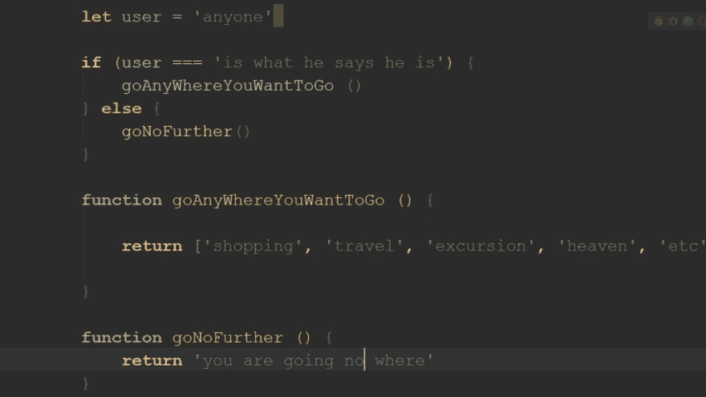

# 为坏人建造

> 原文：<https://dev.to/cjustinobi/building-for-the-bad-guys-4ek9>

 
很多时候，当还在讨论如何着手一个客户的项目时，他们总是强调 app 的安全性。他们会推荐你安装“最强的反坏人软件”，我总是很快回应说“安全是一个过程。”如果他们没有尽力确保应用程序的安全性，不管安装了什么安全插件，应用程序都可能会受到损害。

安装很酷的安全软件，忽视一些简单的安全措施，比如使用哑密码，甚至用明文存储密码，都是没有用的。

在我继续之前，我想在这篇文章中定义一下谁是坏人。坏人就是那些通过系统中发现的任何漏洞寻找最轻微的手段来危害你的应用程序的人。

从软件开发的一开始，我们就做了最坏的打算，并期待它的到来。我们假设攻击者比我们聪明，不会给链条中的薄弱环节留下任何机会。

因此，我将讨论一些简单的方法，开发者可以避免陷入不良黑客的网络。

## 输入字段卫生处理

这是创造攻击途径的最明显和最常见的手段。事实上，只要应用程序中有表单域，就要做最坏的打算，可能的结果是有人试图在您的页面上运行 JavaScript。这就是所谓的 XSS，跨站点脚本。

所以我基本上是说，把任何可以访问你的输入域的人都当作嫌疑犯。任何心怀不轨的人都可以在这些输入中放入恶意代码，如果这样的应用程序的开发者没有安全意识，剩下的将成为历史。

有很多很棒的库可以用来净化 HTML，例如，[https://github.com/cure53/DOMPurify](https://github.com/cure53/DOMPurify)

然而，我提到的输入净化都是针对开发前端的。在服务器端仔细检查也是很好的，因为 JavaScript 可以在前端操作。

## 认证

认证是确定某人或某物实际上是否是其所声明的人或物的过程。

在身份验证过程中，用户提供的凭据将与数据库或任何其他存储方式中的文件中的凭据进行比较。如果凭证匹配，则被认证的用户被授权使用受限资源。这引出了我的下一个观点；授权。

## 授权

它向经过身份验证的用户授予访问权限。访问可以是不同的角色(特权和偏好)。授予授权帐户的特权和首选项取决于角色的权限。为所有这些环境变量定义的设置都是由管理员设置的。

## 软件更新

人们需要保持警惕，及时更新他们正在使用的库或框架的最新安全补丁。

一个命令，一个人可以更新任何第三方插件，他们已经安装。这就是使用包管理器的优势所在。使用简单的命令，如用于节点包的`npm update`和用于 PHP 包的`composer update`等。人们会更新任何过时的第三方库。

## 哈希算法

简单来说，哈希算法是一个将数据字符串转换为固定长度的数字字符串输出的函数。如今，黑客可以获得功能强大、价格低廉的计算资源，用于进行高速密码猜测。Salting 是帮助击败此类攻击和密码哈希去重复所需的编码技术，因为像 MD5 这样的哈希算法本身是不够的。

## 结论

我提到的所有要点，只是一个人可以坚持的基本方法，以避免接触的故事。有很多我没有提到的地方。我期待你对这里没有讨论的任何问题做出贡献。