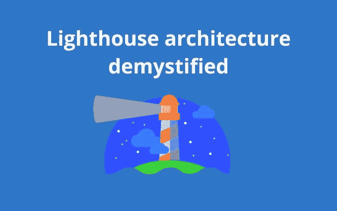
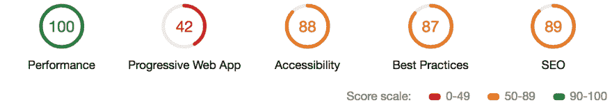
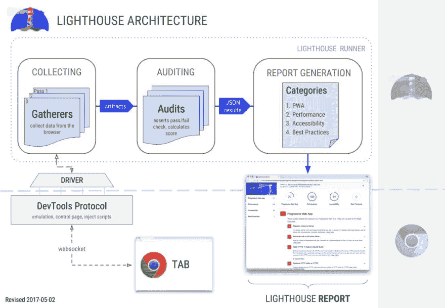
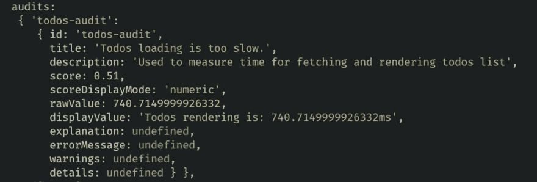
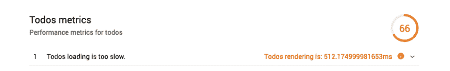
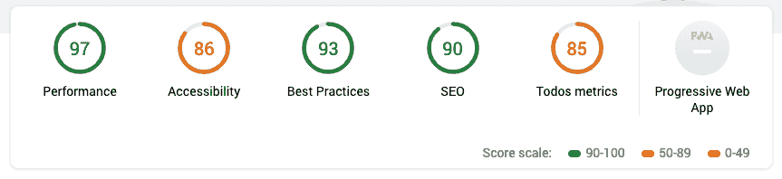
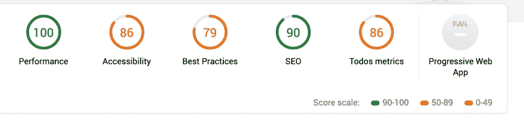
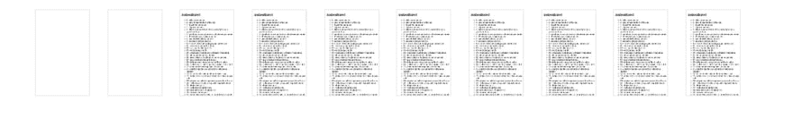

# 灯塔建筑去神秘化

> 原文：<https://dev.to/izifortune/lighthouse-architecture-demystified-hmb>

### [T1】简介](#intro)

[](https://res.cloudinary.com/practicaldev/image/fetch/s--G4bJUTvO--/c_limit%2Cf_auto%2Cfl_progressive%2Cq_auto%2Cw_880/http://izifortune.com/conteimg/2019/03/lighthouse.jpg)

在我之前的[文章](https://dev.to/izifortune/performance-budgets-with-lighthouse---lighthouse-keeper-2475-temp-slug-6276913)中，我解释了我们如何使用*灯塔*来为我们的网站做预算，以及为什么监控你的网站性能是网络开发的一个重要方面。在本文中，我们将深入探讨 *Lighthouse* 的构建模块及其架构，并了解我们如何开始审计和收集网页的定制指标。

Lighthouse 是谷歌开发的一个审计工具，可以收集你网站的不同指标。收集完指标后，它会为你的网页显示一系列的分数。评分分为五个主要审计领域。

[](https://res.cloudinary.com/practicaldev/image/fetch/s--Fd7Yu_7S--/c_limit%2Cf_auto%2Cfl_progressive%2Cq_auto%2Cw_880/https://izifortune.com/conteimg/2019/03/audit1-2.png)

除了给你的网页打分， *Lighthouse* 还提供了更详细的信息，告诉你应该把精力放在哪里，什么叫做“机会”。您的网站的哪些方面可能会带来巨大的性能提升，例如，下面的应用程序执行时间非常长。

[](https://res.cloudinary.com/practicaldev/image/fetch/s--v-jOZ0Sm--/c_limit%2Cf_auto%2Cfl_progressive%2Cq_auto%2Cw_880/https://izifortune.com/conteimg/2019/03/opportunities-1.png)

### 灯塔建筑

*灯塔* [架构](https://github.com/GoogleChrome/lighthouse/blob/master/docs/architecture.md#components--terminology)围绕 [Chrome 调试协议](https://developer.chrome.com/devtools/docs/debugger-protocol)构建，该协议是一套与 Chrome 实例交互的底层 API。它通过*驱动程序*连接 Chrome 实例。*收集器*使用*驱动程序*从页面收集数据。一个*收集器*的输出是一个*工件*，一个分组度量的集合。然后一个*工件*被一个*审计*用来测试一个度量。*审计*断言并给一个特定的指标分配一个分数。审计*的输出*用于生成我们熟悉的灯塔报告。

[](https://res.cloudinary.com/practicaldev/image/fetch/s--Gtv5SB7B--/c_limit%2Cf_auto%2Cfl_progressive%2Cq_auto%2Cw_880/https://izifortune.com/conteimg/2019/03/lighthouse-architcture.png)

我们现在将通过创建一个简单的跟踪网页内部渲染的审计来仔细查看两个 *Lighthouse* 构件。创建一个应用程序是必要的，以便包含一个定制的 *Gatherer* 或 *Audit* ，因为不可能将任何定制的 *Gatherer 或 Audit* 直接添加到 *Chrome* 面板中。

让我们创建我们的项目并安装 lighthouse 作为一个依赖项

```
mkdir custom-audit && cd custom-audit  
npm i --save lighthouse 
```

为了开始审计我们的网站，我们将创建一个新文件`scan.js`，我们将导入 *Lighthouse* ，并开始扫描选择的网页。我们将使用编程方式访问*灯塔*，方法是将它导入到我们的项目
中

```
const lighthouse = require('lighthouse');  
const chromeLauncher = require('chrome-launcher');

async function launchChromeAndRunLighthouse(url, opts, config = null) {  
  const chrome = await chromeLauncher.launch({chromeFlags: opts.chromeFlags});
  opts.port = chrome.port;
  const { lhr } = await lighthouse(url, opts, config);
  await chrome.kill()
  return lhr;
}

const opts = {};

// Usage:
(async () => {
  try {
    const results = await launchChromeAndRunLighthouse('https://izifortune.github.io/lighthouse-custom-gatherer', opts);
    console.log(results);
  } catch (e) {
    console.log(e);
  }
})(); 
```

如果我们现在尝试运行我们的文件，我们应该能够在控制台中看到灯塔扫描的结果:

```
node scan.js 
```

现在我们有了一个项目，Lighthouse 已经启动并运行了，我们可以开始看看 Gatherer 是如何工作的，以及如何在我们的项目中使用它。我们将使用我为这个[演示](https://izifortune.github.io/lighthouse-custom-gatherer)创建的网页。在页面中，我从 API 获取 todo 列表项并呈现在页面上。我使用 [PerformanceAPI](https://developer.mozilla.org/en-US/docs/Web/API/Performance) 来测量动作，如下:

```
const getDataFromServer = async () => {  
  performance.mark('start');
  const todos = await getTodos();
  renderTodos(todos);
  performance.mark('end');
  performance.measure('Render todos', 'start', 'end');
  const measure = performance.getEntriesByName('Render todos')[0];
} 
```

#### 采集者

Lighthouse 使用 Gatherer 来收集页面上的数据。事实上，当前执行默认灯塔审计所需的任何数据都是通过 Gatherer 收集的。我们可以扩展 Gatherer 基类并开始创建自定义类:

```
const { Gatherer } = require('lighthouse');

class MyGatherer extends Gatherer {  
  ...
} 
```

Gatherer 类定义了三个不同的生命周期挂钩，我们可以在类中实现它们:

*   ***beforePass*** -导航到给定 URL 之前调用
*   ***通过***——在页面加载并记录跟踪后调用

 **一个生命周期钩子被期望直接返回一个工件或者一个解决期望工件的承诺。这取决于我们希望从驱动程序收集什么数据，以及在什么时候我们可以使用刚才描述的任何钩子。

现在让我们创建一个定制的收集器，它将从 *PerformanceAPI* 中收集度量值。然后，Gatherer 需要使用 PerformanceObserver 收集 entryType `measure`。我们将继续创建文件`todos-gatherer.js`T4

```
'use strict';

const { Gatherer } = require('lighthouse');

function performance() {  
  return new Promise((res) => {
    let logger = (list) => {
      const entries = list.getEntries();
      window.todosPerformance = entries[0].duration
      res(entries[0].duration);
    }
    let observer = new PerformanceObserver(logger);
    observer.observe({ entryTypes: ['measure'], buffered: true });
  });
}

class TodosGatherer extends Gatherer {  
  beforePass(options) {
    const driver = options.driver;
    return driver.evaluateScriptOnNewDocument(`(${performance.toString()})()`)
  }

  afterPass(options) {
    const driver = options.driver;
    return driver.evaluateAsync('window.todosPerformance')
  }
}

module.exports = TodosGatherer; 
```

在 TodosGatherer 中，我们使用了 *beforePass* 和 *afterPass* 钩子来联系驱动程序，然后在当前页面的上下文中执行一个 javascript 函数，返回一个承诺。在 *beforePass* 中，我们在页面加载后注册了一个 *PerformanceObserver* ，因为观察者没有被缓冲，我们可能会遇到竞争情况。在*后处理*中，我们收集先前注册的测量值。

要了解你在驱动对象上使用的所有方法，你可以在这里看一下

[。](https://github.com/GoogleChrome/lighthouse/blob/34a542a156b271fd7725525b09a92a344d7809c0/lighthouse-core/gather/driver.js)

现在我们需要将它包含在我们的`scan.js`文件中:

```
const lighthouse = require('lighthouse');  
const chromeLauncher = require('chrome-launcher');

const config = {  
  passes: [{
    passName: 'defaultPass', //Needed to run custom Gatherers/Audits in the same pass
    gatherers: [
      `todos-gatherer`,
    ],
  }],
}
... 
```

如果我们现在尝试运行`scan.js`,我们将会收到一个错误，提示没有审计要运行。Gatherer 本身不提供任何信息，而是输出审计中使用的工件来定义指标。接下来，我们将看看审计结果。

#### 审核

审计定义了一个指标或分数，它将工件作为输入，并计算出想要的分数。 *Lighthouse* 正在执行的不同审计，如 *FirstMeaningfulPaint* 或 *SpeedIndex* 实际上都被定义为内部审计。

为了创建一个定制的*审计*，类似于一个*收集器*，我们将扩展一个基类`Audit`并实现基本方法:

为了创建一个定制的*审计*，类似于*收集器*，我们将扩展一个

基类`Audit`，并实现基本方法:

```
const { Audit } = require('lighthouse');

class MyAudit extends Audit {  
  static get meta() {
    ..
  }

  static audit(artifacts) {
    ...
  }
} 
```

类 *Audit* 定义了两个需要被覆盖的方法:

*   ***【meta】***-用于定义关于审计的信息
*   ***审计***——将来自收集者的*工件*作为输入，并返回一个产品度量。

有了这些信息，我们现在可以实现我们的定制审计，并开始收集 todo 列表的性能。自定义审计文件的名称将为`todos-audit.js`，并将包含:

```
'use strict';

const Audit = require('lighthouse').Audit;

class TodosAudit extends Audit {  
  static get meta() {
    return {
      id: 'todos-audit',
      title: 'Todos are loaded and rendered',
      scoreDisplayMode: Audit.SCORING_MODES.NUMERIC,
      failureTitle: 'Todos loading is too slow.',
      description: 'Used to measure time for fetching and rendering todos list',
      requiredArtifacts: ['TodosGatherer'],
    };
  }

  static audit(artifacts) {
    const measure = artifacts.TodosGatherer;

    return {
      rawValue: measure,
      score: Math.max(1 - (measure / 1500), 0),
      displayValue: `Todos rendering is: ${measure}ms`
    };
  }
}
module.exports = TodosAudit; 
```

在方法`meta`中，我们定义了描述*审计*本身的信息，比如 id、标题、scoreDisplayMode 和描述。此外，我们正在配置*工件*，这是*审计*所需要的，在本例中`TodosGatherer`是感兴趣的收集者的名字。

现在我们需要把它添加到`scan.js`内部的配置中，就像我们之前对*收集器*所做的那样。

```
const config = {  
  passes: [{
    passName: 'defaultPass’,
    gatherers: [
      `todos-gatherer`,
    ],
  }],
  audits: [
    'todos-audit',
  ],
  categories: {
    todos: {
      title: 'Todos metrics',
      description: 'Performance metrics for todos',
      auditRefs: [
      // When we add more custom audits, `weight` controls how they're averaged together.
      {id: 'todos-audit', weight: 1},
    ],
    },
  },
} 
```

现在启动我们的扫描，我们可以注意到我们的自定义审计被登录到控制台。

[](https://res.cloudinary.com/practicaldev/image/fetch/s--3W1w9O7N--/c_limit%2Cf_auto%2Cfl_progressive%2Cq_auto%2Cw_880/https://izifortune.com/conteimg/2019/03/console.png)

如果您喜欢使用不同格式的报告，比如 HTML，您可以将输出选项添加到 lighthouse 函数中。选项对象将被 *Lighthouse* 用来配置运行审计输出格式。总结一下最后的`scan.js`会是什么样子:

```
const lighthouse = require('lighthouse');  
const chromeLauncher = require('chrome-launcher');  
const { promisify } = require('util');  
const { writeFile } = require('fs');  
const pWriteFile = promisify(writeFile);

const config = {  
  passes: [{
    passName: 'defaultPass’,
    gatherers: [
      `todos-gatherer`,
    ],
  }],
  audits: [
    'todos-audit',
  ],
  categories: {
    todos: {
      title: 'Todos metrics',
      description: 'Performance metrics for todos',
      auditRefs: [
      // When we add more custom audits, `weight` controls how they're averaged together.
      {id: 'todos-audit', weight: 1},
    ],
    },
  },
}

async function launchChromeAndRunLighthouse(url, opts, config = null) {  
  const chrome = await chromeLauncher.launch({chromeFlags: opts.chromeFlags});
  opts.port = chrome.port;
  const { lhr, report } = await lighthouse(url, opts, config);
  await chrome.kill()
  return report;
}

const opts = {  
  output: 'html'
};

// Usage:
(async () => {
  try {
    const results = await launchChromeAndRunLighthouse('https://izifortune.github.io/lighthouse-custom-gatherer', opts, config);
    await pWriteFile('report.html', results)
  } catch (e) {
    console.log(e);
  }
})(); 
```

现在运行它，我们将在`report.html`中看到一个 HTML 报告，看起来与下面的类似:

[](https://res.cloudinary.com/practicaldev/image/fetch/s--byHDBu1l--/c_limit%2Cf_auto%2Cfl_progressive%2Cq_auto%2Cw_880/https://izifortune.com/conteimg/2019/03/report1.png)

通过向配置对象添加以下关键字，我们还可以将标准 *Lighthouse* 审计与我们的自定义审计包含在一起:

```
const config = {  
  extends: 'lighthouse:default', // Include Lighthouse default audits
  passes: [{
    passName: 'defaultPass’,
    gatherers: [
      `todos-gatherer`,
    ],
  }],
... 
```

[](https://res.cloudinary.com/practicaldev/image/fetch/s--HomVz2At--/c_limit%2Cf_auto%2Cfl_progressive%2Cq_auto%2Cw_880/https://izifortune.com/conteimg/2019/03/full-report.png)

在介绍了 Lighthouse 架构之后，我们可以开始通过测量和报告与我们相关的指标来定制 Lighthouse 审计。我们现在将探讨如何使用 Gatherers 来解决在 CI 环境中执行扫描时的常见问题。

### 会话守护页面

在*瑞安航空*，我们广泛使用*灯塔*来审计我们的网页，这是定期执行扫描的自动化工作的一部分，然后我们定期分析扫描的结果。当您运行自动扫描时，我们遇到的一个主要问题是如何在身份验证或用户会话之后对页面执行审计。而使用手动扫描，我们可以在开始审计之前轻松生成会话；如果我们从 CI 环境中运行 *Lighthouse* ，我们将需要以编程方式生成一个会话，并将信息传递给 *Lighthouse。*

web 应用程序的用户会话身份验证管理的一种常见方法是在成功登录后在服务器上生成令牌(通常是 JWT ),并将结果令牌存储在浏览器中。您可以将令牌存储在浏览器中可用的不同存储中，如 *LocalStorage、SessionStorage、Cookies。*我不会在这里判断哪里是存储令牌的最佳位置，我们感兴趣的是如何写入任何浏览器存储，以便*灯塔*可以访问令牌并执行审计。

通过使用定制的 *Gatherer* ，我们可以利用在导航到页面 URL 之前触发的生命周期钩子 *beforePass* 来创建一个用户会话。在钩子中，我们调用一个 API 来生成一个会话，然后通过*驱动*方法`evaluateScriptOnNewDocument`中的一个，我们可以传递任何要在浏览器实例中执行的函数。

出于这个演示的目的，我创建了另一个[页面](https://izifortune.github.io/lighthouse-custom-gatherer/auth)，其中我基本上只在用户通过身份验证的情况下呈现 todos。为了伪造身份验证，我检查了一个特定的令牌是否存在于 *LocalStorage* 中，然后开始获取并渲染 todos。

让我们在文件

`session-gatherer.js`
中创建一个新的*收集器*称为*会话收集器*

```
const { Gatherer } = require('lighthouse');

const TOKEN = 'iOiJKV1QiLCJhbGciOiJIUzI1NiJ9.eyJzdWIiOiIxMjM0NTY3ODkwIiwibmFtZSI6IkpvaG4gRG9lIiwiYWRtaW4iOnRydWUsImp0aSI6IjkzZDU0MDBiLTQ5MzgtNDNmZS1iMjY4LTY2MDJlNDIxMjFiYiIsImlhdCI6MTU1MjkwNjc0NywiZXhwIjoxNTUyOTEwMzQ3fQ.qEJflkN2ntXrQFalBkkw4duCh55HdNBLGXZOV-dS3KQ';

function createSession(token) {  
  localStorage.setItem('token', token);
}

class SessionGatherer extends Gatherer {

  async beforePass(options) {
    const driver = options.driver;
    return driver.evaluateScriptOnNewDocument(`(${createSession.toString()})('${TOKEN}')`);
  }
}

module.exports = SessionGatherer; 
```

一旦我们创建了 gatherer，我们需要告诉 *Lighthouse* 将它包含在列表中，这样它将在执行审计时与所有其他 gatherer 一起运行。我们需要将创建另一个文件`scan-auth.js`如下:

```
const lighthouse = require('lighthouse');  
const chromeLauncher = require('chrome-launcher');  
const { promisify } = require('util');  
const { writeFile } = require('fs');  
const pWriteFile = promisify(writeFile);

const config = {  
  extends: 'lighthouse:default',
  passes: [{
    passName: 'defaultPass',
    gatherers: [
      `session-gatherer`,
      `todos-gatherer`
    ],
  }],
  audits: [
    'todos-audit'
  ],
  categories: {
    todos: {
      title: 'Todos metrics',
      description: 'Performance metrics for todos',
      auditRefs: [
      // When we add more custom audits, `weight` controls how they're averaged together.
      {id: 'todos-audit', weight: 1},
    ],
    },
  },
}

async function launchChromeAndRunLighthouse(url, opts, config = null) {  
  const chrome = await chromeLauncher.launch({chromeFlags: opts.chromeFlags});
  opts.port = chrome.port;
  const { lhr, report } = await lighthouse(url, opts, config);
  await chrome.kill()
  return report;
}

const opts = {  
  output: 'html'
};

// Usage:
(async () => {
  try {
    const results = await launchChromeAndRunLighthouse('https://izifortune.github.io/lighthouse-custom-gatherer/auth', opts, config);
    await pWriteFile('report.html', results)
  } catch (e) {
    console.log(e);
  }
})(); 
```

现在，我们可以开始在用户会话后面的页面上运行扫描，并监控它们的性能。

```
node scan-auth.js 
```

其中记录了默认的 *Lighthouse* 指标加上定制的 Todos 指标，在这种情况下，这些指标是用户认证的基础。

[](https://res.cloudinary.com/practicaldev/image/fetch/s--IrQ6pOmz--/c_limit%2Cf_auto%2Cfl_progressive%2Cq_auto%2Cw_880/https://izifortune.com/conteimg/2019/03/full-report-auth.png)

现在，在报告中，如果您查看*幻灯片*，您会注意到待办事项列表已正确呈现，这意味着在*本地存储*中找到了一个有效的令牌。

[](https://res.cloudinary.com/practicaldev/image/fetch/s--URUGi8lR--/c_limit%2Cf_auto%2Cfl_progressive%2Cq_auto%2Cw_880/https://izifortune.com/conteimg/2019/03/filmstrip.png)

我已经收集了这个知识库中的例子[https://github.com/izifortune/lighthouse-custom-gatherer](https://github.com/izifortune/lighthouse-custom-gatherer)

### 学分

最初的想法来自于查看来自 *Lighthouse* 团队的定制审计食谱，你可以在这里找到。

该配方是创建定制采集/审计的灵感和第一个例子。我也要感谢@patrickhulce 在 Gitter 上的时间和及时回答。**