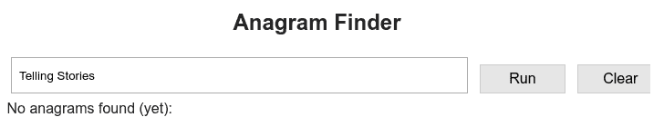

# 如何构建 Web 应用程序，第 3 部分

> 原文：<https://dev.to/gtanyware/how-to-build-a-web-app-part-3-5ae3>

[< < <简介](https://dev.to/gtanyware/how-to-build-a-web-app-1-3fb2)|[|<<<设置](https://dev.to/gtanyware/how-to-build-a-web-app-part-2-5cln) | [文字，文字，文字> > >](https://dev.to/gtanyware/how-to-build-a-web-app-part-4-1a52)

# 讲故事

(为了这个，字谜发现者给了我*，我用鼻子吸了吸小鳗鱼*。我告诉你，这是谎言！)

在这篇文章中，我将描述如何编写变位词查找器 web 应用程序。和以前一样，我的目标受众是技术水平从初级到中级的人。

在之前的一篇文章(不是本系列)中，我写了关于[故事驱动设计](https://dev.to/gtanyware/story-driven-design-4c49)的内容。故事是由想要建立网站的客户写的。这些人通常不是编码专家，但是他们知道他们想要什么以及如何描述它。这里我们有一个非常简单的 web 应用程序，所以故事也应该很简单。这是应用程序:

[](https://res.cloudinary.com/practicaldev/image/fetch/s--OroaKRaU--/c_limit%2Cf_auto%2Cfl_progressive%2Cq_auto%2Cw_880/https://thepracticaldev.s3.amazonaws.com/i/9p9fopo4fedzzkxa7rtx.png)

以下是描述其外观和功能的故事:

该应用程序提供了一个文本栏，一个标签为“运行”的按钮和一个标签为“清除”的按钮

*“当应用程序启动时，文本字段会预加载上次使用时保存的文本(如果这不是第一次)。”*

当用户点击 Run 时，程序调用变位词查找器来查找字典中的单词，这些单词一起用完了给定文本中的所有字母。该按钮的标签变为“停止”。

*“点击停止时，搜索停止，按钮标签变为继续。”*

*“点击继续后，搜索继续。”*

*“当点击清除时，结果列表被清除。”*

页面在文本和按钮下方的面板中显示找到的字谜列表，按字母顺序排序

诸如此类。

## 如何编码故事

这种类型的故事构成了客户和程序员之间契约的基础，也是交付的产品将被验证的依据。故事本身很少是一成不变的；根据用户的经验和反馈，它们经常发生变化，但是相比之下，变位词查找算法很可能永远是固定的。所以将这两项合并到同一个编码结构中没有什么意义。相反，我们有两种不同的编程范例:

网络应用的核心是变位词查找器；接受字符串并返回字符串列表的组件。这最适合作为独立的 JavaScript 模块，它公开了完成这项工作所需的任何 API。您可能自己编写了它，或者在某个存储库中找到了合适的组件。很可能你和你的客户都不需要在里面翻来翻去。

围绕这一点的是用户界面，它实现了用户故事，这些故事很可能会受到定期更改和优化的影响。你*可以*在普通的 JavaScript 中做到这一点，但很可能只有你，即原作者，能够一眼读懂它。其他任何人每次都必须选择通过它的方式。我经常说，这代表了潜在的维护责任和项目总拥有成本(TCO)的增加，所以在这里我们应该愿意考虑替代技术。

## 为什么是 EasyCoder？

很少有网页如此复杂，以至于只能用先进的计算机代码来描述。我能想到的每一个都可以——而且通常都是——用英语描述，如果代码保持其故事可见，那么产品的所有者可以查看它们并验证它们是否如预期的那样，这将非常有帮助。

我遇到过专门的 JavaScript/React 程序员，他们强烈反对这一点。他们认为应该阻止他们的客户查看他们的代码，但我认为他们忽略了一个关键点。如果您的客户——领域专家——能够阅读您的代码，那么他们可能会发现您忽略的一些东西。顾客不是傻瓜，许多人对看到他们支付的东西很感兴趣。他们有我们作为程序员可能缺乏的洞察力。

EasyCoder 是一种类似英语的编程语言，为浏览器设计，以 WordPress 插件的形式提供，看起来与大多数其他编程语言非常不同。它旨在让你用与原始故事明显对应的脚本进行编码；编写故事的领域专家和将故事转化为代码的程序员都可以阅读的脚本。当需要更改时，在这一层进行更改要比将故事隐藏在只有熟练的程序员才能阅读的大量 JavaScript 中容易得多。

至少你可以把下面的代码看作是伪代码，它以一种可验证的形式表达了用户故事，即使你选择用你喜欢的工具重新实现它。

## easy coder 脚本

EasyCoder 脚本存在于网页中，或者从其他地方加载。它们只是文本块，必须由 EasyCoder 插件编译后才能执行任何操作。

因为我们将应用程序构建为一个 WordPress 页面，所以我们无法访问 DOM 树的根(`<body>`元素),所以为了给应用程序提供生存的空间，我们需要给页面添加一个`<div>`,如下所示，带有一个 id，脚本将寻找并附加它自己的一个变量:

```
<div id="anagrams"></div> 
```

EasyCoder 脚本驻留在一个特殊的`<pre>`块中:

```
<pre id="easycoder-script">
...
</pre> 
```

当页面加载后，EasyCoder 插件寻找`<pre>`块，编译其内容并运行它们。

这些故事告诉我们，我们需要一个输入框供用户键入一些文本。我们还会有一些按钮和一个面板来保存到达的字谜。下面是对应于这些故事的完整的 EasyCoder 脚本:

```
 h2 Title
  div Root
  div InputDiv
  div ResultsDiv
  div ResultDiv
  div Label
  div Padding
  input Text
  button RunButton
  button ClearButton
  variable Anagrams
  variable Phrase
  variable Words
  variable Index
  variable Running
  variable Results
  variable Keys

! Attach to the DOM element on the page
  attach Root to `anagrams`
! Styling is different for mobile
  if mobile set the style of Root to `width:100%`
  else set the style of Root to `width:100%;margin:1em`

  create Title in Root
  set the style of Title to `text-align:center`
  set the content of Title to `Anagram Finder`

! Create a separate DIV for all the form components
  create InputDiv in Root
  if mobile set the style of InputDiv to `display:flex;margin: 0.5em`
  else set the style of InputDiv to `display:flex;margin-top:1em`

! "Padding" is reused every time we want a separator
  create Padding in InputDiv
  set the style of Padding to `flex:2`

  create Text in InputDiv
  set the style of Text to `flex:76`
! Retrieve the text from last time
  get Phrase from storage as `anagram-text`
  set the text of Text to Phrase

  create Padding in InputDiv
  set the style of Padding to `flex:2`

  create RunButton in InputDiv
  set the style of RunButton to `flex:10`
  set the text of RunButton to `Run`

  create Padding in InputDiv
  set the style of Padding to `flex:2`

  create ClearButton in InputDiv
  set the style of ClearButton to `flex:10`
  set the text of ClearButton to `Clear`
  on click ClearButton
  begin
    clear ResultsDiv
    clear Results
  end

! A label to go under the form
  create Label in Root
  set the style of Label to `margin: 0.5em 0.5em 0 0.5em`
  set the content of Label to `Loading a word list...`

! The DIV to hold all the found anagrams
  create ResultsDiv in Root
  set the style of ResultsDiv to `margin: 0.5em 0.5em 0 0.5em`

! Load the anagram finder JS file
  require `https://cors.io/?https://raw.githubusercontent.com/gtanyware/EasyCoder/master/demo/anagrams.js`
! Load a list of 33,300 English words
  require `https://cors.io/?https://raw.githubusercontent.com/gtanyware/EasyCoder/master/demo/words.js`

  set the content of Label to `No anagrams found (yet):`
  on click RunButton go to Run

! Wait for the user to do something
  stop

! When the user clicks Run...
Run:
  put Text into storage as `anagram-text` ! Remember it for next time
  json set Results to object ! Make Results an empty JSON variable
Continue:
! Reprogram the button
  set the text of RunButton to `Stop`
  on click RunButton
  begin
    clear Running
!   Reprogram it again
    set the text of RunButton to `Continue`
    on click RunButton go to Continue
  end

! Set the running flag and keep going as long as it remains set
  set Running
  while Running
  begin
!   This is where we call the anagram finder library module
    put anagrams of Text into Anagrams
!   It returns JSON properties "status" and "words"
    if property `status` of Anagrams is `found`
    begin
      put property `words` of Anagrams into Words
      json sort Words
!     Build a phrase with the words of this anagram
      put empty into Phrase
      put 0 into Index
      while Index is less than the json count of Words
      begin
        put Phrase cat element Index of Words cat ` ` into Phrase
        add 1 to Index
      end
!     Check if this phrase is already a property of Results
      if property Phrase of Results is empty
      begin
!       It isn't, so add it, with an arbitrary value (that we don't use)
        set property Phrase of Results to true
!       Extract the phrases as an array
        put the json keys of Results into Keys
        json sort Keys
!       Show how many results we have
        set the content of Label to the json count of Keys cat ` anagrams found:`
!       Rebuild the list of phrases
        clear ResultsDiv
        put 0 into Index
        while Index is less than the json count of Keys
        begin
          create ResultDiv in ResultsDiv
          set the content of ResultDiv to element Index of Keys
          add 1 to Index
        end
      end
    end
!   Allow the CPU to cool off (critical!)
    wait 2 ticks
  end
  stop 
```

任何生活在 80 年代，在早期麦金塔电脑上见过 HyperCard 的人可能会觉得这个有点眼熟。这不是巧合；EasyCoder 受到 HyperTalk 的启发，HyperTalk 是这个“非常棒”的产品中的语言，在某种程度上作为 AppleScript 存在。如果有一个指导原则的话，那就是通过最少使用符号和最大限度地坚持简单的英语语法来确保可读性。

EasyCoder 看起来与现代计算机语言非常不同，它几乎没有符号，也没有专家熟悉的块结构和参数化之类的概念，但这让所有非程序员感到困惑。像 SQL 一样，它位于机器和人之间的中间地带，双方都能理解。

现在来看看它是如何工作的。我用注释(感叹号)对它进行了大量注释；对于好的文档来说，比通常认为的要多，但这是您第一次看到这种语法。脚本的前半部分设置了屏幕，从变量列表开始。惯例是名字都以大写字母开头，就像在英语中一样。其中许多是对应于 DOM 元素的类型；其余的是保存数字或文本的普通变量。

第一个动作是将`Root`变量附加到我们之前设置的`<div>`上。从现在开始，我们和`Root`做的任何事情都将作用于`<div>`本身。然后，我们测试该应用程序是否在智能手机浏览器中运行，并应用合适的样式。如您所见，样式可以内联应用。反对这种工作方式的纯粹主义者可以在每个元素上设置 class 属性并创建单独的样式表，但是对于脚本化元素来说，在创建时设置样式要简单得多。

接下来是一系列的命令，一项一项地创建显示的各个部分。在 EasyCoder 中，当我们创建 DOM 元素时，我们必须指定一个已经存在的父元素。我已经将文本字段和按钮放入它们自己的`<div>`中，并将其命名为`InputDiv`，然后所有其他的直接放入`Root`。我希望即使不是程序员的读者也会发现它很容易理解——这就是它的本意。

`InputDiv`使用了一个`flex`显示属性，我发现在分发组件时使用总计为 100 的百分比会有所帮助。有一行代码从存储器中取出一个值并将其放入文本字段，另一行代码在单击 Run 按钮时保存当前字段值。这些使用浏览器存储，让您在访问一个站点之间保存数据。

设置好屏幕元素后，我们现在有几行`require`代码。这些命令加载 JavaScript 文件并将其插入到文档的`HEAD`中，需要奇怪的 URL 来避免跨域请求拒绝，这种拒绝是为了防止浏览器接受潜在的危险可执行代码。其中一个文件是我们将在本系列的下一部分中构建的变位词查找器组件；另一个是字典——一个单词列表。看起来是这样的:

```
const EasyCoder_words = [
  `a`,
  `aah`,
  `aardvark`,
  `abacus`,
  `abacuses`,
  `abalone`,
  ... 
```

并且继续大约 33，000 行。如果你用一系列法语、德语或西班牙语单词来代替，效果也一样好，但是是在所选的语言中(尽管我不知道如何处理带重音的字符)。稍微搜索一下，就可以在网上找到单词表。

这两项下载需要一段时间，所以使用文本`Label`通知用户有事情发生。

在屏幕设置代码的末尾，有一个`on click`命令来检测用户何时点击`Run`按钮，并将控制权转移给程序标签`Run:`。

当它完成设置时，程序停止并等待一些事情发生。当点击发生时，首先是看起来相当奇怪的命令`json set Results to object`。这将变量初始化为一个空的 JavaScript 对象(即不是数组)。

脚本重新编程了`Run`按钮，这样我们可以用它来停止运行，然后进入一个`while`循环，这里有一行

```
put anagrams of Text into Anagrams 
```

这是我们想要用来调用变位词查找器库的语法，但是这里我们有一个问题。EasyCoder 不知道这种语法，所以我们必须做一些特殊的事情来处理它。在我说更多之前，我先描述一下代码。

当我们使用上面的命令让变位词查找器查找变位词时，它会返回一个单词列表和一个成功/失败标志。我们只对搜索成功感兴趣，所以当搜索失败时(这是更常见的情况),剩余的代码将被跳过，我们要求它再试一次。最重要的是，我们要设置一个短暂的延迟，否则电脑没有机会休息，会迅速过热，除了电源按钮之外，对任何事情都没有反应。EasyCoder 监控自己的代码以防止这种事情发生，但是这里所有的工作都是由一个外部模块完成的。20 毫秒的延迟足以让它冷却一点，同样重要的是，由于 JavaScript 的单线程模型，这是按钮点击被执行的唯一机会。

在不太频繁的搜索成功的情况下，我们获取单词列表，将它们按字母顺序排序，并将其全部放在一行上，每行之间留有一个空格。然后我们检查`Results`对象，看看我们拥有的短语是否已经存在。如果没有，我们将其添加为该对象的属性，提取对象键，对它们进行排序，并将其写入显示中的结果面板，顶部有一行表示找到了多少个变位词。每个变位词都有自己的`<div>`,我们可能希望将来能够点击每个变位词并对其做些什么。

你会看到`json`这个词出现得相当频繁。这是因为 JSON 格式字符串的处理不是标准的 EasyCoder 功能，而是由一个插件语言包完成的。为了避免语法变得模糊，插件在不常用的 JSON 特性前面加上单词`json`。

## 扩展语言

我承诺我会处理调用变位词查找器模块的命令，标准 EasyCoder 无法识别该模块。其他语言用函数来实现这一点，但是 EasyCoder 要求所有的添加都无缝地扩展语言。这种语言由插件包组成，每个插件包处理一个特定的词汇和语法，比如 Google Maps、SVG graphics 或 JSON，所以这是添加一个新包的情况，以实现一个调用变位词查找器的命令。(或者您可以将该命令添加到现有的包中，如果您有一个包的话。)

添加包并不难，但完全是 EasyCoder 特有的。由于这些文章主要是关于 web 应用程序的，我将把它留到最后，放在附录文章中。只有真正使用 EasyCoder 的人才会对它感兴趣。如果有人一直在关注本系列，但是直接用 JavaScript 编写 UI，那么他们在与本系列下一部分将要介绍的变位词查找器交互时不会有任何问题。

## 即将到来...

在本系列的下一部分中，我将向您展示变位词查找器 JavaScript 模块的样子。如果与此同时你想玩字谜游戏，你可以在 https://easycoder.software/anagrams 的[找到这个应用。](https://easycoder.software/anagrams)

标题照片由 [Unsplash](https://unsplash.com/search/photos/scrabble?utm_source=unsplash&utm_medium=referral&utm_content=creditCopyText) 上的[émile Perron](https://unsplash.com/photos/_jXn-gNzuGo?utm_source=unsplash&utm_medium=referral&utm_content=creditCopyText)拍摄