# 6 种免费部署个人网站/ PHP+ MySQL 网络应用的方法

> 原文：<https://dev.to/jorenrui/6-ways-to-deploy-your-personal-websites--php-mysql-web-apps-for-free-4m3a>

> 在这篇文章中，我将分享我的经验，更确切地说是指导，在不同的免费网络主机上部署你的网站/网络应用。然而，这篇文章不会提供详细的信息和彻底的解释。
> 
> [封面图片](https://unsplash.com/photos/dC6Pb2JdAqs?utm_source=unsplash&utm_medium=referral&utm_content=creditCopyText)由[法比安·格罗斯](https://unsplash.com/@grohsfabian)在 [Unsplash](https://unsplash.com/) 拍摄

无论是部署您的个人项目、学校项目还是测试您的 web 应用程序，有几个 web 主机可供您免费部署。

如果你知道如何使用版本控制系统*，那就太好了👍。*

 *如果没有，我建议学习它，[这些资源可能会帮助你](https://help.github.com/en/articles/git-and-github-learning-resources)。对于网站，你可以使用[网络上传你的文件。如果你有一个 PHP+MySQL 的网络应用，你可能想试试](#netlify) [000webhost](#webhost) 。每个帐户最多可以托管两个 web 应用。

虽然我说过，如果你打算使用 [000webhost](#webhost) 来长期托管你的 web 应用，我强烈建议你学习 [*Git*](https://git-scm.com/) 并使用 [Heroku](#heroku-mysql) 来代替。000webhost 有利于快速免费部署 web 应用程序，但它也带来了巨大的安全风险。这就是为什么要么使用 Heroku 或付费网络主机，如数字海洋或 AWS。

## 起动前...

我假设你有一个*随时可以部署的*网站或网络应用。对于不需要任何数据库的项目，可以使用 [*静态 web 主机*](#static-webhost) 。但是如果你想部署你的 PHP+MySQL web 应用程序，那么你可以查看一下*。*

 *此外，我可能会将您的应用程序或项目文件夹称为*存储库*。

> 存储库就像是项目的文件夹。项目的存储库包含项目的所有文件，并存储每个文件的修订历史。您还可以在存储库中讨论和管理您的项目工作。
> 
> - [GitHub](https://help.github.com/en/articles/about-repositories)

## 也...

确保你有一个`index.html`。把它想象成网站的主页。如果您还没有主 HTML 文件，请将其重命名为`index.html`。如果你正在使用像 Laravel 和 CodeIgniter 这样的 PHP 框架，那么你就可以开始了。

[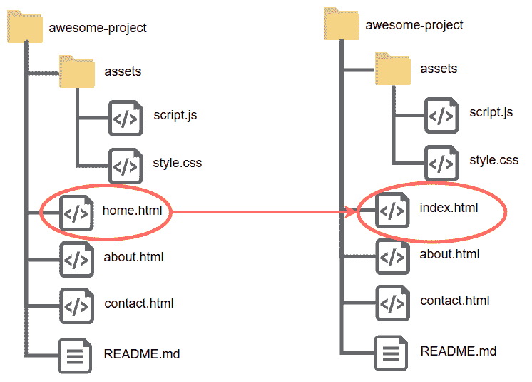](https://res.cloudinary.com/practicaldev/image/fetch/s--Q_IskTq5--/c_limit%2Cf_auto%2Cfl_progressive%2Cq_auto%2Cw_880/https://thepracticaldev.s3.amazonaws.com/i/n9u2jxqk3wdgpi755yru.png)

* * *

## 内容

**静态网页主持人**

*   github pages
*   [GitLab Pages](#gitlab)
*   [Netlify](#netlify) (推荐给初学者)
*   [浪涌](#surge)(推荐 CLI 用户使用)
*   其他如 [Zeit](https://zeit.co/) 和 [AWS 放大](https://aws.amazon.com/amplify/console/)

**动态网页主机(PHP+MySQL)**

*   [Heroku +远程 MySQL for Laravel Apps](#heroku-mysql)
*   [000webhost](#webhost) (给那些还不知道 *Git* 的人)

* * *

#### 编辑:

##### 网络主机

您也可以使用 [Heroku](#heroku-mysql) 和 [000webhost](#webhost) 作为静态 web 主机。这样做时，只需忽略数据库集成部分。😊

你可能想检查的另一个网络主机是 [Glitch](https://glitch.com/) 。

> Cyclo Kitty[@ Cyclo Kitty](https://dev.to/cyclokitty)[@ ThePracticalDev](https://twitter.com/ThePracticalDev)[@ joren Rui](https://twitter.com/jorenrui)[glitch . me](https://t.co/9q6p7f2BYH)动态主机页面使用 GitHub repos 进行导入/导出工作相当轻松。2019 年 3 月 21 日 23 点 07 分[](https://twitter.com/intent/tweet?in_reply_to=1108867752134168577)[](https://twitter.com/intent/retweet?tweet_id=1108867752134168577)[](https://twitter.com/intent/like?tweet_id=1108867752134168577)

##### Heroku -数据库凭证

Bervianto Leo Pratama 提出的一个建议是在 Heroku 的配置变量中更新数据库凭证。

由于这个很棒的建议，Heroku 数据库部分进行了修改，[设置数据库配置变量](#mysql-2)。😊

对于其他 web 主机，您也可以更新`.env`文件并手动上传它，这样它就不会包含在源代码控制中。

* * *

## 静态虚拟主机

### 【github pages】

GitHub 是托管代码的最佳场所之一。它提供*无限的*私有和公共存储库。众所周知，它是开源软件的天堂。

> 托管和审查代码，管理项目，与 3100 万开发人员一起构建您最好的软件。
> 
> - [GitHub](https://github.com/)

[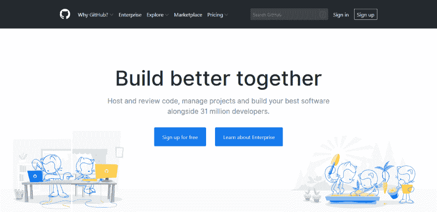](https://res.cloudinary.com/practicaldev/image/fetch/s--Fgcr9ZsA--/c_limit%2Cf_auto%2Cfl_progressive%2Cq_auto%2Cw_880/https://thepracticaldev.s3.amazonaws.com/i/2jm513w3s73t0lzb2whq.png)

GitHub Pages 是 GitHub 提供的服务之一。

> GitHub Pages 是一个静态站点托管服务，旨在直接从 GitHub 存储库中托管您的个人、组织或项目页面。
> 
> - [GitHub](https://help.github.com/en/articles/what-is-github-pages)

#### 目录

1.  [创建 GitHub 账户](#github-1)
2.  [创建存储库](#github-2)
3.  [上传您的文件](#github-3)
4.  [使用 GitHub 页面部署您的网站](#github-4)

#### 1。创建一个 GitHub 账户

如果你还没有 GitHub 帐户，你可以在这里创建一个。

#### 2。创建一个知识库

在右上角的导航中，单击加号图标下的*新存储库*。

[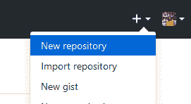](https://res.cloudinary.com/practicaldev/image/fetch/s--EZrT1mWn--/c_limit%2Cf_auto%2Cfl_progressive%2Cq_auto%2Cw_880/https://thepracticaldev.s3.amazonaws.com/i/3vq1ecgeyeeo7j9il2yb.png)

你只需要填写详细信息，然后点击*创建存储库*。

[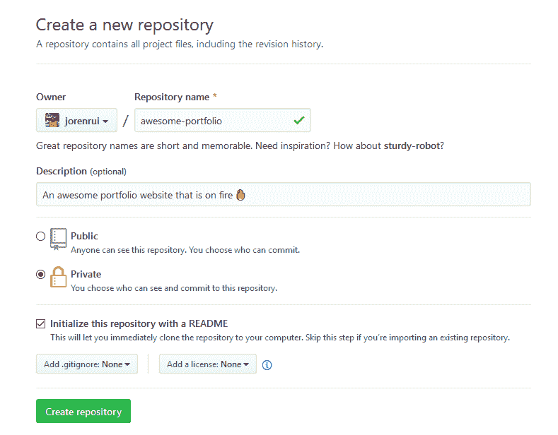](https://res.cloudinary.com/practicaldev/image/fetch/s--g1h_TrZo--/c_limit%2Cf_auto%2Cfl_progressive%2Cq_auto%2Cw_880/https://thepracticaldev.s3.amazonaws.com/i/bp50b3hsvgttikgiu2ti.png)

之后，您现在可以将一些文件添加到您的存储库中。

[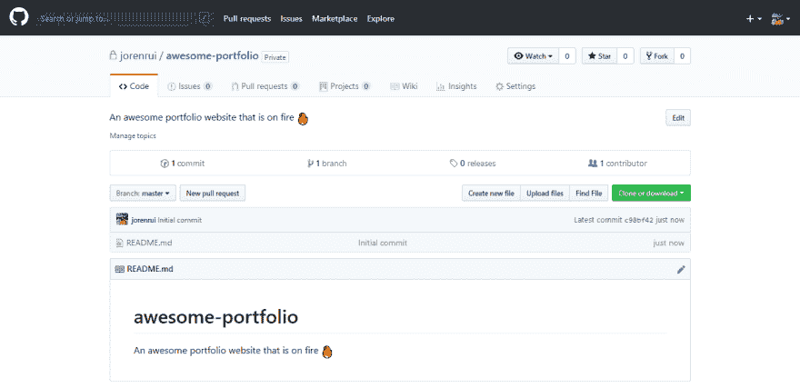](https://res.cloudinary.com/practicaldev/image/fetch/s--7fYnwV8w--/c_limit%2Cf_auto%2Cfl_progressive%2Cq_auto%2Cw_880/https://thepracticaldev.s3.amazonaws.com/i/7ondx14tn8m4tipttaj4.png)

#### 3。上传你的文件

有两种方法可以将文件添加到存储库中:

*   使用 Git
*   通过文件上传

关于文件上传，您可以点击*上传文件*

> 注意:默认情况下，您位于存储库的**主**分支中。

[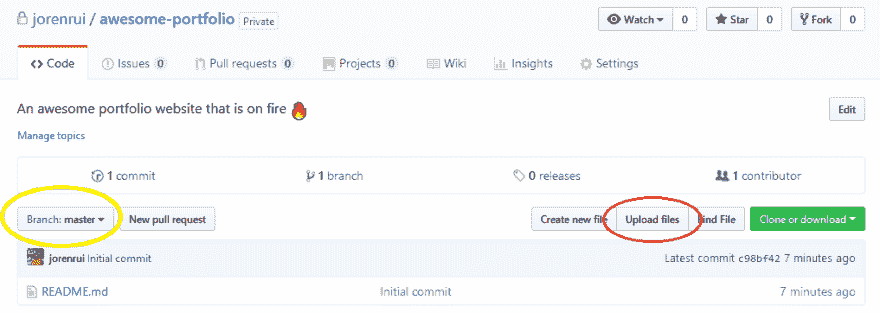](https://res.cloudinary.com/practicaldev/image/fetch/s--X-BwrJXW--/c_limit%2Cf_auto%2Cfl_progressive%2Cq_auto%2Cw_880/https://thepracticaldev.s3.amazonaws.com/i/7uwmq9178mlvvqo6ayqf.png)

或者可以像这样拖放您的文件:

[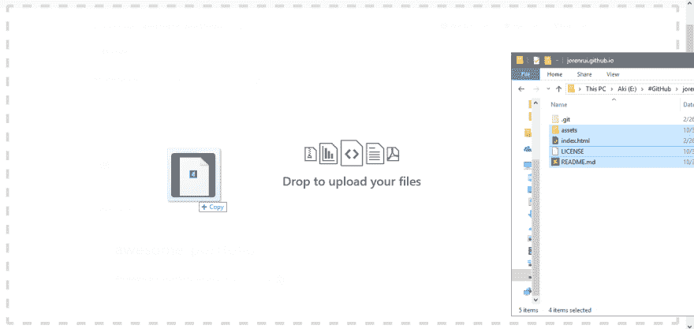](https://res.cloudinary.com/practicaldev/image/fetch/s--0vMZtmgn--/c_limit%2Cf_auto%2Cfl_progressive%2Cq_auto%2Cw_880/https://thepracticaldev.s3.amazonaws.com/i/rt3411iya8t5o4yt75pg.png)

至于*提交消息*，您可以键入描述您所做的事情的内容。如果你添加了一些图片，那么你可以键入*添加可爱的小狗图片*。😆

[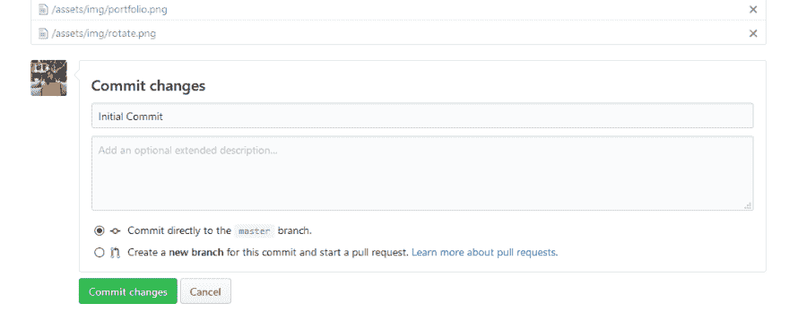](https://res.cloudinary.com/practicaldev/image/fetch/s--F2bYSJxx--/c_limit%2Cf_auto%2Cfl_progressive%2Cq_auto%2Cw_880/https://thepracticaldev.s3.amazonaws.com/i/9ovesmwaryso0ydkrich.png)

#### 4。使用 GitHub Pages 部署您的网站

首先，转到*设置*

[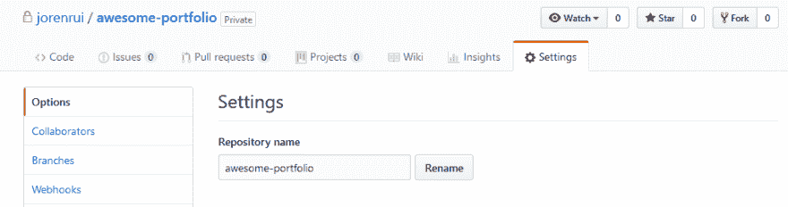](https://res.cloudinary.com/practicaldev/image/fetch/s--1PJEgzPb--/c_limit%2Cf_auto%2Cfl_progressive%2Cq_auto%2Cw_880/https://thepracticaldev.s3.amazonaws.com/i/xcg0afefj2sc0fcjvg3f.png)

向下滚动到 GitHub 页面。然后，点击*主分支*。

[](https://res.cloudinary.com/practicaldev/image/fetch/s--wlLCD8YU--/c_limit%2Cf_auto%2Cfl_progressive%2Cq_auto%2Cw_880/https://thepracticaldev.s3.amazonaws.com/i/52kd56gqxr3twne5ehwd.png)

这样，您的网站现在在`https://<your-username>.github.io/<repository-name>`发布。恭喜✨

如果你想使用`https://<your-username>.github.io`而不是`https://<your-username>.github.io/<repository-name>`，你只需要将你的库命名为`<your-username>.github.io`。这个适合作品集网站。

[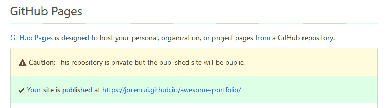](https://res.cloudinary.com/practicaldev/image/fetch/s--K7WRoTSY--/c_limit%2Cf_auto%2Cfl_progressive%2Cq_auto%2Cw_880/https://thepracticaldev.s3.amazonaws.com/i/em8be8p1zmj90vxogcpv.png)

欲了解更多信息，请访问 GitHub 页面。

[返回目录](#toc)

* * *

### GitLab Pages

GitLab 是您可以托管和部署代码的地方之一。它提供无限的私有和公共存储库。

> GitLab 为整个软件开发和运营生命周期提供单一应用程序。GitLab 提供了您所需的一切，以便[管理](https://about.gitlab.com/stages-devops-lifecycle/manage/)、[计划](https://about.gitlab.com/stages-devops-lifecycle/plan/)、[创建](https://about.gitlab.com/stages-devops-lifecycle/create/)、[验证](https://about.gitlab.com/stages-devops-lifecycle/verify/)、[打包](https://about.gitlab.com/stages-devops-lifecycle/package/)、[发布](https://about.gitlab.com/stages-devops-lifecycle/release/)、[配置](https://about.gitlab.com/stages-devops-lifecycle/configure/)、[监控](https://about.gitlab.com/stages-devops-lifecycle/monitor/)、[保护](https://about.gitlab.com/stages-devops-lifecycle/secure/)您的应用程序。
> 
> - [GitLab](https://about.gitlab.com/what-is-gitlab/)

[](https://res.cloudinary.com/practicaldev/image/fetch/s--eFAsRieh--/c_limit%2Cf_auto%2Cfl_progressive%2Cq_auto%2Cw_880/https://thepracticaldev.s3.amazonaws.com/i/fth2y1u9um9ddu2o3w05.png)

[GitLab Pages](https://about.gitlab.com/product/pages/) 是 GitLab 提供的服务之一。

> 在 GitLab.com 免费托管你的静态网站，或者在 T2 托管你自己的 GitLab 实例。
> 
> - [GitLab](https://about.gitlab.com/product/pages/)

#### 目录

1.  [创建 GitLab 账户](#gitlab-1)
2.  [创建存储库](#gitlab-2)
3.  [上传您的文件](#gitlab-3)
4.  [使用 GitLab 页面部署您的网站](#gitlab-4)

#### 1。创建一个 GitLab 账户

如果您还没有 GitLab 帐户，您可以在这里创建一个[。](https://gitlab.com/users/sign_in#register-pane)

#### 2。创建一个知识库

在右上角的导航中，点击加号图标下的*新项目*。或者你可以按下右边绿色的*新建项目*按钮。

[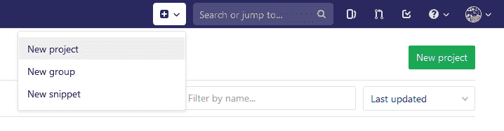](https://res.cloudinary.com/practicaldev/image/fetch/s--2hGsL2sf--/c_limit%2Cf_auto%2Cfl_progressive%2Cq_auto%2Cw_880/https://thepracticaldev.s3.amazonaws.com/i/b8j7m4f2kir0qh31grcc.png)

然后，填写详细信息。之后，您可以点击*创建项目*。

[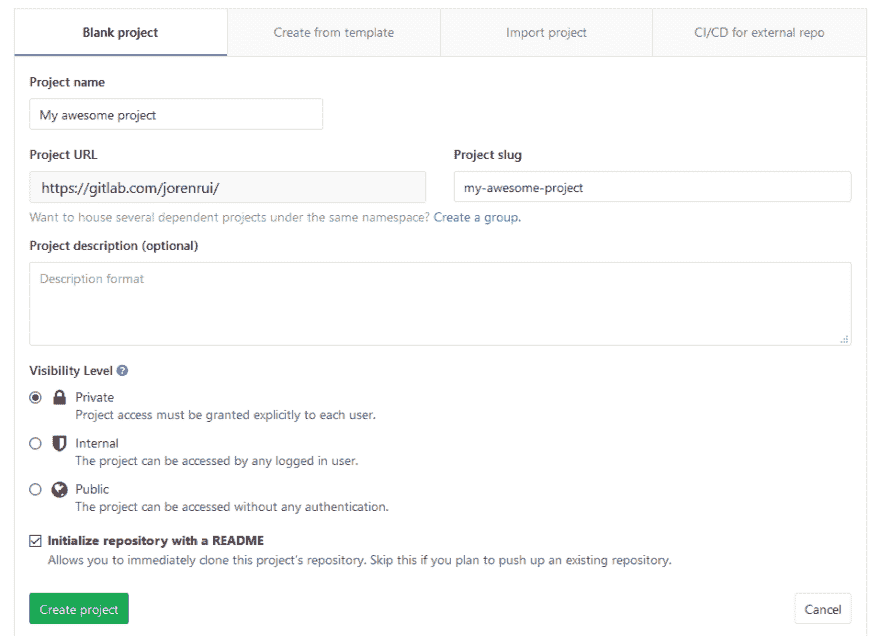](https://res.cloudinary.com/practicaldev/image/fetch/s--7F4AmrbD--/c_limit%2Cf_auto%2Cfl_progressive%2Cq_auto%2Cw_880/https://thepracticaldev.s3.amazonaws.com/i/2b3y663hu43lrno8eepz.png)

#### 3。上传你的文件

有两种方法可以将文件添加到存储库中:

*   使用 Git
*   通过文件上传

至于文件上传，点击加号图标，然后选择*上传文件*

> 注意:默认情况下，您位于存储库的**主**分支中。

[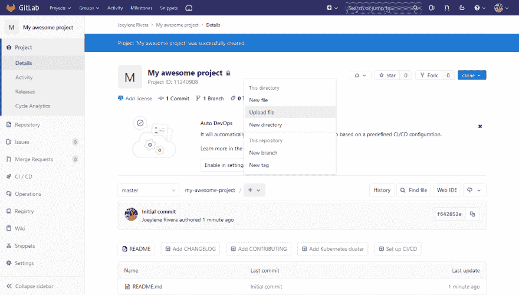](https://res.cloudinary.com/practicaldev/image/fetch/s--GSmbKK64--/c_limit%2Cf_auto%2Cfl_progressive%2Cq_auto%2Cw_880/https://thepracticaldev.s3.amazonaws.com/i/gs24hmbb8jc7dtm2c5zm.png)

然后你可以拖动或上传你的文件。

[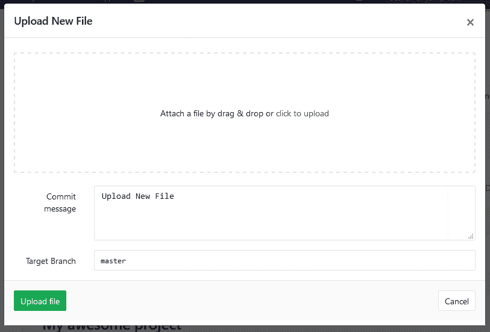](https://res.cloudinary.com/practicaldev/image/fetch/s--46_sGAUa--/c_limit%2Cf_auto%2Cfl_progressive%2Cq_auto%2Cw_880/https://thepracticaldev.s3.amazonaws.com/i/jwwp4qitu3vpxd7ov0zf.png)

至于*提交消息*，键入描述您所做的事情的内容。例如，如果你添加了一个关于页面，那么你可以输入*添加关于页面*。

#### 4。使用 GitLab Pages 部署您的网站

要开始，请单击*设置 CI/CD* 。

[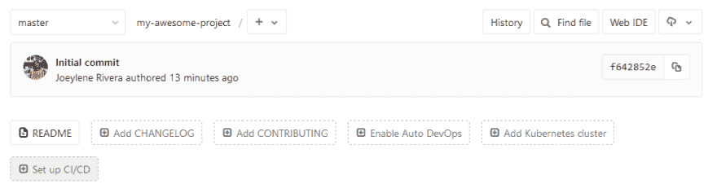](https://res.cloudinary.com/practicaldev/image/fetch/s--fOaFStdf--/c_limit%2Cf_auto%2Cfl_progressive%2Cq_auto%2Cw_880/https://thepracticaldev.s3.amazonaws.com/i/wky2soc86rcha6uvrvfv.png)

这将为您的部署创建一个配置文件。你可以选择一个模板。对于简单的项目，只需选择 *HTML* 。

[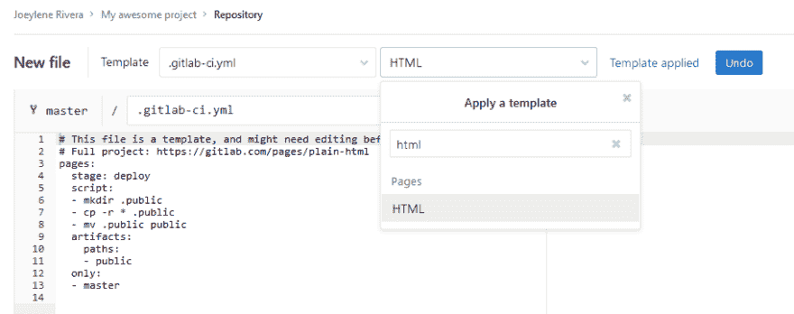](https://res.cloudinary.com/practicaldev/image/fetch/s--UJc3jpaf--/c_limit%2Cf_auto%2Cfl_progressive%2Cq_auto%2Cw_880/https://thepracticaldev.s3.amazonaws.com/i/4mc84n4dtg98b5qprqes.png)

然后按下*提交更改*。

[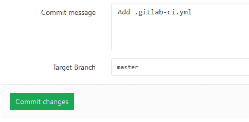](https://res.cloudinary.com/practicaldev/image/fetch/s--UTSh1CqD--/c_limit%2Cf_auto%2Cfl_progressive%2Cq_auto%2Cw_880/https://thepracticaldev.s3.amazonaws.com/i/wivm09mzsgmfj871pqs1.png)

这将在您的项目的根文件夹中创建一个`.gitlab-ci.yml`，其中包含:

```
pages:
  stage: deploy
  script:
  - mkdir .public
  - cp -r * .public
  - mv .public public
  artifacts:
    paths:
    - public
  only:
  - master 
```

Enter fullscreen mode Exit fullscreen mode

GitLab CI/CD 将使用 GitLab 页面构建和部署您的网站。

在侧边栏中，进入*设置*，然后进入*页面*。你会在那里找到你的网站的网址`https://<your-username>.gitlab.io/<repository-name>`。

[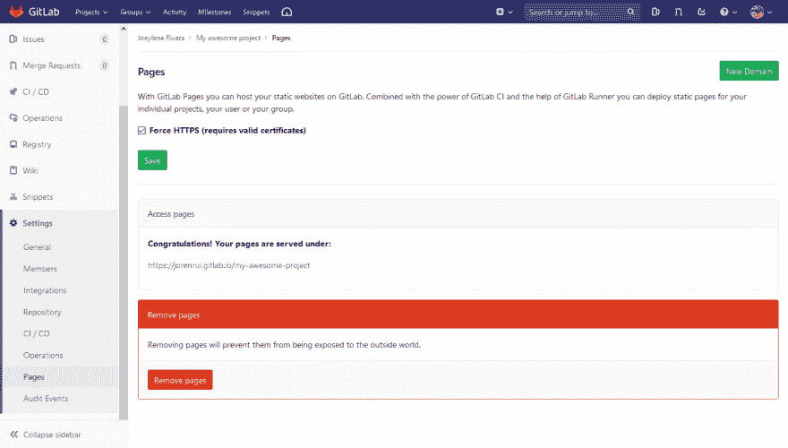](https://res.cloudinary.com/practicaldev/image/fetch/s--qJFOxAgE--/c_limit%2Cf_auto%2Cfl_progressive%2Cq_auto%2Cw_880/https://thepracticaldev.s3.amazonaws.com/i/6tb73i1i2r5eys0sswjt.png)

现在你可能会看到一个 *404 错误*。但是不要担心，它只是需要一些时间在你的网站建立和运行之前。几分钟后再次尝试检查。

如果你想使用`https://<your-username>.gitlab.io`而不是`https://<your-username>.gitlab.io/<repository-name>`，你只需要将你的库命名为`<your-username>.gitlab.io`。这个适合作品集网站。

这样，你的网站就可以上线了。恭喜✨

欲了解更多信息，请访问 [GitLab 页面](https://about.gitlab.com/product/pages/)。

[返回目录](#toc)

* * *

### Netlify

Netlify 提供了一种简单的方法来部署你的站点。

> 集全球部署、持续集成和自动 HTTPS 于一体的工作流程。而这仅仅是开始。
> 
> - [Netlify](https://www.netlify.com/)

[](https://res.cloudinary.com/practicaldev/image/fetch/s--Jknr7ADj--/c_limit%2Cf_auto%2Cfl_progressive%2Cq_auto%2Cw_880/https://thepracticaldev.s3.amazonaws.com/i/1ylj00q7iwvaiuuwic2b.png)

#### 目录

1.  [创建网络账户](#netlify-1)
2.  使用 Netlify 进行部署
    *   [上传您的文件并部署](#netlify-21)
    *   [连接您的 Git 存储库并部署](#netlify-22)
3.  [重命名您的网站](#netlify-3)

#### 1。创建一个网络账户

如果你还没有 Netlify 帐户，你可以使用你的 GitHub/GitLab/BitBucket 帐户或者在这里创建一个。

#### 2。使用 Netlify 进行部署

#### 2.1 上传文件并部署

您可以通过上传文件或将其连接到存储库来部署您的站点。

[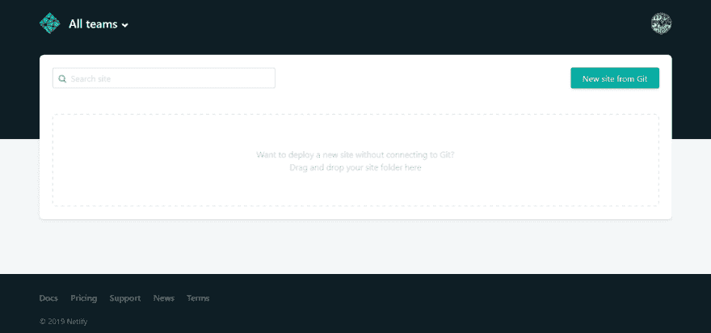](https://res.cloudinary.com/practicaldev/image/fetch/s--rYfSDZDF--/c_limit%2Cf_auto%2Cfl_progressive%2Cq_auto%2Cw_880/https://thepracticaldev.s3.amazonaws.com/i/cdknx7otv409g9o0q0c4.png)

如果你正在上传你的文件，你只需要像这样拖放你的项目文件夹:

[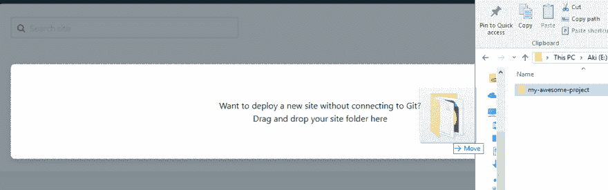](https://res.cloudinary.com/practicaldev/image/fetch/s--ylIZItSE--/c_limit%2Cf_auto%2Cfl_progressive%2Cq_auto%2Cw_880/https://thepracticaldev.s3.amazonaws.com/i/19ufcothdt805qlgyws5.png)

然后，Netlify 现在将部署您的站点。

[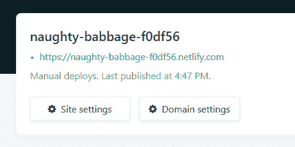](https://res.cloudinary.com/practicaldev/image/fetch/s--PGmS3O-4--/c_limit%2Cf_auto%2Cfl_progressive%2Cq_auto%2Cw_880/https://thepracticaldev.s3.amazonaws.com/i/tql5ei7ouoyma6nuidk8.png)

在这种情况下，你可以在`https://naughty-babbage-f0df56.netlify.com`看到网站。你可以在这里更改网站的名称[。](#netlify-4)

如果你想**更新**你的文件。前往*部署*。

[](https://res.cloudinary.com/practicaldev/image/fetch/s--ti2x52dO--/c_limit%2Cf_auto%2Cfl_progressive%2Cq_auto%2Cw_880/https://thepracticaldev.s3.amazonaws.com/i/vi1qkkcs4cz1ingpa0ja.png)

拖放你的项目文件夹，然后 Netlify 会处理剩下的事情。

[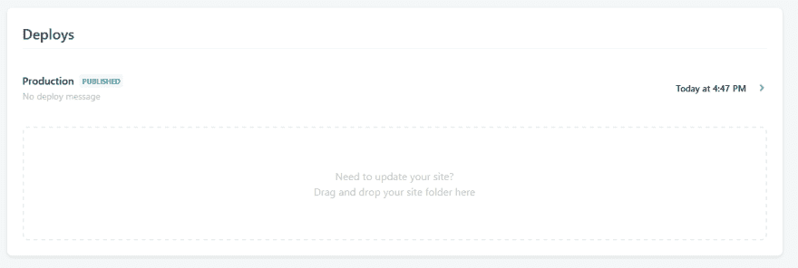](https://res.cloudinary.com/practicaldev/image/fetch/s--kT2-ymKE--/c_limit%2Cf_auto%2Cfl_progressive%2Cq_auto%2Cw_880/https://thepracticaldev.s3.amazonaws.com/i/8ps7lksvzh87pmi816bh.png)

在*概述下*然后生产部署，

[](https://res.cloudinary.com/practicaldev/image/fetch/s--Li3H_SaF--/c_limit%2Cf_auto%2Cfl_progressive%2Cq_auto%2Cw_880/https://thepracticaldev.s3.amazonaws.com/i/tvl6yylyt89s0lmu5zc6.png)

[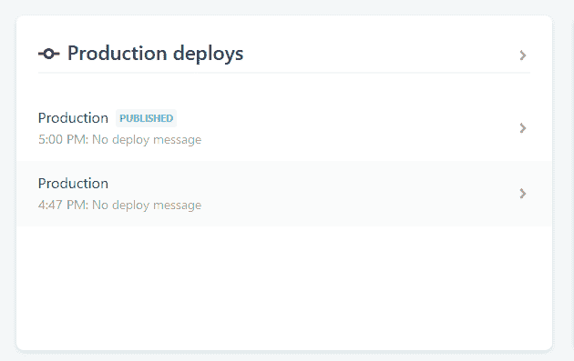](https://res.cloudinary.com/practicaldev/image/fetch/s--ckS96mvj--/c_limit%2Cf_auto%2Cfl_progressive%2Cq_auto%2Cw_880/https://thepracticaldev.s3.amazonaws.com/i/n5hvjz6kakxrii2qrcnn.png)

等到*制作*附近的徽章从*上传*变为*发布*。当它发布后，你的网站就更新了。

#### 2.2 连接您的 Git 库并部署

部署站点的另一种方法是将存储库连接到 Netlify。您可以通过点击 Git 中的*新站点来完成。*

[](https://res.cloudinary.com/practicaldev/image/fetch/s--rYfSDZDF--/c_limit%2Cf_auto%2Cfl_progressive%2Cq_auto%2Cw_880/https://thepracticaldev.s3.amazonaws.com/i/cdknx7otv409g9o0q0c4.png)

它将引导你走向三个简单的步骤

**1。连接到 Git 提供程序，它可以是 GitHub、GitLab 或 BitBucket。**

[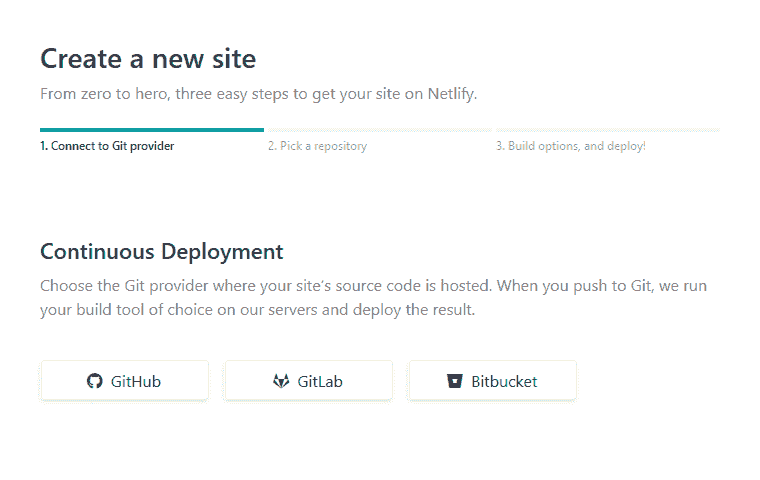](https://res.cloudinary.com/practicaldev/image/fetch/s--ec211bdQ--/c_limit%2Cf_auto%2Cfl_progressive%2Cq_auto%2Cw_880/https://thepracticaldev.s3.amazonaws.com/i/etvlryvjlpva93qxbtif.png)

**2。挑选存储库**

[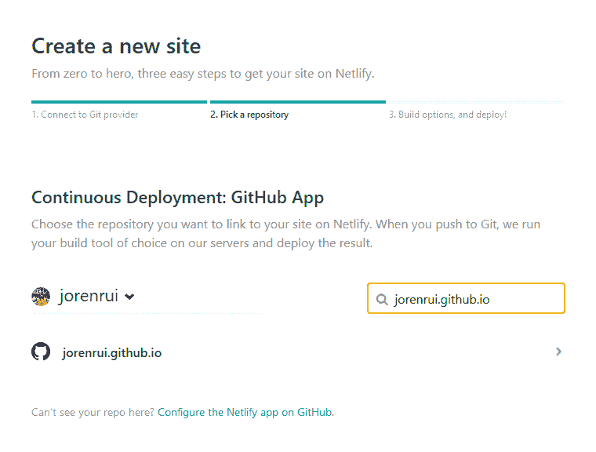](https://res.cloudinary.com/practicaldev/image/fetch/s--wqtxdLLu--/c_limit%2Cf_auto%2Cfl_progressive%2Cq_auto%2Cw_880/https://thepracticaldev.s3.amazonaws.com/i/69865hzcq88ye0sjl5hm.png)

**3。配置您的构建选项**

[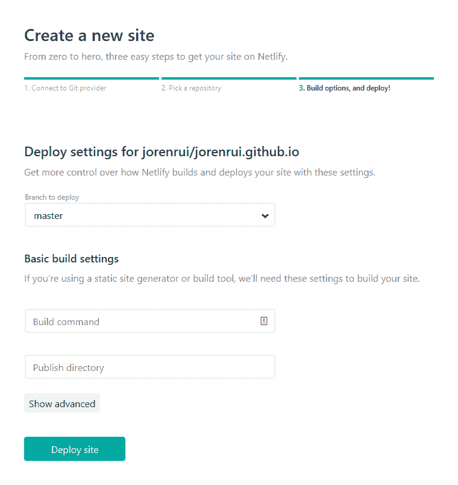](https://res.cloudinary.com/practicaldev/image/fetch/s--gqBfH8wG--/c_limit%2Cf_auto%2Cfl_progressive%2Cq_auto%2Cw_880/https://thepracticaldev.s3.amazonaws.com/i/gzkhg0cjh3czgp8b3arn.png)

如果你不使用 Hugo、Jekyll、Gulp 等，你可以将构建命令和发布目录留空。

[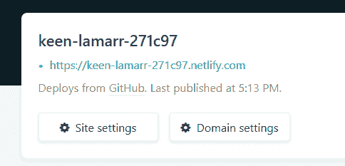](https://res.cloudinary.com/practicaldev/image/fetch/s--3KijsNrx--/c_limit%2Cf_auto%2Cfl_progressive%2Cq_auto%2Cw_880/https://thepracticaldev.s3.amazonaws.com/i/eqgrw3pjja8wkvw12nzy.png)

至此，该网站在`https://keen-lamarr-271c97.netlify.com`上线。

#### 3。更改网站名称

要更改名称，请转到*站点设置*

[](https://res.cloudinary.com/practicaldev/image/fetch/s--hssfOLC9--/c_limit%2Cf_auto%2Cfl_progressive%2Cq_auto%2Cw_880/https://thepracticaldev.s3.amazonaws.com/i/29nad2ghaozxukol1fq8.png)

然后，向下滚动到*站点详情*

[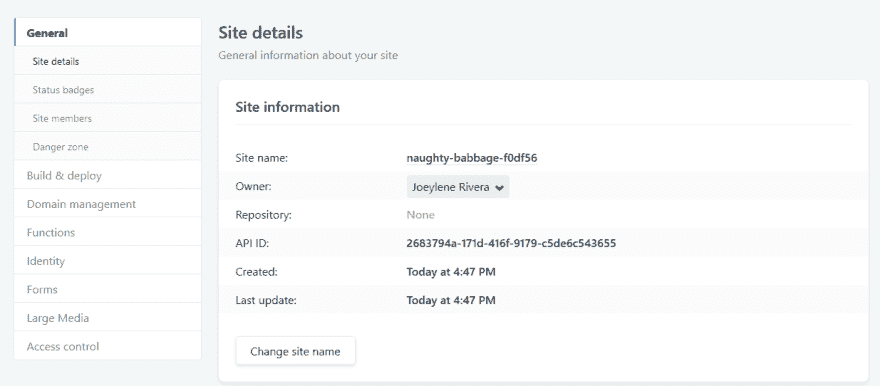](https://res.cloudinary.com/practicaldev/image/fetch/s--x26h0THI--/c_limit%2Cf_auto%2Cfl_progressive%2Cq_auto%2Cw_880/https://thepracticaldev.s3.amazonaws.com/i/vhooyclabblgllw5aetn.png)

在这种情况下，我将把它改为`jorenrui`。

[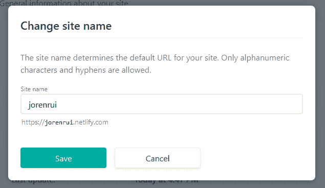](https://res.cloudinary.com/practicaldev/image/fetch/s--h6AOZLvA--/c_limit%2Cf_auto%2Cfl_progressive%2Cq_auto%2Cw_880/https://thepracticaldev.s3.amazonaws.com/i/hl0059np9fnhtjjyveza.png)

之后你就完成了。

祝贺🎉您的网站现在已经启动并运行。

欲了解更多信息，您可以访问 [Netlify 的文档](https://www.netlify.com/docs/)。

[返回目录](#toc)

* * *

### 增兵

Surge 是另一个静态网络主机，你可以用它来部署你的站点。它使用*命令行*来部署您的应用程序。

[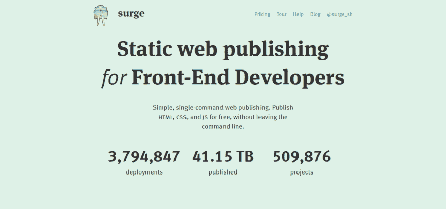](https://res.cloudinary.com/practicaldev/image/fetch/s--ihZwXS2g--/c_limit%2Cf_auto%2Cfl_progressive%2Cq_auto%2Cw_880/https://thepracticaldev.s3.amazonaws.com/i/sdgaqnn6pd1ogtl4ylt9.png)

#### 先决条件

*   熟悉命令行
*   最新版本的 [Node.js](http://nodejs.org/)

#### 目录

1.  [安装浪涌](#surge-1)
2.  [使用浪涌部署](#surge-2)
3.  [cnname](#surge-3)的缩写形式

#### 1。安装浪涌

```
npm install --global surge 
```

Enter fullscreen mode Exit fullscreen mode

对于 Linux 用户:

```
sudo npm install --global surge 
```

Enter fullscreen mode Exit fullscreen mode

#### 2。使用快速增援部署

首先转到您的项目文件夹。在本例中，文件夹的名称是`jorenwebsite`。

```
cd jorenwebsite 
```

Enter fullscreen mode Exit fullscreen mode

然后运行**浪涌** :

```
surge 
```

Enter fullscreen mode Exit fullscreen mode

现在，您可以从命令行登录或创建帐户。

*   项目:`<your project folder's path>`
*   域:`<your-project-name>.surge.sh`

[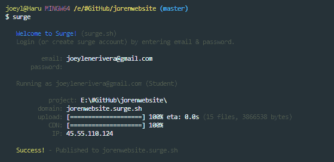](https://res.cloudinary.com/practicaldev/image/fetch/s--Xbx1bX4v--/c_limit%2Cf_auto%2Cfl_progressive%2Cq_auto%2Cw_880/https://thepracticaldev.s3.amazonaws.com/i/56541yp6sf4wfpaes5t6.PNG)

您可以在`<your-project-name>.surge.sh`查看您的网站

更新文件时，请确保您在项目的文件夹中。然后，您可以使用以下命令重新部署站点:

```
surge --domain jorenwebsite.surge.sh 
```

Enter fullscreen mode Exit fullscreen mode

#### 3。cname的缩写

用 CNAME 保存你的域名。在项目文件夹中，创建一个名为`CNAME`的文件。

您可以使用命令行界面:

```
echo jorenwebsite.surge.sh > CNAME 
```

Enter fullscreen mode Exit fullscreen mode

或者创建一个名为`CNAME`的文件，打开你的文本编辑器，添加你的域名，然后保存。

```
jorenwebsite.surge.sh 
```

Enter fullscreen mode Exit fullscreen mode

在这种情况下，域名是`jorenwebsite.surge.sh`。换成你的就行了。

现在当你更新你的文件时，你*不*需要打出`surge --domain jorenwebsite.surge.sh`。你可以通过输入*浪涌*来重新部署你的应用

✨万岁，你完成了！

更多信息可以访问 [Surge](https://surge.sh/help/getting-started-with-surge) 。

[返回目录](#toc)

* * *

## 动态虚拟主机(PHP + MySQL)

### Heroku +远程 MySQL for Laravel Apps

在这一部分，我们将使用[Heroku](https://www.heroku.com/)+[Remote MySQL](https://remotemysql.com/)组合来部署我们的 Laravel web 应用程序。

#### Heroku

Heroku 是部署你的网络应用的好地方之一。它利用 Git 来部署您的应用程序，并拥有自己的 Heroku CLI，您可以在其中运行 bash。

[](https://res.cloudinary.com/practicaldev/image/fetch/s--tzoOTPs2--/c_limit%2Cf_auto%2Cfl_progressive%2Cq_auto%2Cw_880/https://thepracticaldev.s3.amazonaws.com/i/y08sivqqw9y0ozuyimso.png)

#### 先决条件

*   熟悉命令行和 [Git](https://git-scm.com/)
*   安装了 Git
*   安装了 PHP
*   [作曲家](https://getcomposer.org/doc/00-intro.md)已安装
*   一个有效的 Git 存储库

检查是否安装了 Git:

```
git --version 
```

Enter fullscreen mode Exit fullscreen mode

检查是否安装了 PHP:

```
php -v 
```

Enter fullscreen mode Exit fullscreen mode

检查是否安装了 Composer:

```
composer -V 
```

Enter fullscreen mode Exit fullscreen mode

#### 目录

为部署设置 Heroku

1.  [创建一个 Heroku 账户](#heroku-1)
2.  [安装 Heroku CLI](#heroku-2)
3.  [准备 App](#heroku-3)
4.  [创建过程文件](#heroku-4)
5.  [在 Heroku 上创建应用](#heroku-5)
6.  [添加 PHP 构建包](#heroku-6)
7.  [设置 Heroku 配置变量](#heroku-7)
8.  [将代码推送给 Heroku](#heroku-8)
9.  [查看应用](#heroku-9)

集成 MySQL

1.  [创建一个远程 MySQL 账户](#mysql-1)
2.  [设置数据库配置变量](#mysql-2)
3.  [使用数据库](#mysql-3)
4.  [查看应用](#mysql-4)

[您可能遇到的问题及解决方法](#heroku-issues)

#### 设置 Heroku 进行部署

#### 1。创建一个 Heroku 账户

如果您还没有 Heroku 帐户，您可以在这里创建一个

#### 2。安装 Heroku CLI

首先安装 [Heroku CLI](https://devcenter.heroku.com/articles/getting-started-with-php#set-up) 。

之后，您现在可以通过 CLI 登录 Heroku:

```
heroku login 
```

Enter fullscreen mode Exit fullscreen mode

#### 3。准备应用程序

假设您有一个功能正常的 git 存储库，请转到它的目录。在这个例子中，项目的文件夹被命名为`jorenweb`。

```
cd jorenweb 
```

Enter fullscreen mode Exit fullscreen mode

请确保您的应用具备以下条件:

*   `composer.json` -表示是 PHP 应用程序

#### 4。创建过程文件

要从 CLI 创建 Procfile，请运行以下命令:

```
echo "web: vendor/bin/heroku-php-apache2 public/" > Procfile 
```

Enter fullscreen mode Exit fullscreen mode

或者手动创建一个名为`Procfile`的文件，其中包含:

```
web: vendor/bin/heroku-php-apache2 public/ 
```

Enter fullscreen mode Exit fullscreen mode

这将把[文档根](https://devcenter.heroku.com/articles/custom-php-settings#setting-the-document-root)设置为`public/`。

然后提交更改:

```
git add Procfile
git commit -m "Add Procfile for Heroku" 
```

Enter fullscreen mode Exit fullscreen mode

#### 5。在 Heroku 上创建一个应用程序

要在 Heroku 上创建一个应用程序，运行以下命令:

```
heroku create jorenweb 
```

Enter fullscreen mode Exit fullscreen mode

将`jorenweb`替换为您选择的应用程序名称。应用程序的名称将是域名`https://<app name>.herokuapp.com/`。将应用程序名称留空会让 Heroku 为您随机生成一个名称。

#### 6。添加 PHP 构建包

```
heroku buildpacks:set heroku/php 
```

Enter fullscreen mode Exit fullscreen mode

#### 7。设置 Heroku 配置变量

##### Laravel 加密密钥

要检查加密密钥，请运行`php artisan` :

```
php artisan key:generate --show 
```

Enter fullscreen mode Exit fullscreen mode

然后使用`heroku config`命令:
将其复制并设置在 Heroku 上

```
heroku config:set APP_KEY=... 
```

Enter fullscreen mode Exit fullscreen mode

其中`...`是您从`php artisan`命令中复制的*键*。

##### App 的网址

App 的网址是`<app-name>.herokuapp.com`。在这个例子中，应用程序的名称是`jorenweb`。

```
heroku config:set APP_URL=jorenweb.herokuapp.com 
```

Enter fullscreen mode Exit fullscreen mode

#### 8。将代码推给 Heroku

用这个命令推送你的代码:

```
git push heroku master 
```

Enter fullscreen mode Exit fullscreen mode

如果您有多个应用程序，请运行:

```
git push heroku master --app <app-name> 
```

Enter fullscreen mode Exit fullscreen mode

#### 9。查看应用

你可以用这个命令打开你的应用:

```
heroku open 
```

Enter fullscreen mode Exit fullscreen mode

或者去`https://<app name>.herokuapp.com/`。

注意:如果您的应用程序在启动时需要数据库，可能会有一些错误。

#### 集成 MySQL

有几个网站提供 PhpMyAdmin 附带的免费 MySQL，如[免费 SQL 数据库](https://www.freesqldatabase.com/freemysqldatabase/)和 [db4free](https://www.db4free.net/) 。请注意，您只能将它用于测试目的，而不能用于生产。

在这篇文章中，我们将使用[远程 MySQL](https://remotemysql.com/) 。您可以有多达 3 个数据库使用同一电子邮件。

使用它的限制是:

[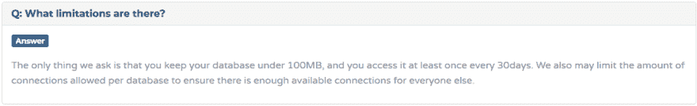](https://res.cloudinary.com/practicaldev/image/fetch/s--F3Y9e5Mv--/c_limit%2Cf_auto%2Cfl_progressive%2Cq_auto%2Cw_880/https://thepracticaldev.s3.amazonaws.com/i/tbfkri72j5hvunr978us.png)

#### 1。创建一个远程 MySQL 账户

在这里创建一个远程 MySQL 账户[。之后，记下`username`、`password`、`database name`和`port`。](https://remotemysql.com/login.php)

[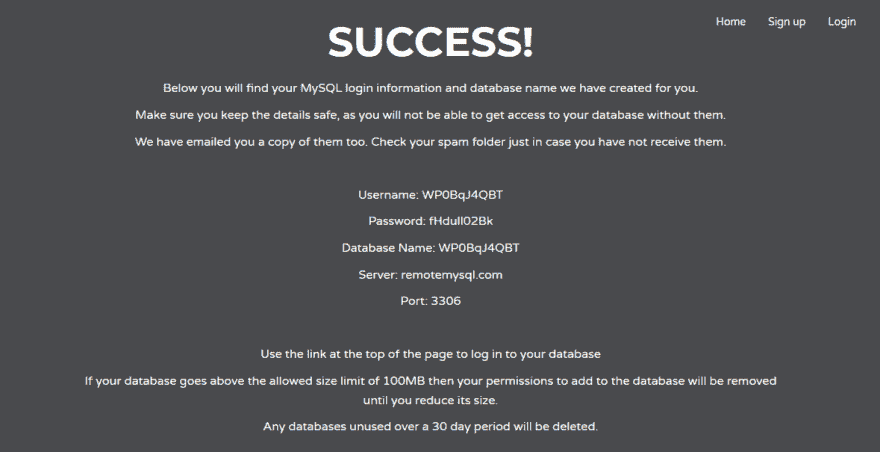](https://res.cloudinary.com/practicaldev/image/fetch/s--ZSB7YiiW--/c_limit%2Cf_auto%2Cfl_progressive%2Cq_auto%2Cw_880/https://thepracticaldev.s3.amazonaws.com/i/nyc8ltbgzvkj8rn4uq7r.png)

#### 2。设置数据库配置变量

有三种方法可以解决这个问题:

*   Heroku CLI
*   Heroku Web
*   更新数据库文件

使用这些不同的方法，我们将更新`mysql`连接的`host`、`database`、`username`、`password`。

##### a. Heroku CLI

使用 Heroku CLI，首先确保您已登录。

```
heroku login 
```

Enter fullscreen mode Exit fullscreen mode

然后，您现在可以更新以下内容:

*   `connection` = `mysql`

```
heroku config:set DB_CONNECTION=mysql 
```

Enter fullscreen mode Exit fullscreen mode

*   `host` = `remotemysql.com`

```
heroku config:set DB_HOST=remotemysql.com 
```

Enter fullscreen mode Exit fullscreen mode

*   `database` = `WP0BqJ4QBT`(将此改为您之前在 remotemysql 上收到的*数据库名称*)

```
heroku config:set DB_DATABASE=WP0BqJ4QBT 
```

Enter fullscreen mode Exit fullscreen mode

*   `username` = `WP0BqJ4QBT`(将此改为您之前在 remotemysql 上收到的*用户名*)

```
heroku config:set DB_USERNAME=WP0BqJ4QBT 
```

Enter fullscreen mode Exit fullscreen mode

*   `password` = `fHduIl02Bk`(将此改为您之前在 remotemysql 上收到的*密码*)

```
heroku config:set DB_PASSWORD=fHduIl02Bk 
```

Enter fullscreen mode Exit fullscreen mode

##### b. Heroku Web

在 Heroku 上，登录并进入您的应用程序。

在导航中，转到*设置*。

[](https://res.cloudinary.com/practicaldev/image/fetch/s--FgoEBx_6--/c_limit%2Cf_auto%2Cfl_progressive%2Cq_auto%2Cw_880/https://thepracticaldev.s3.amazonaws.com/i/rmvimjo2bt3qxwx65x21.png)

然后向下滚动到*配置变量*并点击*显示配置变量*按钮。

[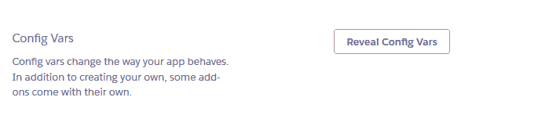](https://res.cloudinary.com/practicaldev/image/fetch/s--9pVAqedr--/c_limit%2Cf_auto%2Cfl_progressive%2Cq_auto%2Cw_880/https://thepracticaldev.s3.amazonaws.com/i/acukas2z4t36mtxfuw9b.PNG)

然后更新以下变量:

*   `connection`
*   `host`
*   `database`
*   `username`
*   `password`

[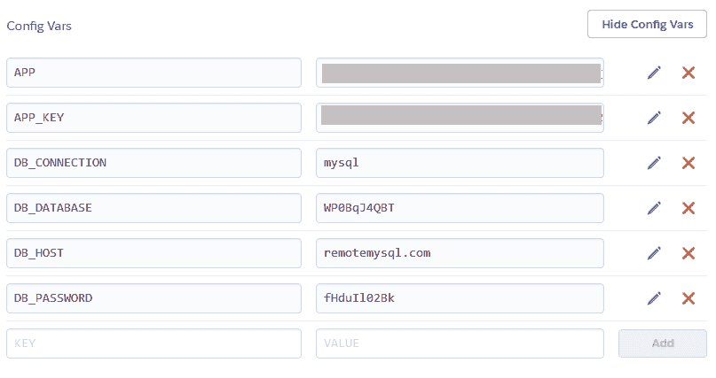](https://res.cloudinary.com/practicaldev/image/fetch/s--SsGuaFlB--/c_limit%2Cf_auto%2Cfl_progressive%2Cq_auto%2Cw_880/https://thepracticaldev.s3.amazonaws.com/i/kwyzaoli0jv479wwbh1d.png)

您可能会看到之前在创建 Heroku 应用程序的过程中设置的`APP`和`APP_KEY`。

##### c .更新数据库文件

在`config/database.php`中，更新`mysql`连接中的`host`、`database`、`username`、`password`。

```
 ...

    'mysql' => [
            'driver' => 'mysql',
-           'host' => env('DB_HOST', '127.0.0.1'), +           'host' => env('DB_HOST', 'remotemysql.com'),
            'port' => env('DB_PORT', '3306'),
-           'database' => env('DB_DATABASE', 'forge'),
-           'username' => env('DB_USERNAME', 'forge'),
-           'password' => env('DB_PASSWORD', ''), +           'database' => env('DB_DATABASE', 'WP0BqJ4QBT'),
+           'username' => env('DB_USERNAME', 'WP0BqJ4QBT'),
+           'password' => env('DB_PASSWORD', 'fHduIl02Bk'),
            'unix_socket' => env('DB_SOCKET', ''),
            'charset' => 'utf8mb4',
            'collation' => 'utf8mb4_unicode_ci',
            'options' => [PDO::ATTR_EMULATE_PREPARES => true],
            'prefix' => '',
            'prefix_indexes' => true,
            'strict' => true,
            'engine' => null,
        ],
    ... 
```

Enter fullscreen mode Exit fullscreen mode

然后推送你的改变:

```
git add config/database.php
git commit -m "Update MySQL DB Configuration"
git push heroku master 
```

Enter fullscreen mode Exit fullscreen mode

#### 3。使用数据库

有两种方法可以访问数据库:

*   通过 PhpMyAdmin
*   通过 Heroku Bash

##### PhpMyAdmin

要使用 PhpMyAdmin 访问数据库，[登录](https://remotemysql.com/phpmyadmin/)远程 MySQL。然后，输入您在[报名](https://remotemysql.com/signup.html)时收到的`username`和`password`。之后，只需导入您的 SQL 转储。

[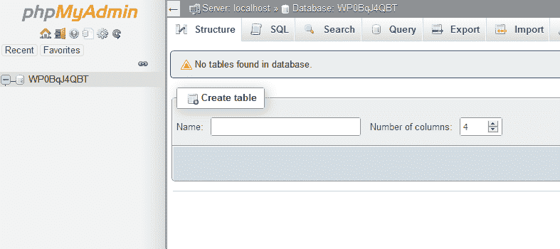](https://res.cloudinary.com/practicaldev/image/fetch/s--1iyB1Rej--/c_limit%2Cf_auto%2Cfl_progressive%2Cq_auto%2Cw_880/https://thepracticaldev.s3.amazonaws.com/i/g2et8h83trl56o0o7ebz.png)

##### 英雄库巴沙尔

另一种方法是使用 Heroku Bash。

如果你还没有登录 Heroku，请首先登录:

```
heroku login 
```

Enter fullscreen mode Exit fullscreen mode

运行命令:
打开 Heroku bash

```
heroku run bash 
```

Enter fullscreen mode Exit fullscreen mode

然后，您现在可以*迁移*您的数据库:

```
php artisan migrate 
```

Enter fullscreen mode Exit fullscreen mode

而*种子*它:

```
php artisan db:seed 
```

Enter fullscreen mode Exit fullscreen mode

#### 4。查看应用

你可以用这个命令打开你的应用:

```
heroku open 
```

Enter fullscreen mode Exit fullscreen mode

或者去`https://<app name>.herokuapp.com/`。

恭喜你。✨ 😆你们都完了！

#### 你可能遇到的问题以及如何解决

##### a .通过 HTTPS 服务资产

在开发模式下，您通常使用 HTTP。但是现在 it 已经投入生产，资产可能无法正确加载。以这个`link`标签为例:

```
<link href="{{ asset('css/app.css') }}" rel="stylesheet"> 
```

Enter fullscreen mode Exit fullscreen mode

`asset()`使用 HTTP，而`secured_asset()`使用 HTTPS。

但是如果你不想在环境问题上强迫 HTTPS，还有另一个解决方案。

要解决这个问题，请转到`app\Providers\AppServiceProvider.php`并添加以下代码:

```
 namespace App\Providers;

  use Illuminate\Support\ServiceProvider;
+ use Illuminate\Support\Facades\Schema; 
  ... 
```

Enter fullscreen mode Exit fullscreen mode

```
 ...

  public function boot()
  {
+    if(config('app.env') === 'production') {
+    \URL::forceScheme('https');
+    }
  }

  ... 
```

Enter fullscreen mode Exit fullscreen mode

这将在生产时将 URL 从 HTTP 更改为 HTTPS。

然后你可以提交这些修改，然后推送到 Heroku。

##### b .迁移过程中指定的密钥过长错误

在`app\Providers\AppServiceProvider.php`中，更新`boot`功能:

```
 use Illuminate\Support\Facades\Schema;

  public function boot()
  {
+    Schema::defaultStringLength(191);
  } 
```

Enter fullscreen mode Exit fullscreen mode

然后你可以提交这些修改，然后推送到 Heroku。

##### c .在 Heroku 上进行数据库迁移期间使用`fzaninotto/faker`时出错(找不到类`Faker\Factory`

在`composer.json`中，将`fzaninotto/faker`从`require-dev`移动到`require`。

```
 ...
-       "laravel/tinker": "^1.0" +       "laravel/tinker": "^1.0",
+       "fzaninotto/faker": "^1.8"
    },
    "require-dev": {
        "beyondcode/laravel-dump-server": "^1.0",
        "filp/whoops": "^2.0",
-       "fzaninotto/faker": "^1.8",
    ... 
```

Enter fullscreen mode Exit fullscreen mode

如果你现在在 Heroku bash，退出它:

```
exit 
```

Enter fullscreen mode Exit fullscreen mode

然后提交您的更改并将其推送到 Heroku:

```
git add composer.json
git commit -m "Update composer.json"
git push heroku master 
```

Enter fullscreen mode Exit fullscreen mode

然后再次运行 Heroku bash:

```
heroku run bash 
```

Enter fullscreen mode Exit fullscreen mode

安装依赖项:

```
composer install 
```

Enter fullscreen mode Exit fullscreen mode

然后再次迁移和播种您的数据库:

```
php artisan migrate:refresh --seed --force 
```

Enter fullscreen mode Exit fullscreen mode

更多信息，你可以访问 Heroku 关于 Laravel 的文档。

[返回目录](#toc)

* * *

### 000 主持人

000webhost 是一个免费的 web 主机，支持 PHP 和 MySQL 应用。它还带有一个控制面板，其中有 PhpMyAdmin 和一个基于 web 的文件管理器。

虽然 000webhost 可以通过文件上传来部署您的 web 应用程序，并且是免费的，但它也带来了很大的安全风险。这就是我不推荐长期使用的原因。学 *Git* 用 Heroku 代替。或者更好的是，使用付费网络主机，从长远来看这是值得的。

> 警告！
> 小心使用 000webhost，因为它已经过 [pwned](https://haveibeenpwned.com/PwnedWebsites#000webhost) 。穆罕默德·福伊萨尔

[](https://res.cloudinary.com/practicaldev/image/fetch/s--3QLlse7x--/c_limit%2Cf_auto%2Cfl_progressive%2Cq_auto%2Cw_880/https://thepracticaldev.s3.amazonaws.com/i/2qfas3h3xea3ndh2oh77.png)

#### 目录

1.  [创建 000 网络主机账户](#webhost-1)
2.  [创建你的网站](#webhost-2)
3.  [上传您的文件](#webhost-3)
4.  [移动文件](#webhost-4)
5.  [配置您的数据库](#webhost-5)
6.  [设置您的网址(可选)](#webhost-6)
7.  [查看你的网络应用](#webhost-7)

#### 1。创建一个 000 虚拟主机账户

如果您还没有 000webhost 帐户，您可以在这里创建一个[。然后你会收到一封电子邮件来验证你的帐户。](https://www.000webhost.com/free-website-sign-up)

#### 2 创建你的网站

验证后，点击*创建您的第一个网站*或*建立网站*，创建您的第一个网站。

[](https://res.cloudinary.com/practicaldev/image/fetch/s---pheMj9O--/c_limit%2Cf_auto%2Cfl_progressive%2Cq_auto%2Cw_880/https://thepracticaldev.s3.amazonaws.com/i/0v0tx9dh1vyiotle3qcm.png)

之后它会问你一些问题，比如你的*网站名称*和*密码*。

[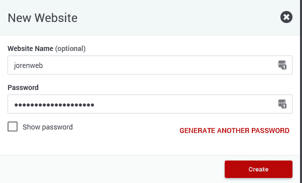](https://res.cloudinary.com/practicaldev/image/fetch/s--e8MmXDDw--/c_limit%2Cf_auto%2Cfl_progressive%2Cq_auto%2Cw_880/https://thepracticaldev.s3.amazonaws.com/i/rkxfddjyml753zh9iu1v.png)

您的网址将是`<website-name>.000webhostapp.com`。在上面的例子中，网址是`jorenweb.000webhostapp.com`。

#### 3。上传你的文件

在导航中，进入*网站管理器*，然后点击*文件管理器*。

[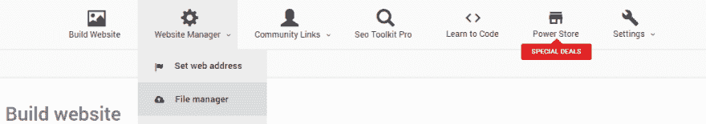](https://res.cloudinary.com/practicaldev/image/fetch/s--xrtCnBCD--/c_limit%2Cf_auto%2Cfl_progressive%2Cq_auto%2Cw_880/https://thepracticaldev.s3.amazonaws.com/i/jgye4qs0s0k1olm3ux8o.png)

这将带您到文件管理器页面。向下滚动并点击*上传文件*按钮。然后，您将被定向到 000webhost 文件管理器，您现在可以在其中上传您的文件。

[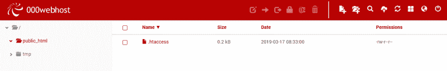](https://res.cloudinary.com/practicaldev/image/fetch/s--10XBbNm3--/c_limit%2Cf_auto%2Cfl_progressive%2Cq_auto%2Cw_880/https://thepracticaldev.s3.amazonaws.com/i/dog627bppyjclfsuz95l.png)

确保您在`public_html`目录中。要上传文件，您可以拖放文件或单击上传图标。

[](https://res.cloudinary.com/practicaldev/image/fetch/s--sFK2c8Bf--/c_limit%2Cf_auto%2Cfl_progressive%2Cq_auto%2Cw_880/https://thepracticaldev.s3.amazonaws.com/i/0kb326fvaex5bra3zveg.png)

我建议把你项目的文件夹归档为一个 **zip** 文件，上传，然后解压。

[](https://res.cloudinary.com/practicaldev/image/fetch/s--ut6BmRnS--/c_limit%2Cf_auto%2Cfl_progressive%2Cq_auto%2Cw_880/https://thepracticaldev.s3.amazonaws.com/i/q4n6e5hqqbpmla4e435o.png)

[](https://res.cloudinary.com/practicaldev/image/fetch/s--cQEaf156--/c_limit%2Cf_auto%2Cfl_progressive%2Cq_auto%2Cw_880/https://thepracticaldev.s3.amazonaws.com/i/e5wk0baz451h5hmexeem.png)

在提取它的时候，让这个目录成为`.`,在这个目录中你将引用你当前所在的目录。在这种情况下，将它提取到`public_html`目录。

[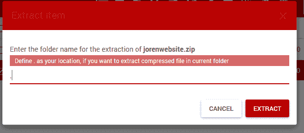](https://res.cloudinary.com/practicaldev/image/fetch/s--02_DgzdY--/c_limit%2Cf_auto%2Cfl_progressive%2Cq_auto%2Cw_880/https://thepracticaldev.s3.amazonaws.com/i/t7vagedkuzeje0z2j1lj.png)

确保它是一个 **zip** 文件，而不是一个 **rar** 文件。如果不这样做，将会导致如下错误:

[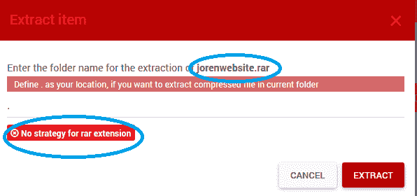](https://res.cloudinary.com/practicaldev/image/fetch/s--AYEXwxBs--/c_limit%2Cf_auto%2Cfl_progressive%2Cq_auto%2Cw_880/https://thepracticaldev.s3.amazonaws.com/i/0ozbtxkhnub9skvbwzqf.png)

之后，你就完成了文件的上传。您现在可以删除 **zip** 文件了。

#### 4。移动文件

转到提取的文件夹。这种情况下就是`jorenwebsite`。选择要移动的文件，然后单击移动图标。

[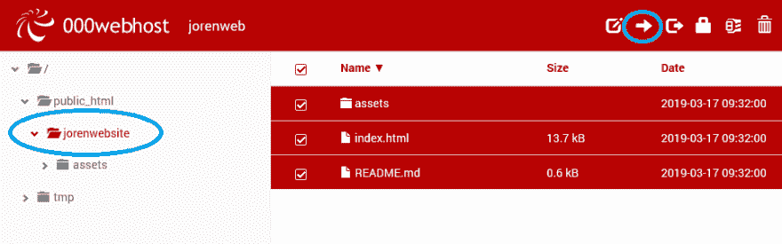](https://res.cloudinary.com/practicaldev/image/fetch/s--pXoKATUb--/c_limit%2Cf_auto%2Cfl_progressive%2Cq_auto%2Cw_880/https://thepracticaldev.s3.amazonaws.com/i/hnyqplodbvxrescf1vum.png)

然后把目的地改成`/public_html`。

[](https://res.cloudinary.com/practicaldev/image/fetch/s--FjFjAcTr--/c_limit%2Cf_auto%2Cfl_progressive%2Cq_auto%2Cw_880/https://thepracticaldev.s3.amazonaws.com/i/rib35snpgofspq5it5ye.png)

最后，删除解压文件的文件夹。在这种情况下，它是`jorenweb`文件夹。

[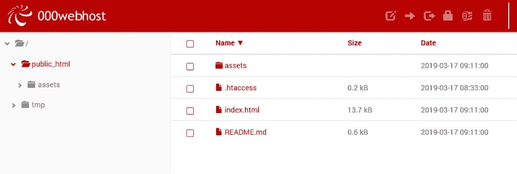](https://res.cloudinary.com/practicaldev/image/fetch/s--_beflQjQ--/c_limit%2Cf_auto%2Cfl_progressive%2Cq_auto%2Cw_880/https://thepracticaldev.s3.amazonaws.com/i/n016n803hagmv2mtv3lj.png)

现在，您的网站已在`<website-name>.000webhostapp.com`上线。

#### 5。配置你的数据库

在导航中，进入*网站管理器*，然后点击*数据库管理器*。

[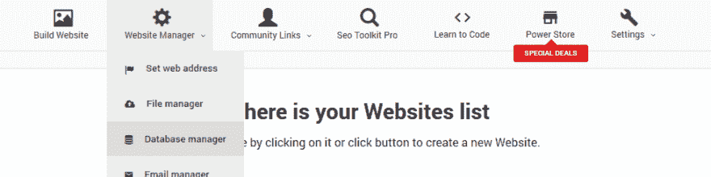](https://res.cloudinary.com/practicaldev/image/fetch/s---pOBPkh2--/c_limit%2Cf_auto%2Cfl_progressive%2Cq_auto%2Cw_880/https://thepracticaldev.s3.amazonaws.com/i/v0xh8r26wgp8zntve2f2.png)

创建一个*新数据库*。

[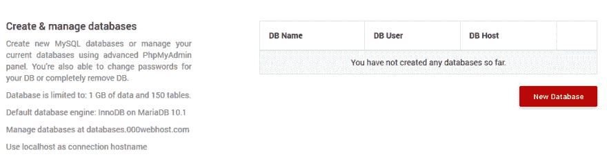](https://res.cloudinary.com/practicaldev/image/fetch/s--oYG7xDPj--/c_limit%2Cf_auto%2Cfl_progressive%2Cq_auto%2Cw_880/https://thepracticaldev.s3.amazonaws.com/i/b06icjw3kkkyl4m17ofk.png)

然后输入你的*数据库名*、*数据库用户名*和*密码*。

[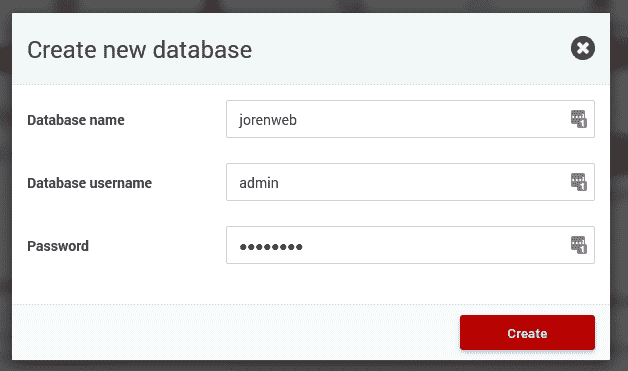](https://res.cloudinary.com/practicaldev/image/fetch/s--ir8qHyEt--/c_limit%2Cf_auto%2Cfl_progressive%2Cq_auto%2Cw_880/https://thepracticaldev.s3.amazonaws.com/i/9306b21q1o7nani7xaa2.png)

现在可以更新数据库配置了。

[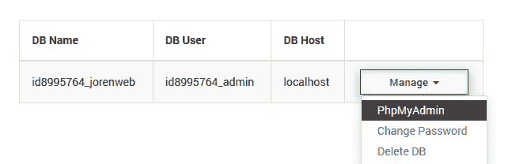](https://res.cloudinary.com/practicaldev/image/fetch/s--aLqX7M6C--/c_limit%2Cf_auto%2Cfl_progressive%2Cq_auto%2Cw_880/https://thepracticaldev.s3.amazonaws.com/i/p1twwud9vp9u4yqsnmk6.png)

在上面的示例中，数据库配置为:

*   数据库名称:id8995764_jorenweb
*   数据库用户:id8995764_admin
*   数据库主机:本地主机
*   密码:`<the password you entered earlier>`

然后，您可以使用 *PhpMyAdmin* 来管理您的数据库。

在导航中，转到*导入*。在这里，上传您的 SQL 转储。

[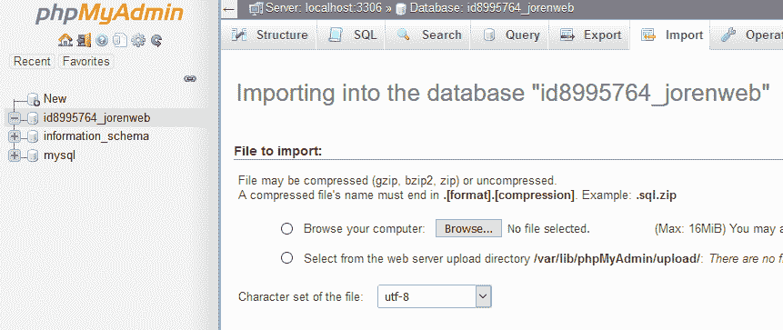](https://res.cloudinary.com/practicaldev/image/fetch/s--6yxtCcmu--/c_limit%2Cf_auto%2Cfl_progressive%2Cq_auto%2Cw_880/https://thepracticaldev.s3.amazonaws.com/i/js4s218ovfr2uo9u9v4j.png)

#### 6。设置您的网址(可选)

默认情况下，您的应用的网址是:`<website name>.000webhostapp.com`

要添加免费的自定义域名，请前往 [Freenom](http://www.freenom.com/en/index.html?lang=en) 。免费的扩展有

。TK /。ML /。GA /。CF /。全船战备部署(general quarters)

检查域的可用性，然后单击*检查*。

[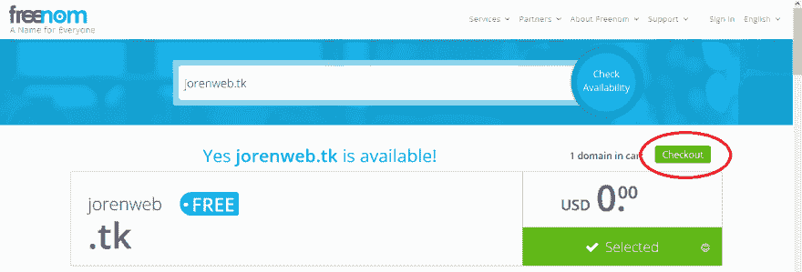](https://res.cloudinary.com/practicaldev/image/fetch/s--pLFutkZ9--/c_limit%2Cf_auto%2Cfl_progressive%2Cq_auto%2Cw_880/https://thepracticaldev.s3.amazonaws.com/i/1445et7uge2xrob7asgc.png)

获得域名后，设置*域名服务器*。点击*使用 DNS* 然后填写字段:

*   名称服务器:`ns01.000webhost.com`
*   名称服务器:`ns02.000webhost.com`

或者进入**我的域名>管理工具>域名服务器**进行设置。

此外，选择您将使用域名的时间段，然后您可以继续。

[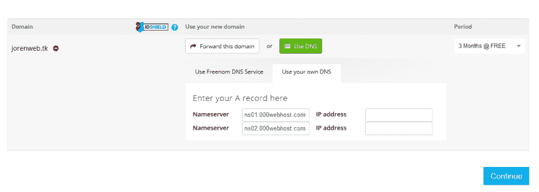](https://res.cloudinary.com/practicaldev/image/fetch/s--wUAFwq7C--/c_limit%2Cf_auto%2Cfl_progressive%2Cq_auto%2Cw_880/https://thepracticaldev.s3.amazonaws.com/i/f60x81va33a7rtptnmy4.png)

在结帐时，您将收到一封电子邮件，其中会将您重定向到一个注册页面以完成订单。

返回 000webhost。

在导航中，进入*网站管理器*，然后点击*设置网址*。

[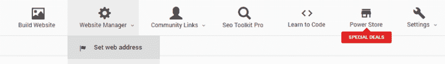](https://res.cloudinary.com/practicaldev/image/fetch/s--3qb35XrB--/c_limit%2Cf_auto%2Cfl_progressive%2Cq_auto%2Cw_880/https://thepracticaldev.s3.amazonaws.com/i/1cf7ksp3hc0c990m0rl8.png)

向下滚动并点击*添加域*。

[](https://res.cloudinary.com/practicaldev/image/fetch/s--XiLEiCzQ--/c_limit%2Cf_auto%2Cfl_progressive%2Cq_auto%2Cw_880/https://thepracticaldev.s3.amazonaws.com/i/9y1buk8xd60o1l6pfexp.png)

选择 *Park Domain* ，然后输入您在 Freenom 中注册的域名。

[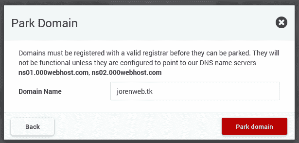](https://res.cloudinary.com/practicaldev/image/fetch/s--PTW9uHuu--/c_limit%2Cf_auto%2Cfl_progressive%2Cq_auto%2Cw_880/https://thepracticaldev.s3.amazonaws.com/i/i7q42r2a9x9mngy06m8b.png)

然后等待域名被链接。更改可能需要 24 小时。

[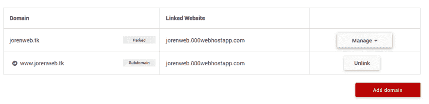](https://res.cloudinary.com/practicaldev/image/fetch/s--qH5TbNcO--/c_limit%2Cf_auto%2Cfl_progressive%2Cq_auto%2Cw_880/https://thepracticaldev.s3.amazonaws.com/i/0atbb2a0382meyygp2tp.png)

#### 7。查看你的网络应用

请访问您的网站`https://<website name>.000webhostapp.com/`

或者，如果您有一个公园域名，`www.example.tk`

之后，你就完成了。恭喜你。🎉

如果你想让你的网站获得一些 SSL 认证，你可以免费使用 [Cloudflare](https://www.cloudflare.com/) 。

更多信息可以访问 [000webhost 论坛](https://www.000webhost.com/forum/)。

[返回目录](#toc)

* * *

## 包装完毕

对于不需要数据库的网站，你可以使用静态网站主机，比如 [GitHub Pages](#github) 、 [GitLab Pages](#gitlab) 、 [Netlify](#netlify) 和 [Surge](#surge) 。你也可以探索和寻找其他网络主机，如 [Zeit](#zeit) 和 [AWS Amplify](https://aws.amazon.com/amplify/console/) 。

至于 PHP+MySQL 网络应用，如果你是一个不使用任何框架的初学者，你可以查看一下 [000webhost](#webhost) 。但是要注意，它有很大的安全隐患，我不建议长期使用。但是如果你想部署一个使用 MySQL 的 Laravel 应用程序，你可以查看 [Heroku +远程 MySQL](#heroku-mysql) 。另一方面， [Heroku](https://www.heroku.com/) 不仅仅提供 PHP web 应用托管。它还可以托管 NodeJS、Ruby、Java、Python 和 Go web 应用。

这些是我在寻找部署我的 web 应用程序的方法时找到的 web 主机。从上传文件到通过 CLI 使用 Git，我的部署过程变得更加容易。我很享受从 000webhost 到 Heroku 的转变，因为我对 CLI 越来越熟悉了。另外，如果可以的话，使用付费的网络主机，比如数字海洋或者 T2 的 AWS。从长远来看，这是值得的。我希望分享这些能在某种程度上帮助你。

感谢阅读和快乐编码！😄 ☕**