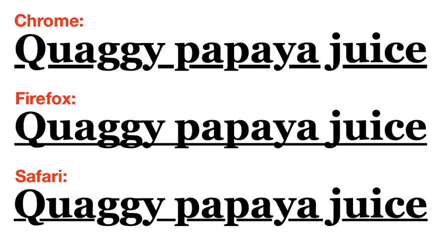
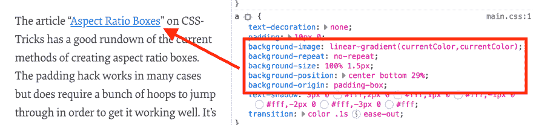

# 用于调整文本下划线偏移量和粗细的 CSS 属性即将出现在 Safari 中

> 原文：<https://dev.to/simevidas/css-properties-for-adjusting-text-underline-offset-and-thickness-are-coming-to-safari-f43>

通过 CSS `text-decoration: underline`声明添加的文本下划线不是由不同的浏览器引擎统一绘制的。下划线的粗细和垂直位置不同。

[](https://res.cloudinary.com/practicaldev/image/fetch/s--xRxHHAfh--/c_limit%2Cf_auto%2Cfl_progressive%2Cq_auto%2Cw_880/https://thepracticaldev.s3.amazonaws.com/i/er57ioliwktkhzeq73x2.png)

这可能是为什么一些网站如 Smashing Magazine 使用基于 CSS 背景的黑客技术来绘制跨浏览器的更加一致的链接下划线的部分原因。(我把这种方法复制给了网络平台新闻。)

[](https://res.cloudinary.com/practicaldev/image/fetch/s--XSKyGD46--/c_limit%2Cf_auto%2Cfl_progressive%2Cq_auto%2Cw_880/https://thepracticaldev.s3.amazonaws.com/i/vfvkrrj3zfxs8kyoq77q.png)

Safari 的预览版(从[技术预览 70](https://webkit.org/blog/8496/release-notes-for-safari-technology-preview-70/) 开始)支持两个新的 CSS 属性，使作者能够<mark>调整文本下划线的粗细和偏移量</mark>。这些属性在 [CSS 文本装饰 4 模块](https://drafts.csswg.org/css-text-decor-4/)中定义。

```
h1 {
  text-decoration: underline;
  text-underline-offset: 0.1em;
  text-decoration-thickness: 0.1em;
} 
```

Enter fullscreen mode Exit fullscreen mode

试试这里的演示:[https://output.jsbin.com/busaboz/quiet](https://output.jsbin.com/busaboz/quiet)。

[https://www.youtube.com/embed/jsPLEJ65K9Q](https://www.youtube.com/embed/jsPLEJ65K9Q)

* * *

*此内容最初发布于 [https://webplatform.news](https://webplatform.news) 。*