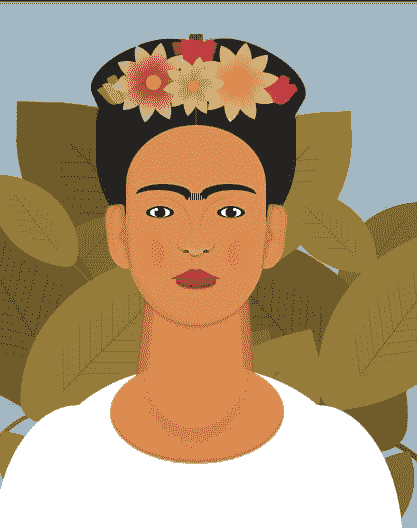
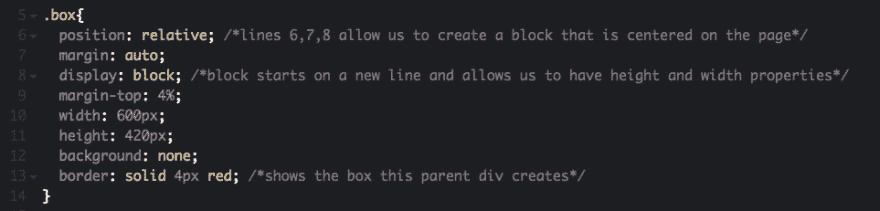
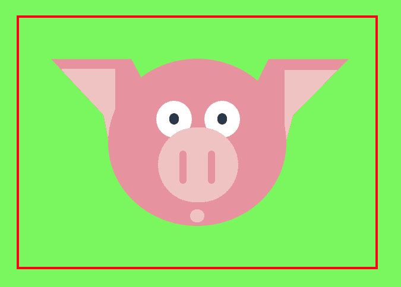
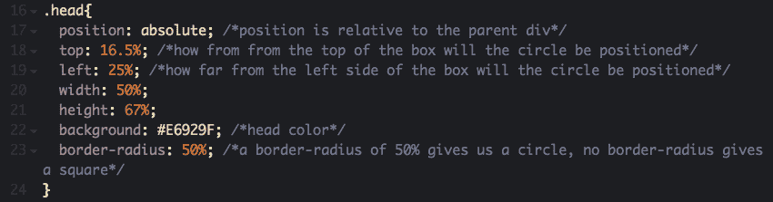
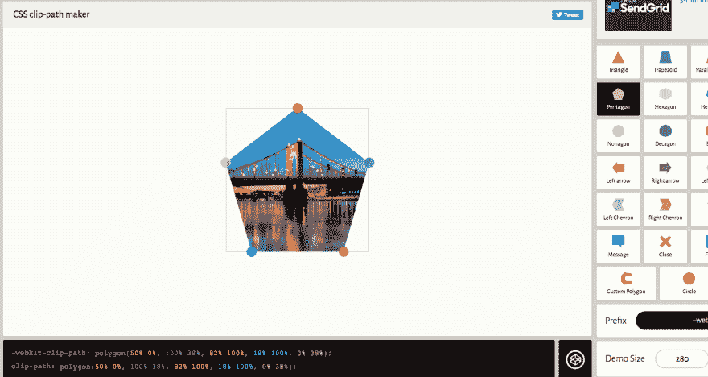

# CSS 艺术入门

> 原文：<https://dev.to/adriennemiller/getting-started-with-css-art-43b8>

我真的被 DEV 本周时事通讯中的一个链接迷住了。这是一个由亚当·库恩创建的弗里达·卡罗的纯 CSS 图像的链接。

<figure> 

<figcaption>亚当·库恩的弗里达·卡罗 CSS 艺术</figcaption>

</figure>

#### 如何从代码中创造艺术？

虽然我有一些 HTML 和 CSS 的经验，但我不知道如何把这些碎片放在一起，只用 CSS 创建一个如此美丽的图像。我决定四处寻找关于纯 CSS 图像的基础教程，并找到了 Michael Mangialard 的帖子[“纯 CSS 图像初学者指南”](https://medium.com/coding-artist/a-beginners-guide-to-pure-css-images-ef9a5d069dd2)。这是一个很棒的初级教程，它将引导你完成创建 CSS 考拉图片的每一步。考拉的每个部分都是一个独立的 HTML div 元素，应用了不同的 CSS 样式。我强烈建议去看看。

迈克尔·曼吉亚拉德的考拉 CSS 艺术:

[https://codepen.io/mikemang/embed/oYMePj?height=600&default-tab=result&embed-version=2](https://codepen.io/mikemang/embed/oYMePj?height=600&default-tab=result&embed-version=2)

#### 我自己的 CSS 图像项目

我浏览了教程，对代码进行了自己的编辑，创建了一个猪的图像，而不是树袋熊。

**我的 CSS 猪项目:**

[https://codepen.io/Millera92/embed/bZxVPe?height=600&default-tab=result&embed-version=2](https://codepen.io/Millera92/embed/bZxVPe?height=600&default-tab=result&embed-version=2)

#### 什么是 CSS 图片？

一个 CSS 图像可以只用 HTML 和 CSS 代码来制作。HTML 是一种标记语言，它为网页提供了基本的结构和内容，而 CSS 则是赋予内容风格的东西。CSS 图像可以通过创建 HTML div 元素，然后赋予它们不同的大小、形状、颜色和位置来创建一个整体图片。

HTML div 是一种标签，用于将元素分组在一起，然后用 CSS 对它们进行样式化，或者用 JavaScript 赋予它们行为。

<figure> 

<figcaption>这是创建父 div 框的代码。</figcaption>

</figure>

#### 都是 div

对于这个项目，组成图像的所有 div 元素都嵌套在一个父 div 中。这个父 div 就像是一个隐形的框架，围在猪头上。如果父 div 被赋予红色边框，您可以看到它实际上是一个位于页面中心的框。子 div 元素的位置基于与父 div 的关系。换句话说，猪的所有不同部分在页面上的位置都与盒子相关。

<figure> 

<figcaption>红色轮廓显示父 div 创建的不可见框。</figcaption>

</figure>

猪头 div 是盒子 div 的子 div，它的定位基于它与那个盒子的关系。

<figure> 

<figcaption>这是创建猪头的代码，也就是一个圆。</figcaption>

</figure>

#### Z 向指数

创建猪的其余元素的位置和样式也是如此。少数还有 z-index，它允许您以一定的顺序将元素堆叠在一起。例如，猪的鼻子比眼睛具有更大的 z 指数，因为鼻子位于眼睛之上。

#### 裁剪路径

Div 元素自然会是一个矩形。你可以通过设置边框半径来开始弯曲矩形的角，设置 50%的边框半径会得到一个圆。

对于更复杂的形状，您可以使用裁剪路径，它设置坐标来决定元素的哪一部分应该被显示。需要注意的是，并非所有浏览器都支持它们。你可以在 Mozilla 的网站上了解更多关于它们的信息和用法。我用了一个叫做 [Clippy](https://bennettfeely.com/clippy/) 的工具，由 Bennett Feely 创建，它允许你画出你想要的形状，然后给你代码。我用这个创建了猪耳朵的形状。

**Clippy 让你轻松制作 CSS 形状:**

#### CSS 图片实用吗？

据我所知，CSS 图像并不适合实际应用。使用设计程序来创建 SVG 图像会有效得多。然而，学习如何创建它们是更熟悉 CSS 样式的一个很好的方法，我发现它特别有助于我熟悉定位是如何工作的。

工具和参考资料:
[纯 CSS 图片入门指南](https://medium.com/coding-artist/a-beginners-guide-to-pure-css-images-ef9a5d069dd2)
[亚当·库恩的弗里达·卡罗 CodePen](https://codepen.io/cobra_winfrey/details/aMLxMQ)
[Clippy](https://bennettfeely.com/clippy/)
[W3Schools CSS](https://www.w3schools.com/css)
[Clip-Path-Mozilla](https://developer.mozilla.org/en-US/docs/Web/CSS/clip-path)