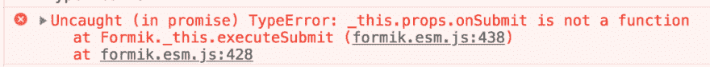
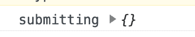
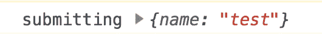
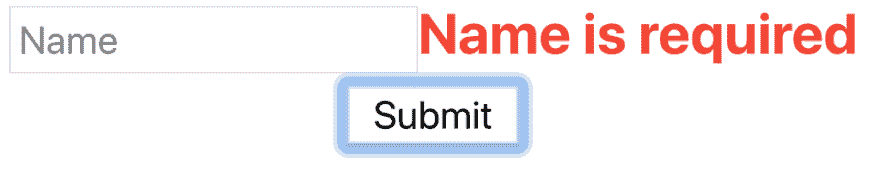
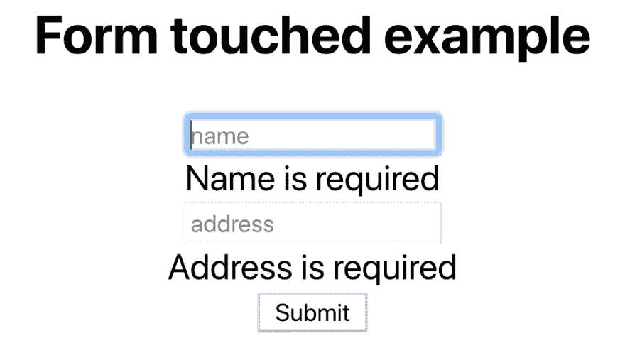

# 不再流泪，使用 Formik 处理 React 中的表单，第一部分

> 原文：<https://dev.to/azure/no-more-tears-handling-forms-in-react-using-formik-part-i-20kp>

[](https://res.cloudinary.com/practicaldev/image/fetch/s--R8Zxqs3r--/c_limit%2Cf_auto%2Cfl_progressive%2Cq_auto%2Cw_880/https://cdn-images-1.medium.com/max/800/1%2A4J7AdkGvC3Kox5Jhhqo70w.jpeg)

在 [Twitter](https://twitter.com/chris_noring) 上关注我，很乐意接受您对主题或改进的建议/Chris

> 50%如果 React 开发人员不使用表单库，他们自己构建，这是一个巨大的数字。随着人们发现 Formik，我认为这个数字将会减少。

本文是系列文章的一部分:

*   不再流泪，使用 Formik 处理表单，第一部分，**我们到了**
*   不再流泪，使用 Formik 处理表单，第二部分，*处理表单*

在本文中，我们将涵盖:

*   **表单概述**，讨论一般的表单和不同的表单库
*   **设置**，我们将介绍如何使用 Formik 安装和设置 React 项目，这样在本节结束后，您就可以使用“Hello World”版本了
*   **让我们来看一下**，这里我们将创建一个相对真实的表单示例，包括大多数类型的表单字段
*   **验证类型**，有不止一种方法可以进行验证，比如每次字段值改变时，或者当您将焦点从一个字段转移到下一个字段时。让我们看看如何在这两种模式之间切换

本文是系列文章的一部分。Formik 有太多有趣的主题，会让这篇文章太长。因此，在我们的下一部分中，我们将使用 Yup、异步验证来涵盖模式验证，并使用一些 Formiks 内置组件来使一切变得不那么冗长:

## 资源

我已经为这两篇文章做了回购，所以如果你卡住了，看看这里[表格演示回购](https://github.com/softchris/formik-example/)

## 通用表单和表单库

表格，你最喜欢的话题？没有吗？是的，我同意你，也不是我最喜欢的。这是一个非常重要的话题，所以我们需要在这里得到很多东西。以下是一个不完整的列表:

*   **太多的**输入字段
*   **太少的**输入字段
*   **清除**错误信息
*   **不同类型的验证**如电子邮件、数字、服务器端验证
*   它是如何验证的，比如每次字符改变，或者输入字段改变，或者当你按下提交按钮时

这是形体痛苦的唯一原因吗？这取决于所选择的 SPA 框架。在我们的例子中，我们选择 React.js 作为我们的 SPA 框架。React 目前还没有一个官方的表单库，通常当创建者创建一个框架时，它并不会显示出你最终的选择，比如:

*   **推出你自己的**，这是关于建立你自己处理表单的方式。这是我们在这篇[文章](https://itnext.io/keep-calm-and-handle-forms-in-react-js-52c67eea340e)中涉及的内容
*   [**Formsy**](https://github.com/christianalfoni/formsy-react) ，根据创作者的说法，它旨在成为灵活性和可重用性之间的最佳平衡点
*   Formik ，这就是本文所涉及的图书馆
*   [**反应形态**](https://github.com/react-tools/react-form) ，这是关于把你的形态值放在一个 Redux 状态，这是坏事还是好事由你决定

根据我最近在 Twitter 上进行的一项研究(是的，我知道，不是超级科学，但仍然是), 50%的 React 开发人员选择构建他们自己的表单处理方式。那是一个**巨大的**数字。我个人的意见是使用 Formik，因为它涵盖了我所期望的表单库的大部分特性。和我呆在一起，也许你会同意 Formik 确实是一个非常有能力的库。:)

如果你想知道更多关于上述图书馆的不同之处，这里有一篇文章[https://codebrahma.com/form-libraries-in-react/](https://codebrahma.com/form-libraries-in-react/)

## 设置

像所有的 React 项目一样，我们从使用工具 Create React App，CRA 开始。创建 React 应用程序就像键入以下内容一样简单:

```
npx create-react-app [myapp]
cd [my app] 
```

现在我们有了一个 React 应用程序，让我们向它添加库 Formik:

```
yarn add formik
OR
npm install formik --save 
```

让我们快速解释一下要让 Formik 正常运行我们需要做些什么。我们需要做到以下几点:

1.  导入 Formik 组件
2.  定义`initialValues`，这将赋予表单初始值
3.  `validate`，这是一个将表单值作为输入参数的函数。该函数的作用是构造并返回一个表示表单状态的对象。对象本身是键-值对，其中键是表单字段的名称，值应该是在该字段上检测到错误时的错误消息
4.  这是一个我们需要定义的函数，当我们按下提交按钮时，我们在这里决定应该发生什么
5.  Formik 组件的子组件是我们定义表单的标记及其包含的字段的地方。这也是我们呈现表单错误的地方(如果有的话)

## 带它兜风

好了，让我们创建一个文件 FirstExample.js，我们将用它来创建一个包含 Formik 的组件。让我们从导入开始:

```
// FirstExample.js

import { Formik } from 'formik'; 
```

现在怎么办？我们需要一个组件来包装 Formik 组件，如下所示:

```
// FirstExample.js

import { Formik } from 'formik';

const FormikExample= () => (
  <Formik>
  // define markup
  </Formik>
) 
```

### 处理提交

这不会渲染任何东西，但是我想一步一步来确保我不会在途中失去你。好了，下一步要做的是添加更多的标记，并涉及 Formik 组件公开的 handleSubmit 方法，所以让我们将您的代码改为:

```
// FirstExample.js

import React from 'react';
import { Formik } from 'formik';

const FirstExample = () => (
  <Formik>
  {({ handleSubmit }) => (
   <form onSubmit={handleSubmit}>
     <input name="name" type="text" placeholder="Name"></input
     <button>Submit</button>
   </form>

  )}
  </Formik>
)

export default FirstExample; 
```

如果此时在浏览器中运行此命令，将会出现以下错误:

[](https://res.cloudinary.com/practicaldev/image/fetch/s--uyrJnhpm--/c_limit%2Cf_auto%2Cfl_progressive%2Cq_auto%2Cw_880/https://cdn-images-1.medium.com/max/1024/1%2Azzt06uCqsPHfKdHbxkhzpg.png)

是的，我们需要为 Formik 组件的 onSubmit 属性分配一个函数，所以接下来让我们这样做:

```
// FirstExample.js

import React from 'react';
import { Formik } from 'formik';

const FirstExample = () => (
  <Formik onSubmit={values => {  
    console.log('submitting', values);  
  }} >

  {({ handleSubmit }) => (
  <form onSubmit={handleSubmit}>
    <input name="name" type="text" placeholder="Name"></input>
    <button>Submit</button>
  </form>
  )}
  </Formik>
)

export default FirstExample; 
```

现在让我们看看点击提交按钮时的输出:

[](https://res.cloudinary.com/practicaldev/image/fetch/s--ML7PxQPc--/c_limit%2Cf_auto%2Cfl_progressive%2Cq_auto%2Cw_880/https://cdn-images-1.medium.com/max/400/1%2AVM7Gc92-4a5IRWuindkTYw.png)

[](https://res.cloudinary.com/practicaldev/image/fetch/s--ZLcqvMRM--/c_limit%2Cf_auto%2Cfl_progressive%2Cq_66%2Cw_880/https://cdn-images-1.medium.com/max/360/1%2AOVjwnByTTBowAZVYssosmg.gif)

没关系，真的，我们接下来会通过谈论元素的生命周期来解释为什么会发生这种情况，希望能带来一些清晰。

### 用 initialValues 处理元素输入生命周期

空 ey，我们做错了什么？好了，我们需要告诉 Formik 组件处理表单中输入元素的生命周期。我们通过定义 initialValues 属性来实现这一点，并为它提供一个包含表单内容的对象。我们还需要处理输入元素上的 onChange 事件。将您的代码更新为以下内容:

```
// FirstExample.js

import React from 'react';
import { Formik } from 'formik';

const FirstExample = () => (
  <Formik 
    initialValues={{ name: '' }}  
    onSubmit={values => {
      console.log('submitting', values);
    }}>
    {({ handleSubmit, handleChange, values }) => (
    <form onSubmit={handleSubmit}>
      <input onChange={handleChange}   
             value={values.name}  
             name="name"  
             type="text" 
             placeholder="Name">
      </input>
      <button>Submit</button>
    </form>
    )}
  </Formik>
 )

export default FirstExample; 
```

所以我们做了上面三件事

1.  **定义了**initial values，并给了它一个表示表单输入值的对象
2.  **connected** 该方法处理输入元素上的 onChange 事件的变化
3.  **将**输入元素的值属性连接到我们的值对象，特别是`name`属性

现在，让我们再次尝试按 submit 并检查结果:

[](https://res.cloudinary.com/practicaldev/image/fetch/s--LxGh49uS--/c_limit%2Cf_auto%2Cfl_progressive%2Cq_auto%2Cw_880/https://cdn-images-1.medium.com/max/530/1%2A-MjKE3ZQktzELJqDoXe8dA.png)

[](https://res.cloudinary.com/practicaldev/image/fetch/s--ayhXG4uq--/c_limit%2Cf_auto%2Cfl_progressive%2Cq_66%2Cw_880/https://cdn-images-1.medium.com/max/260/1%2AuktHLe9hVylqYh4ijGjhPg.gif)

我们现在看到，Formik 选择了我们的输入元素，并正确地处理了生命周期。哦是的:)

### 验证

到目前为止，我们还没有设置任何验证，这通常是我们在处理表单时想要做的。那么，我们如何在 Formik 组件中做到这一点呢？我们需要采取以下步骤:

1.  在 Formik 组件上定义 validate 属性，它需要一个函数来返回一个带有错误映射的对象
2.  读取模板函数中的一个错误属性，如果设置了错误，确保显示错误

好，让我们从验证属性开始:

```
validate = {values => {
  let errors = {};
  if(!values.name) {
    errors.name = 'Name is required';
  }
  return errors;
}} 
```

上面您看到了我们如何为 validate 属性提供一个带有输入参数`values`的函数。values 参数包含我们的表单值，我们只需要调查这些值来确定我们是否有错误。从上面的实现中可以看出，我们正在检查 name 元素，并检查它是否为空。如果它是空的，我们设置一个错误文本，最后我们返回我们的错误对象。

下一步是确保我们的标记使用我们刚刚构造的 errors 对象。这很容易做到，就像这样添加它:

```
{({
  handleSubmit,
  handleChange,
  values,
  errors  
}) => (

<form onSubmit={handleSubmit}>
  <div>
    <input name="name" 
           onChange={handleChange} 
           name="name"
           value={values.name} 
           type="text" 
           placeholder="Name">
    </input>

  {errors.name &&  
    <span style={{ color:"red", fontWeight: "bold" }}>  
    {errors.name}      
    </span>  

  } 
</div>
  <div>
    <button>Submit</button>
  </div>
 </form>

)} 
```

在浏览器中查看，它现在看起来像这样:

[](https://res.cloudinary.com/practicaldev/image/fetch/s--vczchgjq--/c_limit%2Cf_auto%2Cfl_progressive%2Cq_auto%2Cw_880/https://cdn-images-1.medium.com/max/1024/1%2AIkkRtTHrtM3LH2MO7ybnjw.png)

[](https://res.cloudinary.com/practicaldev/image/fetch/s--EG2Aa8qh--/c_limit%2Cf_auto%2Cfl_progressive%2Cq_66%2Cw_880/https://cdn-images-1.medium.com/max/360/1%2ARzYxUERbPtbgs-JTXa1BiQ.gif)

## 改善我们的形态

有许多方法可以改善我们使用 Formik 处理表单的方式，有两种不同的方法:

*   **触摸**，该状态表示用户是否已经与该输入元素交互。如果用户与它进行了交互，那么 touched 的值将为 true，例如，touched.name 将为 true
*   **隐藏/禁用提交按钮**，当你提交一个表单时，这通常意味着你与一个后端对话，而这个后端会花一些时间返回给你，同时确保用户不能按下提交按钮是一个好主意
*   **控制验证调用**，通常情况下，验证函数会运行三次，这是你需要注意的:模糊时、更改时和提交时。

### 搬运感动

到目前为止，我们已经展示了在 onChange 和 onBlur 上运行验证的表单的不同示例，这是默认行为，除非您显式关闭它。然而，这样做的效果是直接在字段旁边显示错误，即使您实际上还没有开始在该字段中输入字符。这不是一个很好的用户体验。我用截图来说明问题:

[](https://res.cloudinary.com/practicaldev/image/fetch/s--KjMhyqWh--/c_limit%2Cf_auto%2Cfl_progressive%2Cq_auto%2Cw_880/https://cdn-images-1.medium.com/max/1024/1%2AS9fAVfxvq7gBvT-hBhJ8pw.png)

上面，我们在名称字段中输入了一个字符，并删除了该字符，因此我们的验证功能被触发。当我们还在现场时，不仅会触发验证，而且对于我们甚至还没有尝试与之交互的地址，还会显示验证错误。这些都不好。那我们该怎么办？嗯，我们可以确保没有一个字段显示任何验证错误，除非它们被触摸过。那么感动是什么意思呢？这意味着我们已经在字段中输入了字符，并让它在另一个字段中工作。让我们展示一下如何在标记中做到这一点:

```
// FormikTouched.js - excerpt showing the Formik components child function 

{({

  values, 
  errors,
  touched ,
  handleSubmit,
  handleChange,
  handleBlur

}) => (

<form onSubmit={handleSubmit}>

  <h2>Form touched example</h2>

  <div>
    <input onBlur={handleBlur}
           onChange={handleChange}
           placeholder="name" 
           name="name" 
           value={values.name} />

    {errors.name && touched.name &&

    <div>{errors.name}</div>

    }

  </div>
  <button>Submit</button>
</form>

)} 
```

我们在上面看到，我们添加了对被触摸属性的访问，作为我们的子函数的输入参数的属性之一。我们还看到，我们在访问`touched.name`的第一个输入参数上使用了所述接触值。本质上，这意味着我们能够判断出，如果 touch.name 是真的，那么显示一个错误是可以的。让我们放大一下:

```
<input onBlur={handleBlur}
       onChange{handleChange}
       placeholder="name" 
       name="name" 
       value={values.name} /> 
{errors.name && touched.name &&

<div>{errors.name}</div>

} 
```

正如你在上面看到的，我们需要增加逻辑`&& touched.name`来确保只有当字段被实际交互时才显示错误。

### 提交时隐藏/禁用我们的提交按钮

[](https://res.cloudinary.com/practicaldev/image/fetch/s--71dHl5jB--/c_limit%2Cf_auto%2Cfl_progressive%2Cq_66%2Cw_880/https://cdn-images-1.medium.com/max/320/1%2Ad_oIF59sxmBfhnbgo2Tr_g.gif)

我们都尝试过上面这样的事情。要求用户保持耐心，等待服务返回。我们甚至展示了一个旋转器。我们迟早会得出这样的结论:在提交表单时，我们必须隐藏或者至少禁用提交按钮。

Formik 通过提供一个名为`setSubmitting`的函数来帮助我们。让我们看看如何使用它，我们将需要去我们的 onSubmit 定义:

```
onSubmit={(values, { setSubmitting }) => {

  setTimeout(() => {

    alert(JSON.stringify(values, null, 2));

    setSubmitting(false);

}, 400);

}} 
```

正如你在上面看到的，我们使用 setTimeout 来模拟后端调用需要时间的事实，在此期间，我们不希望有更多的提交成为可能。我们是不是遗漏了一些东西，比如禁用提交按钮？是的，我们是。下面是如何做到这一点:

```
<button type="submit" disabled={isSubmitting} >

Submit

</button> 
```

当我们点击提交按钮时，属性`isSubmitting`被设置为真。一旦我们在我们的`onSubmit`函数中调用 set submissing(false)`isSubmitting`就被设置为 false。

### 控制验证调用

好了，我们已经建立了验证函数的三个调用点，也就是

*   **on Blur** ，这意味着当我们将焦点从一个输入元素切换到下一个元素时，验证功能将会运行
*   **在更改**时，这意味着每次我们在输入元素中输入/删除一个字符时，验证功能都会运行
*   另外，当我们提交表单时，验证功能也会运行

通过将属性`validateOnBlur`的值更改为 false 来控制模糊行为。它的默认值为 true，这意味着每当我们失去对这个元素的关注时，它都会运行验证函数。如果你知道你有一个昂贵的验证，比如在你的验证函数中执行*异步*调用，那么尽可能少地运行验证可能是个好主意。我遇到的大多数表单都在 blur 上进行验证，所以保持这个功能的启用可能是个好主意，除非验证非常非常昂贵，或者您有一个很好的理由只在提交表单时运行验证。要控制这种行为，您应该在标记中编写以下内容:

```
<Formik validateOnBlur={false}> // to shut it off 
```

至于变化事件，每当你改变一个角色的时候就会被触发，在我看来这太频繁了，但是你可能有充分的理由使用这个。控制其行为类型:

```
<Formik validateOnChange={false}> // to shut it off 
```

## 总结

我们开始讨论表单、不同的验证方式、何时验证、在表单中放多少内容等等。除了 Formik，我们还提到了不同的表单库。此后，我们继续特别是 Formik，看看如何安装和设置它，也逐步建立我们的形式。最后，我们研究了改善我们状态的不同方法。

然而，这个库还有更多值得一提的地方，所以我们保留了某些部分，如异步验证、使用 Yup 的模式验证，并使用 Formiks 内置组件来获得更轻松的表单体验。

这是一个有点长的帖子，但有一些 gif 在那里，所以希望，你已经一路走到这里。在下一篇文章中，我们将学习如何更好、更有效地使用 Formik event，敬请关注。