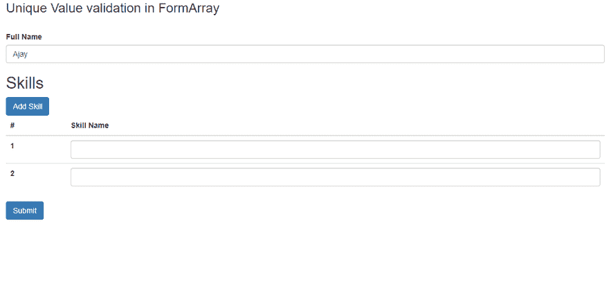

# 角度数组中的唯一值验证

> 原文：<https://dev.to/ajayojha/unique-value-validation-in-formarray-of-angular-3g80>

交叉张贴到[medium.com](https://medium.com/@oojhaajay/quick-solution-unique-value-validation-in-formarray-of-angular-7f2f36493aaa)

这里，我们讨论在 FormArray 中对 FormControl 进行唯一值验证的方法。

我们构建了一个工作申请表，用户可以在其中输入自己的姓名和技能。技能必须是独特的。

让我们开始创建一个表单，并对技能名称应用惟一的验证。因此，angular 中没有唯一可用的验证器，并且不需要在组件中编写太多代码，我将立即使用唯一的验证器[**@ rx web/reactive-form-validators**](https://www.npmjs.com/package/@rxweb/reactive-form-validators)验证框架。这个验证框架提供了 50 多个跨域验证的验证器。

让我们先安装[**@ rx web/reactive-form-validators**](https://www.npmjs.com/package/@rxweb/reactive-form-validators)。

> npm 安装@ rx web/反应式表单验证器

现在，在根模块中注册“RxReactiveFormsModule”。

```
import { NgModule } from '@angular/core';
import { BrowserModule } from '@angular/platform-browser';
import { FormsModule,ReactiveFormsModule } from '@angular/forms';

import { AppComponent } from './app.component';

import {  RxReactiveFormsModule } from "@rxweb/reactive-form-validators"
@NgModule({
  imports:      [ BrowserModule, FormsModule,ReactiveFormsModule,RxReactiveFormsModule ],
  declarations: [AppComponent],
  bootstrap:    [ AppComponent]
})
export class AppModule { } 
```

现在，我们必须创建工作申请表单组，包括嵌套的表单数组。在创建工作申请表单组之前，让我们创建技能表单组并在 skillName FormControl 上应用唯一的验证器。稍后，技能表组将被推入技能表组。

```
 getSkillFormGroup(){
      return this.formBuilder.group({
        skillName:['',RxwebValidators.unique()]
      })
    } 
```

现在，让我们创建主职位申请表单组，在该表单组中，我将调用之前创建的方法“getSkillFormGroup”来将表单组推送到技能表单数组中。

```
 this.jobFormGroup = this.formBuilder.group({
            fullName:[''], 
            skills:this.formBuilder.array([
              this.getSkillFormGroup()
            ])

        }); 
```

由于工作申请表格的性质，用户将增加一项以上的技能。为了实现这一点，我们必须创建“addSkill”方法，并在技能数组中推出新的技能组。

```
 addSkill(){
      let skillsArray = <FormArray>this.jobFormGroup.controls.skills;
      skillsArray.push(this.getSkillFormGroup());
    } 
```

让我们将所有代码包装在一个组件中。

```
import { Component,OnInit } from '@angular/core';
import { FormGroup,FormBuilder,FormArray } from "@angular/forms"
import { RxwebValidators } from '@rxweb/reactive-form-validators';
@Component({
  selector: 'app-root',
  templateUrl: './app.component.html',
})
export class AppComponent implements OnInit {
 jobFormGroup: FormGroup

    constructor(
        private formBuilder: FormBuilder )
    { }

    ngOnInit() {
        this.jobFormGroup = this.formBuilder.group({
            fullName:[''], 
            skills:this.formBuilder.array([
              this.getSkillFormGroup()
            ])

        });
    }

    addSkill(){
      let skillsArray = <FormArray>this.jobFormGroup.controls.skills;
      skillsArray.push(this.getSkillFormGroup());
    }

    getSkillFormGroup(){
      return this.formBuilder.group({
        skillName:['',RxwebValidators.unique()]
      })
    }
} 
```

按照 angular 惯例绑定 HTML。

就是这样…

下面是 FormArray 中唯一验证的工作示例的图像。

[](https://res.cloudinary.com/practicaldev/image/fetch/s--O_4U2Lmi--/c_limit%2Cf_auto%2Cfl_progressive%2Cq_66%2Cw_880/https://thepracticaldev.s3.amazonaws.com/i/iiugejgq95mbowt9kpzk.gif)

请参考 [**栈上的工作示例**](https://stackblitz.com/edit/unique-value-validation-in-formarray-reactive-forms-angular?embed=1&file=src/app/app.component.ts)

我希望你喜欢这个帖子，如果你有任何问题或建议，请在下面发表评论。