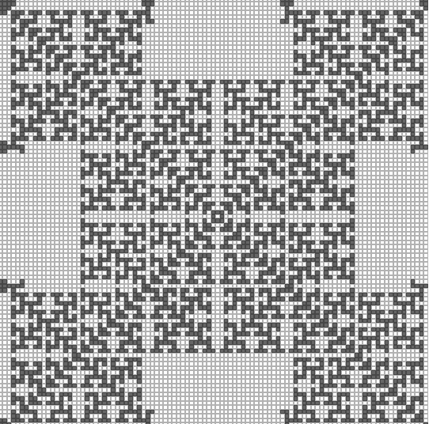

# 康威不同规则的人生游戏

> 原文：<https://dev.to/lexjacobs/conways-game-of-life-with-different-rules-13l0>

# 康威的人生游戏

### [生命的游戏，也简称为生命，是英国数学家约翰·何顿·康威在 1970 年发明的一种细胞自动机](https://en.wikipedia.org/wiki/Conway%27s_Game_of_Life)

如果你花过时间探索或玩康威的生活游戏，你可能非常熟悉由此产生的模式，如:

### 但是，如果你可以玩决定每一回合规则的设置，并且可以创建这样的模式，那会怎么样呢？

现在你可以了！

### 这是项目的部署版本，已经[启动并运行，您可以使用](https://lexjacobs.github.io/conways-game-of-life-explorer/)

### 我用 JavaScript 创建了一个生活探索游戏，让你改变规则。

默认规则是:

*   如果邻居大于 3，则因人口过多而死亡
*   如果邻居少于 2 人，则按人口不足死亡
*   如果邻居正好等于 3，则通过繁殖再生

我还创建了简单的编辑工具，让你添加或删除单个单元格，在游戏的发展过程中播放和暂停，在游戏板上移动你的单元格，还可以选择随机的开始模式。你也可以改变你的初始棋盘大小，以及回合之间的毫秒延迟。

这可以让你做出有趣的开始模式，如下:
(滚动到 30 秒，看到模式变得更加复杂和有趣)

[https://www.youtube.com/embed/dPxABgIkjSw](https://www.youtube.com/embed/dPxABgIkjSw)

### 您可以在我的存储库中浏览代码，网址为:

##  [雷克雅未克](https://github.com/lexjacobs) / [康威生活游戏探索者](https://github.com/lexjacobs/conways-game-of-life-explorer)

### 探索康威的可变棋盘大小和交替规则的生活游戏。

<article class="markdown-body entry-content container-lg" itemprop="text">

## 点击这里的维基百科文章了解更多关于康威的生活游戏

## 在此部署的网站探索游戏

</article>

[View on GitHub](https://github.com/lexjacobs/conways-game-of-life-explorer)

我希望你喜欢探索这个项目，喜欢学习更多关于生命的游戏。

### 请告诉我你的想法！