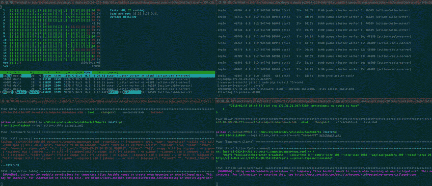
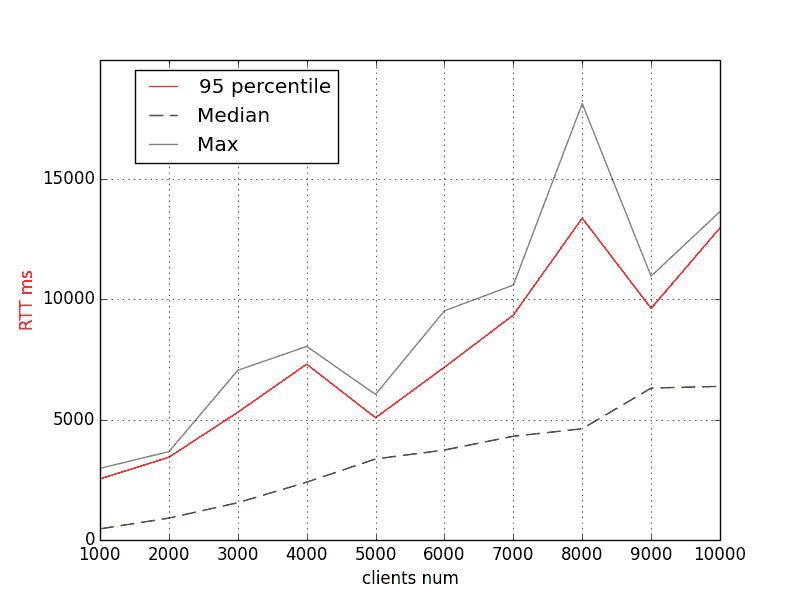
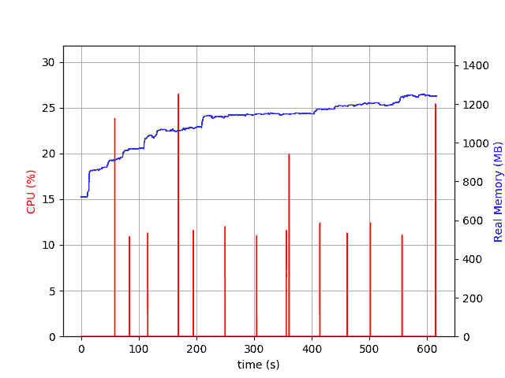
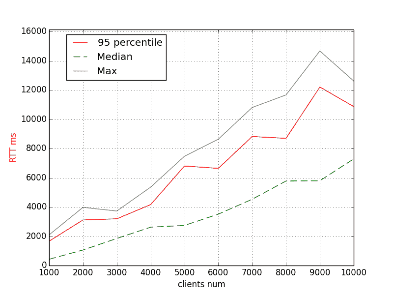
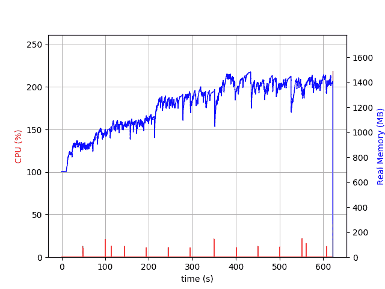
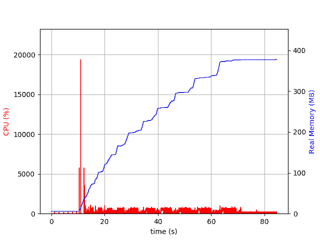
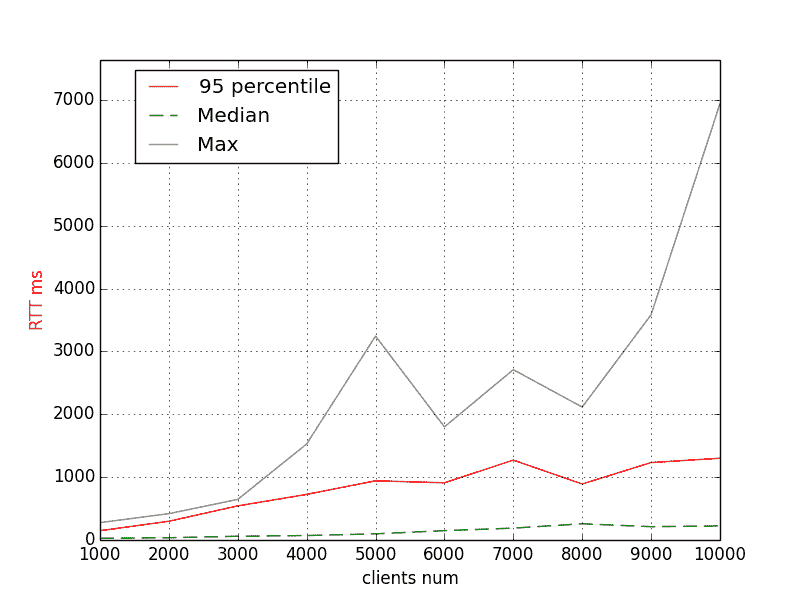

# Cables vs. malloc_trim，或者另一个 Ruby 内存使用基准

> 原文：<https://dev.to/evilmartians/cables-vs-malloctrim-or-yet-another-ruby-memory-usage-benchmark-3emo>

## 单线，大有出息

内存使用一直是 Ruby 社区中讨论最多的性能相关话题之一。

上周，李鸿·赖发表了他的优秀作品[“是什么导致了 Ruby 内存膨胀？”之后，它得到了更多的关注](https://www.joyfulbikeshedding.com/blog/2019-03-14-what-causes-ruby-memory-bloat.html)岗位。

作者为 Ruby 的垃圾收集器(准确地说是 MRI)提出了一个非常简单的补丁:在整个 GC 周期的最后添加一个对 [`malloc_trim`](https://linux.die.net/man/3/malloc_trim) 的调用，并释放*一些*分配的内存给内核。

注意:为了让前一段听起来不那么陌生，读一读李鸿·赖的文章——他在解释复杂事物方面做得非常好；我不能做得更好，所以我把链接留给你。

发布后的第二天， [Noah Gibbs](https://twitter.com/codefolio) 做了一些 RRB ( [Rails Ruby 基准测试](https://github.com/noahgibbs/rails_ruby_bench))基准测试，发现性能提升(请求计时)是**大约%1** 。没什么值得大书特书的，对吧？

另一方面，就像 Noah 注意到的那样，**“对于 1%的加速，一行代码的改变是很难抱怨的”**。

因此，我决定测量补丁对[动作电缆](https://guides.rubyonrails.org/action_cable_overview.html)的影响，该电缆在速度和内存使用方面有些臭名昭著(查看 [AnyCable](https://anycable.io) 以获得更快的替换)。

我从 2016 年开始做动作有线基准[，那时我开始在](https://evilmartians.com/chronicles/anycable-actioncable-on-steroids) [AnyCable](https://anycable.io) 上工作，所以我已经[为此做了一个设置](https://github.com/anycable/anycable/blob/master/benchmarks/HowTo.md)。

当一些*新事物*出现时，我通常会做动作电缆基准测试:要么是新的 web 服务器(例如，参见[的基准测试](https://github.com/anycable/anycable/blob/master/benchmarks/2018-10-27.md)的[碘](https://github.com/boazsegev/iodine#why-not-eventmachine)和[猎鹰](https://github.com/socketry/falcon))要么是新颖的 Ruby *特性*(像`malloc_trim`补丁或即将到来的 [`GC.compact`](https://bugs.ruby-lang.org/issues/15626) )，我计划下次尝试。

框架本身自早期以来没有太大变化(是的，Rails 6 将附带 [Action Cable 测试支持](https://github.com/rails/rails/pull/33659)，但这与性能无关)。成熟稳重。它仍然消耗大量内存。

**注**:参见最新 RubyConf 的[“高速红宝石电缆”讲座](https://www.youtube.com/watch?v=8XRcOZXOzV4)(或[观看幻灯片](https://speakerdeck.com/palkan/rubyconf-2018-high-speed-cables-for-ruby))以了解更多关于 Action Cable(和其他*电缆*)的可伸缩性问题。

## ...基准呢

<figure>

<figcaption>The benchmark is running slow</figcaption>

</figure>

基准测试是基于 Hashrocket 的 [WebSocket shootout](https://hashrocket.com/blog/posts/websocket-shootout) (更准确地说，是它的*广播*部分)。

我们测量广播往返时间(RTT)，即服务器向所有连接的客户端重新传输消息所需的时间——时间越短，服务器的*实时性*越好。

<figure>

<figcaption>Broadcasting diagram</figcaption>

</figure>

作为副作用，我们还使用 [psrecord](https://github.com/astrofrog/psrecord) 实用程序捕获了基准测试期间的应用程序内存使用情况。

我对服务器和[基准客户机](https://github.com/Arkweid/websocket-bench)都使用 AWS EC2 c3.2xlarge (8 个 vCPU，15 个 GiB RAM)实例，并使用默认线程数(`0:16`)和 8 个工作线程运行 Puma。

基准配置:

*   10 步 1k 连接(即最终 10k 连接)
*   在每一步，100 个随机客户端发起广播(8 倍并发)
*   消息有效负载的大小是 200B。

我比较了三种不同的配置(都使用 Rails 6.0.0.beta3):

*   Ruby 2.6.2 ( *基线*)
*   Ruby 2.6.2 + `MALLOC_ARENA_MAX=2` ( [最古老的*法术之一*](https://www.speedshop.co/2017/12/04/malloc-doubles-ruby-memory.html) 提高 Ruby 应用的内存使用率)
*   带`malloc_trim`补丁的 Ruby 2.7-dev ( `trunk`)。

让我们谈一谈期望:

*   我们预计使用`MALLOC_ARENA_MAX=2`或`malloc_trim`补丁的内存使用量会更低
*   我们也希望看到一些积极的变化表现(下 RTT)。

### 🏁准备，稳住，跑！

以下是基线的内存配置文件:

<figure>

<figcaption>Memory (Ruby 2.6.2, default VM settings)</figcaption>

</figure>

**注意**:忽略红线(应该是 CPU)，运行多个子进程的时候好像不太准确(也不知道怎么关🙂).

我们在末端有 **~1.8GB** 的内存(即连接 10k 客户端，发送 1k 消息后)。

RTT 怎么样？

<figure>

<figcaption>RTT (Ruby 2.6.2, default VM settings)</figcaption>

</figure>

第 95 个[百分位](https://en.wikipedia.org/wiki/Percentile)大约是针对 6k 的 **8s 和针对 10k 客户端的**12s**。让我们记住这些数字。**

**注**:为什么不是 [*单调*](http://mathworld.wolfram.com/MonotonicSequence.html) ？多半是由于*(见灰色“Max”线)。这是什么原因造成的？我们只能猜测，我们会的，所以继续读下去。*

 *### 动作索+ `MALLOC_ARENA_MAX=2`

首先，内存使用:

<figure>

<figcaption>Memory (Ruby 2.6.2, MALLOC_ARENA_MAX=2)</figcaption>

</figure>

哇！内存增长更加顺畅，几乎没有达到 1.3GB。很神奇，不是吗？

为什么我以前没试过这个简单的招数？

好的。让我们来看看 RTT 图表:

<figure>

<figcaption>RTT (Ruby 2.6.2, MALLOC_ARENA_MAX=2)</figcaption>

</figure>

第 95 百分位显示 6k 客户端的**~ 7s**和 10k 客户端的**~ 11s**。

这意味着**内存使用和性能都随着 malloc arenas** 数量的减少而提高。

注意，RTT(几乎)是单调的。这让我猜测第一个实验中的异常值也可能是由大量内存使用引起的(较长的 GCs 运行？分配？).

### 动作索+ `malloc_trim(0)`

最后，让我们尝试一下补丁程序(它启发我首先运行所有这些基准):

<figure>

<figcaption>Ruby 2.7-dev, malloc_trim patch</figcaption>

</figure>

内存使用大约是**1.4 GB**——还不错吧？但是看看这条蓝线——它看起来像一把手锯！内存上升和**下降**(不像通常那样上升)，`malloc_trim`成功了！

让我们来看看表演:

<figure>

<figcaption>RTT (Ruby 2.7-dev, malloc_trim patch)</figcaption>

</figure>

我们有 6k 的 **~8s 和 10k** 的 **~14s 作为第 95 百分位值。**

什么？性能下降？也许，那是因为`malloc_trim` [【可以痛苦地缓慢】](https://marek.vavrusa.com/memory/)？

但是不要惊慌。它需要更多的研究。更多的时间获得更多的结果。

这个基准测试是*集成*类型的，我们只能用它来产生假设，例如:“虽然`malloc_trim`对内存使用有正面影响，但它可能会对整体性能产生负面影响。”

## 那么，行动索该怎么办呢？

首先，如果你没有遇到任何问题，什么也不要做。

如果你对内存使用有所顾虑，首先给`MALLOC_ARENA_MAX=2`一个公平的尝试。

没帮上忙？嗯， [AnyCable](https://anycable.io) 是下一个候选人。

**UPD**(03/22/2019):[ksec](https://dev.to/ksec)[指出](https://dev.to/ksec/comment/9i8e)任意电缆基准缺失。所以，我们来补充一下。

顺便说一下，这是我们为任何电缆准备的:

<figure>

<figcaption>AnyCable memory usage</figcaption>

</figure>

<figure>

<figcaption>AnyCable RTT</figcaption>

</figure>

另外，通过参加一个[小调查问卷](https://evilmartians.typeform.com/to/W35uRm)来帮助我改进 AnyCable 不管你是一个狂热的用户还是刚刚听说过这种快速替代 Action Cable 的产品，我都想知道你的想法！

* * *

下次打算用`jemalloc`和 [`GC.compact`](https://bugs.ruby-lang.org/issues/15626) 做实验。[敬请期待！](https://twitter.com/palkan_tula)

* * *

阅读更多关于 https://evilmartians.com/chronicles 的文章！*